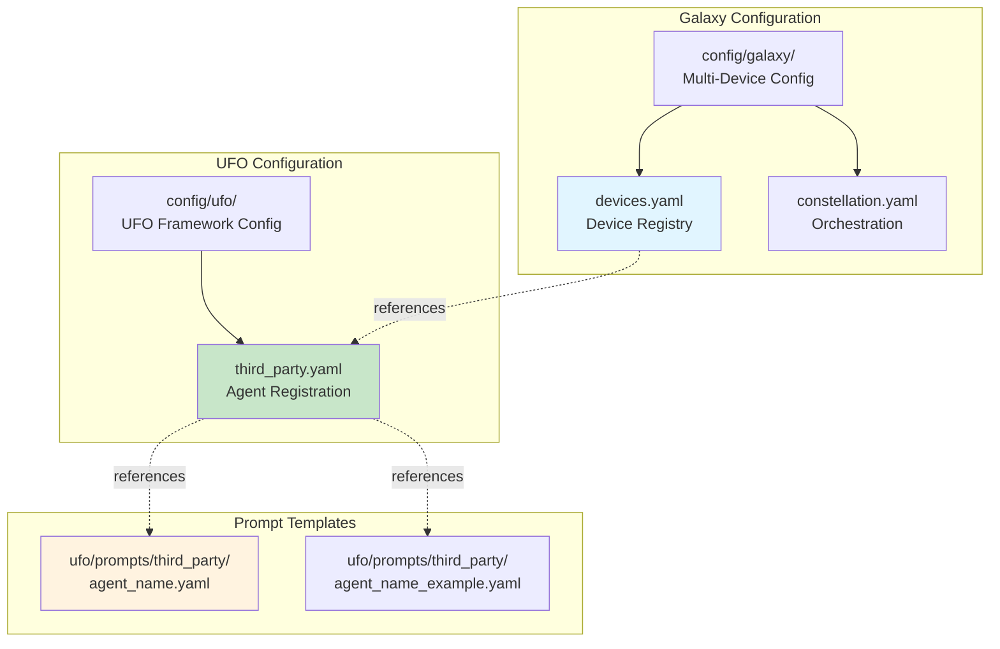
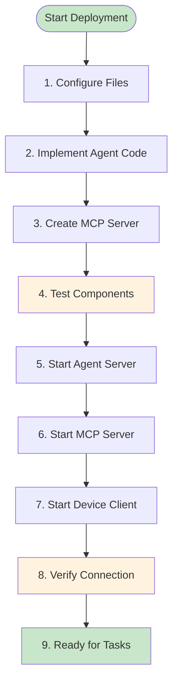

# Part 4: Configuration & Deployment

This tutorial covers the **configuration files and deployment procedures** needed to integrate your device agent into UFO³. You'll learn to configure `third_party.yaml`, register devices in `devices.yaml`, create prompt templates, and deploy the complete system.

---

## Table of Contents

1. [Configuration Overview](#configuration-overview)
2. [Third-Party Agent Configuration](#third-party-agent-configuration)
3. [Device Registration](#device-registration)
4. [Prompt Template Creation](#prompt-template-creation)
5. [Step-by-Step Deployment](#step-by-step-deployment)
6. [Galaxy Multi-Device Integration](#galaxy-multi-device-integration)
7. [Common Configuration Patterns](#common-configuration-patterns)

---

## Configuration Overview

### Configuration File Hierarchy



**Configuration Files**:

| File | Purpose | Required |
|------|---------|----------|
| `config/ufo/third_party.yaml` | Register agent with UFO | ✅ Yes |
| `config/galaxy/devices.yaml` | Register device instances | ✅ Yes (for Galaxy) |
| `config/galaxy/constellation.yaml` | Multi-device orchestration | Optional |
| `ufo/prompts/third_party/<name>.yaml` | Main prompt template | ✅ Yes |
| `ufo/prompts/third_party/<name>_example.yaml` | Few-shot examples | ✅ Yes |

---

## Third-Party Agent Configuration

### File Location

**Path**: `config/ufo/third_party.yaml`

### Configuration Structure

```yaml
# Third-Party Agent Integration Configuration
# This file configures external/third-party agents that extend UFO's capabilities

# ========================================
# Enabled Agents
# ========================================
# List of third-party agents to enable
ENABLED_THIRD_PARTY_AGENTS: ["MobileAgent", "LinuxAgent"]


# ========================================
# Agent Configurations
# ========================================
THIRD_PARTY_AGENT_CONFIG:

  # ----------------------------------
  # MobileAgent Configuration
  # ----------------------------------
  MobileAgent:
    # Visual mode enables screenshot capture
    VISUAL_MODE: True
    
    # Agent name (must match @AgentRegistry.register)
    AGENT_NAME: "MobileAgent"
    
    # Prompt template paths (relative to project root)
    APPAGENT_PROMPT: "ufo/prompts/third_party/mobile_agent.yaml"
    APPAGENT_EXAMPLE_PROMPT: "ufo/prompts/third_party/mobile_agent_example.yaml"
    
    # Optional: API prompt template (for custom tool descriptions)
    # API_PROMPT: "ufo/prompts/third_party/mobile_agent_api.yaml"
    
    # Agent introduction (shown to HostAgent for delegation)
    INTRODUCTION: >
      The MobileAgent controls Android and iOS mobile devices.
      It can perform UI automation, tap/swipe gestures, type text,
      launch apps, and capture screenshots. Use it for mobile
      app testing, automation, and device control tasks.

  # ----------------------------------
  # LinuxAgent Configuration (Reference)
  # ----------------------------------
  LinuxAgent:
    # Visual mode disabled for CLI-based agent
    VISUAL_MODE: False
    
    AGENT_NAME: "LinuxAgent"
    APPAGENT_PROMPT: "ufo/prompts/third_party/linux_agent.yaml"
    APPAGENT_EXAMPLE_PROMPT: "ufo/prompts/third_party/linux_agent_example.yaml"
    
    INTRODUCTION: >
      The LinuxAgent executes commands on Linux systems.
      It can run bash commands, manage files, inspect processes,
      configure services, and perform system administration tasks.
      Use it for Linux server management and automation.
```

### Configuration Field Reference

| Field | Type | Required | Description | Example |
|-------|------|----------|-------------|---------|
| `VISUAL_MODE` | boolean | ✅ Yes | Enable screenshot capture | `True` for mobile/GUI, `False` for CLI |
| `AGENT_NAME` | string | ✅ Yes | Must match `@AgentRegistry.register` | `"MobileAgent"` |
| `APPAGENT_PROMPT` | string | ✅ Yes | Path to main prompt template | `"ufo/prompts/third_party/mobile_agent.yaml"` |
| `APPAGENT_EXAMPLE_PROMPT` | string | ✅ Yes | Path to example prompt template | `"ufo/prompts/third_party/mobile_agent_example.yaml"` |
| `API_PROMPT` | string | Optional | Custom API descriptions | `"ufo/prompts/third_party/mobile_agent_api.yaml"` |
| `INTRODUCTION` | string | ✅ Yes | Agent description for HostAgent | Multi-line string describing capabilities |

!!! warning "Configuration Checklist"
    - ✅ Add your agent to `ENABLED_THIRD_PARTY_AGENTS` list
    - ✅ Create a config section with agent name as key
    - ✅ Set `AGENT_NAME` to match `@AgentRegistry.register(agent_name="...")`
    - ✅ Set `VISUAL_MODE` based on whether agent uses screenshots
    - ✅ Create prompt template files before starting UFO
    - ✅ Write descriptive `INTRODUCTION` for Galaxy orchestration

---

## Device Registration

### File Location

**Path**: `config/galaxy/devices.yaml`

### Device Configuration Structure

```yaml
# Device Configuration - YAML Format
# This configuration defines device instances for Galaxy constellation

devices:
  # ----------------------------------
  # Mobile Agent Device 1 (Android)
  # ----------------------------------
  - device_id: "mobile_agent_1"
    
    # WebSocket server URL for this device
    server_url: "ws://192.168.1.100:5010/ws"
    
    # Operating system
    os: "android"
    
    # Device capabilities (used by Galaxy for task routing)
    capabilities:
      - "ui_automation"
      - "mobile_app_testing"
      - "touch_gestures"
      - "screenshot_capture"
      - "android_apps"
    
    # Custom metadata (accessible in prompts via {tips})
    metadata:
      device_model: "Google Pixel 6"
      android_version: "14"
      screen_resolution: "1080x2400"
      device_location: "Test Lab A"
      performance: "high"
      description: "Primary Android test device"
      
      # Custom instructions for the agent
      tips: >
        This device runs Android 14 on Google Pixel 6.
        Screen resolution is 1080x2400 pixels.
        All standard Android apps are installed.
        For app testing, use package name format: com.example.app
    
    # Auto-connect on startup
    auto_connect: true
    
    # Maximum connection retries
    max_retries: 5

  # ----------------------------------
  # Mobile Agent Device 2 (iOS)
  # ----------------------------------
  - device_id: "mobile_agent_2"
    server_url: "ws://192.168.1.101:5020/ws"
    os: "ios"
    capabilities:
      - "ui_automation"
      - "ios_app_testing"
      - "xcuitest"
      - "screenshot_capture"
    metadata:
      device_model: "iPhone 14 Pro"
      ios_version: "17.2"
      screen_resolution: "1179x2556"
      device_location: "Test Lab B"
      tips: >
        iOS device using XCUITest for automation.
        Use bundle ID format: com.company.AppName
    auto_connect: true
    max_retries: 5

  # ----------------------------------
  # Linux Agent (Server)
  # ----------------------------------
  - device_id: "linux_agent_1"
    server_url: "ws://192.168.1.50:5001/ws"
    os: "linux"
    capabilities:
      - "bash_commands"
      - "server_management"
      - "file_operations"
      - "process_management"
    metadata:
      os_version: "Ubuntu 22.04"
      hostname: "server-01"
      logs_file_path: "/var/log/app/app.log"
      dev_path: "/home/developer/projects/"
      warning_log_pattern: "WARN"
      error_log_pattern: "ERROR|FATAL"
      tips: >
        Ubuntu 22.04 server.
        Application logs: /var/log/app/app.log
        Development path: /home/developer/projects/
        Use 'sudo' for privileged operations.
    auto_connect: true
    max_retries: 10

  # ----------------------------------
  # Additional Device Template
  # ----------------------------------
  # - device_id: "your_device_id"
  #   server_url: "ws://HOST:PORT/ws"
  #   os: "android|ios|linux|windows"
  #   capabilities: ["capability1", "capability2"]
  #   metadata:
  #     key: "value"
  #     tips: "Custom instructions"
  #   auto_connect: true
  #   max_retries: 5
```

### Device Configuration Field Reference

| Field | Type | Required | Description | Example |
|-------|------|----------|-------------|---------|
| `device_id` | string | ✅ Yes | Unique device identifier | `"mobile_agent_1"` |
| `server_url` | string | ✅ Yes | WebSocket server URL | `"ws://192.168.1.100:5010/ws"` |
| `os` | string | ✅ Yes | Operating system | `"android"`, `"ios"`, `"linux"`, `"windows"` |
| `capabilities` | list[string] | ✅ Yes | Device capabilities | `["ui_automation", "app_testing"]` |
| `metadata` | dict | Optional | Custom device metadata | `{device_model: "Pixel 6", ...}` |
| `metadata.tips` | string | Recommended | Agent-specific instructions | Multi-line instructions |
| `auto_connect` | boolean | Optional | Auto-connect on startup | `true` (default: `false`) |
| `max_retries` | integer | Optional | Connection retry limit | `5` (default: `3`) |

!!! tip "Device Configuration Best Practices"
    - ✅ Use descriptive `device_id` (e.g., `mobile_android_pixel6_lab1`)
    - ✅ Add comprehensive `capabilities` for Galaxy task routing
    - ✅ Include device-specific details in `metadata.tips`
    - ✅ Set `auto_connect: true` for production devices
    - ✅ Use higher `max_retries` for unstable networks
    - ✅ Include log paths, dev paths, and patterns in `metadata`

---

## Prompt Template Creation

### Main Prompt Template

**File**: `ufo/prompts/third_party/mobile_agent.yaml`

```yaml
version: 1.0

system: |-
  You are **MobileAgent**, the UFO framework's intelligent agent for mobile device automation.
  Your goal is to **complete the entire User Request** by interacting with mobile devices using touch gestures, UI automation, and available APIs.

  ## Capabilities
  - **Tap** elements by coordinates or UI element properties
  - **Swipe** gestures (up, down, left, right) for scrolling and navigation
  - **Type** text into input fields
  - **Launch** applications by package/bundle ID
  - **Capture** screenshots for visual inspection
  - **Extract** UI hierarchy (XML tree on Android, Accessibility tree on iOS)

  ## Platform Support
  - **Android**: Via ADB (Android Debug Bridge) and UI Automator
  - **iOS**: Via XCTest framework and accessibility APIs

  ## Task Status
  After each step, decide the overall status of the **User Request**:
  - `CONTINUE` — the request is partially complete; further actions are required.
  - `FINISH` — the request has been successfully fulfilled; no further actions are needed.
  - `FAIL` — the request cannot be completed due to errors, invalid UI state, or repeated ineffective attempts.

  ## Response Format
  Always respond **only** with valid JSON that strictly follows the structure below.
  Your output must be directly parseable by `json.loads()` — no markdown, comments, or extra text.

  Required JSON keys:

    {{{{
      "observation": str, "<Describe the current mobile UI state relevant to the User Request. Include visible elements, current app, screen content, or errors. Reference screenshot and UI tree if available.>",
      "thought": str, "<Explain your reasoning for the next single-step action to progress toward completing the User Request. Consider current UI state, navigation, and user intent.>",
      "action": {{{{
        "function": str, "<Name of the API function. Leave empty ('') if no execution is needed.>",
        "arguments": Dict[str, Any], "<The dictionary of arguments {{'<key>': '<value>'}}, for the function. Use an empty dictionary if no arguments are needed.>",
        "status": str, "<CONTINUE | FINISH | FAIL>"
      }}}},
      "plan": List[str], "<List the next steps after the current action to fully complete the User Request.>",
      "result": str, "<Optional but REQUIRED for FINISH and FAIL states. A comprehensive description of the User Request outcome. Include all relevant information: success status, UI state, data extracted, errors encountered, etc.>"
    }}}}

  ## Operational Rules
  - **Use screenshots and UI tree** to understand the current mobile UI state
  - **Identify UI elements** by text, content-desc, resource-id, or coordinates
  - **Plan actions carefully** - mobile UIs may have animations, loading states, or modal dialogs
  - **Verify actions** - after tapping a button, check if the expected screen transition occurred
  - **Handle edge cases** - pop-ups, permissions dialogs, network errors, app crashes
  - Do **not** ask for user confirmation
  - Avoid **destructive actions** (uninstall apps, factory reset) unless explicitly instructed
  - Review previous actions to avoid repeating ineffective steps

  ## Actions
  - You are able to use the following APIs to interact with the mobile device.
  {{apis}}

  ## Examples
  - Below are some examples for your reference. Only use them as guidance and do not copy them directly.
  {{examples}}

  ## Final Reminder
  Please observe the previous steps, current screenshot, and UI tree carefully to decide your next action.
  Think step-by-step, act carefully, and output only the required JSON structure.
  Any invalid JSON or extra text will crash the system.


user: |-
  <Overall User Request:> {{user_request}}
  <Current Screenshot:> [See attached image]
  <Installed Apps:> {{installed_apps}}
  <Current Screen Controls:> {{current_controls}}
  <The actions you took at the last step and their results:> {{last_success_actions}}
  <Your Next Plan:> {{prev_plan}}
  <Your response:>
```

### Example Prompt Template

**File**: `ufo/prompts/third_party/mobile_agent_example.yaml`

```yaml
version: 1.0

example1:
  Request: |-
    Open the Settings app and enable Wi-Fi.
  Response:
    observation: |-
      The device is on the home screen. I can see app icons for various applications. The Settings app icon is visible in the UI tree with package name "com.android.settings".
    thought: |-
      To enable Wi-Fi, I need to first launch the Settings app. I'll use the launch_app function with the Settings package name.
    action:
      function: |-
        launch_app
      arguments:
        {"package_name": "com.android.settings"}
      status: |-
        CONTINUE
    plan:
      - (1) Launch Settings app.
      - (2) Navigate to Wi-Fi settings (may require scrolling).
      - (3) Tap the Wi-Fi toggle to enable it.
      - (4) Verify Wi-Fi is enabled and mark FINISH.
    result: |-
      Request in CONTINUE state. Successfully launched Settings app. Next steps: navigate to Wi-Fi settings and enable the toggle.

example2:
  Request: |-
    Find and tap the "Login" button on the current screen.
  Response:
    observation: |-
      The current screenshot shows a login screen with email and password input fields. There is a button with text "Login" visible near the bottom of the screen. According to the current screen controls list, the button is located at coordinates (540, 1650) with resource-id "com.example.app:id/login_button".
    thought: |-
      I can see the Login button in the controls list. I'll tap it using the coordinates provided.
    action:
      function: |-
        tap_screen
      arguments:
        {"x": 540, "y": 1650}
      status: |-
        CONTINUE
    plan:
      - (1) Tap the Login button at (540, 1650).
      - (2) Wait for navigation or error message.
      - (3) Verify successful login or handle errors.
      - (4) Mark FINISH if logged in successfully.
    result: |-
      Request in CONTINUE state. Tapped Login button at coordinates (540, 1650). Awaiting app response (loading indicator or next screen).

example3:
  Request: |-
    Scroll down to view more content in the current list.
  Response:
    observation: |-
      The screenshot shows a scrollable list view with multiple items. The UI tree indicates this is a RecyclerView with id "com.example.app:id/content_list". The list appears to have more content below the visible area based on the scroll indicators.
    thought: |-
      To scroll down, I'll perform a swipe gesture from bottom to top. I'll use coordinates in the middle of the screen, starting near the bottom and ending near the top.
    action:
      function: |-
        swipe
      arguments:
        {"start_x": 540, "start_y": 1800, "end_x": 540, "end_y": 600, "duration_ms": 300}
      status: |-
        CONTINUE
    plan:
      - (1) Swipe down to scroll the list.
      - (2) Capture new screenshot to see newly visible content.
      - (3) Check if target content is now visible.
      - (4) Repeat scroll if needed or mark FINISH.
    result: |-
      Request in CONTINUE state. Performed swipe gesture to scroll down. The list should now display content that was previously below the visible area.

example4:
  Request: |-
    Type "testuser@example.com" into the email field.
  Response:
    observation: |-
      The screenshot shows a login form with two input fields. The UI tree shows an EditText with hint "Email" at coordinates (540, 800) with resource-id "com.example.app:id/email_input". The field appears to be empty and ready for input.
    thought: |-
      I need to first tap the email field to focus it, then type the email address. I'll tap the field coordinates first.
    action:
      function: |-
        tap_screen
      arguments:
        {"x": 540, "y": 800}
      status: |-
        CONTINUE
    plan:
      - (1) Tap the email input field to focus it.
      - (2) Type the email address "testuser@example.com".
      - (3) Verify text is entered correctly.
      - (4) Mark FINISH.
    result: |-
      Request in CONTINUE state. Tapped email field at (540, 800) to focus it. Next step: type the email address into the focused field.
```

### Prompt Template Best Practices

| Component | Best Practice | Example |
|-----------|---------------|---------|
| **System Prompt** | Comprehensive instructions | Capabilities, rules, response format |
| **Response Format** | JSON schema with examples | `{"observation": ..., "thought": ..., "action": ...}` |
| **API Placeholder** | Use `{apis}` for tool injection | Populated by prompter |
| **Examples Placeholder** | Use `{examples}` for few-shot | Populated from example template |
| **User Prompt** | Include all context | Request, screenshot, UI tree, history |
| **Examples** | Cover common scenarios | Launch app, tap, swipe, type, scroll |

!!! tip "Prompt Template Tips"
    - ✅ Use `{{variable}}` for template variables (double braces)
    - ✅ Provide clear JSON structure with type annotations
    - ✅ Include platform-specific guidance (Android vs iOS)
    - ✅ Add examples covering success and failure cases
    - ✅ Reference screenshots and UI trees in prompts
    - ✅ Emphasize JSON-only output (no markdown)
    - ❌ Don't hardcode API descriptions (use `{apis}` placeholder)

---

## Step-by-Step Deployment

### Deployment Checklist



### Step 1: Configure third_party.yaml

```bash
# Edit config/ufo/third_party.yaml
nano config/ufo/third_party.yaml
```

Add your agent configuration:

```yaml
ENABLED_THIRD_PARTY_AGENTS: ["MobileAgent"]

THIRD_PARTY_AGENT_CONFIG:
  MobileAgent:
    VISUAL_MODE: True
    AGENT_NAME: "MobileAgent"
    APPAGENT_PROMPT: "ufo/prompts/third_party/mobile_agent.yaml"
    APPAGENT_EXAMPLE_PROMPT: "ufo/prompts/third_party/mobile_agent_example.yaml"
    INTRODUCTION: "MobileAgent controls Android/iOS devices..."
```

### Step 2: Register Device in devices.yaml

```bash
# Edit config/galaxy/devices.yaml
nano config/galaxy/devices.yaml
```

Add device registration:

```yaml
devices:
  - device_id: "mobile_agent_1"
    server_url: "ws://192.168.1.100:5010/ws"
    os: "android"
    capabilities: ["ui_automation", "app_testing"]
    metadata:
      device_model: "Pixel 6"
      tips: "Android device for testing"
    auto_connect: true
    max_retries: 5
```

### Step 3: Create Prompt Templates

```bash
# Create main prompt
touch ufo/prompts/third_party/mobile_agent.yaml

# Create example prompt
touch ufo/prompts/third_party/mobile_agent_example.yaml
```

Copy content from [Prompt Template Creation](#prompt-template-creation) section.

### Step 4: Implement Agent Components

```bash
# Agent class
# Edit: ufo/agents/agent/customized_agent.py

# Processor
# Edit: ufo/agents/processors/customized/customized_agent_processor.py

# States
# Create: ufo/agents/states/mobile_agent_state.py

# Strategies
# Create: ufo/agents/processors/strategies/mobile_agent_strategy.py

# Prompter
# Create: ufo/prompter/customized/mobile_agent_prompter.py
```

### Step 5: Create MCP Server

```bash
# Create MCP server
touch ufo/client/mcp/http_servers/mobile_mcp_server.py
```

Implement MCP server from [Part 2: MCP Server Development](mcp_server.md).

### Step 6: Test Components

```bash
# Run unit tests
pytest tests/unit/test_mobile_agent.py

# Run integration tests
pytest tests/integration/test_mobile_agent_integration.py
```

### Step 7: Start Agent Server

```bash
# Terminal 1: Start UFO agent server
python -m ufo.server.app --port 5010
```

Expected output:
```
========================================
UFO Agent Server
========================================
INFO: Server starting on 0.0.0.0:5010
INFO: Registered agents: MobileAgent, LinuxAgent
INFO: WebSocket endpoint: ws://localhost:5010/ws
========================================
```

### Step 8: Start MCP Server

```bash
# Terminal 2: Start MCP server
python -m ufo.client.mcp.http_servers.mobile_mcp_server \
  --host localhost \
  --port 8020 \
  --platform android
```

Expected output:
```
==================================================
UFO Mobile MCP Server (Android)
Mobile device automation via Model Context Protocol
Running on localhost:8020
==================================================
INFO: Server started successfully
INFO: Registered tools: tap_screen, swipe, type_text, ...
```

### Step 9: Start Device Client

```bash
# Terminal 3: Start device client
python -m ufo.client.client \
  --ws \
  --ws-server ws://localhost:5010/ws \
  --client-id mobile_agent_1 \
  --platform android \
  --log-level INFO
```

Expected output:
```
INFO: Platform: android
INFO: UFO Client initialized: mobile_agent_1
INFO: Connecting to ws://localhost:5010/ws (attempt 1/5)
INFO: ✅ Client registered: mobile_agent_1
INFO: Starting message handling loop
```

### Step 10: Verify Connection

```bash
# Check agent server logs
# Should show: "Client mobile_agent_1 registered"

# Check client logs
# Should show: "✅ Client registered: mobile_agent_1"

# Test basic command (optional)
curl -X POST http://localhost:5010/api/v1/task \
  -H "Content-Type: application/json" \
  -d '{
    "request": "Tap at coordinates (500, 1000)",
    "device_id": "mobile_agent_1"
  }'
```

---

## Galaxy Multi-Device Integration

### Constellation Configuration

**File**: `config/galaxy/constellation.yaml`

```yaml
# Galaxy Constellation Configuration
# Multi-device orchestration settings

constellation:
  # Constellation ID (unique identifier)
  constellation_id: "mobile_test_constellation"
  
  # Heartbeat interval (seconds)
  heartbeat_interval: 30
  
  # Task timeout (seconds)
  task_timeout: 300
  
  # Retry strategy
  max_task_retries: 3
  retry_delay: 5
  
  # Load balancing
  load_balancing_strategy: "round_robin"  # Options: round_robin, least_loaded, capability_based
  
  # Device selection
  device_selection_strategy: "capability_match"  # Options: capability_match, explicit, random

# Task routing rules
routing_rules:
  - task_type: "mobile_app_testing"
    preferred_devices: ["mobile_agent_1", "mobile_agent_2"]
    required_capabilities: ["ui_automation"]
  
  - task_type: "server_management"
    preferred_devices: ["linux_agent_1", "linux_agent_2"]
    required_capabilities: ["bash_commands"]
```

### Galaxy Deployment Example

```bash
# ========================================
# Start Galaxy with Multiple Devices
# ========================================

# Terminal 1: Galaxy orchestrator
python -m galaxy \
  --constellation-id mobile_test_constellation \
  --config config/galaxy/constellation.yaml

# Terminal 2-4: Device clients
python -m ufo.client.client --ws --ws-server ws://localhost:5010/ws --client-id mobile_agent_1 --platform android &
python -m ufo.client.client --ws --ws-server ws://localhost:5011/ws --client-id mobile_agent_2 --platform ios &
python -m ufo.client.client --ws --ws-server ws://localhost:5001/ws --client-id linux_agent_1 --platform linux &

# Terminal 5: Submit multi-device task
python -m galaxy.client.submit_task \
  --constellation mobile_test_constellation \
  --request "Test app on both Android and iOS devices" \
  --devices mobile_agent_1,mobile_agent_2
```

---

## Common Configuration Patterns

### Pattern 1: Development vs Production

```yaml
# Development configuration
ENABLED_THIRD_PARTY_AGENTS: ["MobileAgent"]
THIRD_PARTY_AGENT_CONFIG:
  MobileAgent:
    VISUAL_MODE: True
    # Use local test device
    
# config/galaxy/devices.yaml (dev)
devices:
  - device_id: "mobile_dev"
    server_url: "ws://localhost:5010/ws"
    auto_connect: false  # Manual connection for debugging

---

# Production configuration
ENABLED_THIRD_PARTY_AGENTS: ["MobileAgent", "LinuxAgent"]
THIRD_PARTY_AGENT_CONFIG:
  MobileAgent:
    VISUAL_MODE: True
    # Use production device farm

# config/galaxy/devices.yaml (prod)
devices:
  - device_id: "mobile_prod_01"
    server_url: "ws://192.168.1.100:5010/ws"
    auto_connect: true  # Auto-connect for reliability
    max_retries: 10
```

### Pattern 2: Multi-Platform Support

```yaml
# Support both Android and iOS with same agent
THIRD_PARTY_AGENT_CONFIG:
  MobileAgent:
    VISUAL_MODE: True
    AGENT_NAME: "MobileAgent"
    APPAGENT_PROMPT: "ufo/prompts/third_party/mobile_agent.yaml"
    APPAGENT_EXAMPLE_PROMPT: "ufo/prompts/third_party/mobile_agent_example.yaml"
    
# Separate device registrations
devices:
  - device_id: "android_device"
    os: "android"
    capabilities: ["ui_automation", "android_apps"]
    
  - device_id: "ios_device"
    os: "ios"
    capabilities: ["ui_automation", "ios_apps", "xcuitest"]
```

### Pattern 3: Device Pool Management

```yaml
# Multiple devices of same type for load balancing
devices:
  - device_id: "android_pool_1"
    server_url: "ws://192.168.1.101:5010/ws"
    os: "android"
    capabilities: ["ui_automation"]
    metadata:
      pool: "android_test_farm"
      device_index: 1
  
  - device_id: "android_pool_2"
    server_url: "ws://192.168.1.102:5010/ws"
    os: "android"
    capabilities: ["ui_automation"]
    metadata:
      pool: "android_test_farm"
      device_index: 2
```

---

## Summary

**What You've Configured**:

- ✅ Third-party agent registration in `third_party.yaml`
- ✅ Device registration in `devices.yaml`
- ✅ Main and example prompt templates
- ✅ Step-by-step deployment procedure
- ✅ Galaxy multi-device integration (optional)

**Key Takeaways**:

| Configuration | Purpose | File |
|---------------|---------|------|
| **Agent Registration** | Enable agent in UFO | `config/ufo/third_party.yaml` |
| **Device Registry** | Register device instances | `config/galaxy/devices.yaml` |
| **Prompt Templates** | Define LLM prompts | `ufo/prompts/third_party/*.yaml` |
| **Deployment** | Start servers and clients | Terminal commands |

---

## Next Steps

**Continue to**: [Part 5: Testing & Debugging →](testing.md)

Learn comprehensive testing strategies, debugging techniques, and common issue resolution.

---

## Related Documentation

- **[Galaxy Overview](../../galaxy/overview.md)** - Multi-device orchestration
- **[Third-Party Agents](../creating_third_party_agents.md)** - Related tutorial
- **[Agent Architecture](../../infrastructure/agents/overview.md)** - Agent design patterns

---

**Previous**: [← Part 3: Client Setup](client_setup.md)  
**Next**: [Part 5: Testing & Debugging →](testing.md)
