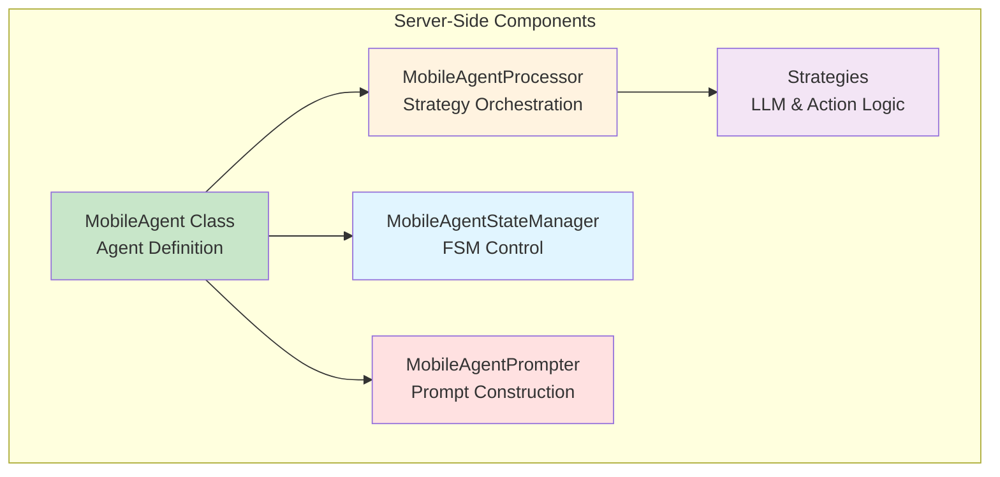
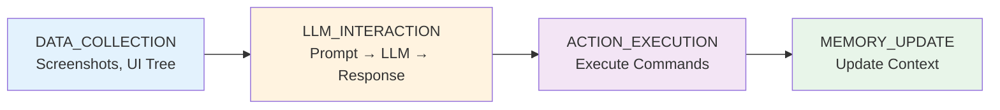
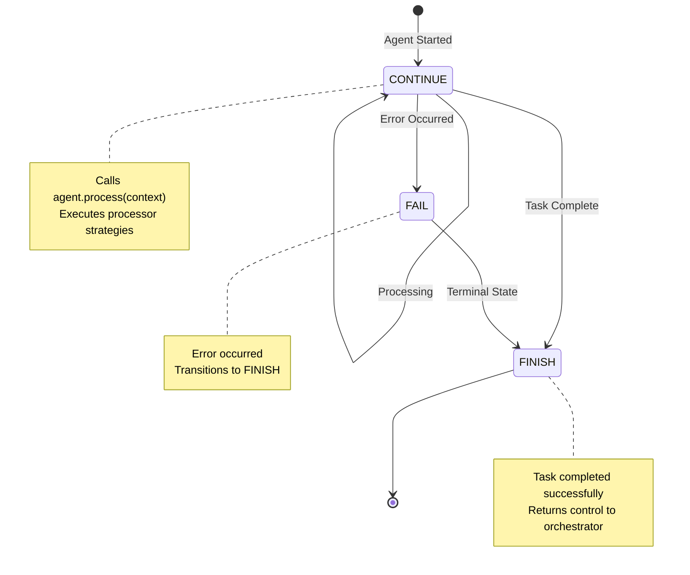

# Part 1: Core Components - Server-Side Implementation

This tutorial covers the **server-side components** of your device agent. You'll learn to implement the Agent Class, Processor, State Manager, Strategies, and Prompter using **LinuxAgent** as reference.

---

## Table of Contents

1. [Component Overview](#component-overview)
2. [Step 1: Agent Class](#step-1-agent-class)
3. [Step 2: Processor](#step-2-processor)
4. [Step 3: State Manager](#step-3-state-manager)
5. [Step 4: Processing Strategies](#step-4-processing-strategies)
6. [Step 5: Prompter](#step-5-prompter)
7. [Testing Your Implementation](#testing-your-implementation)

---

## Component Overview

### What You'll Build



**Component Responsibilities**:

| Component | File | Purpose | Example (LinuxAgent) |
|-----------|------|---------|---------------------|
| **Agent Class** | `customized_agent.py` | Agent definition, initialization | `LinuxAgent` class |
| **Processor** | `customized_agent_processor.py` | Strategy orchestration | `LinuxAgentProcessor` |
| **State Manager** | `linux_agent_state.py` | FSM states and transitions | `LinuxAgentStateManager` |
| **Strategies** | `linux_agent_strategy.py` | LLM and action execution logic | `LinuxLLMInteractionStrategy` |
| **Prompter** | `linux_agent_prompter.py` | Prompt construction for LLM | `LinuxAgentPrompter` |

---

## Step 1: Agent Class

### Understanding the Agent Class

The **Agent Class** is the entry point for your device agent. It:

- Inherits from `CustomizedAgent` (which extends `AppAgent`)
- Registers with `AgentRegistry` for automatic discovery
- Initializes prompter and default state
- Maintains blackboard for multi-agent coordination

### LinuxAgent Implementation

```python
# File: ufo/agents/agent/customized_agent.py

from ufo.agents.agent.app_agent import AppAgent
from ufo.agents.agent.basic import AgentRegistry
from ufo.agents.memory.blackboard import Blackboard
from ufo.agents.processors.customized.customized_agent_processor import (
    LinuxAgentProcessor,
)
from ufo.agents.states.linux_agent_state import ContinueLinuxAgentState
from ufo.prompter.customized.linux_agent_prompter import LinuxAgentPrompter


@AgentRegistry.register(
    agent_name="LinuxAgent",      # Unique identifier
    third_party=True,             # Mark as third-party/device agent
    processor_cls=LinuxAgentProcessor  # Link to processor class
)
class LinuxAgent(CustomizedAgent):
    """
    LinuxAgent is a specialized agent that interacts with Linux systems.
    Executes shell commands via MCP and manages Linux device tasks.
    """

    def __init__(
        self,
        name: str,
        main_prompt: str,
        example_prompt: str,
    ) -> None:
        """
        Initialize the LinuxAgent.
        
        :param name: The name of the agent instance
        :param main_prompt: Path to main prompt template YAML
        :param example_prompt: Path to example prompt template YAML
        """
        # Call parent constructor with None for process/app (not GUI-based)
        super().__init__(
            name=name,
            main_prompt=main_prompt,
            example_prompt=example_prompt,
            process_name=None,      # No Windows process for Linux
            app_root_name=None,     # No Windows app for Linux
            is_visual=None,         # Typically False for CLI-based agents
        )
        
        # Initialize blackboard for multi-agent coordination
        self._blackboard = Blackboard()
        
        # Set default state (ContinueLinuxAgentState)
        self.set_state(self.default_state)
        
        # Flag to track context provision
        self._context_provision_executed = False
        
        # Logger for debugging
        self.logger = logging.getLogger(__name__)
        self.logger.info(
            f"LinuxAgent initialized with prompts: {main_prompt}, {example_prompt}"
        )

    def get_prompter(
        self, is_visual: bool, main_prompt: str, example_prompt: str
    ) -> LinuxAgentPrompter:
        """
        Get the prompter for the agent.
        
        :param is_visual: Whether the agent uses visual mode (screenshots)
        :param main_prompt: Path to main prompt template
        :param example_prompt: Path to example prompt template
        :return: LinuxAgentPrompter instance
        """
        return LinuxAgentPrompter(main_prompt, example_prompt)

    @property
    def default_state(self) -> ContinueLinuxAgentState:
        """
        Get the default state for LinuxAgent.
        
        :return: ContinueLinuxAgentState instance
        """
        return ContinueLinuxAgentState()

    @property
    def blackboard(self) -> Blackboard:
        """
        Get the blackboard for multi-agent coordination.
        
        :return: Blackboard instance
        """
        return self._blackboard
```

### Creating Your MobileAgent Class

Now let's create `MobileAgent` following the same pattern:

```python
# File: ufo/agents/agent/customized_agent.py

import logging
from ufo.agents.agent.app_agent import AppAgent
from ufo.agents.agent.basic import AgentRegistry
from ufo.agents.memory.blackboard import Blackboard
from ufo.agents.processors.customized.customized_agent_processor import (
    MobileAgentProcessor,  # We'll create this in Step 2
)
from ufo.agents.states.mobile_agent_state import ContinueMobileAgentState
from ufo.prompter.customized.mobile_agent_prompter import MobileAgentPrompter


@AgentRegistry.register(
    agent_name="MobileAgent",
    third_party=True,
    processor_cls=MobileAgentProcessor
)
class MobileAgent(CustomizedAgent):
    """
    MobileAgent controls Android/iOS mobile devices.
    Supports UI automation, app testing, and mobile-specific operations.
    """

    def __init__(
        self,
        name: str,
        main_prompt: str,
        example_prompt: str,
    ) -> None:
        """
        Initialize the MobileAgent.
        
        :param name: Agent instance name
        :param main_prompt: Main prompt template path
        :param example_prompt: Example prompt template path
        """
        super().__init__(
            name=name,
            main_prompt=main_prompt,
            example_prompt=example_prompt,
            process_name=None,
            app_root_name=None,
            is_visual=None,  # Visual mode set by processor based on data collection
        )
        
        # Initialize blackboard for multi-agent coordination
        self._blackboard = Blackboard()
        
        # Set default state
        self.set_state(self.default_state)
        
        # Track context provision
        self._context_provision_executed = False
        
        # Logger
        self.logger = logging.getLogger(__name__)
        self.logger.info(
            f"Main prompt: {main_prompt}, Example prompt: {example_prompt}"
        )

    def get_prompter(
        self, is_visual: bool, main_prompt: str, example_prompt: str
    ) -> MobileAgentPrompter:
        """
        Get the prompter for MobileAgent.
        
        :param is_visual: Whether the agent uses visual mode (enabled for MobileAgent)
        :param main_prompt: Main prompt template path
        :param example_prompt: Example prompt template path
        :return: MobileAgentPrompter instance
        """
        return MobileAgentPrompter(main_prompt, example_prompt)

    @property
    def default_state(self) -> ContinueMobileAgentState:
        """
        Get the default state.
        
        :return: ContinueMobileAgentState instance
        """
        return ContinueMobileAgentState()

    @property
    def blackboard(self) -> Blackboard:
        """
        Get the blackboard for multi-agent coordination.
        
        :return: Blackboard instance
        """
        return self._blackboard
```

### Key Differences from LinuxAgent

| Aspect | LinuxAgent | MobileAgent |
|--------|-----------|-------------|
| **is_visual** | `None` (no screenshots by default) | `None` (visual mode managed by processor) |
| **Platform Tracking** | Not needed | Not explicitly tracked (handled by device metadata) |
| **Processor** | `LinuxAgentProcessor` | `MobileAgentProcessor` |
| **Prompter** | `LinuxAgentPrompter` | `MobileAgentPrompter` |
| **Default State** | `ContinueLinuxAgentState` | `ContinueMobileAgentState` |
| **Data Collection** | No screenshots | Screenshots, apps, UI controls via strategies |

!!! tip "Agent Class Best Practices"
    - ✅ Always call `super().__init__()` first
    - ✅ Initialize blackboard for multi-agent coordination
    - ✅ Set `is_visual=None` and let processor determine visual mode
    - ✅ Use meaningful logger messages for debugging
    - ✅ Keep initialization logic minimal (delegate to processor)
    - ✅ Track context provision to avoid redundant operations

---

## Step 2: Processor

### Understanding the Processor

The **Processor** orchestrates the execution pipeline through modular strategies. It:

- Manages strategy execution across 4 phases
- Configures middleware (logging, error handling, metrics)
- Validates strategy dependencies
- Finalizes processing context

### Four Processing Phases



### LinuxAgentProcessor Implementation

```python
# File: ufo/agents/processors/customized/customized_agent_processor.py

from typing import TYPE_CHECKING
from ufo.agents.processors.app_agent_processor import AppAgentProcessor
from ufo.agents.processors.context.processing_context import ProcessingPhase
from ufo.agents.processors.strategies.app_agent_processing_strategy import (
    AppMemoryUpdateStrategy,
)
from ufo.agents.processors.strategies.linux_agent_strategy import (
    LinuxActionExecutionStrategy,
    LinuxLLMInteractionStrategy,
    LinuxLoggingMiddleware,
)

if TYPE_CHECKING:
    from ufo.agents.agent.customized_agent import LinuxAgent


class LinuxAgentProcessor(CustomizedProcessor):
    """
    Processor for Linux MCP Agent.
    
    Manages the execution pipeline with strategies for:
    - LLM Interaction: Generate shell commands
    - Action Execution: Execute commands via Linux MCP
    - Memory Update: Update agent memory and blackboard
    """

    def _setup_strategies(self) -> None:
        """
        Setup processing strategies for LinuxAgent.
        
        Note: No DATA_COLLECTION strategy since LinuxAgent doesn't
        use screenshots (relies on shell command output).
        """
        
        # Phase 2: LLM Interaction
        self.strategies[ProcessingPhase.LLM_INTERACTION] = (
            LinuxLLMInteractionStrategy(
                fail_fast=True  # LLM failures should halt processing
            )
        )

        # Phase 3: Action Execution
        self.strategies[ProcessingPhase.ACTION_EXECUTION] = (
            LinuxActionExecutionStrategy(
                fail_fast=False  # Continue on action failures
            )
        )

        # Phase 4: Memory Update
        self.strategies[ProcessingPhase.MEMORY_UPDATE] = (
            AppMemoryUpdateStrategy(
                fail_fast=False  # Memory failures shouldn't stop agent
            )
        )

    def _setup_middleware(self) -> None:
        """
        Setup middleware pipeline for LinuxAgent.
        
        Uses custom logging middleware for Linux-specific context.
        """
        self.middleware_chain = [LinuxLoggingMiddleware()]

    def _finalize_processing_context(
        self, processing_context: ProcessingContext
    ) -> None:
        """
        Finalize processing context by updating global context.
        
        :param processing_context: The processing context to finalize
        """
        super()._finalize_processing_context(processing_context)
        
        try:
            # Extract result from local context
            result = processing_context.get_local("result")
            if result:
                # Update global context with result
                self.global_context.set(ContextNames.ROUND_RESULT, result)
        except Exception as e:
            self.logger.warning(
                f"Failed to update ContextNames from results: {e}"
            )
```

### Creating MobileAgentProcessor

```python
# File: ufo/agents/processors/customized/customized_agent_processor.py

from ufo.agents.processors.strategies.customized_agent_processing_strategy import (
    CustomizedScreenshotCaptureStrategy,
)
from ufo.agents.processors.strategies.mobile_agent_strategy import (
    MobileScreenshotCaptureStrategy,
    MobileAppsCollectionStrategy,
    MobileControlsCollectionStrategy,
    MobileActionExecutionStrategy,
    MobileLLMInteractionStrategy,
    MobileLoggingMiddleware,
)
from ufo.agents.processors.strategies.processing_strategy import ComposedStrategy

if TYPE_CHECKING:
    from ufo.agents.agent.customized_agent import MobileAgent


class MobileAgentProcessor(CustomizedProcessor):
    """
    Processor for MobileAgent.
    
    Manages execution pipeline with mobile-specific strategies:
    - Data Collection: Screenshots, installed apps, and UI controls
    - LLM Interaction: Mobile UI understanding with visual context
    - Action Execution: Touch gestures, swipes, taps
    - Memory Update: Context tracking
    """

    def _setup_strategies(self) -> None:
        """Setup processing strategies for MobileAgent."""
        
        # Phase 1: Data Collection (compose multiple strategies)
        self.strategies[ProcessingPhase.DATA_COLLECTION] = ComposedStrategy(
            strategies=[
                MobileScreenshotCaptureStrategy(fail_fast=True),
                MobileAppsCollectionStrategy(fail_fast=False),
                MobileControlsCollectionStrategy(fail_fast=False),
            ],
            name="MobileDataCollectionStrategy",
            fail_fast=True,  # Stop if critical data (screenshot) fails
        )

        # Phase 2: LLM Interaction (mobile UI understanding)
        self.strategies[ProcessingPhase.LLM_INTERACTION] = (
            MobileLLMInteractionStrategy(
                fail_fast=True  # LLM failures should halt
            )
        )

        # Phase 3: Action Execution (touch gestures)
        self.strategies[ProcessingPhase.ACTION_EXECUTION] = (
            MobileActionExecutionStrategy(
                fail_fast=False  # Continue on action failures for retry
            )
        )

        # Phase 4: Memory Update
        self.strategies[ProcessingPhase.MEMORY_UPDATE] = (
            AppMemoryUpdateStrategy(
                fail_fast=False  # Don't stop on memory errors
            )
        )

    def _setup_middleware(self) -> None:
        """Setup middleware for mobile-specific logging."""
        self.middleware_chain = [MobileLoggingMiddleware()]

    def _finalize_processing_context(
        self, processing_context: ProcessingContext
    ) -> None:
        """Finalize context with mobile-specific results."""
        super()._finalize_processing_context(processing_context)
        
        try:
            # Extract mobile-specific results
            result = processing_context.get_local("result")
            
            if result:
                self.global_context.set(ContextNames.ROUND_RESULT, result)
                
        except Exception as e:
            self.logger.warning(f"Failed to finalize context: {e}")
```

### Processor Configuration Guide

| Phase | Required? | When to Use | Example Strategies |
|-------|-----------|-------------|-------------------|
| **DATA_COLLECTION** | Optional | Agent needs observations (screenshots, sensor data) | `CustomizedScreenshotCaptureStrategy` |
| **LLM_INTERACTION** | **Required** | All agents need LLM reasoning | `LinuxLLMInteractionStrategy`, `MobileLLMInteractionStrategy` |
| **ACTION_EXECUTION** | **Required** | All agents need command execution | `LinuxActionExecutionStrategy`, `MobileActionExecutionStrategy` |
| **MEMORY_UPDATE** | Recommended | Track agent history and context | `AppMemoryUpdateStrategy` |

!!! warning "Common Processor Mistakes"
    ❌ **Don't** skip `_setup_strategies()` - processor won't execute  
    ❌ **Don't** use `fail_fast=True` for all strategies - agent becomes brittle  
    ❌ **Don't** forget to call `super()._finalize_processing_context()` - context won't propagate  
    ✅ **Do** use `fail_fast=True` for LLM_INTERACTION - ensures valid responses  
    ✅ **Do** use `fail_fast=False` for ACTION_EXECUTION - allows retry logic  
    ✅ **Do** add custom middleware for debugging and logging

---

## Step 3: State Manager

### Understanding State Manager

The **State Manager** implements the Finite State Machine (FSM) that controls agent lifecycle. It defines:

- **States**: `CONTINUE`, `FINISH`, `FAIL`, etc.
- **Transitions**: Rules for moving between states
- **State Handlers**: Logic executed in each state

### LinuxAgent States



### LinuxAgent State Implementation

```python
# File: ufo/agents/states/linux_agent_state.py

from enum import Enum
from typing import TYPE_CHECKING, Dict, Optional, Type
from ufo.agents.states.basic import AgentState, AgentStateManager

if TYPE_CHECKING:
    from ufo.agents.agent.customized_agent import LinuxAgent


class LinuxAgentStatus(Enum):
    """Status enum for LinuxAgent states."""
    FINISH = "FINISH"
    CONTINUE = "CONTINUE"
    FAIL = "FAIL"


class LinuxAgentStateManager(AgentStateManager):
    """
    State manager for LinuxAgent.
    Manages state registration and retrieval.
    """
    
    _state_mapping: Dict[str, Type[LinuxAgentState]] = {}

    @property
    def none_state(self) -> AgentState:
        """Return the none state."""
        return NoneLinuxAgentState()


class LinuxAgentState(AgentState):
    """
    Abstract base class for LinuxAgent states.
    All LinuxAgent states inherit from this class.
    """

    async def handle(
        self, agent: "LinuxAgent", context: Optional["Context"] = None
    ) -> None:
        """
        Handle the agent for the current step.
        
        :param agent: The LinuxAgent instance
        :param context: The global context
        """
        pass

    @classmethod
    def agent_class(cls) -> Type[LinuxAgent]:
        """Return the agent class this state belongs to."""
        from ufo.agents.agent.customized_agent import LinuxAgent
        return LinuxAgent

    def next_agent(self, agent: "LinuxAgent") -> "LinuxAgent":
        """
        Get the agent for the next step.
        Default: return same agent (no delegation).
        
        :param agent: Current agent
        :return: Next agent (typically same agent for device agents)
        """
        return agent

    def next_state(self, agent: "LinuxAgent") -> LinuxAgentState:
        """
        Determine next state based on agent status.
        
        :param agent: Current agent
        :return: Next state instance
        """
        status = agent.status
        state = LinuxAgentStateManager().get_state(status)
        return state

    def is_round_end(self) -> bool:
        """Check if the round ends."""
        return False


@LinuxAgentStateManager.register
class ContinueLinuxAgentState(LinuxAgentState):
    """
    CONTINUE state: Normal execution state.
    Calls agent.process() to execute processor strategies.
    """

    async def handle(
        self, agent: "LinuxAgent", context: Optional["Context"] = None
    ) -> None:
        """
        Handle CONTINUE state by executing processor.
        
        :param agent: LinuxAgent instance
        :param context: Global context
        """
        await agent.process(context)

    def is_subtask_end(self) -> bool:
        """Subtask does not end in CONTINUE state."""
        return False

    @classmethod
    def name(cls) -> str:
        """State name matching LinuxAgentStatus enum."""
        return LinuxAgentStatus.CONTINUE.value


@LinuxAgentStateManager.register
class FinishLinuxAgentState(LinuxAgentState):
    """
    FINISH state: Terminal state indicating task completion.
    """

    def next_agent(self, agent: "LinuxAgent") -> "LinuxAgent":
        """Return same agent (no further delegation)."""
        return agent

    def next_state(self, agent: "LinuxAgent") -> LinuxAgentState:
        """Stay in FINISH state."""
        return FinishLinuxAgentState()

    def is_subtask_end(self) -> bool:
        """Subtask ends in FINISH state."""
        return True

    def is_round_end(self) -> bool:
        """Round ends in FINISH state."""
        return True

    @classmethod
    def name(cls) -> str:
        """State name."""
        return LinuxAgentStatus.FINISH.value


@LinuxAgentStateManager.register
class FailLinuxAgentState(LinuxAgentState):
    """
    FAIL state: Error occurred, transition to FINISH.
    """

    def next_agent(self, agent: "LinuxAgent") -> "LinuxAgent":
        """Return same agent."""
        return agent

    def next_state(self, agent: "LinuxAgent") -> LinuxAgentState:
        """Transition to FINISH after failure."""
        return FinishLinuxAgentState()

    def is_round_end(self) -> bool:
        """Round ends after failure."""
        return True

    def is_subtask_end(self) -> bool:
        """Subtask ends after failure."""
        return True

    @classmethod
    def name(cls) -> str:
        """State name."""
        return LinuxAgentStatus.FAIL.value


@LinuxAgentStateManager.register
class NoneLinuxAgentState(LinuxAgentState):
    """
    NONE state: Initial/default state, transitions to FINISH.
    """

    def next_agent(self, agent: "LinuxAgent") -> "LinuxAgent":
        """Return same agent."""
        return agent

    def next_state(self, agent: "LinuxAgent") -> LinuxAgentState:
        """Transition to FINISH."""
        return FinishLinuxAgentState()

    def is_subtask_end(self) -> bool:
        """Subtask ends in NONE state."""
        return True

    def is_round_end(self) -> bool:
        """Round ends in NONE state."""
        return True

    @classmethod
    def name(cls) -> str:
        """Empty name for NONE state."""
        return ""
```

### Creating MobileAgent States

```python
# File: ufo/agents/states/mobile_agent_state.py

from enum import Enum
from typing import TYPE_CHECKING, Dict, Optional, Type
from ufo.agents.states.basic import AgentState, AgentStateManager

if TYPE_CHECKING:
    from ufo.agents.agent.customized_agent import MobileAgent


class MobileAgentStatus(Enum):
    """Status enum for MobileAgent states."""
    FINISH = "FINISH"
    CONTINUE = "CONTINUE"
    FAIL = "FAIL"
    WAITING = "WAITING"  # Waiting for app to load


class MobileAgentStateManager(AgentStateManager):
    """State manager for MobileAgent."""
    
    _state_mapping: Dict[str, Type[MobileAgentState]] = {}

    @property
    def none_state(self) -> AgentState:
        """Return the none state."""
        return NoneMobileAgentState()


class MobileAgentState(AgentState):
    """Abstract base class for MobileAgent states."""

    async def handle(
        self, agent: "MobileAgent", context: Optional["Context"] = None
    ) -> None:
        """Handle the agent for the current step."""
        pass

    @classmethod
    def agent_class(cls) -> Type[MobileAgent]:
        """Return the agent class."""
        from ufo.agents.agent.customized_agent import MobileAgent
        return MobileAgent

    def next_agent(self, agent: "MobileAgent") -> "MobileAgent":
        """Get next agent (same agent for device agents)."""
        return agent

    def next_state(self, agent: "MobileAgent") -> MobileAgentState:
        """Determine next state based on status."""
        status = agent.status
        state = MobileAgentStateManager().get_state(status)
        return state

    def is_round_end(self) -> bool:
        """Check if round ends."""
        return False


@MobileAgentStateManager.register
class ContinueMobileAgentState(MobileAgentState):
    """CONTINUE state for MobileAgent."""

    async def handle(
        self, agent: "MobileAgent", context: Optional["Context"] = None
    ) -> None:
        """Execute processor strategies."""
        await agent.process(context)

    def is_subtask_end(self) -> bool:
        return False

    @classmethod
    def name(cls) -> str:
        return MobileAgentStatus.CONTINUE.value


@MobileAgentStateManager.register
class FinishMobileAgentState(MobileAgentState):
    """FINISH state for MobileAgent."""

    def next_state(self, agent: "MobileAgent") -> MobileAgentState:
        return FinishMobileAgentState()

    def is_subtask_end(self) -> bool:
        return True

    def is_round_end(self) -> bool:
        return True

    @classmethod
    def name(cls) -> str:
        return MobileAgentStatus.FINISH.value


@MobileAgentStateManager.register
class FailMobileAgentState(MobileAgentState):
    """FAIL state for MobileAgent."""

    def next_state(self, agent: "MobileAgent") -> MobileAgentState:
        return FinishMobileAgentState()

    def is_round_end(self) -> bool:
        return True

    def is_subtask_end(self) -> bool:
        return True

    @classmethod
    def name(cls) -> str:
        return MobileAgentStatus.FAIL.value


@MobileAgentStateManager.register
class WaitingMobileAgentState(MobileAgentState):
    """
    WAITING state: Wait for app to load or animation to complete.
    """

    async def handle(
        self, agent: "MobileAgent", context: Optional["Context"] = None
    ) -> None:
        """Wait and then transition to CONTINUE."""
        import asyncio
        await asyncio.sleep(2)  # Wait 2 seconds
        agent.status = MobileAgentStatus.CONTINUE.value

    def is_subtask_end(self) -> bool:
        return False

    @classmethod
    def name(cls) -> str:
        return MobileAgentStatus.WAITING.value


@MobileAgentStateManager.register
class NoneMobileAgentState(MobileAgentState):
    """NONE state for MobileAgent."""

    def next_state(self, agent: "MobileAgent") -> MobileAgentState:
        return FinishMobileAgentState()

    def is_subtask_end(self) -> bool:
        return True

    def is_round_end(self) -> bool:
        return True

    @classmethod
    def name(cls) -> str:
        return ""
```

### State Design Guidelines

| State | When to Use | Required Methods | Terminal? |
|-------|-------------|------------------|-----------|
| **CONTINUE** | Normal execution | `handle()` calls `agent.process()` | No |
| **FINISH** | Task complete | `is_subtask_end()` → `True` | Yes |
| **FAIL** | Error occurred | `next_state()` → `FINISH` | Yes |
| **WAITING** | Async delays | `handle()` with `await asyncio.sleep()` | No |
| **NONE** | Default/initial | `next_state()` → `FINISH` | Yes |

!!! tip "State Design Best Practices"
    - ✅ Always register states with `@StateManager.register`
    - ✅ Implement `name()` to match status enum value
    - ✅ Call `agent.process()` in `CONTINUE.handle()`
    - ✅ Set `is_round_end()` = `True` for terminal states
    - ✅ Transition `FAIL` → `FINISH` for graceful termination
    - ❌ Don't create too many states - keep it simple
    - ❌ Don't call processor directly - use `agent.process()`

---

## Step 4: Processing Strategies

### Understanding Strategies

**Strategies** are modular execution units that implement specific phases of the processing pipeline. Each strategy:

- Executes independently within its phase
- Declares dependencies using `@depends_on` decorator
- Provides results using `@provides` decorator
- Returns `ProcessingResult` with success/failure status

### LinuxAgent Strategies

#### Strategy 1: LLM Interaction

```python
# File: ufo/agents/processors/strategies/linux_agent_strategy.py

from typing import TYPE_CHECKING
from ufo.agents.processors.strategies.app_agent_processing_strategy import (
    AppLLMInteractionStrategy,
)
from ufo.agents.processors.context.processing_context import (
    ProcessingContext,
    ProcessingResult,
    ProcessingPhase,
)
from ufo.agents.processors.core.strategy_dependency import depends_on, provides

if TYPE_CHECKING:
    from ufo.agents.agent.customized_agent import LinuxAgent


@depends_on("request")  # Requires "request" in context
@provides(
    "parsed_response",   # Provides LLM parsed response
    "response_text",     # Raw LLM response text
    "llm_cost",          # LLM API cost
    "prompt_message",    # Prompt sent to LLM
    "action",            # Action to execute
    "thought",           # LLM reasoning
    "comment",           # LLM comment
)
class LinuxLLMInteractionStrategy(AppLLMInteractionStrategy):
    """
    Strategy for LLM interaction with Linux Agent.
    
    Constructs prompts with Linux context, calls LLM,
    parses response into structured action.
    """

    def __init__(self, fail_fast: bool = True) -> None:
        """
        Initialize Linux LLM interaction strategy.
        
        :param fail_fast: Raise exceptions immediately on errors
        """
        super().__init__(fail_fast=fail_fast)

    async def execute(
        self, agent: "LinuxAgent", context: ProcessingContext
    ) -> ProcessingResult:
        """
        Execute LLM interaction for LinuxAgent.
        
        :param agent: LinuxAgent instance
        :param context: Processing context with request data
        :return: ProcessingResult with parsed LLM response
        """
        try:
            # Step 1: Extract request from context
            request = context.get("request")
            plan = self._get_prev_plan(agent)

            # Step 2: Build comprehensive prompt
            self.logger.info("Building Linux Agent prompt")
            
            # Get blackboard context (if multi-agent)
            blackboard_prompt = []
            if not agent.blackboard.is_empty():
                blackboard_prompt = agent.blackboard.blackboard_to_prompt()

            # Construct prompt message
            prompt_message = agent.message_constructor(
                dynamic_examples=[],
                dynamic_knowledge="",
                plan=plan,
                request=request,
                blackboard_prompt=blackboard_prompt,
                last_success_actions=self._get_last_success_actions(agent),
            )

            # Step 3: Get LLM response
            self.logger.info("Getting LLM response for Linux Agent")
            response_text, llm_cost = await self._get_llm_response(
                agent, prompt_message
            )

            # Step 4: Parse and validate response
            self.logger.info("Parsing Linux Agent response")
            parsed_response = self._parse_app_response(agent, response_text)

            # Step 5: Extract structured data
            structured_data = parsed_response.model_dump()

            return ProcessingResult(
                success=True,
                data={
                    "parsed_response": parsed_response,
                    "response_text": response_text,
                    "llm_cost": llm_cost,
                    "prompt_message": prompt_message,
                    **structured_data,  # action, thought, comment, etc.
                },
                phase=ProcessingPhase.LLM_INTERACTION,
            )

        except Exception as e:
            error_msg = f"Linux LLM interaction failed: {str(e)}"
            self.logger.error(error_msg)
            return self.handle_error(e, ProcessingPhase.LLM_INTERACTION, context)
```

#### Strategy 2: Action Execution

```python
# File: ufo/agents/processors/strategies/linux_agent_strategy.py

@depends_on("parsed_response", "command_dispatcher")
@provides("execution_result", "action_info", "control_log", "status")
class LinuxActionExecutionStrategy(AppActionExecutionStrategy):
    """
    Strategy for executing actions in LinuxAgent.
    
    Dispatches shell commands to Linux MCP server,
    captures results, and creates action logs.
    """

    def __init__(self, fail_fast: bool = False) -> None:
        """
        Initialize Linux action execution strategy.
        
        :param fail_fast: Raise exceptions immediately (typically False)
        """
        super().__init__(fail_fast=fail_fast)

    async def execute(
        self, agent: "LinuxAgent", context: ProcessingContext
    ) -> ProcessingResult:
        """
        Execute Linux Agent actions.
        
        :param agent: LinuxAgent instance
        :param context: Processing context with parsed response
        :return: ProcessingResult with execution results
        """
        try:
            # Step 1: Extract context variables
            parsed_response = context.get_local("parsed_response")
            command_dispatcher = context.global_context.command_dispatcher

            if not parsed_response:
                return ProcessingResult(
                    success=True,
                    data={"message": "No response for action execution"},
                    phase=ProcessingPhase.ACTION_EXECUTION,
                )

            # Step 2: Execute the action via command dispatcher
            execution_results = await self._execute_app_action(
                command_dispatcher, parsed_response.action
            )

            # Step 3: Create action info for memory tracking
            actions = self._create_action_info(
                parsed_response.action,
                execution_results,
            )

            # Step 4: Print action info (for debugging)
            action_info = ListActionCommandInfo(actions)
            action_info.color_print()

            # Step 5: Create control log
            control_log = action_info.get_target_info()

            status = (
                parsed_response.action.status
                if isinstance(parsed_response.action, ActionCommandInfo)
                else action_info.status
            )

            return ProcessingResult(
                success=True,
                data={
                    "execution_result": execution_results,
                    "action_info": action_info,
                    "control_log": control_log,
                    "status": status,
                },
                phase=ProcessingPhase.ACTION_EXECUTION,
            )

        except Exception as e:
            error_msg = f"Linux action execution failed: {str(e)}"
            self.logger.error(error_msg)
            return self.handle_error(e, ProcessingPhase.ACTION_EXECUTION, context)
```

### Creating MobileAgent Strategies

```python
# File: ufo/agents/processors/strategies/mobile_agent_strategy.py

from typing import TYPE_CHECKING
from ufo.agents.processors.strategies.app_agent_processing_strategy import (
    AppLLMInteractionStrategy,
    AppActionExecutionStrategy,
)
from ufo.agents.processors.context.processing_context import (
    ProcessingContext,
    ProcessingResult,
    ProcessingPhase,
)
from ufo.agents.processors.core.strategy_dependency import depends_on, provides

if TYPE_CHECKING:
    from ufo.agents.agent.customized_agent import MobileAgent


@depends_on("request", "clean_screenshot_url", "annotated_screenshot_url", "installed_apps", "current_controls")
@provides(
    "parsed_response",
    "response_text",
    "llm_cost",
    "prompt_message",
    "action",
    "thought",
    "comment",
)
class MobileLLMInteractionStrategy(AppLLMInteractionStrategy):
    """
    LLM interaction strategy for MobileAgent.
    
    Handles mobile UI screenshots, installed apps, and screen controls for LLM understanding.
    """

    def __init__(self, fail_fast: bool = True) -> None:
        super().__init__(fail_fast=fail_fast)

    async def execute(
        self, agent: "MobileAgent", context: ProcessingContext
    ) -> ProcessingResult:
        """Execute LLM interaction for mobile UI."""
        try:
            # Extract mobile-specific context
            request = context.get("request")
            screenshot_url = context.get_local("clean_screenshot_url")
            annotated_screenshot_url = context.get_local("annotated_screenshot_url")
            installed_apps = context.get_local("installed_apps", [])
            current_controls = context.get_local("current_controls", [])
            
            self.logger.info("Building Mobile Agent prompt")
            
            # Get blackboard context (if multi-agent)
            blackboard_prompt = []
            if not agent.blackboard.is_empty():
                blackboard_prompt = agent.blackboard.blackboard_to_prompt()
            
            # Construct prompt message with mobile-specific data
            prompt_message = agent.message_constructor(
                dynamic_examples=[],
                dynamic_knowledge="",
                plan=self._get_prev_plan(agent),
                request=request,
                installed_apps=installed_apps,
                current_controls=current_controls,
                screenshot_url=screenshot_url,
                annotated_screenshot_url=annotated_screenshot_url,
                blackboard_prompt=blackboard_prompt,
                last_success_actions=self._get_last_success_actions(agent),
            )

            # Get LLM response
            self.logger.info("Getting LLM response for Mobile Agent")
            response_text, llm_cost = await self._get_llm_response(
                agent, prompt_message
            )

            # Parse response
            self.logger.info("Parsing Mobile Agent response")
            parsed_response = self._parse_app_response(agent, response_text)

            return ProcessingResult(
                success=True,
                data={
                    "parsed_response": parsed_response,
                    "response_text": response_text,
                    "llm_cost": llm_cost,
                    "prompt_message": prompt_message,
                    **parsed_response.model_dump(),
                },
                phase=ProcessingPhase.LLM_INTERACTION,
            )

        except Exception as e:
            self.logger.error(f"Mobile LLM interaction failed: {e}")
            return self.handle_error(e, ProcessingPhase.LLM_INTERACTION, context)


@depends_on("parsed_response", "command_dispatcher")
@provides("execution_result", "action_info", "control_log", "status")
class MobileActionExecutionStrategy(AppActionExecutionStrategy):
    """
    Action execution strategy for MobileAgent.
    
    Executes mobile-specific actions (tap, swipe, type, etc.)
    via Mobile MCP server.
    """

    def __init__(self, fail_fast: bool = False) -> None:
        super().__init__(fail_fast=fail_fast)

    async def execute(
        self, agent: "MobileAgent", context: ProcessingContext
    ) -> ProcessingResult:
        """Execute mobile actions."""
        try:
            parsed_response = context.get_local("parsed_response")
            command_dispatcher = context.global_context.command_dispatcher

            if not parsed_response:
                return ProcessingResult(
                    success=True,
                    data={"message": "No action to execute"},
                    phase=ProcessingPhase.ACTION_EXECUTION,
                )

            # Execute mobile action
            execution_results = await self._execute_app_action(
                command_dispatcher, parsed_response.action
            )

            # Create action info
            actions = self._create_action_info(
                parsed_response.action,
                execution_results,
            )

            action_info = ListActionCommandInfo(actions)
            action_info.color_print()

            control_log = action_info.get_target_info()
            status = action_info.status

            return ProcessingResult(
                success=True,
                data={
                    "execution_result": execution_results,
                    "action_info": action_info,
                    "control_log": control_log,
                    "status": status,
                },
                phase=ProcessingPhase.ACTION_EXECUTION,
            )

        except Exception as e:
            self.logger.error(f"Mobile action execution failed: {e}")
            return self.handle_error(e, ProcessingPhase.ACTION_EXECUTION, context)


# Middleware for mobile-specific logging
class MobileLoggingMiddleware(AppAgentLoggingMiddleware):
    """Logging middleware for MobileAgent."""

    def starting_message(self, context: ProcessingContext) -> str:
        """Return starting message."""
        request = context.get_local("request")
        return f"Executing mobile task: [{request}]"
```

### Strategy Design Checklist

- [ ] Use `@depends_on()` decorator to declare dependencies
- [ ] Use `@provides()` decorator to declare outputs
- [ ] Return `ProcessingResult` with success status
- [ ] Handle exceptions gracefully (log, return error result)
- [ ] Respect `fail_fast` setting
- [ ] Use `self.logger` for debugging
- [ ] Call `self.handle_error()` in except blocks

---

## Step 5: Prompter

### Understanding the Prompter

The **Prompter** constructs prompts for LLM interaction. It:

- Loads prompt templates from YAML files
- Constructs system and user messages
- Inserts dynamic context (request, plan, examples)
- Formats API/tool descriptions

### LinuxAgent Prompter

```python
# File: ufo/prompter/customized/linux_agent_prompter.py

import json
from typing import Any, Dict, List
from ufo.prompter.agent_prompter import AppAgentPrompter


class LinuxAgentPrompter(AppAgentPrompter):
    """
    Prompter for LinuxAgent.
    
    Constructs prompts for shell command generation.
    """

    def __init__(
        self,
        prompt_template: str,
        example_prompt_template: str,
    ):
        """
        Initialize LinuxAgentPrompter.
        
        :param prompt_template: Path to main prompt YAML
        :param example_prompt_template: Path to example prompt YAML
        """
        super().__init__(None, prompt_template, example_prompt_template)
        self.api_prompt_template = None

    def system_prompt_construction(
        self, additional_examples: List[str] = []
    ) -> str:
        """
        Construct system prompt for LinuxAgent.
        
        :param additional_examples: Additional examples to include
        :return: System prompt string
        """
        # Format API descriptions
        apis = self.api_prompt_helper(verbose=1)
        
        # Format examples
        examples = self.examples_prompt_helper(
            additional_examples=additional_examples
        )

        # Fill template
        return self.prompt_template["system"].format(
            apis=apis, examples=examples
        )

    def user_prompt_construction(
        self,
        prev_plan: List[str],
        user_request: str,
        retrieved_docs: str = "",
        last_success_actions: List[Dict[str, Any]] = [],
    ) -> str:
        """
        Construct user prompt for LinuxAgent.
        
        :param prev_plan: Previous execution plan
        :param user_request: User's request
        :param retrieved_docs: Retrieved documentation (optional)
        :param last_success_actions: Last successful actions
        :return: User prompt string
        """
        prompt = self.prompt_template["user"].format(
            prev_plan=json.dumps(prev_plan),
            user_request=user_request,
            retrieved_docs=retrieved_docs,
            last_success_actions=json.dumps(last_success_actions),
        )

        return prompt

    def user_content_construction(
        self,
        prev_plan: List[str],
        user_request: str,
        retrieved_docs: str = "",
        last_success_actions: List[Dict[str, Any]] = [],
    ) -> List[Dict[str, str]]:
        """
        Construct user content for LLM (supports multi-modal).
        
        :param prev_plan: Previous plan
        :param user_request: User request
        :param retrieved_docs: Retrieved docs
        :param last_success_actions: Last actions
        :return: List of content dicts
        """
        user_content = []

        user_content.append({
            "type": "text",
            "text": self.user_prompt_construction(
                prev_plan=prev_plan,
                user_request=user_request,
                retrieved_docs=retrieved_docs,
                last_success_actions=last_success_actions,
            ),
        })

        return user_content
```

### Creating MobileAgent Prompter

```python
# File: ufo/prompter/customized/mobile_agent_prompter.py

import json
from typing import Any, Dict, List
from ufo.prompter.agent_prompter import AppAgentPrompter


class MobileAgentPrompter(AppAgentPrompter):
    """
    Prompter for MobileAgent.
    
    Handles mobile UI screenshots, installed apps, and control information for LLM prompts.
    """

    def __init__(
        self,
        prompt_template: str,
        example_prompt_template: str,
    ):
        """
        Initialize MobileAgentPrompter.
        
        :param prompt_template: Path to main prompt YAML
        :param example_prompt_template: Path to example prompt YAML
        """
        super().__init__(None, prompt_template, example_prompt_template)
        self.api_prompt_template = None

    def system_prompt_construction(
        self, additional_examples: List[str] = []
    ) -> str:
        """Construct system prompt for MobileAgent."""
        apis = self.api_prompt_helper(verbose=1)
        examples = self.examples_prompt_helper(
            additional_examples=additional_examples
        )

        return self.prompt_template["system"].format(
            apis=apis, examples=examples
        )

    def user_prompt_construction(
        self,
        prev_plan: List[str],
        user_request: str,
        installed_apps: List[Dict[str, Any]],
        current_controls: List[Dict[str, Any]],
        retrieved_docs: str = "",
        last_success_actions: List[Dict[str, Any]] = [],
    ) -> str:
        """
        Construct user prompt with mobile context.
        
        :param prev_plan: Previous plan
        :param user_request: User request
        :param installed_apps: List of installed apps on the device
        :param current_controls: List of current screen controls
        :param retrieved_docs: Retrieved docs
        :param last_success_actions: Last actions
        :return: User prompt string
        """
        prompt = self.prompt_template["user"].format(
            prev_plan=json.dumps(prev_plan),
            user_request=user_request,
            installed_apps=json.dumps(installed_apps),
            current_controls=json.dumps(current_controls),
            retrieved_docs=retrieved_docs,
            last_success_actions=json.dumps(last_success_actions),
        )

        return prompt

    def user_content_construction(
        self,
        prev_plan: List[str],
        user_request: str,
        installed_apps: List[Dict[str, Any]],
        current_controls: List[Dict[str, Any]],
        screenshot_url: str = None,  # Clean screenshot (base64 URL)
        annotated_screenshot_url: str = None,  # Annotated screenshot (base64 URL)
        retrieved_docs: str = "",
        last_success_actions: List[Dict[str, Any]] = [],
    ) -> List[Dict[str, str]]:
        """
        Construct user content with screenshots for vision LLMs.
        
        :param prev_plan: Previous plan
        :param user_request: User request
        :param installed_apps: List of installed apps
        :param current_controls: List of current screen controls
        :param screenshot_url: Clean screenshot (base64 URL)
        :param annotated_screenshot_url: Annotated screenshot (base64 URL)
        :param retrieved_docs: Retrieved docs
        :param last_success_actions: Last actions
        :return: List of content dicts (images + text)
        """
        user_content = []

        # Add screenshots if available (for vision LLMs)
        if screenshot_url:
            user_content.append({
                "type": "image_url",
                "image_url": {"url": screenshot_url},
            })

        if annotated_screenshot_url:
            user_content.append({
                "type": "image_url",
                "image_url": {"url": annotated_screenshot_url},
            })

        # Add text prompt
        user_content.append({
            "type": "text",
            "text": self.user_prompt_construction(
                prev_plan=prev_plan,
                user_request=user_request,
                installed_apps=installed_apps,
                current_controls=current_controls,
                retrieved_docs=retrieved_docs,
                last_success_actions=last_success_actions,
            ),
        })

        return user_content
```
        last_success_actions: List[Dict[str, Any]] = [],
    ) -> str:
        """
        Construct user prompt with mobile UI context.
        
        :param prev_plan: Previous plan
        :param user_request: User request
        :param ui_tree: Mobile UI hierarchy (XML/JSON)
        :param retrieved_docs: Retrieved docs
        :param last_success_actions: Last actions
        :return: User prompt string
        """
        prompt = self.prompt_template["user"].format(
            prev_plan=json.dumps(prev_plan),
            user_request=user_request,
            ui_tree=ui_tree,  # Mobile-specific
            retrieved_docs=retrieved_docs,
            last_success_actions=json.dumps(last_success_actions),
        )

        return prompt

```

!!! note "Note on user_content_construction"
    The actual `user_content_construction` method is already shown above in the MobileAgentPrompter class.
    It handles screenshot URLs and control information for vision LLMs.

### Prompter Best Practices

- ✅ Inherit from `AppAgentPrompter` for standard structure
- ✅ Use `self.prompt_template` and `self.example_prompt_template`
- ✅ Implement `system_prompt_construction()` and `user_prompt_construction()`
- ✅ Use `user_content_construction()` for multi-modal content
- ✅ Format examples with `examples_prompt_helper()`
- ✅ Format APIs with `api_prompt_helper()`
- ✅ Pass screenshot URLs (base64) for vision model support
- ✅ Include installed_apps and current_controls for mobile context
- ❌ Don't hardcode prompts - use YAML templates

---

## Testing Your Implementation

### Unit Test: Agent Class

```python
# File: tests/unit/test_mobile_agent.py

import pytest
from ufo.agents.agent.customized_agent import MobileAgent
from ufo.agents.processors.customized.customized_agent_processor import (
    MobileAgentProcessor
)


class TestMobileAgent:
    """Unit tests for MobileAgent."""

    @pytest.fixture
    def agent(self):
        """Create test MobileAgent instance."""
        return MobileAgent(
            name="test_mobile_agent",
            main_prompt="ufo/prompts/third_party/mobile_agent.yaml",
            example_prompt="ufo/prompts/third_party/mobile_agent_example.yaml",
        )

    def test_agent_initialization(self, agent):
        """Test agent initializes correctly."""
        assert agent.name == "test_mobile_agent"
        assert agent.prompter is not None
        assert agent.blackboard is not None

    def test_processor_registration(self, agent):
        """Test processor is registered correctly."""
        assert hasattr(agent, "_processor_cls")
        assert agent._processor_cls == MobileAgentProcessor

    def test_default_state(self, agent):
        """Test default state is set."""
        from ufo.agents.states.mobile_agent_state import ContinueMobileAgentState
        assert isinstance(agent.default_state, ContinueMobileAgentState)
```

### Integration Test: Full Pipeline

```python
# File: tests/integration/test_mobile_agent_pipeline.py

import pytest
from ufo.agents.agent.customized_agent import MobileAgent
from ufo.module.context import Context


class TestMobileAgentPipeline:
    """Integration tests for MobileAgent pipeline."""

    @pytest.fixture
    async def agent_with_context(self):
        """Create agent with context."""
        agent = MobileAgent(
            name="test_agent",
            main_prompt="ufo/prompts/third_party/mobile_agent.yaml",
            example_prompt="ufo/prompts/third_party/mobile_agent_example.yaml",
        )
        
        context = Context()
        context.set("request", "Tap the login button")
        
        return agent, context

    @pytest.mark.asyncio
    async def test_processor_execution(self, agent_with_context):
        """Test processor executes all strategies."""
        agent, context = agent_with_context
        
        # Execute processor
        processor = agent._processor_cls(agent, context)
        result = await processor.process()
        
        # Verify strategies executed
        assert result is not None
        assert "parsed_response" in context.get_all_local()
```

---

## Summary

**What You've Built**:

- **Agent Class** - MobileAgent with registration and initialization
- **Processor** - MobileAgentProcessor with strategy orchestration
- **State Manager** - MobileAgentStateManager with FSM states
- **Strategies** - LLM and action execution strategies
- **Prompter** - MobileAgentPrompter for prompt construction

**Next Step**: [Part 2: MCP Server Development →](mcp_server.md)

---

## Related Documentation

- **[Agent Architecture](../../infrastructure/agents/overview.md)** - Three-layer architecture
- **[Processor Design](../../infrastructure/agents/design/processor.md)** - Processor deep dive
- **[Strategy Pattern](../../infrastructure/agents/design/strategy.md)** - Strategy implementation
- **[State Machine](../../infrastructure/agents/design/state.md)** - State management

