# Creating Device Agents - Tutorial Series

This tutorial series teaches you how to create new device agents for UFO³, using **LinuxAgent** as a reference implementation.

## 📚 Tutorial Structure

### [Part 0: Overview](overview.md)
**Introduction to device agents and architecture overview**

- Understanding device agents vs third-party agents
- Server-client architecture
- LinuxAgent as reference implementation
- Tutorial roadmap

**Time**: 15 minutes | **Difficulty**: ⭐

---

### [Part 1: Core Components](core_components.md)
**Building server-side components**

- Agent Class implementation
- Processor and strategy orchestration
- State Manager and FSM
- Processing Strategies (LLM, Action)
- Prompter for LLM interaction

**Time**: 45 minutes | **Difficulty**: ⭐⭐⭐

---

### [Part 2: MCP Server Development](mcp_server.md)
**Creating platform-specific MCP servers** *(Placeholder - Under Development)*

- MCP server architecture
- Defining MCP tools
- Command execution logic
- Error handling and validation

**Time**: 30 minutes | **Difficulty**: ⭐⭐

---

### [Part 3: Client Setup](client_setup.md)
**Setting up the device client** *(Placeholder - Under Development)*

- Client initialization and configuration
- MCP server manager integration
- WebSocket connection setup
- Platform detection

**Time**: 20 minutes | **Difficulty**: ⭐⭐

---

### [Part 4: Configuration & Deployment](configuration.md)
**Configuring and deploying your agent** *(Placeholder - Under Development)*

- `third_party.yaml` configuration
- `devices.yaml` device registration
- Prompt template creation
- Deployment steps
- Galaxy integration

**Time**: 25 minutes | **Difficulty**: ⭐⭐

---

### [Part 5: Testing & Debugging](testing.md)
**Testing and debugging your implementation** *(Placeholder - Under Development)*

- Unit testing strategies
- Integration testing
- Debugging techniques
- Common issues and solutions

**Time**: 30 minutes | **Difficulty**: ⭐⭐⭐

---

### [Part 6: Complete Example: MobileAgent](example_mobile_agent.md)
**Hands-on walkthrough creating MobileAgent** *(Placeholder - Under Development)*

- Step-by-step implementation
- Android/iOS platform specifics
- UI Automator integration
- Complete working example

**Time**: 60 minutes | **Difficulty**: ⭐⭐⭐⭐

---

## Quick Navigation

| I Want To... | Go To |
|--------------|-------|
| Understand device agent architecture | [Overview](overview.md#understanding-device-agents) |
| Study LinuxAgent implementation | [Overview](overview.md#linuxagent-reference-implementation) |
| Create Agent Class | [Core Components - Step 1](core_components.md#step-1-agent-class) |
| Build Processor | [Core Components - Step 2](core_components.md#step-2-processor) |
| Implement State Machine | [Core Components - Step 3](core_components.md#step-3-state-manager) |
| Write Processing Strategies | [Core Components - Step 4](core_components.md#step-4-processing-strategies) |
| Create Prompter | [Core Components - Step 5](core_components.md#step-5-prompter) |
| Build MCP Server | [MCP Server](mcp_server.md) *(placeholder)* |
| Setup Client | [Client Setup](client_setup.md) *(placeholder)* |
| Configure & Deploy | [Configuration](configuration.md) *(placeholder)* |
| Test & Debug | [Testing](testing.md) *(placeholder)* |
| Complete Example | [MobileAgent Example](example_mobile_agent.md) *(placeholder)* |

---

## Prerequisites

Before starting, ensure you have:

- ✅ Python 3.10+
- ✅ UFO³ repository cloned
- ✅ Basic understanding of async programming
- ✅ Familiarity with [Agent Architecture](../../infrastructure/agents/overview.md)

---

## Learning Path

```mermaid
graph LR
    A[Overview<br/>✅ Complete] --> B[Core Components<br/>✅ Complete]
    B --> C[MCP Server<br/>📝 Placeholder]
    C --> D[Client Setup<br/>📝 Placeholder]
    D --> E[Configuration<br/>📝 Placeholder]
    E --> F[Testing<br/>📝 Placeholder]
    F --> G[Complete Example<br/>📝 Placeholder]
    
    style A fill:#c8e6c9
    style B fill:#c8e6c9
    style C fill:#fff3e0
    style D fill:#fff3e0
    style E fill:#fff3e0
    style F fill:#fff3e0
    style G fill:#fff3e0
```

**Recommended Path**:
1. ✅ **Completed**: [Overview](overview.md) - Understand architecture
2. ✅ **Completed**: [Core Components](core_components.md) - Build server-side components
3. 📝 **Placeholder**: [MCP Server](mcp_server.md) - Create device commands
4. 📝 **Placeholder**: [Client Setup](client_setup.md) - Setup device client
5. 📝 **Placeholder**: [Configuration](configuration.md) - Configure and deploy
6. 📝 **Placeholder**: [Testing](testing.md) - Test and debug
7. 📝 **Placeholder**: [Complete Example](example_mobile_agent.md) - Full MobileAgent implementation

---

## Additional Resources

- **[Agent Architecture Overview](../../infrastructure/agents/overview.md)** - Three-layer architecture
- **[Agent Types](../../infrastructure/agents/agent_types.md)** - Platform-specific implementations
- **[Linux Quick Start](../../getting_started/quick_start_linux.md)** - Deploy LinuxAgent
- **[Creating Third-Party Agents](../creating_third_party_agents.md)** - Related tutorial
- **[MCP Overview](../../mcp/overview.md)** - Model Context Protocol
- **[Server Overview](../../server/overview.md)** - Server architecture
- **[Client Overview](../../client/overview.md)** - Client architecture

---

## Getting Help

If you encounter issues:

1. 📖 Review the [FAQ](../../faq.md)
2. 🐛 Check [troubleshooting guides](core_components.md#testing-your-implementation)
3. 💬 Ask in GitHub Discussions
4. 🐞 Report bugs on GitHub Issues

---

## Contributing

Found an issue or want to improve these tutorials?

- 📝 Submit a PR with improvements
- 💡 Suggest new topics
- 🔍 Report errors or unclear sections

---

**Ready to start?** → [Begin with Overview](overview.md)
