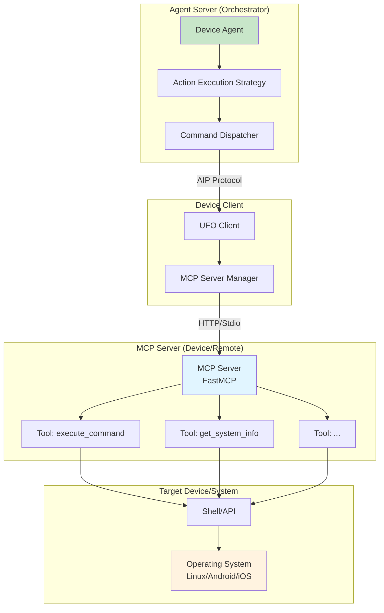
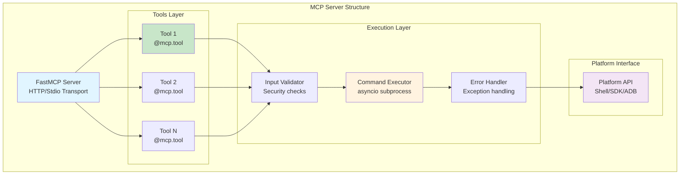

# Part 2: MCP Server Development

This tutorial teaches you how to create a **platform-specific MCP (Model Context Protocol) server** that enables your device agent to execute commands on the target device. We'll use **LinuxAgent's MCP server** as reference implementation.

---

## Table of Contents

1. [MCP Server Overview](#mcp-server-overview)
2. [Architecture and Design](#architecture-and-design)
3. [LinuxAgent MCP Server Analysis](#linuxagent-mcp-server-analysis)
4. [Creating Your MCP Server](#creating-your-mcp-server)
5. [Tool Definition Best Practices](#tool-definition-best-practices)
6. [Error Handling and Validation](#error-handling-and-validation)
7. [Testing Your MCP Server](#testing-your-mcp-server)

---

## MCP Server Overview

### What is an MCP Server?

An **MCP Server** is a service that exposes **platform-specific tools** (commands) to LLM agents via the Model Context Protocol. For device agents, the MCP server:

- Runs on or near the target device
- Exposes tools as callable functions
- Executes system-level commands safely
- Returns structured results to the agent

### MCP Server in Device Agent Architecture



**Key Points**:

- **MCP Server** runs separately from agent server (security isolation)
- **Tools** are atomic operations exposed to LLM
- **Command Dispatcher** translates LLM actions to MCP tool calls
- **Results** flow back through the same path

---

## Architecture and Design

### MCP Server Components



### MCP Server Design Principles

| Principle | Description | Example |
|-----------|-------------|---------|
| **Atomic Tools** | Each tool performs one specific operation | `execute_command` vs `execute_and_parse_command` |
| **Type Safety** | Use Pydantic `Field` for type annotations | `Annotated[str, Field(description="...")]` |
| **Error Resilience** | Handle all exceptions gracefully | Try/except with structured error responses |
| **Security First** | Validate and sanitize all inputs | Block dangerous commands, validate paths |
| **Platform Agnostic** | Abstract platform differences | Use subprocess for shell, ADB for Android |
| **Async Execution** | Use asyncio for non-blocking operations | `async def`, `await subprocess` |

---

## LinuxAgent MCP Server Analysis

### File Location

**Path**: `ufo/client/mcp/http_servers/linux_mcp_server.py`

### Complete Implementation

```python
#!/usr/bin/env python3
# Copyright (c) Microsoft Corporation.
# Licensed under the MIT License.

"""
Linux MCP Server
Provides MCP interface for executing shell commands on Linux systems.
"""

import argparse
import asyncio
from typing import Annotated, Any, Dict, Optional
from fastmcp import FastMCP
from pydantic import Field


def create_bash_mcp_server(host: str = "", port: int = 8010) -> None:
    """Create an MCP server for Linux command execution."""
    
    # Initialize FastMCP server with configuration
    mcp = FastMCP(
        "Linux Bash MCP Server",  # Server name
        instructions="MCP server for executing shell commands on Linux.",
        stateless_http=False,  # Maintain state across requests
        json_response=True,    # Return JSON responses
        host=host,
        port=port,
    )

    # ========================================
    # Tool 1: Execute Shell Command
    # ========================================
    @mcp.tool()
    async def execute_command(
        command: Annotated[
            str,
            Field(
                description="Shell command to execute on the Linux system. "
                "This should be a valid bash/sh command that will be executed "
                "in a shell environment. Examples: 'ls -la /home', "
                "'cat /etc/os-release', 'python3 --version', "
                "'grep -r \"pattern\" /path/to/search'. Be cautious with "
                "destructive commands as some dangerous operations are blocked."
            ),
        ],
        timeout: Annotated[
            int,
            Field(
                description="Maximum execution time in seconds before the "
                "command is forcefully terminated. Default is 30 seconds. "
                "Use higher values for long-running operations."
            ),
        ] = 30,
        cwd: Annotated[
            Optional[str],
            Field(
                description="Working directory path where the command should "
                "be executed. If not specified, uses server's current directory. "
                "Use absolute paths for reliability."
            ),
        ] = None,
    ) -> Annotated[
        Dict[str, Any],
        Field(
            description="Dictionary containing execution results with keys: "
            "'success' (bool), 'exit_code' (int), 'stdout' (str), "
            "'stderr' (str), or 'error' (str error message if execution failed)"
        ),
    ]:
        """
        Execute a shell command on Linux and return stdout/stderr.
        
        Security: Blocks known dangerous commands.
        """
        # Security: Block dangerous commands
        dangerous = [
            "rm -rf /",
            ":(){ :|:& };:",  # Fork bomb
            "mkfs",
            "dd if=/dev/zero",
            "shutdown",
            "reboot",
        ]
        if any(d in command.lower() for d in dangerous):
            return {"success": False, "error": "Blocked dangerous command."}
        
        try:
            # Create async subprocess
            proc = await asyncio.create_subprocess_shell(
                command,
                stdout=asyncio.subprocess.PIPE,
                stderr=asyncio.subprocess.PIPE,
                cwd=cwd,
            )
            
            try:
                # Wait for completion with timeout
                stdout, stderr = await asyncio.wait_for(
                    proc.communicate(), timeout=timeout
                )
            except asyncio.TimeoutError:
                # Kill process on timeout
                proc.kill()
                await proc.wait()
                return {"success": False, "error": f"Timeout after {timeout}s."}
            
            # Return structured result
            return {
                "success": proc.returncode == 0,
                "exit_code": proc.returncode,
                "stdout": stdout.decode("utf-8", errors="replace"),
                "stderr": stderr.decode("utf-8", errors="replace"),
            }
        except Exception as e:
            return {"success": False, "error": str(e)}

    # ========================================
    # Tool 2: Get System Information
    # ========================================
    @mcp.tool()
    async def get_system_info() -> Annotated[
        Dict[str, Any],
        Field(
            description="Dictionary containing basic Linux system information "
            "with keys: 'uname', 'uptime', 'memory', 'disk'"
        ),
    ]:
        """
        Get basic system info (uname, uptime, memory, disk).
        """
        info = {}
        cmds = {
            "uname": "uname -a",
            "uptime": "uptime",
            "memory": "free -h",
            "disk": "df -h",
        }
        
        for k, cmd in cmds.items():
            try:
                proc = await asyncio.create_subprocess_shell(
                    cmd, stdout=asyncio.subprocess.PIPE
                )
                out, _ = await proc.communicate()
                info[k] = out.decode("utf-8", errors="replace").strip()
            except Exception as e:
                info[k] = f"Error: {e}"
        
        return info

    # Start the server
    mcp.run(transport="streamable-http")


def main():
    """CLI entry point for Linux MCP server."""
    parser = argparse.ArgumentParser(description="Linux Bash MCP Server")
    parser.add_argument(
        "--port", type=int, default=8010, help="Port to run the server on"
    )
    parser.add_argument(
        "--host", default="localhost", help="Host to bind the server to"
    )
    args = parser.parse_args()

    print("=" * 50)
    print("UFO Linux Bash MCP Server")
    print("Linux command execution via Model Context Protocol")
    print(f"Running on {args.host}:{args.port}")
    print("=" * 50)

    create_bash_mcp_server(host=args.host, port=args.port)


if __name__ == "__main__":
    main()
```

### Key Design Patterns

#### 1. Type-Safe Tool Definitions

```python
@mcp.tool()
async def execute_command(
    command: Annotated[str, Field(description="...")],  # Required parameter
    timeout: Annotated[int, Field(description="...")] = 30,  # Optional with default
    cwd: Annotated[Optional[str], Field(description="...")] = None,  # Optional
) -> Annotated[Dict[str, Any], Field(description="...")]:  # Return type
```

**Benefits**:
- ✅ LLM understands parameter types and descriptions
- ✅ Runtime validation via Pydantic
- ✅ Auto-generated API documentation
- ✅ Clear contracts for consumers

#### 2. Security-First Validation

```python
# Block dangerous commands
dangerous = ["rm -rf /", ":(){ :|:& };:", "mkfs", ...]
if any(d in command.lower() for d in dangerous):
    return {"success": False, "error": "Blocked dangerous command."}
```

**Best Practices**:
- ✅ Whitelist safe operations when possible
- ✅ Blacklist known dangerous patterns
- ✅ Validate paths (prevent directory traversal)
- ✅ Limit command complexity
- ❌ Don't rely on sanitization alone

#### 3. Async Execution with Timeout

```python
proc = await asyncio.create_subprocess_shell(...)
try:
    stdout, stderr = await asyncio.wait_for(proc.communicate(), timeout=timeout)
except asyncio.TimeoutError:
    proc.kill()
    await proc.wait()
    return {"success": False, "error": f"Timeout after {timeout}s."}
```

**Why Async?**:
- Non-blocking execution (server remains responsive)
- Timeout enforcement (prevent hanging)
- Concurrent tool execution support
- Better resource utilization

#### 4. Structured Error Handling

```python
return {
    "success": proc.returncode == 0,  # Boolean success flag
    "exit_code": proc.returncode,     # Numeric exit code
    "stdout": stdout.decode("utf-8", errors="replace"),  # Output
    "stderr": stderr.decode("utf-8", errors="replace"),  # Errors
}
```

**Error Response Contract**:
- Always return dict (never raise exceptions to LLM)
- Include `success` boolean field
- Provide detailed error messages
- Preserve stdout/stderr for debugging

---

## Creating Your MCP Server

### Step-by-Step Guide: MobileAgent MCP Server

Let's create a complete MCP server for mobile automation (Android/iOS):

**File**: `ufo/client/mcp/http_servers/mobile_mcp_server.py`

```python
#!/usr/bin/env python3
# Copyright (c) Microsoft Corporation.
# Licensed under the MIT License.

"""
Mobile MCP Server
Provides MCP interface for mobile device automation (Android/iOS).
"""

import argparse
import asyncio
import subprocess
from typing import Annotated, Any, Dict, Optional, Literal
from fastmcp import FastMCP
from pydantic import Field


def create_mobile_mcp_server(
    host: str = "localhost", 
    port: int = 8020,
    platform: str = "android"
) -> None:
    """Create an MCP server for mobile device automation."""
    
    mcp = FastMCP(
        f"Mobile MCP Server ({platform.capitalize()})",
        instructions=f"MCP server for {platform} mobile device automation",
        stateless_http=False,
        json_response=True,
        host=host,
        port=port,
    )

    # ========================================
    # Tool 1: Tap Element by Coordinates
    # ========================================
    @mcp.tool()
    async def tap_screen(
        x: Annotated[int, Field(description="X coordinate (pixels from left)")],
        y: Annotated[int, Field(description="Y coordinate (pixels from top)")],
        duration_ms: Annotated[
            int, 
            Field(description="Tap duration in milliseconds (default: 100)")
        ] = 100,
    ) -> Annotated[
        Dict[str, Any],
        Field(description="Result with 'success', 'message', and optional 'error'")
    ]:
        """
        Tap the screen at specified coordinates.
        
        Platform support:
        - Android: Uses ADB input tap
        - iOS: Uses xcrun simctl (simulator) or ios-deploy (device)
        """
        try:
            if platform == "android":
                # Android: adb shell input tap x y
                result = subprocess.run(
                    ["adb", "shell", "input", "tap", str(x), str(y)],
                    capture_output=True,
                    text=True,
                    timeout=5
                )
                
                if result.returncode == 0:
                    return {
                        "success": True,
                        "message": f"Tapped at ({x}, {y})",
                        "platform": "android"
                    }
                else:
                    return {
                        "success": False,
                        "error": f"ADB error: {result.stderr}",
                        "platform": "android"
                    }
            
            elif platform == "ios":
                # iOS: xcrun simctl (for simulator)
                # Note: Real device requires more complex setup
                result = subprocess.run(
                    ["xcrun", "simctl", "io", "booted", "tap", str(x), str(y)],
                    capture_output=True,
                    text=True,
                    timeout=5
                )
                
                if result.returncode == 0:
                    return {
                        "success": True,
                        "message": f"Tapped at ({x}, {y})",
                        "platform": "ios"
                    }
                else:
                    return {
                        "success": False,
                        "error": f"iOS error: {result.stderr}",
                        "platform": "ios"
                    }
            
        except subprocess.TimeoutExpired:
            return {"success": False, "error": "Command timeout"}
        except Exception as e:
            return {"success": False, "error": str(e)}

    # ========================================
    # Tool 2: Swipe Gesture
    # ========================================
    @mcp.tool()
    async def swipe(
        start_x: Annotated[int, Field(description="Start X coordinate")],
        start_y: Annotated[int, Field(description="Start Y coordinate")],
        end_x: Annotated[int, Field(description="End X coordinate")],
        end_y: Annotated[int, Field(description="End Y coordinate")],
        duration_ms: Annotated[
            int, 
            Field(description="Swipe duration in milliseconds (default: 300)")
        ] = 300,
    ) -> Dict[str, Any]:
        """
        Perform a swipe gesture from start to end coordinates.
        """
        try:
            if platform == "android":
                # Android: adb shell input swipe x1 y1 x2 y2 duration
                result = subprocess.run(
                    [
                        "adb", "shell", "input", "swipe",
                        str(start_x), str(start_y),
                        str(end_x), str(end_y),
                        str(duration_ms)
                    ],
                    capture_output=True,
                    text=True,
                    timeout=5
                )
                
                return {
                    "success": result.returncode == 0,
                    "message": f"Swiped from ({start_x},{start_y}) to ({end_x},{end_y})",
                    "error": result.stderr if result.returncode != 0 else None
                }
            
            elif platform == "ios":
                # iOS simulator: multiple taps with delay
                # (Approximates swipe - real swipe requires XCUITest)
                await asyncio.sleep(0.1)  # Placeholder
                return {
                    "success": True,
                    "message": f"Swipe gesture simulated (iOS)",
                    "note": "Real device requires XCUITest integration"
                }
                
        except Exception as e:
            return {"success": False, "error": str(e)}

    # ========================================
    # Tool 3: Type Text
    # ========================================
    @mcp.tool()
    async def type_text(
        text: Annotated[str, Field(description="Text to type")],
        clear_first: Annotated[
            bool, 
            Field(description="Clear existing text before typing")
        ] = False,
    ) -> Dict[str, Any]:
        """
        Type text into the currently focused input field.
        """
        try:
            if platform == "android":
                # Escape special characters for ADB
                escaped_text = text.replace(" ", "%s").replace("'", "\\'")
                
                if clear_first:
                    # Clear existing text (Ctrl+A + Delete)
                    subprocess.run(
                        ["adb", "shell", "input", "keyevent", "KEYCODE_CTRL_A"],
                        timeout=2
                    )
                    subprocess.run(
                        ["adb", "shell", "input", "keyevent", "KEYCODE_DEL"],
                        timeout=2
                    )
                
                # Type new text
                result = subprocess.run(
                    ["adb", "shell", "input", "text", escaped_text],
                    capture_output=True,
                    text=True,
                    timeout=5
                )
                
                return {
                    "success": result.returncode == 0,
                    "message": f"Typed: {text}",
                    "error": result.stderr if result.returncode != 0 else None
                }
            
            elif platform == "ios":
                # iOS: xcrun simctl io booted text
                result = subprocess.run(
                    ["xcrun", "simctl", "io", "booted", "text", text],
                    capture_output=True,
                    text=True,
                    timeout=5
                )
                
                return {
                    "success": result.returncode == 0,
                    "message": f"Typed: {text}",
                    "error": result.stderr if result.returncode != 0 else None
                }
                
        except Exception as e:
            return {"success": False, "error": str(e)}

    # ========================================
    # Tool 4: Capture Screenshot
    # ========================================
    @mcp.tool()
    async def capture_screenshot(
        save_path: Annotated[
            str, 
            Field(description="Local path to save screenshot (e.g., '/tmp/screen.png')")
        ],
    ) -> Dict[str, Any]:
        """
        Capture a screenshot from the mobile device.
        """
        try:
            if platform == "android":
                # Android: adb exec-out screencap -p > file
                result = subprocess.run(
                    ["adb", "exec-out", "screencap", "-p"],
                    capture_output=True,
                    timeout=10
                )
                
                if result.returncode == 0:
                    with open(save_path, "wb") as f:
                        f.write(result.stdout)
                    return {
                        "success": True,
                        "message": f"Screenshot saved to {save_path}",
                        "path": save_path
                    }
                else:
                    return {"success": False, "error": result.stderr.decode()}
            
            elif platform == "ios":
                # iOS: xcrun simctl io booted screenshot
                result = subprocess.run(
                    ["xcrun", "simctl", "io", "booted", "screenshot", save_path],
                    capture_output=True,
                    text=True,
                    timeout=10
                )
                
                return {
                    "success": result.returncode == 0,
                    "message": f"Screenshot saved to {save_path}",
                    "path": save_path,
                    "error": result.stderr if result.returncode != 0 else None
                }
                
        except Exception as e:
            return {"success": False, "error": str(e)}

    # ========================================
    # Tool 5: Get UI Hierarchy
    # ========================================
    @mcp.tool()
    async def get_ui_tree(
        format: Annotated[
            Literal["xml", "json"],
            Field(description="Output format (xml or json)")
        ] = "xml",
    ) -> Dict[str, Any]:
        """
        Get the current UI hierarchy/tree from the device.
        """
        try:
            if platform == "android":
                # Android: adb shell uiautomator dump
                # Dump to device, then pull
                subprocess.run(
                    ["adb", "shell", "uiautomator", "dump", "/sdcard/window_dump.xml"],
                    timeout=10
                )
                
                result = subprocess.run(
                    ["adb", "shell", "cat", "/sdcard/window_dump.xml"],
                    capture_output=True,
                    text=True,
                    timeout=5
                )
                
                if result.returncode == 0:
                    return {
                        "success": True,
                        "ui_tree": result.stdout,
                        "format": "xml"
                    }
                else:
                    return {"success": False, "error": result.stderr}
            
            elif platform == "ios":
                # iOS: requires XCUITest or Appium
                return {
                    "success": False,
                    "error": "iOS UI tree requires XCUITest integration",
                    "note": "Use accessibility inspector or Appium"
                }
                
        except Exception as e:
            return {"success": False, "error": str(e)}

    # ========================================
    # Tool 6: Launch App
    # ========================================
    @mcp.tool()
    async def launch_app(
        package_name: Annotated[
            str,
            Field(description="App package name (Android) or bundle ID (iOS)")
        ],
    ) -> Dict[str, Any]:
        """
        Launch an application by package name or bundle ID.
        """
        try:
            if platform == "android":
                # Android: adb shell monkey
                result = subprocess.run(
                    [
                        "adb", "shell", "monkey", "-p", package_name,
                        "-c", "android.intent.category.LAUNCHER", "1"
                    ],
                    capture_output=True,
                    text=True,
                    timeout=10
                )
                
                return {
                    "success": "monkey" in result.stdout.lower(),
                    "message": f"Launched {package_name}",
                    "output": result.stdout
                }
            
            elif platform == "ios":
                # iOS: xcrun simctl launch
                result = subprocess.run(
                    ["xcrun", "simctl", "launch", "booted", package_name],
                    capture_output=True,
                    text=True,
                    timeout=10
                )
                
                return {
                    "success": result.returncode == 0,
                    "message": f"Launched {package_name}",
                    "error": result.stderr if result.returncode != 0 else None
                }
                
        except Exception as e:
            return {"success": False, "error": str(e)}

    # Start the server
    mcp.run(transport="streamable-http")


def main():
    """CLI entry point for Mobile MCP server."""
    parser = argparse.ArgumentParser(description="Mobile MCP Server")
    parser.add_argument(
        "--port", type=int, default=8020, help="Port to run the server on"
    )
    parser.add_argument(
        "--host", default="localhost", help="Host to bind the server to"
    )
    parser.add_argument(
        "--platform",
        choices=["android", "ios"],
        default="android",
        help="Mobile platform (android or ios)"
    )
    args = parser.parse_args()

    print("=" * 50)
    print(f"UFO Mobile MCP Server ({args.platform.capitalize()})")
    print(f"Mobile device automation via Model Context Protocol")
    print(f"Running on {args.host}:{args.port}")
    print("=" * 50)

    create_mobile_mcp_server(host=args.host, port=args.port, platform=args.platform)


if __name__ == "__main__":
    main()
```

---

## Tool Definition Best Practices

### 1. Descriptive Tool Names

| ❌ Bad | ✅ Good | Why |
|--------|---------|-----|
| `do_thing` | `tap_screen` | Clear action |
| `cmd` | `execute_command` | Self-documenting |
| `get` | `get_ui_tree` | Specific purpose |

### 2. Rich Type Annotations

```python
# ✅ Excellent: Full type hints with descriptions
@mcp.tool()
async def tap_screen(
    x: Annotated[int, Field(description="X coordinate in pixels from left edge")],
    y: Annotated[int, Field(description="Y coordinate in pixels from top edge")],
    duration_ms: Annotated[int, Field(description="Tap duration in milliseconds")] = 100,
) -> Annotated[Dict[str, Any], Field(description="Result dict with 'success' and 'message'")]:
```

### 3. Consistent Return Format

```python
# ✅ Always return structured dict
{
    "success": bool,      # Required: operation status
    "message": str,       # Optional: human-readable result
    "error": str,         # Optional: error details if success=False
    "data": Any,          # Optional: additional result data
}

# ❌ Don't mix return types
return True  # Bad: not structured
raise Exception("Error")  # Bad: exceptions not handled by LLM
```

### 4. Comprehensive Docstrings

```python
@mcp.tool()
async def swipe(start_x: int, start_y: int, end_x: int, end_y: int) -> Dict:
    """
    Perform a swipe gesture from start to end coordinates.
    
    Platform support:
    - Android: Uses ADB input swipe
    - iOS: Simulated via multiple taps (requires XCUITest for real swipe)
    
    Args:
        start_x: Starting X coordinate (pixels from left)
        start_y: Starting Y coordinate (pixels from top)
        end_x: Ending X coordinate
        end_y: Ending Y coordinate
    
    Returns:
        Dict with 'success', 'message', and optional 'error'
    
    Example:
        >>> await swipe(100, 500, 100, 100)  # Swipe up
        {"success": True, "message": "Swiped from (100,500) to (100,100)"}
    """
```

---

## Error Handling and Validation

### Input Validation Strategies

```python
@mcp.tool()
async def tap_screen(x: int, y: int) -> Dict[str, Any]:
    """Tap with validation."""
    
    # 1. Range validation
    if x < 0 or y < 0:
        return {
            "success": False,
            "error": f"Invalid coordinates: ({x}, {y}). Must be non-negative."
        }
    
    # 2. Boundary checks (if screen size known)
    max_x, max_y = 1080, 1920  # Example resolution
    if x > max_x or y > max_y:
        return {
            "success": False,
            "error": f"Coordinates out of bounds. Screen: {max_x}x{max_y}"
        }
    
    # 3. Execute with error handling
    try:
        result = subprocess.run([...], timeout=5)
        return {"success": result.returncode == 0}
    except subprocess.TimeoutExpired:
        return {"success": False, "error": "Tap command timeout"}
    except Exception as e:
        return {"success": False, "error": f"Unexpected error: {str(e)}"}
```

### Security Validation

```python
def validate_app_package(package: str) -> bool:
    """Validate app package name format."""
    import re
    # Android: com.example.app
    android_pattern = r'^[a-z][a-z0-9_]*(\.[a-z][a-z0-9_]*)+$'
    # iOS: com.example.App
    ios_pattern = r'^[a-zA-Z][a-zA-Z0-9_]*(\.[a-zA-Z][a-zA-Z0-9_]*)+$'
    
    return bool(re.match(android_pattern, package) or re.match(ios_pattern, package))

@mcp.tool()
async def launch_app(package_name: str) -> Dict:
    """Launch app with validation."""
    if not validate_app_package(package_name):
        return {
            "success": False,
            "error": f"Invalid package name format: {package_name}"
        }
    # ... continue execution
```

### Timeout Strategies

```python
# Strategy 1: Command-level timeout
result = subprocess.run([...], timeout=5)

# Strategy 2: Async timeout with cleanup
try:
    proc = await asyncio.create_subprocess_exec(...)
    stdout, stderr = await asyncio.wait_for(proc.communicate(), timeout=10)
except asyncio.TimeoutError:
    proc.kill()  # Clean up process
    await proc.wait()
    return {"success": False, "error": "Operation timeout"}

# Strategy 3: Retry with backoff
async def execute_with_retry(cmd, max_retries=3):
    for attempt in range(max_retries):
        try:
            return await execute_command(cmd)
        except TimeoutError:
            if attempt == max_retries - 1:
                raise
            await asyncio.sleep(2 ** attempt)  # Exponential backoff
```

---

## Testing Your MCP Server

### Unit Testing

```python
# tests/test_mobile_mcp_server.py

import pytest
from unittest.mock import patch, MagicMock
from ufo.client.mcp.http_servers.mobile_mcp_server import (
    create_mobile_mcp_server
)


class TestMobileMCPServer:
    """Unit tests for Mobile MCP Server tools."""

    @pytest.mark.asyncio
    @patch('subprocess.run')
    async def test_tap_screen_success(self, mock_run):
        """Test successful tap execution."""
        # Mock subprocess result
        mock_run.return_value = MagicMock(
            returncode=0,
            stdout="",
            stderr=""
        )
        
        # Import tool function (assuming it's exposed)
        from mobile_mcp_server import tap_screen
        
        result = await tap_screen(x=100, y=200)
        
        assert result["success"] == True
        assert "Tapped at (100, 200)" in result["message"]
        mock_run.assert_called_once()

    @pytest.mark.asyncio
    async def test_tap_screen_invalid_coordinates(self):
        """Test tap with invalid coordinates."""
        from mobile_mcp_server import tap_screen
        
        result = await tap_screen(x=-10, y=50)
        
        assert result["success"] == False
        assert "Invalid coordinates" in result["error"]

    @pytest.mark.asyncio
    @patch('subprocess.run')
    async def test_swipe_timeout(self, mock_run):
        """Test swipe with timeout."""
        mock_run.side_effect = subprocess.TimeoutExpired(cmd="adb", timeout=5)
        
        from mobile_mcp_server import swipe
        
        result = await swipe(0, 0, 100, 100)
        
        assert result["success"] == False
        assert "timeout" in result["error"].lower()
```

### Integration Testing

```python
# tests/integration/test_mcp_server_integration.py

import pytest
import requests
from ufo.client.mcp.mcp_server_manager import HTTPMCPServer


class TestMCPServerIntegration:
    """Integration tests for MCP server."""

    @pytest.fixture
    def mcp_server(self):
        """Start MCP server for testing."""
        config = {
            "host": "localhost",
            "port": 8020,
            "path": "/mcp"
        }
        server = HTTPMCPServer(config)
        server.start()
        yield server
        server.stop()

    def test_server_health(self, mcp_server):
        """Test server is reachable."""
        response = requests.get(f"{mcp_server.server}/health")
        assert response.status_code == 200

    def test_tap_screen_end_to_end(self, mcp_server):
        """Test tap screen tool end-to-end."""
        payload = {
            "tool": "tap_screen",
            "parameters": {"x": 100, "y": 200}
        }
        response = requests.post(
            f"{mcp_server.server}/execute",
            json=payload
        )
        
        assert response.status_code == 200
        result = response.json()
        assert "success" in result
```

### Manual Testing

```bash
# 1. Start MCP server
python -m ufo.client.mcp.http_servers.mobile_mcp_server \
  --host localhost \
  --port 8020 \
  --platform android

# 2. Test with curl
curl -X POST http://localhost:8020/mcp \
  -H "Content-Type: application/json" \
  -d '{
    "tool": "tap_screen",
    "parameters": {"x": 500, "y": 1000}
  }'

# 3. Expected response
{
  "success": true,
  "message": "Tapped at (500, 1000)",
  "platform": "android"
}
```

---

## Summary

**What You've Built**:

- ✅ Platform-specific MCP server with FastMCP
- ✅ Type-safe tool definitions with Pydantic
- ✅ Async execution with timeout handling
- ✅ Security validation and error handling
- ✅ Comprehensive testing strategy

**Key Takeaways**:

| Concept | Best Practice |
|---------|---------------|
| **Tool Design** | Atomic, single-purpose operations |
| **Type Safety** | Use `Annotated[T, Field(description=...)]` |
| **Error Handling** | Always return structured dicts, never raise |
| **Security** | Validate inputs, block dangerous operations |
| **Async** | Use `asyncio` for non-blocking execution |
| **Testing** | Unit + integration tests for all tools |

---

## Next Steps

**Continue to**: [Part 3: Client Setup →](client_setup.md)

Learn how to configure the UFO client to connect to your MCP server and enable device agent execution.

---

## Related Documentation

- **[MCP Overview](../../mcp/overview.md)** - Model Context Protocol fundamentals
- **[Creating MCP Servers](../creating_mcp_servers.md)** - General MCP server tutorial
- **[FastMCP Documentation](https://github.com/jlowin/fastmcp)** - FastMCP library reference
- **[AIP Protocol](../../aip/overview.md)** - Agent Interaction Protocol

---

**Previous**: [← Part 1: Core Components](core_components.md)  
**Next**: [Part 3: Client Setup →](client_setup.md)
