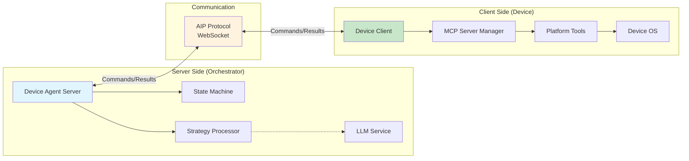
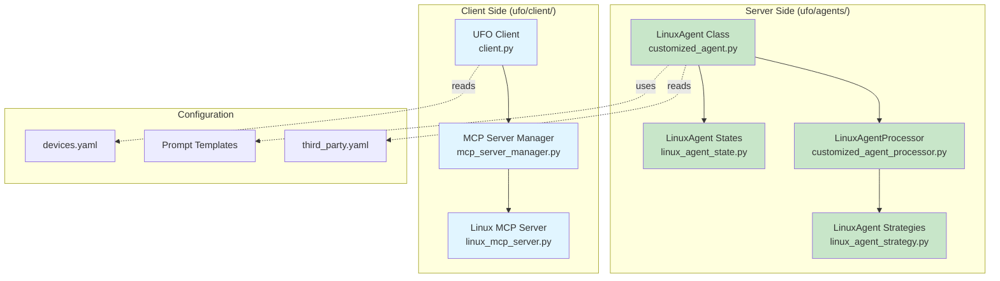
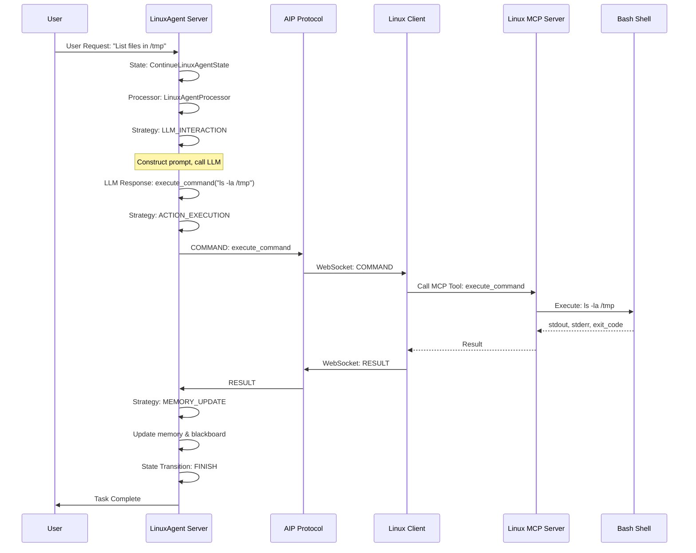
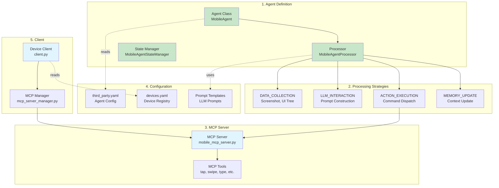

# Creating a New Device Agent - Complete Tutorial

This comprehensive tutorial teaches you how to create a new device agent (like `MobileAgent`, `AndroidAgent`, or `iOSAgent`) and integrate it with UFO³'s multi-device orchestration system. We'll use **LinuxAgent** as our primary reference implementation.

---

## 📋 Table of Contents

1. [Introduction](#introduction)
2. [Prerequisites](#prerequisites)
3. [Understanding Device Agents](#understanding-device-agents)
4. [LinuxAgent: Reference Implementation](#linuxagent-reference-implementation)
5. [Architecture Overview](#architecture-overview)
6. [Tutorial Roadmap](#tutorial-roadmap)

---

## Introduction

### What is a Device Agent?

A **Device Agent** is a specialized AI agent that controls and automates tasks on a specific type of device or platform. Unlike traditional third-party agents that extend specific functionality, device agents represent entire computing platforms with their own:

- **Execution Environment**: Device-specific OS, runtime, and APIs
- **Control Mechanism**: UI automation, CLI commands, or platform APIs
- **Communication Protocol**: Client-server architecture via WebSocket
- **MCP Integration**: Device-specific MCP servers for command execution

### Device Agent vs Third-Party Agent

| Aspect | Device Agent | Third-Party Agent |
|--------|--------------|-------------------|
| **Scope** | Full platform control (Windows, Linux, Mobile) | Specific functionality (Hardware, Web) |
| **Architecture** | Client-Server separation | Runs on orchestrator server |
| **Communication** | WebSocket + AIP Protocol | Direct method calls |
| **MCP Servers** | Platform-specific MCP servers | Shares MCP servers |
| **Examples** | WindowsAgent, LinuxAgent, MobileAgent | HardwareAgent, WebAgent |
| **Deployment** | Separate client process on device | Part of orchestrator |

### When to Create a Device Agent

Create a **Device Agent** when you need to:

- Control an entirely new platform (mobile, IoT, embedded)
- Execute tasks on remote or distributed devices
- Integrate with Galaxy multi-device orchestration
- Isolate execution for security or scalability

Create a **Third-Party Agent** when you need to:

- Extend existing platform with new capabilities
- Add specialized tools or APIs
- Run alongside existing agents

---

## Prerequisites

Before starting this tutorial, ensure you have:

### Knowledge Requirements

- ✅ **Python 3.10+**: Intermediate Python programming skills
- ✅ **Async Programming**: Understanding of `async`/`await` patterns
- ✅ **UFO³ Basics**: Familiarity with [Agent Architecture](../../infrastructure/agents/overview.md)
- ✅ **MCP Protocol**: Understanding of [Model Context Protocol](../../mcp/overview.md)
- ✅ **WebSocket**: Basic knowledge of WebSocket communication

### Recommended Reading

| Priority | Topic | Link | Time |
|----------|-------|------|------|
| 🥇 | **Agent Architecture Overview** | [Infrastructure/Agents](../../infrastructure/agents/overview.md) | 20 min |
| 🥇 | **LinuxAgent Quick Start** | [Quick Start: Linux](../../getting_started/quick_start_linux.md) | 15 min |
| 🥈 | **Server-Client Architecture** | [Server Overview](../../server/overview.md), [Client Overview](../../client/overview.md) | 30 min |
| 🥈 | **MCP Integration** | [MCP Overview](../../mcp/overview.md) | 20 min |
| 🥉 | **AIP Protocol** | [AIP Protocol](../../aip/overview.md) | 15 min |

### Development Environment

```bash
# Clone UFO³ repository
git clone https://github.com/microsoft/UFO.git
cd UFO

# Install dependencies
pip install -r requirements.txt

# Verify installation
python -c "import ufo; print('UFO³ installed successfully')"
```

---

## Understanding Device Agents

### Three-Layer Architecture

All device agents in UFO³ follow a **unified three-layer architecture**:

```mermaid
graph TB
    subgraph "Device Agent Architecture"
        subgraph "Level-1: State Layer (FSM)"
            S1[AgentState]
            S2[State Machine]
            S3[State Transitions]
            S1 --> S2 --> S3
        end
        
        subgraph "Level-2: Strategy Layer (Execution Logic)"
            P1[ProcessorTemplate]
            P2[DATA_COLLECTION]
            P3[LLM_INTERACTION]
            P4[ACTION_EXECUTION]
            P5[MEMORY_UPDATE]
            P1 --> P2 --> P3 --> P4 --> P5
        end
        
        subgraph "Level-3: Command Layer (System Interface)"
            C1[CommandDispatcher]
            C2[MCP Tools]
            C3[Device Commands]
            C1 --> C2 --> C3
        end
        
        S3 -->|delegates to| P1
        P5 -->|executes via| C1
    end
    
    style S1 fill:#e1f5ff
    style P1 fill:#fff3e0
    style C1 fill:#f3e5f5
```



**Key Layers**:

1. **State Layer (Level-1)**: Finite State Machine controlling agent lifecycle
2. **Strategy Layer (Level-2)**: Processing pipeline with modular strategies
3. **Command Layer (Level-3)**: Atomic system operations via MCP

For detailed architecture, see [Agent Architecture Documentation](../../infrastructure/agents/overview.md).

---

### Server-Client Separation

Device agents use a **server-client architecture** for security and scalability:



**Separation Benefits**:

| Component | Location | Responsibilities | Security |
|-----------|----------|------------------|----------|
| **Agent Server** | Orchestrator | Reasoning, planning, state management | Untrusted (LLM-driven) |
| **Device Client** | Target Device | Command execution, resource access | Trusted (validated operations) |
| **AIP Protocol** | Network | Message transport, serialization | Encrypted channel |

**Separation Benefits**:

- **Security**: Isolates LLM reasoning from system-level execution
- **Scalability**: Single orchestrator manages multiple devices
- **Flexibility**: Clients run on resource-constrained devices (mobile, IoT)
- **Safety**: Client validates all commands before execution

---

## LinuxAgent: Reference Implementation

### Why LinuxAgent as Reference?

**LinuxAgent** is the ideal reference for creating new device agents because:

- ✅ **Simple Architecture**: Single-tier agent (no HostAgent delegation)
- ✅ **Clear Separation**: Clean server-client boundary
- ✅ **Well-Documented**: Comprehensive code and documentation
- ✅ **Production-Ready**: Battle-tested in real deployments
- ✅ **Minimal Complexity**: Focuses on core device agent patterns

### LinuxAgent Components



**File Locations**:

| Component | File Path | Purpose |
|-----------|-----------|---------|
| **Agent Class** | `ufo/agents/agent/customized_agent.py` | LinuxAgent definition |
| **Processor** | `ufo/agents/processors/customized/customized_agent_processor.py` | LinuxAgentProcessor |
| **Strategies** | `ufo/agents/processors/strategies/linux_agent_strategy.py` | LLM & Action strategies |
| **States** | `ufo/agents/states/linux_agent_state.py` | State machine states |
| **Prompter** | `ufo/prompter/customized/linux_agent_prompter.py` | Prompt construction |
| **Client** | `ufo/client/client.py` | Device client entry point |
| **MCP Server** | `ufo/client/mcp/http_servers/linux_mcp_server.py` | Command execution |

---

### LinuxAgent Architecture Diagram



**Key Execution Flow**:

1. **User Request** → LinuxAgent Server receives request
2. **State Machine** → Activates `ContinueLinuxAgentState`
3. **Processor** → Executes `LinuxAgentProcessor` strategies
4. **LLM Interaction** → Generates shell command
5. **Action Execution** → Sends command via AIP to client
6. **MCP Execution** → Client executes via Linux MCP Server
7. **Result Handling** → Server receives result, updates memory
8. **State Transition** → Moves to `FINISH` state

---

## Architecture Overview

### Complete Device Agent Architecture

When creating a new device agent (e.g., `MobileAgent`), you'll implement these components:



**Implementation Checklist**:

- [ ] **Agent Class**: Define `MobileAgent` inheriting from `CustomizedAgent`
- [ ] **Processor**: Create `MobileAgentProcessor` with custom strategies
- [ ] **State Manager**: Implement `MobileAgentStateManager` and states
- [ ] **Strategies**: Build platform-specific LLM and action strategies
- [ ] **MCP Server**: Develop MCP server with platform tools
- [ ] **Prompter**: Create custom prompter for mobile context
- [ ] **Client Setup**: Configure client to run on mobile device
- [ ] **Configuration**: Add agent config to `third_party.yaml`
- [ ] **Device Registry**: Register device in `devices.yaml`
- [ ] **Prompt Templates**: Write LLM prompt templates

---

## Tutorial Roadmap

This tutorial is split into **6 detailed guides**:

### 📘 Part 1: [Core Components](core_components.md)

Learn to implement the **server-side components**:

- Agent Class definition
- Processor and strategies
- State Manager and states
- Prompter for LLM interaction

**Time**: 45 minutes  
**Difficulty**: ⭐⭐⭐

---

### 📘 Part 2: [MCP Server Development](mcp_server.md)

Create a **platform-specific MCP server**:

- MCP server architecture
- Defining MCP tools
- Command execution logic
- Error handling and validation

**Time**: 30 minutes  
**Difficulty**: ⭐⭐

---

### 📘 Part 3: [Client Configuration](client_setup.md)

Set up the **device client**:

- Client initialization
- MCP server manager integration
- WebSocket connection setup
- Platform detection

**Time**: 20 minutes  
**Difficulty**: ⭐⭐

---

### 📘 Part 4: [Configuration & Deployment](configuration.md)

Configure and deploy your agent:

- `third_party.yaml` configuration
- `devices.yaml` device registration
- Prompt template creation
- Galaxy integration

**Time**: 25 minutes  
**Difficulty**: ⭐⭐

---

### 📘 Part 5: [Testing & Debugging](testing.md)

Test and debug your implementation:

- Unit testing strategies
- Integration testing
- Debugging techniques
- Common issues and solutions

**Time**: 30 minutes  
**Difficulty**: ⭐⭐⭐

---

### 📘 Part 6: [Complete Example: MobileAgent](example_mobile_agent.md)

**Hands-on walkthrough** creating `MobileAgent`:

- Step-by-step implementation
- Android/iOS platform specifics
- UI Automator integration
- Complete working example

**Time**: 60 minutes  
**Difficulty**: ⭐⭐⭐⭐

---

## Quick Start Guide

For experienced developers, here's a **minimal implementation checklist**:

### 1️⃣ Create Agent Class

```python
# ufo/agents/agent/customized_agent.py

@AgentRegistry.register(
    agent_name="MobileAgent",
    third_party=True,
    processor_cls=MobileAgentProcessor
)
class MobileAgent(CustomizedAgent):
    def __init__(self, name, main_prompt, example_prompt):
        super().__init__(name, main_prompt, example_prompt,
                         process_name=None, app_root_name=None, is_visual=None)
        self._blackboard = Blackboard()
        self.set_state(self.default_state)
        self._context_provision_executed = False
    
    @property
    def default_state(self):
        return ContinueMobileAgentState()
```

### 2️⃣ Create Processor

```python
# ufo/agents/processors/customized/customized_agent_processor.py

class MobileAgentProcessor(CustomizedProcessor):
    def _setup_strategies(self):
        # Compose multiple data collection strategies
        self.strategies[ProcessingPhase.DATA_COLLECTION] = ComposedStrategy(
            strategies=[
                MobileScreenshotCaptureStrategy(fail_fast=True),
                MobileAppsCollectionStrategy(fail_fast=False),
                MobileControlsCollectionStrategy(fail_fast=False),
            ],
            name="MobileDataCollectionStrategy",
            fail_fast=True,
        )
        
        self.strategies[ProcessingPhase.LLM_INTERACTION] = (
            MobileLLMInteractionStrategy(fail_fast=True)
        )
        self.strategies[ProcessingPhase.ACTION_EXECUTION] = (
            MobileActionExecutionStrategy(fail_fast=False)
        )
        self.strategies[ProcessingPhase.MEMORY_UPDATE] = (
            AppMemoryUpdateStrategy(fail_fast=False)
        )
```

### 3️⃣ Create MCP Server

```python
# ufo/client/mcp/http_servers/mobile_mcp_server.py

def create_mobile_mcp_server(host="localhost", port=8020):
    mcp = FastMCP("Mobile MCP Server", stateless_http=False, 
                  json_response=True, host=host, port=port)
    
    @mcp.tool()
    async def tap_element(x: int, y: int) -> dict:
        # Execute tap via ADB or platform API
        pass
    
    mcp.run(transport="streamable-http")
```

### 4️⃣ Configure Agent

```yaml
# config/ufo/third_party.yaml

ENABLED_THIRD_PARTY_AGENTS: ["MobileAgent"]

THIRD_PARTY_AGENT_CONFIG:
  MobileAgent:
    VISUAL_MODE: True
    AGENT_NAME: "MobileAgent"
    APPAGENT_PROMPT: "ufo/prompts/third_party/mobile_agent.yaml"
    APPAGENT_EXAMPLE_PROMPT: "ufo/prompts/third_party/mobile_agent_example.yaml"
    INTRODUCTION: "MobileAgent controls Android/iOS devices..."
```

### 5️⃣ Register Device

```yaml
# config/galaxy/devices.yaml

devices:
  - device_id: "mobile_agent_1"
    server_url: "ws://localhost:5010/ws"
    os: "android"
    capabilities: ["ui_automation", "app_testing"]
    metadata:
      device_model: "Pixel 6"
      android_version: "13"
    max_retries: 5
```

### 6️⃣ Start Server & Client

```bash
# Terminal 1: Start Agent Server
python -m ufo.server.app --port 5010

# Terminal 2: Start Device Client
python -m ufo.client.client \
  --ws --ws-server ws://localhost:5010/ws \
  --client-id mobile_agent_1 \
  --platform android

# Terminal 3: Start MCP Server (on device or accessible endpoint)
python -m ufo.client.mcp.http_servers.mobile_mcp_server --port 8020
```

---

## Next Steps

**Ready to Build Your Device Agent?**

Start with Part 1: [Core Components →](core_components.md)

Or jump to a specific topic:

- [MCP Server Development](mcp_server.md)
- [Configuration & Deployment](configuration.md)
- [Complete Example: MobileAgent](example_mobile_agent.md)

---

## Related Documentation

- **[Agent Architecture](../../infrastructure/agents/overview.md)** - Three-layer architecture deep dive
- **[Linux Agent Quick Start](../../getting_started/quick_start_linux.md)** - LinuxAgent deployment guide
- **[Server Overview](../../server/overview.md)** - Server-side orchestration
- **[Client Overview](../../client/overview.md)** - Client-side execution
- **[MCP Overview](../../mcp/overview.md)** - Model Context Protocol
- **[AIP Protocol](../../aip/overview.md)** - Agent Interaction Protocol
- **[Creating Third-Party Agents](../creating_third_party_agents.md)** - Third-party agent tutorial

---

## Summary

**Key Takeaways**:

- **Device Agents** control entire platforms (Windows, Linux, Mobile)
- **Server-Client Architecture** separates reasoning from execution
- **Three-Layer Design** provides modular, extensible framework
- **LinuxAgent** is the best reference implementation
- **6-Part Tutorial** covers all aspects of device agent creation
- **MCP Integration** enables platform-specific command execution
- **Galaxy Integration** supports multi-device orchestration

**Ready to build your first device agent? Let's get started!** 🚀

