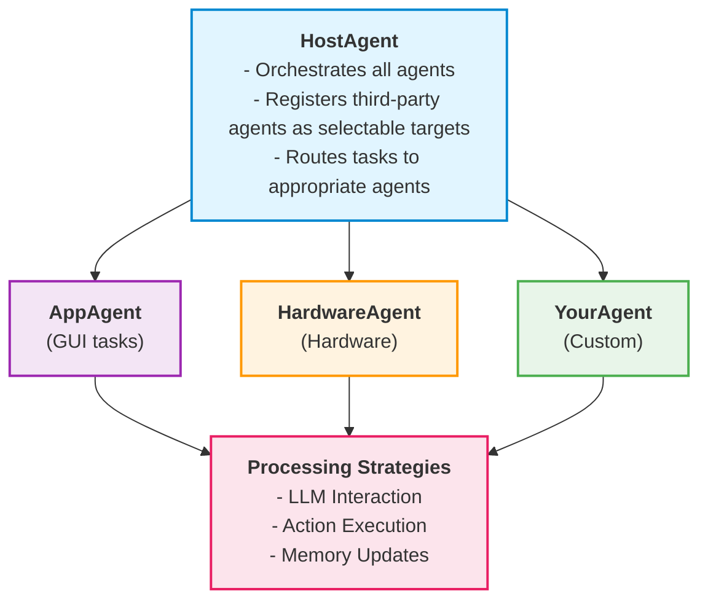

# Creating Custom Third-Party Agents - Complete Tutorial

This tutorial teaches you how to create, register, and deploy custom third-party agents that extend UFO²'s capabilities beyond Windows GUI automation. You'll learn the complete process using **HardwareAgent** as a reference implementation.

**Prerequisites**: Basic Python knowledge, familiarity with UFO² agent architecture, [Agent Configuration](../configuration/system/agents_config.md), and [Third-Party Configuration](../configuration/system/third_party_config.md).

---

## Table of Contents

1. [Overview](#overview)
2. [Understanding Third-Party Agents](#understanding-third-party-agents)
3. [Step-by-Step Implementation](#step-by-step-implementation)
4. [Complete Example: HardwareAgent](#complete-example-hardwareagent)
5. [Registering with HostAgent](#registering-with-hostagent)
6. [Configuration and Deployment](#configuration-and-deployment)
7. [Best Practices](#best-practices)
8. [Troubleshooting](#troubleshooting)

---

## Overview

### What are Third-Party Agents?

Third-party agents are specialized agents that extend UFO²'s capabilities to handle tasks beyond standard Windows GUI automation. They work alongside the core agents (HostAgent and AppAgent) to provide domain-specific functionality.

**Key Characteristics**:
- ✅ Independent agent implementation with custom logic
- ✅ Registered and managed by HostAgent
- ✅ Selectable as execution targets by the LLM
- ✅ Can use MCP servers and custom tools
- ✅ Configurable via YAML files

**Common Use Cases**:
- 🔧 **Hardware Control**: Physical device manipulation (HardwareAgent)
- 🐧 **Linux CLI**: Server and CLI command execution (LinuxAgent)
- 🌐 **Web Automation**: Browser-based tasks without GUI
- 📡 **IoT Integration**: Smart device control
- 🤖 **Robotic Process Automation**: Custom automation workflows

---

## Understanding Third-Party Agents

### Architecture Overview

Third-party agents integrate with UFO² through a well-defined architecture:



### Agent Registry System

UFO² uses a registry pattern to dynamically load and manage agents:

```python
@AgentRegistry.register(
    agent_name="YourAgent",      # Unique identifier
    third_party=True,            # Mark as third-party
    processor_cls=YourProcessor  # Processing logic
)
class YourAgent(CustomizedAgent):
    """Your custom agent implementation."""
    pass
```

**How it works**:

1. **Registration**: `@AgentRegistry.register()` decorator registers your agent class
2. **Filtering**: Registry checks if agent is in `ENABLED_THIRD_PARTY_AGENTS` config
3. **Instantiation**: HostAgent creates instances when needed
4. **Target Selection**: LLM can select your agent as an execution target

---

## Step-by-Step Implementation

### Step 1: Create Agent Class

Create your agent class by inheriting from `CustomizedAgent`:

```python
# File: ufo/agents/agent/customized_agent.py

from ufo.agents.agent.app_agent import AppAgent
from ufo.agents.agent.basic import AgentRegistry
from ufo.agents.processors.customized.customized_agent_processor import (
    CustomizedProcessor,
    YourAgentProcessor,  # Import your processor
)

@AgentRegistry.register(
    agent_name="YourAgent",
    third_party=True,
    processor_cls=YourAgentProcessor
)
class YourAgent(CustomizedAgent):
    """
    YourAgent is a specialized agent that handles [specific functionality].
    
    This agent extends CustomizedAgent to provide:
    - Custom domain logic (e.g., hardware control, web automation)
    - Specialized action execution
    - Domain-specific tool integration
    """
    
    def __init__(
        self,
        name: str,
        main_prompt: str,
        example_prompt: str,
        api_prompt: str = None,
    ) -> None:
        """
        Initialize YourAgent.
        
        :param name: The name of the agent instance
        :param main_prompt: Path to main prompt template YAML
        :param example_prompt: Path to example prompt template YAML
        :param api_prompt: Optional path to API prompt template YAML
        """
        super().__init__(
            name=name,
            main_prompt=main_prompt,
            example_prompt=example_prompt,
            process_name=None,
            app_root_name=None,
            is_visual=None,  # Set True if your agent uses screenshots
        )
        
        # Optional: Add custom initialization
        self._custom_state = {}
        self.logger.info(f"YourAgent initialized with prompts: {main_prompt}")

    # Optional: Override methods for custom behavior
    def get_prompter(self, is_visual: bool, main_prompt: str, example_prompt: str):
        """Get the prompter for your agent."""
        # Use default or create custom prompter
        return super().get_prompter(is_visual, main_prompt, example_prompt)
```

**Key Points**:
- ✅ **Inherit from `CustomizedAgent`**: Provides base functionality
- ✅ **Use `@AgentRegistry.register()`**: Enables dynamic loading
- ✅ **Set `third_party=True`**: Triggers configuration filtering
- ✅ **Specify `processor_cls`**: Links to your processing logic

---

### Step 2: Create Processor Class

Create a processor that defines how your agent processes tasks. For detailed information about processors and strategies, see [Agent Architecture](../infrastructure/agents/overview.md).

```python
# File: ufo/agents/processors/customized/customized_agent_processor.py

from typing import TYPE_CHECKING
from ufo.agents.processors.app_agent_processor import AppAgentProcessor
from ufo.agents.processors.context.processing_context import (
    ProcessingContext,
    ProcessingPhase,
)
from ufo.agents.processors.strategies.app_agent_processing_strategy import (
    AppActionExecutionStrategy,
    AppMemoryUpdateStrategy,
)
from ufo.agents.processors.strategies.customized_agent_processing_strategy import (
    CustomizedLLMInteractionStrategy,
    CustomizedScreenshotCaptureStrategy,
)

if TYPE_CHECKING:
    from ufo.agents.agent.customized_agent import YourAgent


class YourAgentProcessor(CustomizedProcessor):
    """
    Processor for YourAgent - defines processing pipeline and strategies.
    """

    def __init__(self, agent: "YourAgent", global_context: "Context") -> None:
        """
        Initialize YourAgent processor.
        
        :param agent: The YourAgent instance
        :param global_context: Global context shared across processing
        """
        super().__init__(agent, global_context)

    def _setup_strategies(self) -> None:
        """
        Setup processing strategies for YourAgent.
        
        Define how your agent processes each phase:
        - DATA_COLLECTION: Gather observations (screenshots, data)
        - LLM_INTERACTION: Communicate with LLM to get actions
        - ACTION_EXECUTION: Execute the selected action
        - MEMORY_UPDATE: Update agent memory and history
        """
        
        # Phase 1: Data Collection (if your agent uses visual input)
        self.strategies[ProcessingPhase.DATA_COLLECTION] = (
            CustomizedScreenshotCaptureStrategy(
                fail_fast=True,  # Stop if screenshot capture fails
            )
        )

        # Phase 2: LLM Interaction
        self.strategies[ProcessingPhase.LLM_INTERACTION] = (
            CustomizedLLMInteractionStrategy(
                fail_fast=True  # LLM failures should halt processing
            )
        )

        # Phase 3: Action Execution
        # Option A: Use default strategy
        self.strategies[ProcessingPhase.ACTION_EXECUTION] = (
            AppActionExecutionStrategy(
                fail_fast=False  # Continue on action failures
            )
        )
        
        # Option B: Create custom strategy (see Step 3)
        # self.strategies[ProcessingPhase.ACTION_EXECUTION] = (
        #     YourActionExecutionStrategy(fail_fast=False)
        # )

        # Phase 4: Memory Update
        self.strategies[ProcessingPhase.MEMORY_UPDATE] = (
            AppMemoryUpdateStrategy(
                fail_fast=False  # Memory failures shouldn't stop agent
            )
        )

    def _setup_middleware(self) -> None:
        """
        Optional: Setup middleware for logging, error handling, etc.
        """
        # Use default middleware or add custom middleware
        super()._setup_middleware()
        
        # Example: Add custom middleware
        # self.middleware_chain.append(YourCustomMiddleware())
```

**Strategy Setup Guidelines**:

| Phase | Purpose | fail_fast | Strategy Options |
|-------|---------|-----------|------------------|
| **DATA_COLLECTION** | Capture observations | `True` | Screenshot, sensor data, API calls |
| **LLM_INTERACTION** | Get LLM decision | `True` | Custom prompts, function calling |
| **ACTION_EXECUTION** | Execute action | `False` | Custom tools, API calls, commands |
| **MEMORY_UPDATE** | Save history | `False` | Standard or custom memory logic |

---

### Step 3: Create Custom Strategies (Optional)

If you need custom processing logic, create strategy classes:

```python
# File: ufo/agents/processors/strategies/your_agent_strategy.py

from typing import TYPE_CHECKING
from ufo.agents.processors.strategies.base import (
    BaseProcessingStrategy,
    ProcessingResult,
)
from ufo.agents.processors.context.processing_context import ProcessingContext

if TYPE_CHECKING:
    from ufo.agents.agent.customized_agent import YourAgent


class YourActionExecutionStrategy(BaseProcessingStrategy):
    """
    Custom action execution strategy for YourAgent.
    """

    def __init__(self, fail_fast: bool = False) -> None:
        super().__init__(name="your_action_execution", fail_fast=fail_fast)

    async def execute(
        self, 
        agent: "YourAgent", 
        context: ProcessingContext
    ) -> ProcessingResult:
        """
        Execute custom actions for your agent.
        
        :param agent: YourAgent instance
        :param context: Processing context with LLM response
        :return: ProcessingResult with execution outcome
        """
        try:
            # Extract action from LLM response
            parsed_response = context.get_local("parsed_response")
            function_name = parsed_response.get("function")
            arguments = parsed_response.get("arguments", {})
            
            self.logger.info(f"Executing action: {function_name}")

            # Execute your custom action logic
            if function_name == "your_custom_action":
                result = self._execute_custom_action(arguments)
            else:
                # Fallback to standard action execution
                result = await self._execute_standard_action(
                    agent, function_name, arguments
                )

            # Store results in context
            context.set_local("action_result", result)
            context.set_local("action_status", "success")

            return ProcessingResult(
                success=True,
                data={"result": result},
                error=None
            )

        except Exception as e:
            self.logger.error(f"Action execution failed: {str(e)}")
            
            return ProcessingResult(
                success=False,
                data={},
                error=str(e)
            )

    def _execute_custom_action(self, arguments: dict) -> dict:
        """
        Implement your custom action logic here.
        
        Example: Hardware control, API calls, CLI commands, etc.
        """
        # Your custom implementation
        return {"status": "executed", "details": arguments}
```

**When to Create Custom Strategies**:
- ✅ Need domain-specific action execution (e.g., hardware APIs)
- ✅ Special LLM interaction patterns (e.g., multi-turn dialogs)
- ✅ Custom data collection (e.g., sensor readings, external APIs)
- ❌ Standard GUI automation (use default strategies)

---

### Step 4: Create Prompt Templates

Create YAML prompt templates to guide your agent's LLM interactions:

```yaml
# File: ufo/prompts/third_party/your_agent.yaml

system: |
  You are YourAgent, a specialized AI agent that handles [specific domain tasks].
  
  Your capabilities include:
  - [Capability 1]: Description
  - [Capability 2]: Description
  - [Capability 3]: Description
  
  You have access to the following tools:
  {apis}
  
  Guidelines:
  1. Analyze the user's request carefully
  2. Select the most appropriate tool for the task
  3. Provide clear reasoning for your decisions
  4. Handle errors gracefully
  
  Available actions:
  - your_action_1: Description and usage
  - your_action_2: Description and usage
  - finish: Complete the task

user: |
  ## Previous Actions
  {previous_actions}
  
  ## Current Task
  User Request: {request}
  
  ## Available Tools
  {tool_list}
  
  ## Instructions
  Based on the above information:
  1. Analyze what needs to be done
  2. Select the appropriate action
  3. Provide the action parameters
  
  Respond with:
  - Thought: Your reasoning
  - Action: The action to take
  - Arguments: Parameters for the action
```

```yaml
# File: ufo/prompts/third_party/your_agent_example.yaml

example_1: |
  User Request: [Example request]
  
  Thought: [Agent's reasoning]
  Action: your_action_1
  Arguments:
    param1: value1
    param2: value2

example_2: |
  User Request: [Another example]
  
  Thought: [Agent's reasoning]
  Action: finish
  Arguments:
    summary: Task completed successfully
```

**Prompt Design Best Practices**:
- ✅ **Clear role definition**: Explain what your agent does
- ✅ **Tool descriptions**: List available actions with usage
- ✅ **Examples**: Provide concrete examples of interactions
- ✅ **Error handling**: Include guidance for error scenarios
- ✅ **Output format**: Specify expected response structure

---

## Complete Example: HardwareAgent

Let's examine the complete implementation of **HardwareAgent** as a reference:

### Agent Class

```python
# File: ufo/agents/agent/customized_agent.py

@AgentRegistry.register(
    agent_name="HardwareAgent", 
    third_party=True, 
    processor_cls=HardwareAgentProcessor
)
class HardwareAgent(CustomizedAgent):
    """
    HardwareAgent is a specialized agent that interacts with hardware components.
    It extends CustomizedAgent to provide additional functionality specific to hardware.
    
    Use cases:
    - Robotic arm control for keyboard/mouse input
    - USB device plug/unplug automation
    - Physical hardware testing
    - Sensor data collection
    """
    pass  # Inherits all functionality from CustomizedAgent
```

**Why so simple?**
- ✅ **Inheritance**: Gets all functionality from `CustomizedAgent`
- ✅ **Composition**: Custom logic goes in the Processor
- ✅ **Separation of Concerns**: Agent defines "what", Processor defines "how"

---

### Processor Class

```python
# File: ufo/agents/processors/customized/customized_agent_processor.py

class HardwareAgentProcessor(CustomizedProcessor):
    """
    Processor for Hardware Agent.
    
    Handles hardware-specific processing logic including:
    - Visual mode for screenshot understanding
    - Custom action execution for hardware APIs
    - Hardware-specific error handling
    """
    pass  # Uses default strategy setup from CustomizedProcessor
```

**Default Strategy Setup**:
```python
# From CustomizedProcessor._setup_strategies()
def _setup_strategies(self) -> None:
    # Data collection with screenshots
    self.strategies[ProcessingPhase.DATA_COLLECTION] = (
        CustomizedScreenshotCaptureStrategy(fail_fast=True)
    )

    # LLM interaction with custom prompts
    self.strategies[ProcessingPhase.LLM_INTERACTION] = (
        CustomizedLLMInteractionStrategy(fail_fast=True)
    )

    # Action execution using standard tools
    self.strategies[ProcessingPhase.ACTION_EXECUTION] = (
        AppActionExecutionStrategy(fail_fast=False)
    )

    # Memory updates
    self.strategies[ProcessingPhase.MEMORY_UPDATE] = (
        AppMemoryUpdateStrategy(fail_fast=False)
    )
```

---

### Configuration

```yaml
# File: config/ufo/third_party.yaml

ENABLED_THIRD_PARTY_AGENTS: ["HardwareAgent"]

THIRD_PARTY_AGENT_CONFIG:
  HardwareAgent:
    # Enable visual mode for screenshot understanding
    VISUAL_MODE: True
    
    # Agent identifier (must match @AgentRegistry.register name)
    AGENT_NAME: "HardwareAgent"
    
    # Prompt templates
    APPAGENT_PROMPT: "ufo/prompts/share/base/app_agent.yaml"
    APPAGENT_EXAMPLE_PROMPT: "ufo/prompts/examples/visual/app_agent_example.yaml"
    API_PROMPT: "ufo/prompts/third_party/hardware_agent_api.yaml"
    
    # Description for LLM context
    INTRODUCTION: "The HardwareAgent is used to manipulate hardware components of the computer without using GUI, such as robotic arms for keyboard input and mouse control, plug and unplug devices such as USB drives, and other hardware-related tasks."
```

**Configuration Fields**:

| Field | Required | Description |
|-------|----------|-------------|
| `VISUAL_MODE` | Optional | Enable screenshot-based reasoning |
| `AGENT_NAME` | **Required** | Must match registry name exactly |
| `APPAGENT_PROMPT` | **Required** | Main prompt template path |
| `APPAGENT_EXAMPLE_PROMPT` | **Required** | Example prompt template path |
| `API_PROMPT` | Optional | API/tool description prompt |
| `INTRODUCTION` | **Required** | Agent description for LLM |

---

## Registering with HostAgent

### How HostAgent Discovers Third-Party Agents

The registration process is automatic through the Agent Registry system:

```python
# File: ufo/agents/processors/strategies/host_agent_processing_strategy.py

def _register_third_party_agents(
    self, target_registry: TargetRegistry, start_index: int
) -> int:
    """
    Register enabled third-party agents with HostAgent.
    
    This method:
    1. Reads ENABLED_THIRD_PARTY_AGENTS from config
    2. Creates TargetInfo entries for each agent
    3. Registers them as selectable targets for the LLM
    """
    try:
        # Get enabled third-party agent names from configuration
        third_party_agent_names = ufo_config.system.enabled_third_party_agents

        if not third_party_agent_names:
            self.logger.info("No third-party agents configured")
            return 0

        # Create third-party agent entries
        third_party_agent_list = []
        for i, agent_name in enumerate(third_party_agent_names):
            agent_id = str(i + start_index + 1)  # Unique ID for selection
            third_party_agent_list.append(
                TargetInfo(
                    kind=TargetKind.THIRD_PARTY_AGENT.value,
                    id=agent_id,
                    type="ThirdPartyAgent",
                    name=agent_name,  # e.g., "HardwareAgent"
                )
            )

        # Register third-party agents in target registry
        target_registry.register(third_party_agent_list)

        return len(third_party_agent_list)

    except Exception as e:
        self.logger.warning(f"Failed to register third-party agents: {str(e)}")
        return 0
```

**Target Registry Flow**:

```
1. HostAgent starts processing
       ↓
2. _register_applications_and_agents() called
       ↓
3. _register_third_party_agents() called
       ↓
4. Read ENABLED_THIRD_PARTY_AGENTS from config
       ↓
5. Create TargetInfo for each agent
       ↓
6. Register in TargetRegistry
       ↓
7. LLM can now select third-party agents as targets
```

### LLM Target Selection

When HostAgent presents targets to the LLM:

```json
{
  "available_targets": [
    {"id": "1", "name": "Microsoft Word", "kind": "APPLICATION"},
    {"id": "2", "name": "Google Chrome", "kind": "APPLICATION"},
    {"id": "3", "name": "HardwareAgent", "kind": "THIRD_PARTY_AGENT"},
    {"id": "4", "name": "LinuxAgent", "kind": "THIRD_PARTY_AGENT"}
  ]
}
```

The LLM selects a target based on the task:

```json
{
  "thought": "Need to control physical hardware for USB operations",
  "selected_target": "3",  // HardwareAgent
  "action": "delegate_to_agent"
}
```

### Agent Instantiation

When LLM selects your agent, HostAgent creates an instance:

```python
# File: ufo/agents/agent/host_agent.py

@staticmethod
def create_agent(agent_type: str, *args, **kwargs) -> BasicAgent:
    """
    Create an agent based on the given type.
    """
    if agent_type == "host":
        return HostAgent(*args, **kwargs)
    elif agent_type == "app":
        return AppAgent(*args, **kwargs)
    elif agent_type in AgentRegistry.list_agents():
        # Third-party agents are retrieved from registry
        return AgentRegistry.get(agent_type)(*args, **kwargs)
    else:
        raise ValueError("Invalid agent type: {}".format(agent_type))
```

**Instantiation Flow**:

```
1. LLM selects "HardwareAgent"
       ↓
2. HostAgent calls create_agent("HardwareAgent")
       ↓
3. AgentRegistry.get("HardwareAgent") retrieves class
       ↓
4. Class instantiated with config parameters
       ↓
5. Agent executes task
       ↓
6. Results returned to HostAgent
```

---

## Configuration and Deployment

### Step 1: Enable Your Agent

Edit `config/ufo/third_party.yaml`:

```yaml
ENABLED_THIRD_PARTY_AGENTS: ["YourAgent"]

THIRD_PARTY_AGENT_CONFIG:
  YourAgent:
    VISUAL_MODE: False  # Set True if using screenshots
    AGENT_NAME: "YourAgent"
    APPAGENT_PROMPT: "ufo/prompts/third_party/your_agent.yaml"
    APPAGENT_EXAMPLE_PROMPT: "ufo/prompts/third_party/your_agent_example.yaml"
    INTRODUCTION: "YourAgent handles [specific tasks] by [method]. Use this agent when you need to [use case]."
```

**Configuration Checklist**:
- ✅ Add agent name to `ENABLED_THIRD_PARTY_AGENTS`
- ✅ Create config block under `THIRD_PARTY_AGENT_CONFIG`
- ✅ Set `AGENT_NAME` to match registry name
- ✅ Provide paths to prompt templates
- ✅ Write clear `INTRODUCTION` for LLM context

---

### Step 2: Add Prompt Templates

Create your prompt files:

```
ufo/prompts/third_party/
├── your_agent.yaml          # Main prompt template
└── your_agent_example.yaml  # Example interactions
```

**Template Requirements**:
- ✅ Define agent role and capabilities
- ✅ List available actions/tools
- ✅ Provide clear output format
- ✅ Include error handling guidance
- ✅ Add concrete examples

---

### Step 3: Test Configuration

Test that your agent loads correctly:

```python
# test_your_agent.py

from config.config_loader import get_ufo_config
from ufo.agents.agent.basic import AgentRegistry

def test_agent_registration():
    """Test that YourAgent is registered correctly."""
    config = get_ufo_config()
    
    # Check if agent is enabled
    assert "YourAgent" in config.system.enabled_third_party_agents
    print("✅ Agent is enabled in config")
    
    # Check if agent is registered
    registered_agents = AgentRegistry.list_agents()
    assert "YourAgent" in registered_agents
    print("✅ Agent is registered in AgentRegistry")
    
    # Test agent instantiation
    agent_cls = AgentRegistry.get("YourAgent")
    agent_config = config.system.third_party_agent_config["YourAgent"]
    
    agent = agent_cls(
        name="test_agent",
        main_prompt=agent_config["APPAGENT_PROMPT"],
        example_prompt=agent_config["APPAGENT_EXAMPLE_PROMPT"],
    )
    print(f"✅ Agent instantiated: {agent}")
    
    # Check processor
    assert hasattr(agent, "_processor_cls")
    print(f"✅ Processor registered: {agent._processor_cls}")

if __name__ == "__main__":
    test_agent_registration()
```

Run test:
```powershell
python test_your_agent.py
```

---

### Step 4: Integration Testing

Test your agent in a full UFO² session:

```python
# integration_test.py

from ufo.agents.agent.host_agent import HostAgent
from config.config_loader import get_ufo_config

def test_agent_selection():
    """Test that HostAgent can discover and select YourAgent."""
    config = get_ufo_config()
    
    # Create HostAgent
    host_agent = HostAgent(
        name="host",
        is_visual=True,
        main_prompt="ufo/prompts/share/base/host_agent.yaml",
        example_prompt="ufo/prompts/examples/visual/host_agent_example.yaml",
        api_prompt="ufo/prompts/share/base/api.yaml",
    )
    
    # Verify third-party agents are in target registry
    # (This happens during HostAgent processing)
    print("✅ HostAgent created successfully")
    print(f"Enabled third-party agents: {config.system.enabled_third_party_agents}")

if __name__ == "__main__":
    test_agent_selection()
```

---

## Best Practices

### Code Organization

```
ufo/
├── agents/
│   ├── agent/
│   │   └── customized_agent.py          # Agent classes
│   └── processors/
│       ├── customized/
│       │   └── customized_agent_processor.py  # Processors
│       └── strategies/
│           └── your_agent_strategy.py    # Custom strategies
├── prompts/
│   └── third_party/
│       ├── your_agent.yaml              # Main prompt
│       └── your_agent_example.yaml      # Examples
config/
└── ufo/
    └── third_party.yaml                 # Configuration
```

**Organization Guidelines**:
- ✅ **Agent classes** → `ufo/agents/agent/customized_agent.py`
- ✅ **Processors** → `ufo/agents/processors/customized/`
- ✅ **Custom strategies** → `ufo/agents/processors/strategies/`
- ✅ **Prompts** → `ufo/prompts/third_party/`
- ✅ **Configuration** → `config/ufo/third_party.yaml`

---

### Naming Conventions

| Component | Naming Pattern | Example |
|-----------|----------------|---------|
| Agent Class | `{Name}Agent` | `HardwareAgent`, `WebAgent` |
| Processor Class | `{Name}AgentProcessor` | `HardwareAgentProcessor` |
| Strategy Class | `{Name}{Phase}Strategy` | `HardwareActionExecutionStrategy` |
| Registry Name | Same as class (no suffix) | `"HardwareAgent"` |
| Config Key | Same as registry name | `HardwareAgent:` |

---

### Error Handling

Implement robust error handling in your strategies:

```python
async def execute(self, agent, context) -> ProcessingResult:
    try:
        # Main execution logic
        result = await self._do_work(agent, context)
        
        return ProcessingResult(
            success=True,
            data=result,
            error=None
        )
        
    except SpecificError as e:
        # Handle expected errors gracefully
        self.logger.warning(f"Expected error: {e}")
        return ProcessingResult(
            success=False,
            data={"partial_result": "..."},
            error=f"Recoverable error: {str(e)}"
        )
        
    except Exception as e:
        # Log unexpected errors
        self.logger.error(f"Unexpected error: {e}", exc_info=True)
        
        if self.fail_fast:
            raise  # Re-raise if configured to fail fast
        
        return ProcessingResult(
            success=False,
            data={},
            error=f"Fatal error: {str(e)}"
        )
```

**Error Handling Guidelines**:
- ✅ Use `ProcessingResult` to communicate outcomes
- ✅ Log errors at appropriate levels (warning/error)
- ✅ Respect `fail_fast` setting
- ✅ Provide actionable error messages
- ✅ Return partial results when possible

---

### Logging

Use structured logging throughout your agent:

```python
import logging

class YourAgentProcessor(CustomizedProcessor):
    def __init__(self, agent, global_context):
        super().__init__(agent, global_context)
        self.logger = logging.getLogger(__name__)
    
    async def execute(self, agent, context):
        # Info: Normal operation flow
        self.logger.info(f"Processing task: {context.get_local('task')}")
        
        # Debug: Detailed debugging info
        self.logger.debug(f"Context state: {context.get_all_local()}")
        
        # Warning: Recoverable issues
        self.logger.warning(f"Retrying action after failure")
        
        # Error: Serious problems
        self.logger.error(f"Action failed: {error}", exc_info=True)
```

**Logging Best Practices**:
- ✅ Use `self.logger` from base class
- ✅ Log at appropriate levels (debug/info/warning/error)
- ✅ Include context in log messages
- ✅ Use `exc_info=True` for exceptions
- ✅ Avoid logging sensitive data

---

### Testing

Create comprehensive tests for your agent:

```python
# tests/test_your_agent.py

import pytest
from ufo.agents.agent.customized_agent import YourAgent
from ufo.agents.processors.customized.customized_agent_processor import (
    YourAgentProcessor
)

class TestYourAgent:
    @pytest.fixture
    def agent(self):
        """Create test agent instance."""
        return YourAgent(
            name="test_agent",
            main_prompt="ufo/prompts/third_party/your_agent.yaml",
            example_prompt="ufo/prompts/third_party/your_agent_example.yaml",
        )
    
    def test_agent_initialization(self, agent):
        """Test agent initializes correctly."""
        assert agent.name == "test_agent"
        assert agent.prompter is not None
    
    def test_processor_registration(self, agent):
        """Test processor is registered."""
        assert hasattr(agent, "_processor_cls")
        assert agent._processor_cls == YourAgentProcessor
    
    @pytest.mark.asyncio
    async def test_action_execution(self, agent, mock_context):
        """Test action execution logic."""
        processor = YourAgentProcessor(agent, mock_context)
        result = await processor.execute_phase(
            ProcessingPhase.ACTION_EXECUTION,
            agent,
            mock_context
        )
        assert result.success == True
```

**Test Coverage Checklist**:
- ✅ Agent initialization
- ✅ Processor registration
- ✅ Strategy execution
- ✅ Error handling
- ✅ Configuration loading
- ✅ Integration with HostAgent

---

## Troubleshooting

### Issue 1: Agent Not Registered

!!!bug "Error Message"
    ```
    ValueError: No agent class registered under 'YourAgent'
    ```
    
    **Diagnosis**: Agent is not enabled in configuration or decorator is missing.
    
    **Solutions**:
    
    1. Check configuration:
    ```yaml
    # config/ufo/third_party.yaml
    ENABLED_THIRD_PARTY_AGENTS: ["YourAgent"]  # ← Must include your agent
    ```
    
    2. Verify decorator:
    ```python
    @AgentRegistry.register(
        agent_name="YourAgent",  # ← Must match config
        third_party=True,        # ← Must be True
        processor_cls=YourAgentProcessor
    )
    class YourAgent(CustomizedAgent):
        pass
    ```
    
    3. Check import:
    ```python
    # Ensure your agent module is imported
    # In ufo/agents/agent/__init__.py or customized_agent.py
    from ufo.agents.agent.customized_agent import YourAgent
    ```

---

### Issue 2: Prompt Files Not Found

!!!bug "Error Message"
    ```
    FileNotFoundError: ufo/prompts/third_party/your_agent.yaml
    ```
    
    **Diagnosis**: Prompt template files don't exist or paths are incorrect.
    
    **Solutions**:
    
    1. Create prompt files:
    ```powershell
    # Create directory if needed
    New-Item -ItemType Directory -Force -Path "ufo\prompts\third_party"
    
    # Create prompt files
    New-Item -ItemType File -Path "ufo\prompts\third_party\your_agent.yaml"
    New-Item -ItemType File -Path "ufo\prompts\third_party\your_agent_example.yaml"
    ```
    
    2. Verify paths in configuration:
    ```yaml
    THIRD_PARTY_AGENT_CONFIG:
      YourAgent:
        APPAGENT_PROMPT: "ufo/prompts/third_party/your_agent.yaml"
        APPAGENT_EXAMPLE_PROMPT: "ufo/prompts/third_party/your_agent_example.yaml"
    ```
    
    3. Check file permissions:
    ```powershell
    # Verify files are readable
    Test-Path "ufo\prompts\third_party\your_agent.yaml"
    ```

---

### Issue 3: Agent Not Appearing in Target List

!!!bug "Symptom"
    HostAgent doesn't show your third-party agent as a selectable target.
    
    **Diagnosis**: Agent is registered but not appearing in TargetRegistry.
    
    **Solutions**:
    
    1. Check enabled agents:
    ```python
    from config.config_loader import get_ufo_config
    config = get_ufo_config()
    print(config.system.enabled_third_party_agents)
    # Should include "YourAgent"
    ```
    
    2. Verify TargetKind:
    ```python
    # In your registration code
    TargetInfo(
        kind=TargetKind.THIRD_PARTY_AGENT.value,  # ← Correct kind
        name=agent_name,
    )
    ```
    
    3. Check HostAgent logs:
    ```
    [INFO] Registered 2 third-party agents
    ```
    
    4. Test target registry directly:
    ```python
    from ufo.agents.processors.schemas.target import TargetRegistry, TargetKind
    registry = TargetRegistry()
    targets = registry.get_by_kind(TargetKind.THIRD_PARTY_AGENT)
    print(targets)  # Should include your agent
    ```

---

### Issue 4: Processor Not Executing

!!!bug "Symptom"
    Agent instantiates but processor strategies don't execute.
    
    **Diagnosis**: Processor class not properly linked or strategies not set up.
    
    **Solutions**:
    
    1. Verify processor_cls in decorator:
    ```python
    @AgentRegistry.register(
        agent_name="YourAgent",
        third_party=True,
        processor_cls=YourAgentProcessor  # ← Must be specified
    )
    ```
    
    2. Check processor initialization:
    ```python
    class YourAgentProcessor(CustomizedProcessor):
        def __init__(self, agent, global_context):
            super().__init__(agent, global_context)  # ← Must call super
            # Your custom init
    ```
    
    3. Verify strategy setup:
    ```python
    def _setup_strategies(self) -> None:
        # Must populate self.strategies dict
        self.strategies[ProcessingPhase.LLM_INTERACTION] = ...
    ```
    
    4. Check processor is created:
    ```python
    # In your test
    assert hasattr(agent, "_processor_cls")
    processor = agent._processor_cls(agent, global_context)
    assert processor is not None
    ```

---

### Issue 5: LLM Not Selecting Your Agent

!!!bug "Symptom"
    Agent is registered but LLM never selects it.
    
    **Diagnosis**: Agent description unclear or not suitable for user requests.
    
    **Solutions**:
    
    1. Improve `INTRODUCTION`:
    ```yaml
    INTRODUCTION: "Use YourAgent when you need to [clear use case]. It provides [specific capabilities] through [method]. Examples: [concrete examples]."
    ```
    
    2. Add clear examples in prompt:
    ```yaml
    # your_agent_example.yaml
    example_1: |
      User: [Clear example request]
      Agent: [Clear example response]
    ```
    
    3. Test with explicit requests:
    ```python
    # Test with request that clearly needs your agent
    user_request = "Use YourAgent to [specific task]"
    ```
    
    4. Check HostAgent prompt includes your agent:
    ```
    Available targets:
    - YourAgent: [Your INTRODUCTION text should appear here]
    ```

---

## Advanced Topics

### Multi-MCP Integration

Integrate multiple MCP servers with your agent:

```yaml
# config/ufo/agent_mcp.yaml

YourAgent:
  mcp_servers:
    hardware_control:
      type: "local"
      module: "your_package.hardware_mcp"
      config:
        device_port: "/dev/ttyUSB0"
    
    data_collection:
      type: "http"
      url: "http://localhost:8080/mcp"
      config:
        api_key: "${SENSOR_API_KEY}"
```

See [Creating Custom MCP Servers](./creating_mcp_servers.md) for details.

---

### State Management

Maintain agent state across invocations:

```python
from ufo.agents.memory.blackboard import Blackboard

class YourAgent(CustomizedAgent):
    def __init__(self, name, main_prompt, example_prompt):
        super().__init__(name, main_prompt, example_prompt)
        
        # Use blackboard for persistent state
        self._blackboard = Blackboard()
    
    @property
    def blackboard(self) -> Blackboard:
        return self._blackboard
    
    def save_state(self, key: str, value: Any):
        """Save state to blackboard."""
        self.blackboard.add_entry(key, value)
    
    def load_state(self, key: str) -> Any:
        """Load state from blackboard."""
        return self.blackboard.get_entry(key)
```

---

### Custom Prompter

Create a custom prompter for specialized LLM interactions:

```python
from ufo.prompter.app_prompter import AppPrompter

class YourAgentPrompter(AppPrompter):
    """Custom prompter for YourAgent."""
    
    def user_content_construction(
        self,
        prev_plan: List[str],
        user_request: str,
        retrieved_docs: str,
        last_success_actions: List[Dict],
        **kwargs
    ) -> List[Dict[str, str]]:
        """
        Construct custom user message content.
        """
        # Add custom context
        custom_context = self._build_custom_context(**kwargs)
        
        # Call parent method
        base_content = super().user_content_construction(
            prev_plan=prev_plan,
            user_request=user_request,
            retrieved_docs=retrieved_docs,
            last_success_actions=last_success_actions
        )
        
        # Insert custom content
        base_content.insert(0, {
            "type": "text",
            "text": custom_context
        })
        
        return base_content
```

Use custom prompter in your agent:

```python
class YourAgent(CustomizedAgent):
    def get_prompter(self, is_visual, main_prompt, example_prompt):
        return YourAgentPrompter(main_prompt, example_prompt)
```

---

## Related Documentation

- **[Third-Party Agent Configuration](../configuration/system/third_party_config.md)** - Configuration reference
- **[Agent Configuration](../configuration/system/agents_config.md)** - Core agent LLM settings  
- **[Creating Custom MCP Servers](./creating_mcp_servers.md)** - MCP server development for custom tools
- **[Agent Architecture](../infrastructure/agents/overview.md)** - Understanding agent design patterns
- **[HostAgent Strategy](../ufo2/host_agent/strategy.md)** - Learn how HostAgent orchestrates third-party agents
- **[AppAgent Strategy](../ufo2/app_agent/strategy.md)** - Processing strategies reference

---

## Summary

**Key Takeaways:**

✅ **Third-party agents extend UFO²** with specialized capabilities  
✅ **Use `@AgentRegistry.register()`** to register your agent  
✅ **Create processor classes** to define processing logic  
✅ **Configure in third_party.yaml** to enable your agent  
✅ **HostAgent automatically discovers** enabled third-party agents  
✅ **LLM selects agents** based on task requirements  
✅ **Follow HardwareAgent** as a reference implementation  

**Build powerful third-party agents to extend UFO²!** 🚀

---

## Quick Reference

### Minimal Agent Implementation

```python
# 1. Agent class
@AgentRegistry.register(
    agent_name="MyAgent", third_party=True, processor_cls=MyProcessor
)
class MyAgent(CustomizedAgent):
    pass

# 2. Processor class
class MyProcessor(CustomizedProcessor):
    pass  # Use default strategies

# 3. Configuration
# config/ufo/third_party.yaml
ENABLED_THIRD_PARTY_AGENTS: ["MyAgent"]
THIRD_PARTY_AGENT_CONFIG:
  MyAgent:
    AGENT_NAME: "MyAgent"
    APPAGENT_PROMPT: "ufo/prompts/third_party/my_agent.yaml"
    APPAGENT_EXAMPLE_PROMPT: "ufo/prompts/third_party/my_agent_example.yaml"
    INTRODUCTION: "MyAgent handles [tasks]."

# 4. Prompt templates
# Create: ufo/prompts/third_party/my_agent.yaml
# Create: ufo/prompts/third_party/my_agent_example.yaml
```

**That's all you need to get started!** 🎉
