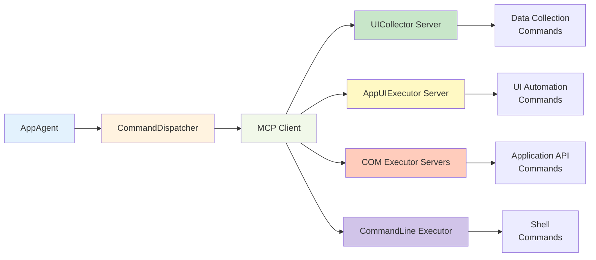
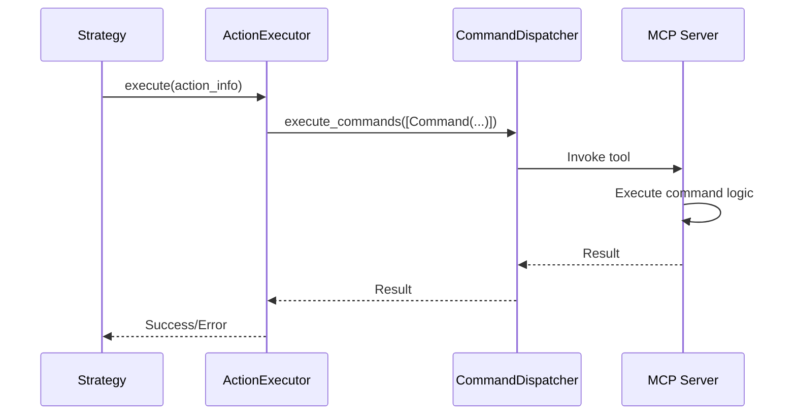

# AppAgent Command System

AppAgent executes application-level commands through the **MCP (Model-Context Protocol)** system. Commands are dynamically provided by MCP servers and executed through the `CommandDispatcher` interface. This document describes the MCP configuration for AppAgent commands.

---

## Command Execution Architecture



!!!note "Dynamic Commands"
    AppAgent commands are **not hardcoded**. They are dynamically discovered from configured MCP servers. The available commands depend on:
    
    - **MCP server configuration** in `config/ufo/mcp.yaml`
    - **Application context** (e.g., Word, Excel, PowerPoint)
    - **Installed MCP servers** (local, HTTP, or stdio)

---

## MCP Server Configuration

### Configuration File

AppAgent commands are configured in **`config/ufo/mcp.yaml`**:

```yaml
# Default configuration for all applications
AppAgent:
  default:
    data_collection:
      - namespace: UICollector
        type: local
        start_args: []
        reset: false
    action:
      - namespace: AppUIExecutor
        type: local
        start_args: []
        reset: false
      - namespace: CommandLineExecutor
        type: local
        start_args: []
        reset: false
  
  # Application-specific configurations
  WINWORD.EXE:
    action:
      - namespace: AppUIExecutor
        type: local
      - namespace: WordCOMExecutor
        type: local
        reset: true  # Reset on document switch
  
  EXCEL.EXE:
    action:
      - namespace: AppUIExecutor
        type: local
      - namespace: ExcelCOMExecutor
        type: local
        reset: true
  
  POWERPNT.EXE:
    action:
      - namespace: AppUIExecutor
        type: local
      - namespace: PowerPointCOMExecutor
        type: local
        reset: true
  
  explorer.exe:
    action:
      - namespace: AppUIExecutor
        type: local
      - namespace: PDFReaderExecutor
        type: local
        reset: true
```

### MCP Servers Used by AppAgent

| Server | Namespace | Type | Purpose | Command Categories |
|--------|-----------|------|---------|-------------------|
| **UICollector** | `UICollector` | Local | Data collection | Screenshot capture, control detection, UI tree |
| **AppUIExecutor** | `AppUIExecutor` | Local | UI automation | Mouse clicks, keyboard input, text entry |
| **CommandLineExecutor** | `CommandLineExecutor` | Local | Shell execution | PowerShell, Bash commands |
| **WordCOMExecutor** | `WordCOMExecutor` | Local | Word automation | Document creation, text manipulation, formatting |
| **ExcelCOMExecutor** | `ExcelCOMExecutor` | Local | Excel automation | Workbook creation, data entry, charts |
| **PowerPointCOMExecutor** | `PowerPointCOMExecutor` | Local | PowerPoint automation | Presentation creation, slides, shapes |
| **PDFReaderExecutor** | `PDFReaderExecutor` | Local | PDF operations | Text extraction, page navigation |

When AppAgent works with specific applications (Word, Excel, PowerPoint), additional **COM executor servers** are automatically loaded to provide native API access alongside UI automation commands. These servers have `reset: true` to prevent state leakage between documents.

---

## Command Discovery

### Listing Available Commands

AppAgent dynamically discovers available commands from MCP servers:

```python
# Get all available tools from MCP servers
result = await command_dispatcher.execute_commands([
    Command(tool_name="list_tools", parameters={})
])

tools = result[0].result
# Returns list of all available commands with their schemas
```

### Command Categories

Commands are categorized by purpose:

| Category | Server | Examples |
|----------|--------|----------|
| **Data Collection** | UICollector | `capture_window_screenshot`, `get_app_window_controls_target_info`, `get_ui_tree` |
| **Mouse Actions** | AppUIExecutor | `click_input`, `click_on_coordinates`, `drag_on_coordinates`, `wheel_mouse_input` |
| **Keyboard Actions** | AppUIExecutor | `set_edit_text`, `keyboard_input` |
| **Data Retrieval** | AppUIExecutor | `texts`, `get_text` |
| **Document API** | WordCOMExecutor | `create_document`, `insert_text`, `save_document` |
| **Spreadsheet API** | ExcelCOMExecutor | `create_workbook`, `insert_data`, `create_chart` |
| **Presentation API** | PowerPointCOMExecutor | `create_presentation`, `add_slide`, `insert_shape` |
| **Shell Execution** | CommandLineExecutor | `execute_command` |

---

## Command Execution

### Execution Flow



### Example: Execute UI Command

```python
from aip.messages import Command

# Create command
command = Command(
    tool_name="click_input",
    parameters={
        "id": "12",
        "name": "Export",
        "button": "left",
        "double": False
    },
    tool_type="action",
)

# Execute command
results = await command_dispatcher.execute_commands([command])

# Check result
if results[0].status == "SUCCESS":
    print(f"Command executed: {results[0].result}")
```

---

## Configuration Resources

For detailed MCP configuration, server setup, and command reference:

**Quick References:**

- **[MCP Configuration Reference](../../configuration/system/mcp_reference.md)** - Quick MCP settings reference
- **[MCP Overview](../../mcp/overview.md)** - MCP architecture and concepts

**Configuration Guides:**

- **[MCP Configuration Guide](../../mcp/configuration.md)** - Complete configuration documentation
- **[Local Servers](../../mcp/local_servers.md)** - Built-in MCP servers
- **[Remote Servers](../../mcp/remote_servers.md)** - HTTP and stdio servers
- **[Creating MCP Servers](../../tutorials/creating_mcp_servers.md)** - Creating custom MCP servers

**Server Type Documentation:**

- **[Action Servers](../../mcp/action.md)** - Action server documentation
- **[Data Collection Servers](../../mcp/data_collection.md)** - Data collection server documentation

### Detailed Server Documentation

Each MCP server has comprehensive documentation:

| Server | Documentation | Command Details |
|--------|--------------|----------------|
| UICollector | [UICollector Server](../../mcp/servers/ui_collector.md) | Screenshot, control detection, UI tree commands |
| AppUIExecutor | [AppUIExecutor Server](../../mcp/servers/app_ui_executor.md) | UI automation commands with parameters |
| WordCOMExecutor | [Word COM Executor](../../mcp/servers/word_com_executor.md) | Microsoft Word API commands |
| ExcelCOMExecutor | [Excel COM Executor](../../mcp/servers/excel_com_executor.md) | Microsoft Excel API commands |
| PowerPointCOMExecutor | [PowerPoint COM Executor](../../mcp/servers/ppt_com_executor.md) | Microsoft PowerPoint API commands |
| PDFReaderExecutor | [PDF Reader Executor](../../mcp/servers/pdf_reader_executor.md) | PDF reading commands |
| CommandLineExecutor | [CommandLine Executor](../../mcp/servers/command_line_executor.md) | Shell command execution |

!!!warning "Command Details Subject to Change"
    Specific command parameters, names, and behaviors may change as MCP servers evolve. Always refer to the **server-specific documentation** for the most up-to-date command reference.

---

## Agent Configuration Settings

### AppAgent Configuration

```yaml
# config/ufo/app_agent_config.yaml
system:
  # Control detection backend
  control_backend:
    - "uia"  # Windows UI Automation
    - "omniparser"  # Vision-based detection
  
  # Screenshot settings
  save_full_screen: true  # Also capture desktop
  save_ui_tree: true  # Save UI tree JSON
  include_last_screenshot: true  # Include previous step
  concat_screenshot: true  # Concatenate clean + annotated
  
  # Window behavior
  maximize_window: false  # Maximize on selection
  show_visual_outline_on_screen: true  # Draw red outline
```

See **[Configuration Overview](../../configuration/system/overview.md)** and **[System Configuration](../../configuration/system/system_config.md)** for complete configuration options.

---

## Related Documentation

**Architecture & Design:**

- **[AppAgent Overview](overview.md)** - High-level AppAgent architecture
- **[State Machine](state.md)** - State machine documentation
- **[Processing Strategy](strategy.md)** - 4-phase processing pipeline
- **[HostAgent Commands](../host_agent/commands.md)** - Desktop-level commands

**Core Features:**

- **[Hybrid Actions](../core_features/hybrid_actions.md)** - MCP command system architecture
- **[Control Detection](../core_features/control_detection/overview.md)** - UIA and OmniParser backends
- **[Command Dispatcher](../../infrastructure/modules/dispatcher.md)** - Command routing

---

## Summary

**Key Takeaways:**

✅ **MCP-Based**: All commands provided by MCP servers configured in `mcp.yaml`  
✅ **Dynamic Discovery**: Commands discovered at runtime via `list_tools`  
✅ **Application-Specific**: COM executors auto-loaded for Word, Excel, PowerPoint  
✅ **Hybrid Approach**: UI automation + native API commands  
✅ **Configurable**: Extensive MCP server configuration options  
✅ **Documented**: Each server has detailed command reference

!!!warning "Command Details Subject to Change"
    Specific command parameters, names, and behaviors may change as MCP servers evolve. Always refer to the **server-specific documentation** for the most up-to-date command reference.

**Next Steps:**

1. **Review MCP Configuration**: [MCP Configuration Reference](../../configuration/system/mcp_reference.md)
2. **Explore Server Documentation**: Click server links above for command details
3. **Understand Processing**: [Processing Strategy](strategy.md) shows commands in action
4. **Learn State Machine**: [State Machine](state.md) explains when commands execute
