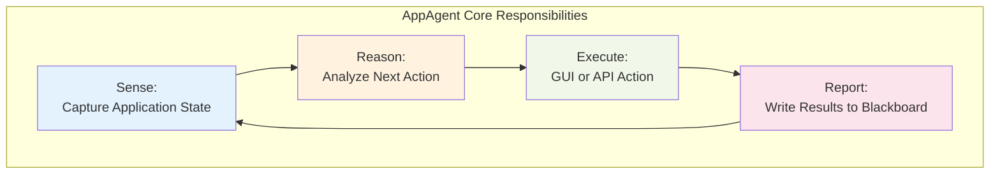
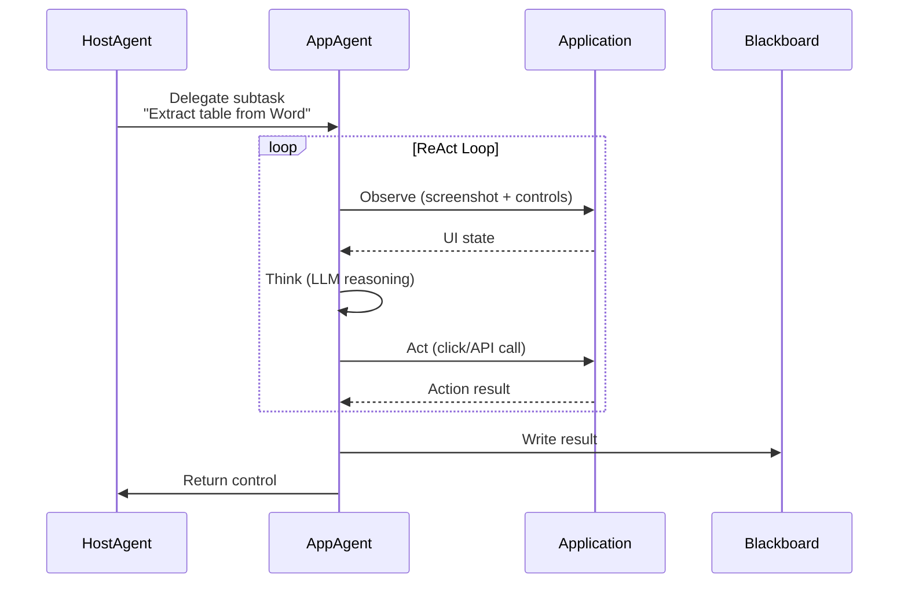
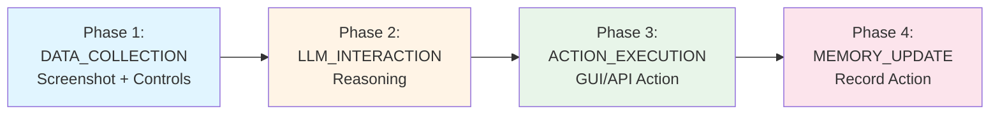

# AppAgent: Application Execution Agent

**AppAgent** is the core execution runtime in UFO, responsible for carrying out individual subtasks within a specific Windows application. Each AppAgent functions as an isolated, application-specialized worker process launched and orchestrated by the central HostAgent.

---

## What is AppAgent?

<figure markdown>
  
  <figcaption>AppAgent Architecture: Application-specialized worker process for subtask execution</figcaption>
</figure>

**AppAgent** operates as a **child agent** under the HostAgent's orchestration:

- **Isolated Runtime**: Each AppAgent is dedicated to a single Windows application
- **Subtask Executor**: Executes specific subtasks delegated by HostAgent
- **Application Expert**: Tailored with deep knowledge of the target app's API surface, control semantics, and domain logic
- **Hybrid Execution**: Leverages both GUI automation and API-based actions through MCP commands

Unlike monolithic Computer-Using Agents (CUAs) that treat all GUI contexts uniformly, each AppAgent is tailored to a single application and operates with specialized knowledge of its interface and capabilities.

---

## Core Responsibilities



| Responsibility | Description | Example |
|---------------|-------------|---------|
| **State Sensing** | Capture application UI, detect controls, understand current state | Screenshot Word window → Detect 50 controls → Annotate UI elements |
| **Reasoning** | Analyze state and determine next action using LLM | "Table visible with Export button [12] → Click to export data" |
| **Action Execution** | Execute GUI clicks or API calls via MCP commands | `click_input(control_id=12)` or `execute_word_command("export_table")` |
| **Result Reporting** | Write execution results to shared Blackboard | Write extracted data to `subtask_result_1` for HostAgent |

---

## ReAct-Style Control Loop

Upon receiving a subtask and execution context from the HostAgent, the AppAgent initializes a **ReAct-style control loop** where it iteratively:

1. **Observes** the current application state (screenshot + control detection)
2. **Thinks** about the next step (LLM reasoning)
3. **Acts** by executing either a GUI or API-based action (MCP commands)



The MCP command system enables **reliable control** over dynamic and complex UIs by favoring structured API commands whenever available, while retaining fallback to GUI-based interaction commands when necessary.

---

## Execution Architecture

### Finite State Machine

AppAgent uses a finite state machine with 7 states to control its execution flow:

- **CONTINUE**: Continue processing the current subtask
- **FINISH**: Successfully complete the subtask
- **ERROR**: Encounter an unrecoverable error
- **FAIL**: Fail to complete the subtask
- **PENDING**: Wait for user input or clarification
- **CONFIRM**: Request user confirmation for sensitive actions
- **SCREENSHOT**: Capture and re-annotate the application screenshot

**State Details**: See [State Machine Documentation](state.md) for complete state definitions and transitions.

### 4-Phase Processing Pipeline

Each execution round follows a 4-phase pipeline:



**Strategy Details**: See [Processing Strategy Documentation](strategy.md) for complete pipeline implementation.

---

## Hybrid GUI–API Execution

AppAgent executes actions through the **MCP (Model-Context Protocol) command system**, which provides a unified interface for both GUI automation and native API calls:

```python
# GUI-based command (fallback)
command = Command(
    tool_name="click_input",
    parameters={"control_id": "12", "button": "left"}
)
await command_dispatcher.execute_commands([command])

# API-based command (preferred when available)
command = Command(
    tool_name="word_export_table",
    parameters={"format": "csv", "path": "output.csv"}
)
await command_dispatcher.execute_commands([command])
```

**Implementation**: See [Hybrid Actions](../core_features/hybrid_actions.md) for details on the MCP command system.

---

## Knowledge Enhancement

AppAgent is enhanced with **Retrieval Augmented Generation (RAG)** from heterogeneous sources:

| Knowledge Source | Purpose | Configuration |
|-----------------|---------|---------------|
| **Help Documents** | Application-specific documentation | [Learning from Help Documents](../core_features/knowledge_substrate/learning_from_help_document.md) |
| **Bing Search** | Latest information and updates | [Learning from Bing Search](../core_features/knowledge_substrate/learning_from_bing_search.md) |
| **Self-Demonstrations** | Successful action trajectories | [Experience Learning](../core_features/knowledge_substrate/experience_learning.md) |
| **Human Demonstrations** | Expert-provided workflows | [Learning from Demonstrations](../core_features/knowledge_substrate/learning_from_demonstration.md) |

**Knowledge Substrate Overview**: See [Knowledge Substrate](../core_features/knowledge_substrate/overview.md) for the complete RAG architecture.

---

## Command System

AppAgent executes actions through the **MCP (Model-Context Protocol)** command system:

**Application-Level Commands**:

- `capture_window_screenshot` - Capture application window
- `get_control_info` - Detect UI controls via UIA/OmniParser
- `click_input` - Click on UI control
- `set_edit_text` - Type text into input field
- `annotation` - Annotate screenshot with control labels

**Command Details**: See [Command System Documentation](commands.md) for complete command reference.

---

## Control Detection Backends

AppAgent supports multiple control detection backends for comprehensive UI understanding:

**UIA (UI Automation):**  
Native Windows UI Automation API for standard controls

- ✅ Fast and accurate
- ✅ Works with most Windows applications
- ❌ May miss custom controls

**OmniParser (Visual Detection):**  
Vision-based grounding model for visual elements

- ✅ Detects icons, images, custom controls
- ✅ Works with web content
- ❌ Requires external service

**Hybrid (UIA + OmniParser):**  
Best of both worlds - maximum coverage

- ✅ Native controls + visual elements
- ✅ Comprehensive UI understanding

**Control Detection Details**: See [Control Detection Overview](../core_features/control_detection/overview.md).

---

## Input and Output

### AppAgent Input

| Input | Description | Source |
|-------|-------------|--------|
| **User Request** | Original user request in natural language | HostAgent |
| **Sub-Task** | Specific subtask to execute | HostAgent delegation |
| **Application Context** | Target app name, window info | HostAgent |
| **Control Information** | Detected UI controls with labels | Data collection phase |
| **Screenshots** | Clean, annotated, previous step images | Data collection phase |
| **Blackboard** | Shared memory for inter-agent communication | Global context |
| **Retrieved Knowledge** | Help docs, demos, search results | RAG system |

### AppAgent Output

| Output | Description | Consumer |
|--------|-------------|----------|
| **Observation** | Current UI state description | LLM context |
| **Thought** | Reasoning about next action | Execution log |
| **ControlLabel** | Selected control to interact with | Action executor |
| **Function** | MCP command to execute (click_input, set_edit_text, etc.) | Command dispatcher |
| **Args** | Command parameters | Command dispatcher |
| **Status** | Agent state (CONTINUE, FINISH, etc.) | State machine |
| **Blackboard Update** | Execution results | HostAgent |

**Example Output**:
```json
{
    "Observation": "Word document with table, Export button at [12]",
    "Thought": "Click Export to extract table data",
    "ControlLabel": "12",
    "Function": "click_input",
    "Args": {"button": "left"},
    "Status": "CONTINUE"
}
```

---

## Related Documentation

**Detailed Documentation:**

- **[State Machine](state.md)**: Complete FSM with state definitions and transitions
- **[Processing Strategy](strategy.md)**: 4-phase pipeline implementation details
- **[Command System](commands.md)**: Application-level MCP commands reference

**Core Features:**

- **[Hybrid Actions](../core_features/hybrid_actions.md)**: MCP command system for GUI–API execution
- **[Control Detection](../core_features/control_detection/overview.md)**: UIA and visual detection
- **[Knowledge Substrate](../core_features/knowledge_substrate/overview.md)**: RAG system overview

**Tutorials:**

- **[Creating AppAgent](../../tutorials/creating_app_agent/overview.md)**: Step-by-step guide
- **[Help Document Provision](../../tutorials/creating_app_agent/help_document_provision.md)**: Add help docs
- **[Demonstration Provision](../../tutorials/creating_app_agent/demonstration_provision.md)**: Add demos
- **[Wrapping App-Native API](../../tutorials/creating_app_agent/warpping_app_native_api.md)**: Integrate APIs

---

## API Reference

:::agents.agent.app_agent.AppAgent

---

## Summary

**AppAgent Key Characteristics:**

✅ **Application-Specialized Worker**: Dedicated to single Windows application  
✅ **ReAct Control Loop**: Iterative observe → think → act execution  
✅ **Hybrid Execution**: GUI automation + API calls via MCP commands  
✅ **7-State FSM**: Robust state management for execution control  
✅ **4-Phase Pipeline**: Structured data collection → reasoning → action → memory  
✅ **Knowledge-Enhanced**: RAG from docs, demos, and search  
✅ **Orchestrated by HostAgent**: Child agent in hierarchical architecture

**Next Steps:**

1. **Deep Dive**: Read [State Machine](state.md) and [Processing Strategy](strategy.md) for implementation details
2. **Learn Features**: Explore [Core Features](../core_features/hybrid_actions.md) for advanced capabilities
3. **Hands-On Tutorial**: Follow [Creating AppAgent](../../tutorials/creating_app_agent/overview.md) guide
