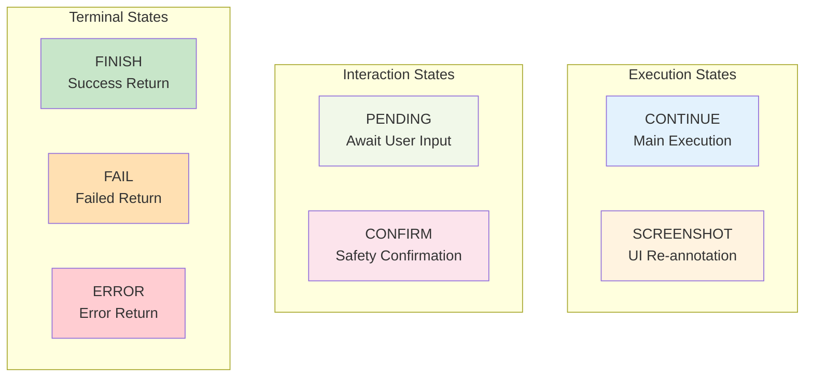
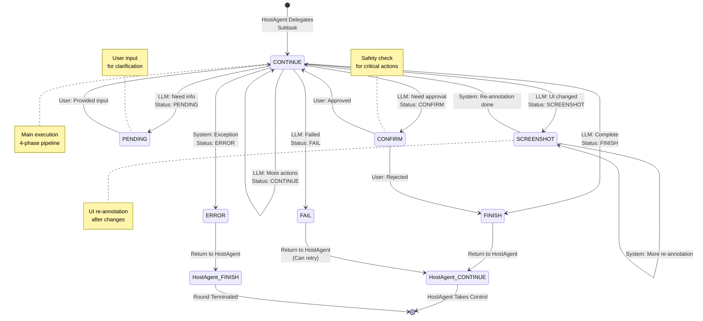
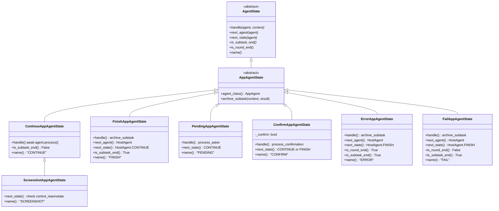
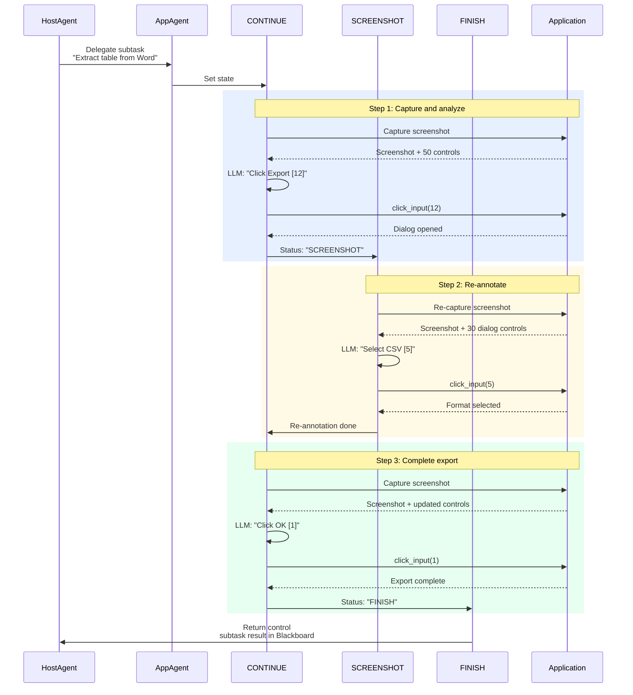

# AppAgent State Machine

AppAgent uses a **7-state finite state machine (FSM)** to control execution flow within a specific Windows application. The state machine manages subtask execution, UI re-annotation, user confirmations, error handling, and handoff back to HostAgent.

---

## State Overview

AppAgent implements a robust 7-state FSM defined in `ufo/agents/states/app_agent_state.py`:



### State Enumeration

```python
class AppAgentStatus(Enum):
    """Store the status of the app agent."""
    
    CONTINUE = "CONTINUE"      # Main execution state
    SCREENSHOT = "SCREENSHOT"  # Re-annotation state
    FINISH = "FINISH"          # Subtask completed successfully
    FAIL = "FAIL"              # Subtask failed but recoverable
    PENDING = "PENDING"        # Awaiting user input
    CONFIRM = "CONFIRM"        # Safety confirmation required
    ERROR = "ERROR"            # Critical failure
```

| State | Purpose | Processor Executed | Subtask Ends | Returns to HostAgent |
|-------|---------|-------------------|--------------|---------------------|
| **CONTINUE** | Main execution - interact with app controls | ✅ Yes (4 phases) | ❌ No | ❌ No |
| **SCREENSHOT** | Re-capture and re-annotate UI after changes | ✅ Yes (4 phases) | ❌ No | ❌ No |
| **FINISH** | Subtask completed successfully | ❌ No | ✅ Yes | ✅ Yes |
| **FAIL** | Subtask failed but can be retried | ❌ No | ✅ Yes | ✅ Yes |
| **PENDING** | Await user input for clarification | ✅ Yes (ask user) | ❌ No | ❌ No |
| **CONFIRM** | Request user approval for safety-critical action | ✅ Yes (present dialog) | ❌ No | ❌ No |
| **ERROR** | Unhandled exception or critical failure | ❌ No | ✅ Yes | ✅ Yes |

---

## State Definitions

### CONTINUE State

**Purpose**: Main execution state where AppAgent iteratively interacts with the application.

```python
@AppAgentStateManager.register
class ContinueAppAgentState(AppAgentState):
    """The class for the continue app agent state."""
    
    async def handle(
        self, agent: "AppAgent", context: Optional["Context"] = None
    ) -> None:
        """
        Handle the agent for the current step.
        :param agent: The agent for the current step.
        :param context: The context for the agent and session.
        """
        await agent.process(context)
    
    def is_subtask_end(self) -> bool:
        """Check if the subtask ends."""
        return False
    
    @classmethod
    def name(cls) -> str:
        """The class name of the state."""
        return AppAgentStatus.CONTINUE.value
```

| Property | Value |
|----------|-------|
| **Type** | Execution |
| **Processor Executed** | ✓ Yes (4-phase pipeline) |
| **Subtask Ends** | No |
| **Round Ends** | No |
| **Next States** | CONTINUE / SCREENSHOT / FINISH / PENDING / CONFIRM / ERROR |

**Behavior**:

- Executes 4-phase processing pipeline (DATA_COLLECTION → LLM_INTERACTION → ACTION_EXECUTION → MEMORY_UPDATE)
- LLM analyzes UI and selects control to interact with
- Executes action on selected control
- Records action in memory and Blackboard
- Transitions based on LLM's `Status` field in response

**Example Flow**:
```
CONTINUE → Capture UI → LLM selects "Export [12]" → Click control 12 
→ LLM returns Status: "SCREENSHOT" → Transition to SCREENSHOT
```

CONTINUE is the primary execution state where AppAgent spends most of its time during subtask execution.

---

### SCREENSHOT State

**Purpose**: Re-capture and re-annotate UI after control interactions that change the interface.

```python
@AppAgentStateManager.register
class ScreenshotAppAgentState(ContinueAppAgentState):
    """The class for the screenshot app agent state."""
    
    @classmethod
    def name(cls) -> str:
        """The class name of the state."""
        return AppAgentStatus.SCREENSHOT.value
    
    def next_state(self, agent: BasicAgent) -> AgentState:
        """Determine next state based on control_reannotate."""
        agent_processor = agent.processor
        
        if agent_processor is None:
            agent.status = AppAgentStatus.CONTINUE.value
            return ContinueAppAgentState()
        
        control_reannotate = agent_processor.control_reannotate
        
        if control_reannotate is None or len(control_reannotate) == 0:
            agent.status = AppAgentStatus.CONTINUE.value
            return ContinueAppAgentState()
        else:
            return super().next_state(agent)
    
    def is_subtask_end(self) -> bool:
        """Check if the subtask ends."""
        return False
```

| Property | Value |
|----------|-------|
| **Type** | Execution |
| **Processor Executed** | ✓ Yes (same as CONTINUE) |
| **Subtask Ends** | No |
| **Duration** | Single re-annotation cycle |
| **Next States** | SCREENSHOT (if controls need re-annotation) / CONTINUE (if complete) |

**Behavior**:

- Inherits from `ContinueAppAgentState` - executes same 4-phase pipeline
- Re-captures screenshot after UI changes (dialog opened, menu expanded, etc.)
- Re-detects and re-annotates controls with updated labels
- Checks `control_reannotate` to determine if more re-annotation needed
- Transitions to CONTINUE once UI stabilizes

**When to Use**:

- LLM sets `Status: "SCREENSHOT"` when it expects UI changes
- After clicking buttons that open dialogs
- After expanding dropdown menus or combo boxes
- After any action that significantly alters the UI

**Screenshot Example:**

```
Action: Click "Export" button [12]
→ Dialog opens with new controls
→ LLM sets Status: "SCREENSHOT"
→ SCREENSHOT state re-annotates dialog controls as [1], [2], [3]...
→ Transitions to CONTINUE with fresh annotations
```

---

### FINISH State

**Purpose**: Subtask completed successfully - archive results and return control to HostAgent.

```python
@AppAgentStateManager.register
class FinishAppAgentState(AppAgentState):
    """The class for the finish app agent state."""
    
    async def handle(
        self, agent: "AppAgent", context: Optional["Context"] = None
    ) -> None:
        """Archive subtask result."""
        if agent.processor:
            result = agent.processor.processing_context.get_local("result")
        else:
            result = None
        
        await self.archive_subtask(context, result)
    
    def next_agent(self, agent: "AppAgent") -> HostAgent:
        """Get the agent for the next step."""
        return agent.host
    
    def next_state(self, agent: "AppAgent") -> HostAgentState:
        """Get the next state of the agent."""
        if agent.mode == "follower":
            return FinishHostAgentState()
        else:
            return ContinueHostAgentState()
```

FINISH indicates successful completion. The subtask result is available in the Blackboard for HostAgent to access and use in subsequent orchestration decisions.

---
    
    def is_subtask_end(self) -> bool:
        """Check if the subtask ends."""
        return True
    
    @classmethod
    def name(cls) -> str:
        """The class name of the state."""
        return AppAgentStatus.FINISH.value
```

| Property | Value |
|----------|-------|
| **Type** | Terminal |
| **Processor Executed** | ✗ No |
| **Subtask Ends** | ✓ Yes |
| **Round Ends** | No (HostAgent continues) |
| **Next Agent** | HostAgent |
| **Next States** | HostAgent.CONTINUE (normal) / HostAgent.FINISH (follower mode) |

**Behavior**:

- Archives subtask to `previous_subtasks` with status and result
- Writes execution results to Blackboard for HostAgent
- Returns control to HostAgent
- HostAgent determines next action (new subtask, finish, etc.)

**Transition Logic**:

```python
# In LLM response
{
    "Status": "FINISH",
    "Comment": "Table data successfully extracted and saved"
}

# Next agent and state
next_agent = agent.host  # HostAgent
next_state = ContinueHostAgentState()  # HostAgent continues orchestration
```

!!!success "Subtask Completion"
    FINISH indicates successful completion. The subtask result is available in the Blackboard for HostAgent to access and use in subsequent orchestration decisions.

---

### PENDING State

**Purpose**: Await user input to clarify ambiguous situations or provide additional information.

```python
@AppAgentStateManager.register
class PendingAppAgentState(AppAgentState):
    """The class for the pending app agent state."""
    
    async def handle(
        self, agent: "AppAgent", context: Optional["Context"] = None
    ) -> None:
        """Ask the user questions to help the agent proceed."""
        agent.process_asker(ask_user=ufo_config.system.ask_question)
    
    def next_state(self, agent: AppAgent) -> AppAgentState:
        """Get the next state of the agent."""
        agent.status = AppAgentStatus.CONTINUE.value
        return ContinueAppAgentState()
    
    def is_subtask_end(self) -> bool:
        """Check if the subtask ends."""
        return False
    
    @classmethod
    def name(cls) -> str:
        """The class name of the state."""
        return AppAgentStatus.PENDING.value
```

| Property | Value |
|----------|-------|
| **Type** | Interaction |
| **Processor Executed** | ✓ Yes (ask user) |
| **Subtask Ends** | No |
| **Duration** | Until user responds |
| **Next States** | CONTINUE (user provided input) |

**Behavior**:

- Displays question to user via `process_asker`
- Waits for user response (configurable via `ask_question` setting)
- User input is added to context for next CONTINUE execution
- Always transitions to CONTINUE after user responds

**Use Cases**:

- Ambiguous control selection: "Which 'Export' button should I click?"
- Missing information: "What filename should I use for the export?"
- Clarification needed: "Should I overwrite the existing file?"

!!!warning "Configuration Required"
    Set `system.ask_question = true` in configuration to enable PENDING state user interaction. If disabled, the agent will skip asking and make a best-effort decision.

---

### CONFIRM State

**Purpose**: Request user approval before executing safety-critical or irreversible actions.

```python
@AppAgentStateManager.register
class ConfirmAppAgentState(AppAgentState):
    """The class for the confirm app agent state."""
    
    def __init__(self) -> None:
        """Initialize the confirm state."""
        self._confirm = None
    
    async def handle(
        self, agent: "AppAgent", context: Optional["Context"] = None
    ) -> None:
        """Request user confirmation for the action."""
        # If safe guard disabled, proceed automatically
        if not ufo_config.system.safe_guard:
            await agent.process_resume()
            self._confirm = True
            return
        
        # Ask user for confirmation
        self._confirm = agent.process_confirmation()
        
        # If user confirms, resume the task
        if self._confirm:
            await agent.process_resume()
    
    def next_state(self, agent: AppAgent) -> AppAgentState:
        """Get the next state based on user decision."""
        if self._confirm:
            agent.status = AppAgentStatus.CONTINUE.value
            return ContinueAppAgentState()
        else:
            agent.status = AppAgentStatus.FINISH.value
            return FinishAppAgentState()
    
    def is_subtask_end(self) -> bool:
        """Check if the subtask ends."""
        return False
    
    @classmethod
    def name(cls) -> str:
        """The class name of the state."""
        return AppAgentStatus.CONFIRM.value
```

| Property | Value |
|----------|-------|
| **Type** | Interaction |
| **Processor Executed** | ✓ Yes (present confirmation) |
| **Subtask Ends** | No |
| **Duration** | Until user approves/rejects |
| **Next States** | CONTINUE (approved) / FINISH (rejected) |

**Behavior**:

- Presents action for user approval via `process_confirmation`
- Waits for user decision (approve/reject)
- If approved: Resumes processing via `process_resume` → CONTINUE
- If rejected: Archives subtask → FINISH
- Bypassed if `safe_guard` configuration is disabled

**Safety-Critical Actions**:

- File deletions: "About to delete file.txt - Confirm?"
- Application launches: "Launch Calculator.exe?"
- System configuration changes: "Modify registry key?"

!!!warning "Safety Mechanism"
    CONFIRM provides a safety net for potentially destructive operations. Configure `system.safe_guard = true` to enable confirmation prompts.

---

### ERROR State

**Purpose**: Handle unrecoverable exceptions and critical failures - archive error and return to HostAgent.

```python
@AppAgentStateManager.register
class ErrorAppAgentState(AppAgentState):
    """The class for the error app agent state."""
    
    async def handle(
        self, agent: "AppAgent", context: Optional["Context"] = None
    ) -> None:
        """Archive subtask with error result."""
        if agent.processor:
            result = agent.processor.processing_context.get_local("result")
        else:
            result = None
        
        await self.archive_subtask(context, result)
    
    def next_agent(self, agent: "AppAgent") -> HostAgent:
        """Get the agent for the next step."""
        return agent.host
    
    def next_state(self, agent: "AppAgent") -> HostAgentState:
        """Get the next state of the agent."""
        return FinishHostAgentState()
    
    def is_round_end(self) -> bool:
        """Check if the round ends."""
        return True
    
    def is_subtask_end(self) -> bool:
        """Check if the subtask ends."""
        return True
    
    @classmethod
    def name(cls) -> str:
        """The class name of the state."""
        return AppAgentStatus.ERROR.value
```

| Property | Value |
|----------|-------|
| **Type** | Terminal |
| **Processor Executed** | ✗ No |
| **Subtask Ends** | ✓ Yes |
| **Round Ends** | ✓ Yes |
| **Next Agent** | HostAgent |
| **Next States** | HostAgent.FINISH (terminate round) |

**Behavior**:

- Archives subtask with error status and error details
- Returns control to HostAgent
- HostAgent transitions to FINISH (ends current round)
- Error details logged for debugging

**Error Scenarios**:

- Unhandled Python exceptions during processing
- Critical LLM failures (timeout, invalid response)
- Command dispatcher failures
- Unrecoverable application crashes

!!!danger "Terminal State"
    ERROR terminates both the subtask and the current round. HostAgent will end the session or start a new round depending on configuration.

---

### FAIL State

**Purpose**: Handle recoverable failures - archive failed subtask and return to HostAgent for retry or alternative approach.

```python
@AppAgentStateManager.register
class FailAppAgentState(AppAgentState):
    """The class for the fail app agent state."""
    
    async def handle(
        self, agent: "AppAgent", context: Optional["Context"] = None
    ) -> None:
        """Archive subtask with failure result."""
        if agent.processor:
            result = agent.processor.processing_context.get_local("result")
        else:
            result = None
        
        await self.archive_subtask(context, result)
    
    def next_agent(self, agent: "AppAgent") -> HostAgent:
        """Get the agent for the next step."""
        return agent.host
    
    def next_state(self, agent: "AppAgent") -> HostAgentState:
        """Get the next state of the agent."""
        return FinishHostAgentState()
    
    def is_round_end(self) -> bool:
        """Check if the round ends."""
        return False
    
    def is_subtask_end(self) -> bool:
        """Check if the subtask ends."""
        return True
    
    @classmethod
    def name(cls) -> str:
        """The class name of the state."""
        return AppAgentStatus.FAIL.value
```

| Property | Value |
|----------|-------|
| **Type** | Terminal |
| **Processor Executed** | ✗ No |
| **Subtask Ends** | ✓ Yes |
| **Round Ends** | ✗ No (unlike ERROR) |
| **Next Agent** | HostAgent |
| **Next States** | HostAgent.FINISH (but round doesn't end) |

**Behavior**:

- Archives subtask with FAIL status and failure details
- Returns control to HostAgent
- HostAgent can retry subtask or try alternative approach
- Unlike ERROR, does not terminate the round
- Allows for graceful degradation and recovery

**Failure Scenarios**:

- Control not found but task can be retried
- Action timeout but application still responsive
- Partial completion with known issues
- Expected failure conditions

!!!info "Recoverable Failures"
    FAIL indicates a recoverable failure that the HostAgent can handle gracefully, unlike ERROR which terminates the entire round. Use FAIL when the task failed but the system is still in a valid state.

---

## State Transition Diagram



<figure markdown>
  
  <figcaption>AppAgent State Machine: Visual representation of the 6-state FSM with transitions and conditions</figcaption>
</figure>

---

## State Transition Control

### LLM-Driven Transitions

Most state transitions are controlled by the LLM through the `Status` field in its response:

```json
{
  "Observation": "Word document with Export button [12] visible",
  "Thought": "I should click the Export button to extract table data",
  "ControlLabel": "12",
  "ControlText": "Export",
  "Function": "click_input",
  "Args": {"button": "left"},
  "Status": "SCREENSHOT",
  "Comment": "Clicking Export will open a dialog"
}
```

**Status Mapping**:

| LLM Status Value | Next State | Decision Logic |
|-----------------|------------|----------------|
| `"CONTINUE"` | CONTINUE | More actions needed, continue execution |
| `"SCREENSHOT"` | SCREENSHOT | UI will change, re-annotate controls |
| `"FINISH"` | FINISH | Subtask complete, return to HostAgent |
| `"FAIL"` | FAIL | Subtask failed but recoverable |
| `"PENDING"` | PENDING | Need user clarification |
| `"CONFIRM"` | CONFIRM | Safety-critical action needs approval |
| `"ERROR"` | ERROR | Manually triggered error (rare) |

### System-Driven Transitions

Some transitions are triggered by system conditions:

```python
# Exception handling in processor
try:
    result = await processor.process(agent, context)
except Exception as e:
    agent.status = AppAgentStatus.ERROR.value
    # Transitions to ERROR state

# Screenshot re-annotation check
if control_reannotate and len(control_reannotate) > 0:
    # Stay in SCREENSHOT state
    return ScreenshotAppAgentState()
else:
    # Transition to CONTINUE
    agent.status = AppAgentStatus.CONTINUE.value
    return ContinueAppAgentState()
```

---

## Implementation Details

### State Class Hierarchy



### State Manager Registry

```python
class AppAgentStateManager(AgentStateManager):
    """State manager for AppAgent with registration system."""
    
    _state_mapping: Dict[str, Type[AppAgentState]] = {}
    
    @property
    def none_state(self) -> AgentState:
        """The none state of the state manager."""
        return NoneAppAgentState()

# States are registered via decorator
@AppAgentStateManager.register
class ContinueAppAgentState(AppAgentState):
    ...
```

**Registration Benefits**:

- Automatic state mapping by name
- Centralized state lookup via `get_state(status)`
- Type-safe state retrieval
- Easy to add new states

---

## Execution Flow Example

### Multi-Step Subtask Execution



---

## Related Documentation

**Architecture:**

- **[AppAgent Overview](overview.md)**: High-level architecture and responsibilities
- **[Processing Strategy](strategy.md)**: 4-phase processing pipeline details
- **[HostAgent State Machine](../host_agent/state.md)**: Parent agent FSM

**Design Patterns:**

- **[State Layer Design](../../infrastructure/agents/design/state.md)**: FSM design principles
- **[Processor Framework](../../infrastructure/agents/design/processor.md)**: Processing architecture

---

## API Reference

:::agents.states.app_agent_state.AppAgentState
:::agents.states.app_agent_state.AppAgentStateManager

---

## Summary

**AppAgent State Machine Key Features:**

✅ **7-State FSM**: CONTINUE, SCREENSHOT, FINISH, FAIL, PENDING, CONFIRM, ERROR  
✅ **LLM-Driven**: Most transitions controlled by LLM's `Status` field  
✅ **UI Re-annotation**: SCREENSHOT state handles dynamic UI changes  
✅ **User Interaction**: PENDING and CONFIRM states for human input  
✅ **Error Handling**: ERROR and FAIL states for graceful failure recovery  
✅ **HostAgent Integration**: FINISH/FAIL/ERROR return control to parent agent  
✅ **Subtask Archiving**: Execution history tracked in `previous_subtasks`

**Next Steps:**

1. **Understand Processing**: Read [Processing Strategy](strategy.md) for pipeline details
2. **Learn Commands**: Check [Command System](commands.md) for available actions
3. **Explore Patterns**: Review [State Layer Design](../../infrastructure/agents/design/state.md) for FSM principles
