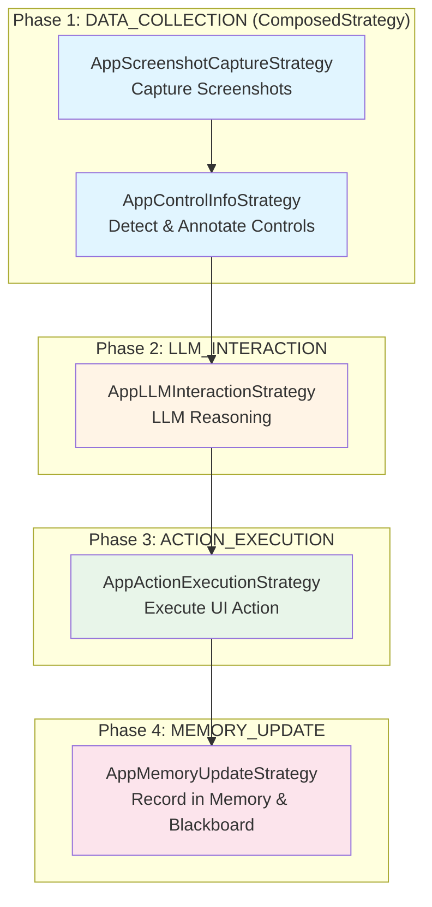
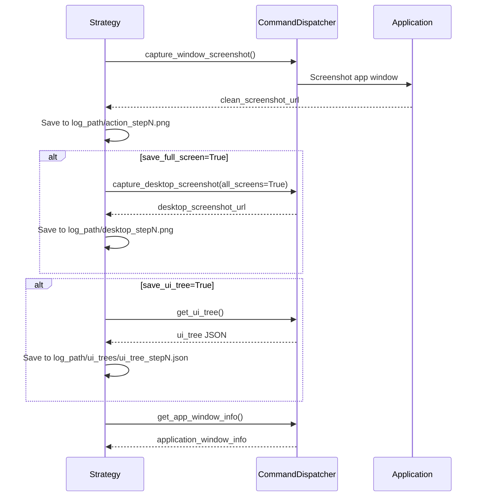
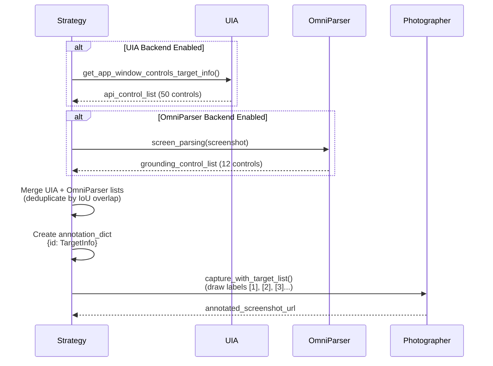
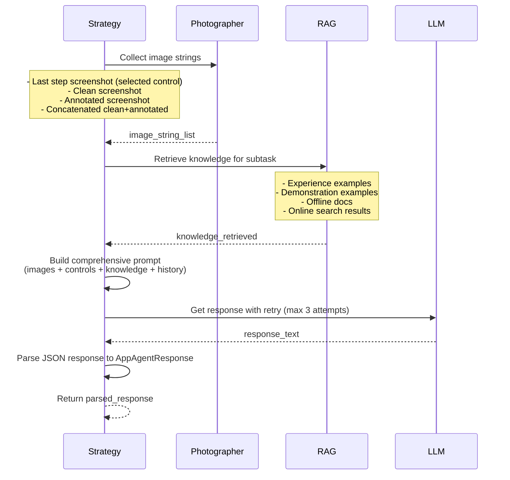
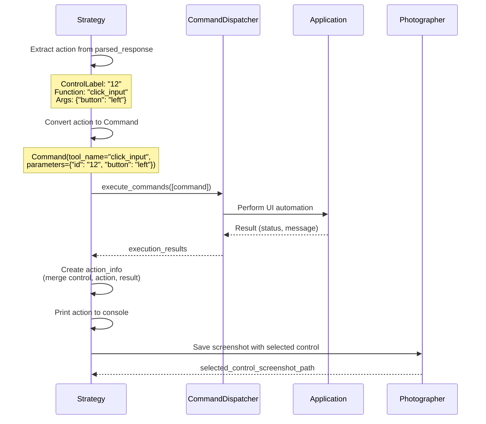
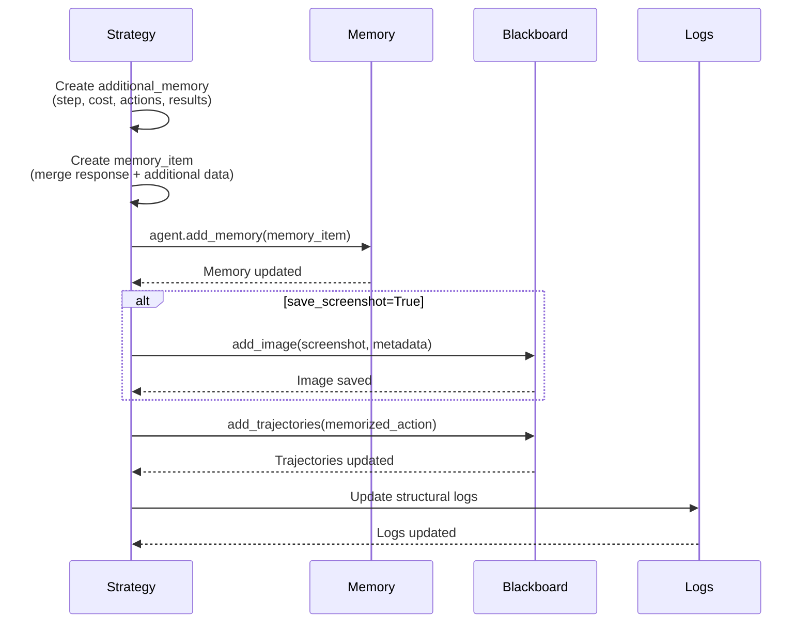
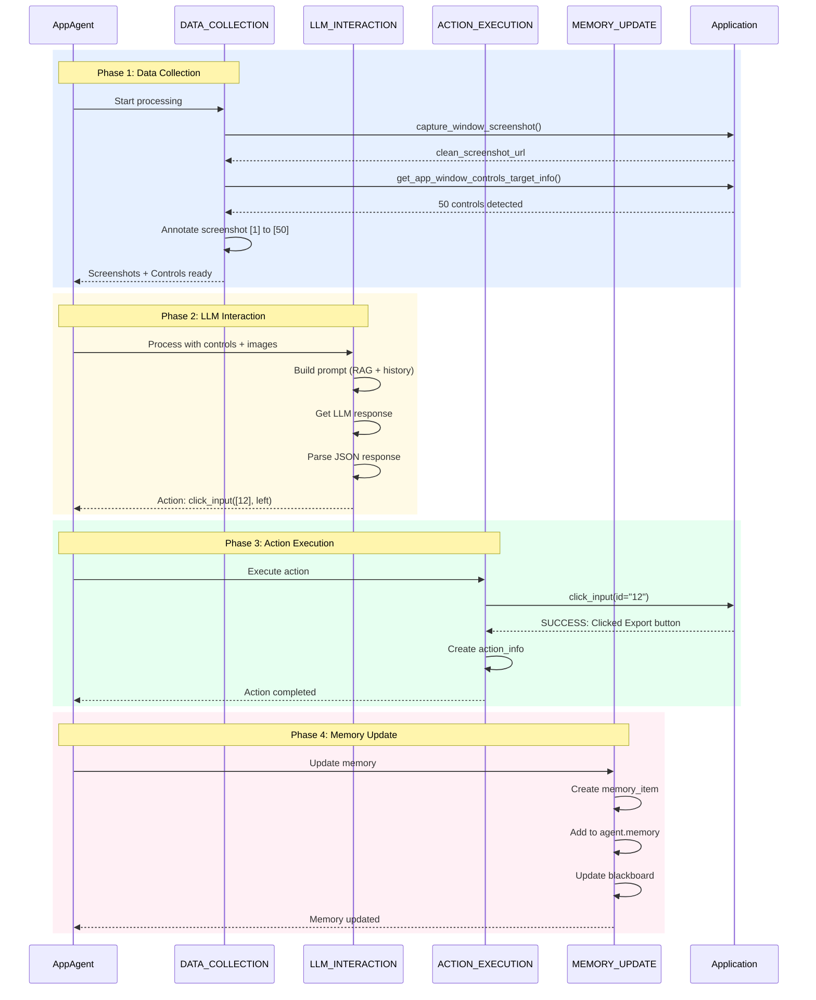

# AppAgent Processing Strategy

AppAgent executes a **4-phase processing pipeline** in **CONTINUE** and **SCREENSHOT** states. Each phase handles a specific aspect of application-level automation: **data collection** (screenshot + controls), **LLM reasoning**, **action execution**, and **memory recording**. This document details the implementation of each strategy based on the actual codebase.

---

## Strategy Assembly

Processing strategies are **assembled and orchestrated** by the `AppAgentProcessor` class defined in `ufo/agents/processors/app_agent_processor.py`. The processor acts as the **coordinator** that initializes, configures, and executes the 4-phase pipeline for application-level automation.

### AppAgentProcessor Overview

The `AppAgentProcessor` extends `ProcessorTemplate` and serves as the main orchestrator for AppAgent workflows:

```python
class AppAgentProcessor(ProcessorTemplate):
    """
    App Agent Processor - Modern, extensible App Agent processing implementation.
    
    Processing Pipeline:
    1. Data Collection: Screenshot capture and UI control information (composed strategy)
    2. LLM Interaction: Context-aware prompting and response parsing
    3. Action Execution: UI automation and control interaction
    4. Memory Update: Agent memory and blackboard synchronization
    
    Middleware Stack:
    - Structured logging and debugging middleware
    """
    
    processor_context_class = AppAgentProcessorContext
    
    def __init__(self, agent: "AppAgent", global_context: "Context"):
        super().__init__(agent, global_context)
```

### Strategy Registration

During initialization, `AppAgentProcessor._setup_strategies()` registers all four processing strategies:

```python
def _setup_strategies(self) -> None:
    """Setup processing strategies for App Agent."""
    
    # Phase 1: Data collection (COMPOSED: Screenshot + Control Info)
    self.strategies[ProcessingPhase.DATA_COLLECTION] = ComposedStrategy(
        strategies=[
            AppScreenshotCaptureStrategy(),
            AppControlInfoStrategy(),
        ],
        name="AppDataCollectionStrategy",
        fail_fast=True,  # Data collection is critical
    )
    
    # Phase 2: LLM interaction (critical - fail_fast=True)
    self.strategies[ProcessingPhase.LLM_INTERACTION] = (
        AppLLMInteractionStrategy(
            fail_fast=True  # LLM failure should trigger recovery
        )
    )
    
    # Phase 3: Action execution (graceful - fail_fast=False)
    self.strategies[ProcessingPhase.ACTION_EXECUTION] = (
        AppActionExecutionStrategy(
            fail_fast=False  # Action failures can be handled gracefully
        )
    )
    
    # Phase 4: Memory update (graceful - fail_fast=False)
    self.strategies[ProcessingPhase.MEMORY_UPDATE] = (
        AppMemoryUpdateStrategy(
            fail_fast=False  # Memory update failures shouldn't stop process
        )
    )
```

| Phase | Strategy Class | fail_fast | Composition | Rationale |
|-------|---------------|-----------|-------------|-----------|
| **DATA_COLLECTION** | `ComposedStrategy` (Screenshot + Control Info) | ✓ True | ✓ Composed | Screenshot and control detection are critical for LLM context |
| **LLM_INTERACTION** | `AppLLMInteractionStrategy` | ✓ True | ✗ Single | LLM response failure requires immediate recovery |
| **ACTION_EXECUTION** | `AppActionExecutionStrategy` | ✗ False | ✗ Single | Action failures can be gracefully handled and retried |
| **MEMORY_UPDATE** | `AppMemoryUpdateStrategy` | ✗ False | ✗ Single | Memory failures shouldn't block the main execution flow |

**Composed Strategy Pattern:**  
Phase 1 uses **ComposedStrategy** to execute two sub-strategies sequentially:

1. **AppScreenshotCaptureStrategy**: Captures application window + desktop screenshots
2. **AppControlInfoStrategy**: Detects UI controls via UIA/OmniParser and creates annotations

This ensures both screenshot and control data are available together for the LLM analysis phase.

### Middleware Configuration

The processor configures specialized logging middleware:

```python
def _setup_middleware(self) -> None:
    """Setup middleware pipeline for App Agent."""
    self.middleware_chain = [AppAgentLoggingMiddleware()]
```

**AppAgentLoggingMiddleware** provides:

- Subtask and application context tracking
- Rich Panel displays with color coding
- Action execution logging
- Performance metrics and cost tracking

---

## Processing Pipeline Architecture



---

## Phase 1: DATA_COLLECTION

### Strategy: `ComposedStrategy` (Screenshot + Control Info)

**Purpose**: Gather comprehensive application UI context including screenshots and control information for LLM decision making.

```python
# Composed strategy combines two sub-strategies
self.strategies[ProcessingPhase.DATA_COLLECTION] = ComposedStrategy(
    strategies=[
        AppScreenshotCaptureStrategy(),
        AppControlInfoStrategy(),
    ],
    name="AppDataCollectionStrategy",
    fail_fast=True,
)
```

### Sub-Strategy 1: AppScreenshotCaptureStrategy

**Purpose**: Capture application window and desktop screenshots.

```python
@depends_on("app_root", "log_path", "session_step")
@provides(
    "clean_screenshot_path",
    "annotated_screenshot_path",
    "desktop_screenshot_path",
    "ui_tree_path",
    "clean_screenshot_url",
    "desktop_screenshot_url",
    "application_window_info",
    "screenshot_saved_time",
)
class AppScreenshotCaptureStrategy(BaseProcessingStrategy):
    """Strategy for capturing application screenshots and desktop screenshots."""
    
    async def execute(self, agent, context) -> ProcessingResult:
        # 1. Capture application window screenshot
        clean_screenshot_url = await self._capture_app_screenshot(
            clean_screenshot_path, command_dispatcher
        )
        
        # 2. Capture desktop screenshot if needed
        if ufo_config.system.save_full_screen:
            desktop_screenshot_url = await self._capture_desktop_screenshot(
                desktop_screenshot_path, command_dispatcher
            )
        
        # 3. Capture UI tree if needed
        if ufo_config.system.save_ui_tree:
            await self._capture_ui_tree(ui_tree_path, command_dispatcher)
        
        # 4. Get application window information
        application_window_info = await self._get_application_window_info(
            command_dispatcher
        )
        
        return ProcessingResult(success=True, data={...})
```

**Execution Steps**:



**Key Outputs**:

| Output | Type | Description | Example |
|--------|------|-------------|---------|
| `clean_screenshot_url` | str | Base64 image of app window | `data:image/png;base64,iVBORw0K...` |
| `clean_screenshot_path` | str | File path to screenshot | `logs/action_step5.png` |
| `desktop_screenshot_url` | str | Base64 image of desktop | `data:image/png;base64,iVBORw0K...` |
| `application_window_info` | TargetInfo | Window metadata (name, rect, type) | `TargetInfo(name="Word", rect=[0,0,1920,1080])` |
| `screenshot_saved_time` | float | Performance timing (seconds) | `0.324` |

### Sub-Strategy 2: AppControlInfoStrategy

**Purpose**: Detect, filter, and annotate UI controls using UIA and/or OmniParser.

```python
@depends_on("clean_screenshot_path", "application_window_info")
@provides(
    "control_info",
    "annotation_dict",
    "control_filter_time",
    "control_recorder",
    "annotated_screenshot_path",
    "annotated_screenshot_url",
)
class AppControlInfoStrategy(BaseProcessingStrategy):
    """Strategy for collecting and filtering UI control information."""
    
    def __init__(self, fail_fast: bool = True):
        super().__init__(name="app_control_info", fail_fast=fail_fast)
        self.control_detection_backend = ufo_config.system.control_backend
        self.photographer = PhotographerFacade()
        
        if "omniparser" in self.control_detection_backend:
            self.grounding_service = OmniparserGrounding(...)
```

**Execution Steps**:



**Control Detection Backends**:

**UIA (UI Automation):**

```python
async def _collect_uia_controls(self, command_dispatcher) -> List[TargetInfo]:
    """Collect UIA controls from the application window."""
    result = await command_dispatcher.execute_commands([
        Command(
            tool_name="get_app_window_controls_target_info",
            parameters={"field_list": ["id", "name", "type", "rect", ...]},
        )
    ])
        
    target_info_list = [TargetInfo(**control) for control in result[0].result]
    return target_info_list
```
    
**Advantages**: Fast, accurate, native Windows controls
**Limitations**: May miss custom controls, web content, icons

**OmniParser (Visual):**

```python
async def _collect_grounding_controls(
    self, clean_screenshot_path, application_window_info
) -> List[TargetInfo]:
    """Collect controls using grounding service."""
    grounding_controls = self.grounding_service.screen_parsing(
        clean_screenshot_path, application_window_info
    )
    return grounding_controls
```
    
**Advantages**: Detects visual elements (icons, images, custom controls)
**Limitations**: Slower, requires external service

**Hybrid (UIA + OmniParser):**

```python
def _collect_merged_control_list(
    self, api_control_list, grounding_control_list
) -> List[TargetInfo]:
    """Merge UIA and grounding sources with IoU deduplication."""
    merged_controls = self.photographer.merge_target_info_list(
        api_control_list,
        grounding_control_list,
        iou_overlap_threshold=ufo_config.system.iou_threshold_for_merge,
    )
    return merged_controls
```
    
**Advantage**: Maximum coverage - native + visual elements

**Annotation Process**:

```python
# Create annotation dictionary mapping IDs to controls
annotation_dict = {
    "1": TargetInfo(id="1", name="Export", type="Button", rect=[100, 200, 150, 230]),
    "2": TargetInfo(id="2", name="Save", type="Button", rect=[160, 200, 210, 230]),
    # ... more controls
}

# Draw labels on screenshot
annotated_screenshot_url = self._save_annotated_screenshot(
    application_window_info,
    clean_screenshot_path,
    merged_control_list,
    annotated_screenshot_path,
)
```

!!!example "Control Detection Example"
    ```
    UIA detects: 45 controls (buttons, textboxes, menus)
    OmniParser detects: 12 visual elements (icons, images)
    IoU deduplication removes: 3 overlapping controls
    Final merged list: 54 annotated controls [1] to [54]
    ```

---

## Phase 2: LLM_INTERACTION

### Strategy: `AppLLMInteractionStrategy`

**Purpose**: Build context-aware prompts with app-specific data and get LLM reasoning for next action.

```python
@provides(
    "parsed_response",
    "response_text",
    "llm_cost",
    "prompt_message",
    "save_screenshot",
    "comment",
    "concat_screenshot_path",
    "plan",
    "observation",
    "last_control_screenshot_path",
    "action",
    "thought",
)
class AppLLMInteractionStrategy(BaseProcessingStrategy):
    """Strategy for LLM interaction with App Agent specific prompting."""
    
    async def execute(self, agent, context) -> ProcessingResult:
        # 1. Collect image strings (last step + current clean + annotated)
        image_string_list = self._collect_image_strings(...)
        
        # 2. Retrieve knowledge from RAG system
        knowledge_retrieved = self._knowledge_retrieval(agent, subtask)
        
        # 3. Build comprehensive prompt
        prompt_message = await self._build_app_prompt(...)
        
        # 4. Get LLM response with retry logic
        response_text, llm_cost = await self._get_llm_response(agent, prompt_message)
        
        # 5. Parse and validate response
        parsed_response = self._parse_app_response(agent, response_text)
        
        return ProcessingResult(success=True, data={...})
```

**Execution Flow**:



**Prompt Construction**:

```python
async def _build_app_prompt(
    self,
    agent,
    control_info,           # List of detected controls
    image_string_list,      # Screenshots
    knowledge_retrieved,     # RAG results
    request,                # User request
    subtask,                # Current subtask
    plan,                   # Previous plan
    prev_subtask,           # Previous subtasks
    application_process_name,
    host_message,           # Message from HostAgent
    session_step,
    request_logger,
) -> List[Dict]:
    """Build comprehensive prompt for App Agent."""
    
    # Get blackboard context
    blackboard_prompt = agent.blackboard.blackboard_to_prompt()
    
    # Get last successful actions
    last_success_actions = self._get_last_success_actions(agent)
    
    # Extract knowledge
    retrieved_examples = (
        knowledge_retrieved["experience_examples"] +
        knowledge_retrieved["demonstration_examples"]
    )
    retrieved_knowledge = (
        knowledge_retrieved["offline_docs"] +
        knowledge_retrieved["online_docs"]
    )
    
    # Build prompt using agent's message constructor
    prompt_message = agent.message_constructor(
        dynamic_examples=retrieved_examples,
        dynamic_knowledge=retrieved_knowledge,
        image_list=image_string_list,
        control_info=control_info,
        prev_subtask=prev_subtask,
        plan=plan,
        request=request,
        subtask=subtask,
        current_application=application_process_name,
        host_message=host_message,
        blackboard_prompt=blackboard_prompt,
        last_success_actions=last_success_actions,
    )
    
    return prompt_message
```

**LLM Response Parsing**:

```python
def _parse_app_response(self, agent, response_text: str) -> AppAgentResponse:
    """Parse LLM response into structured AppAgentResponse."""
    response_dict = agent.response_to_dict(response_text)
    parsed_response = AppAgentResponse.model_validate(response_dict)
    return parsed_response
```

**AppAgentResponse Schema**:

```python
{
    "Observation": "Word document with Export button at label [12]",
    "Thought": "I should click Export to extract table data",
    "ControlLabel": "12",
    "ControlText": "Export",
    "Function": "click_input",
    "Args": {"button": "left", "double": false},
    "Status": "SCREENSHOT",
    "Plan": ["Click Export", "Select CSV format", "Choose save location"],
    "Comment": "Clicking Export will open a dialog",
    "SaveScreenshot": {"save": false, "reason": ""}
}
```

!!!tip "Retry Logic"
    LLM interaction includes automatic retry (configurable, default 3 attempts) to handle transient failures or JSON parsing errors.

---

## Phase 3: ACTION_EXECUTION

### Strategy: `AppActionExecutionStrategy`

**Purpose**: Execute UI actions on selected controls based on LLM response.

```python
@depends_on("parsed_response", "log_path", "session_step")
@provides(
    "execution_result",
    "action_info",
    "control_log",
    "status",
    "selected_control_screenshot_path",
)
class AppActionExecutionStrategy(BaseProcessingStrategy):
    """Strategy for executing App Agent actions."""
    
    async def execute(self, agent, context) -> ProcessingResult:
        # 1. Extract parsed response
        parsed_response = context.get_local("parsed_response")
        
        # 2. Execute the action via command dispatcher
        execution_results = await self._execute_app_action(
            command_dispatcher,
            parsed_response.action
        )
        
        # 3. Create action info for memory
        actions = self._create_action_info(
            annotation_dict,
            parsed_response.action,
            execution_results,
        )
        
        # 4. Save annotated screenshot with selected control highlighted
        self._save_annotated_screenshot(...)
        
        return ProcessingResult(success=True, data={...})
```

**Execution Flow**:



**Action to Command Conversion**:

```python
def _action_to_command(self, action: ActionCommandInfo) -> Command:
    """Convert ActionCommandInfo to Command for execution."""
    return Command(
        tool_name=action.function,  # e.g., "click_input"
        parameters=action.arguments or {},  # e.g., {"id": "12", "button": "left"}
        tool_type="action",
    )
```

**Action Info Creation**:

```python
def _create_action_info(
    self,
    annotation_dict,
    actions,
    execution_results,
) -> List[ActionCommandInfo]:
    """Create action information for memory tracking."""
    
    # Handle single or multiple actions
    if isinstance(actions, ActionCommandInfo):
        actions = [actions]
    
    # Merge control info with action results
    for i, action in enumerate(actions):
        if action.arguments and "id" in action.arguments:
            control_id = action.arguments["id"]
            target_control = annotation_dict.get(control_id)
            action.target = target_control  # Link to TargetInfo
        
        action.result = execution_results[i]  # Link to execution result
    
    return actions
```

**Example Action Execution**:

```
Input: ControlLabel="12", Function="click_input", Args={"button": "left"}
↓
Command: Command(tool_name="click_input", parameters={"id": "12", "button": "left"})
↓
Execution: Click control [12] (Export button) with left mouse button
↓
Result: ResultStatus.SUCCESS, message="Clicked control successfully"
↓
Action Info: ActionCommandInfo(
    function="click_input",
    target=TargetInfo(name="Export", type="Button"),
    result=Result(status=SUCCESS),
    action_string="click_input on [12]Export"
)
```

!!!warning "Error Handling"
    Action execution uses `fail_fast=False`, allowing graceful handling of failures. Failed actions are logged but don't halt the pipeline.

---

## Phase 4: MEMORY_UPDATE

### Strategy: `AppMemoryUpdateStrategy`

**Purpose**: Record execution history in agent memory and update shared Blackboard.

```python
@depends_on("session_step", "parsed_response")
@provides("additional_memory", "memory_item", "updated_blackboard")
class AppMemoryUpdateStrategy(BaseProcessingStrategy):
    """Strategy for updating App Agent memory and blackboard."""
    
    async def execute(self, agent, context) -> ProcessingResult:
        # 1. Create additional memory data
        additional_memory = self._create_additional_memory_data(agent, context)
        
        # 2. Create and populate memory item
        memory_item = self._create_and_populate_memory_item(
            parsed_response,
            additional_memory
        )
        
        # 3. Add memory to agent
        agent.add_memory(memory_item)
        
        # 4. Update blackboard
        self._update_blackboard(agent, save_screenshot, ...)
        
        # 5. Update structural logs
        self._update_structural_logs(context, memory_item)
        
        return ProcessingResult(success=True, data={...})
```

**Execution Flow**:



**Memory Item Creation**:

```python
def _create_and_populate_memory_item(
    self,
    parsed_response: AppAgentResponse,
    additional_memory: AppAgentProcessorContext,
) -> MemoryItem:
    """Create and populate memory item."""
    memory_item = MemoryItem()
    
    # Add LLM response data
    if parsed_response:
        memory_item.add_values_from_dict(parsed_response.model_dump())
    
    # Add additional context data
    memory_item.add_values_from_dict(additional_memory.to_dict(selective=True))
    
    return memory_item
```

**Additional Memory Data**:

```python
def _create_additional_memory_data(self, agent, context):
    """Create additional memory data for App Agent."""
    app_context = AppAgentProcessorContext()
    
    # Action information
    action_info = context.get("action_info")
    if action_info:
        app_context.function_call = action_info.get_function_calls()
        app_context.action = action_info.to_list_of_dicts()
        app_context.action_success = action_info.to_list_of_dicts(success_only=True)
        app_context.action_type = [action.result.namespace for action in action_info.actions]
        app_context.action_representation = action_info.to_representation()
    
    # Step information
    app_context.session_step = context.get_global("SESSION_STEP", 0)
    app_context.round_step = context.get_global("CURRENT_ROUND_STEP", 0)
    app_context.round_num = context.get_global("CURRENT_ROUND_ID", 0)
    app_context.agent_step = agent.step
    
    # Task information
    app_context.subtask = context.get("subtask", "")
    app_context.request = context.get("request", "")
    app_context.app_root = context.get("app_root", "")
    
    # Cost and results
    app_context.cost = context.get("llm_cost", 0.0)
    app_context.results = context.get("execution_result", [])
    
    return app_context
```

**Blackboard Update**:

```python
def _update_blackboard(
    self,
    agent,
    save_screenshot,
    save_reason,
    screenshot_path,
    memory_item,
    application_process_name,
):
    """Update agent blackboard with screenshots and actions."""
    
    # Add action trajectories
    history_keys = ufo_config.system.history_keys
    if history_keys:
        memory_dict = memory_item.to_dict()
        memorized_action = {
            key: memory_dict.get(key)
            for key in history_keys
            if key in memory_dict
        }
        if memorized_action:
            agent.blackboard.add_trajectories(memorized_action)
    
    # Add screenshot if requested
    if save_screenshot:
        metadata = {
            "screenshot application": application_process_name,
            "saving reason": save_reason,
        }
        agent.blackboard.add_image(screenshot_path, metadata)
```

**Memory Item Example**:

```python
{
    "observation": "Word document with Export button at [12]",
    "thought": "Click Export to extract table",
    "control_label": "12",
    "function_call": ["click_input"],
    "action": [{"function": "click_input", "target": {...}, "result": {...}}],
    "action_success": [{"action_string": "click_input on [12]Export", ...}],
    "status": "SCREENSHOT",
    "plan": ["Click Export", "Select CSV", "Save file"],
    "cost": 0.0023,
    "session_step": 5,
    "round_step": 2,
    "subtask": "Extract table from Word document",
}
```

!!!info "Selective Memory"
    The `history_keys` configuration controls which fields are added to Blackboard trajectories. This prevents information overload while maintaining essential context for cross-agent communication.

---

## Complete Execution Example

### Single Action Cycle



---

## Error Handling

### Fail-Fast vs Graceful

```python
# DATA_COLLECTION: fail_fast=True
# Critical failure stops pipeline immediately
try:
    result = await screenshot_strategy.execute(agent, context)
except Exception as e:
    # Propagate immediately - cannot proceed without screenshots
    raise ProcessingError(f"Data collection failed: {e}")

# ACTION_EXECUTION: fail_fast=False
# Failures are logged but don't stop pipeline
try:
    result = await action_strategy.execute(agent, context)
except Exception as e:
    # Log error, return partial result, continue to memory phase
    logger.error(f"Action execution failed: {e}")
    return ProcessingResult(success=False, error=str(e), data={})
```

### Retry Mechanisms

**LLM Interaction Retry**:

```python
async def _get_llm_response(self, agent, prompt_message):
    """Get response from LLM with retry logic."""
    max_retries = ufo_config.system.json_parsing_retry  # Default: 3
    
    for retry_count in range(max_retries):
        try:
            # Run LLM call in thread executor to avoid blocking
            loop = asyncio.get_event_loop()
            response_text, cost = await loop.run_in_executor(
                None,
                agent.get_response,
                prompt_message,
                AgentType.APP,
                True,  # use_backup_engine
            )
            
            # Validate response can be parsed
            agent.response_to_dict(response_text)
            return response_text, cost
            
        except Exception as e:
            if retry_count < max_retries - 1:
                logger.warning(f"LLM retry {retry_count + 1}/{max_retries}: {e}")
            else:
                raise
```

---

## Performance Optimization

### Composed Strategy Benefits

```python
# Sequential execution with shared context
self.strategies[ProcessingPhase.DATA_COLLECTION] = ComposedStrategy(
    strategies=[
        AppScreenshotCaptureStrategy(),  # Provides: screenshots, window_info
        AppControlInfoStrategy(),        # Depends on: screenshots, window_info
    ],
    name="AppDataCollectionStrategy",
    fail_fast=True,
)
```

**Benefits**:

- **Context Sharing**: Screenshot output immediately available to Control Info strategy
- **Atomic Failure**: If screenshot fails, control detection is skipped
- **Performance**: Avoids redundant window queries

### Dependency Injection

```python
@depends_on("clean_screenshot_path", "application_window_info")
@provides("control_info", "annotation_dict", "annotated_screenshot_url")
class AppControlInfoStrategy(BaseProcessingStrategy):
    # Automatically receives dependencies from previous strategies
    pass
```

**Benefits**:

- Type-safe dependency declaration
- Automatic data flow between strategies
- Easy to add new strategies without refactoring

---

## Related Documentation

**Architecture:**

- **[AppAgent Overview](overview.md)**: High-level architecture and responsibilities
- **[State Machine](state.md)**: State machine that invokes this pipeline
- **[Command System](commands.md)**: MCP command details
- **[HostAgent Processing Strategy](../host_agent/strategy.md)**: Parent agent pipeline

**Core Features:**

- **[Hybrid Actions](../core_features/hybrid_actions.md)**: MCP command system
- **[Control Detection](../core_features/control_detection/overview.md)**: UIA + OmniParser backends
- **[Knowledge Substrate](../core_features/knowledge_substrate/overview.md)**: RAG system integration

**Design Patterns:**

- **[Processor Framework](../../infrastructure/agents/design/processor.md)**: ProcessorTemplate architecture
- **[Strategy Pattern](../../infrastructure/agents/design/processor.md)**: BaseProcessingStrategy design

---

## Summary

**AppAgent Processing Pipeline Key Features:**

✅ **4-Phase Pipeline**: DATA_COLLECTION → LLM_INTERACTION → ACTION_EXECUTION → MEMORY_UPDATE  
✅ **Composed Strategy**: Phase 1 combines Screenshot + Control Info strategies  
✅ **Multi-Backend Control Detection**: UIA + OmniParser with hybrid merging  
✅ **Knowledge-Enhanced Prompting**: RAG integration from docs, demos, and search  
✅ **Retry Logic**: Automatic LLM retry with configurable attempts  
✅ **Memory & Blackboard**: Comprehensive execution tracking and inter-agent communication  
✅ **Graceful Error Handling**: fail_fast configuration per phase

**Next Steps:**

1. **Study Commands**: Read [Command System](commands.md) for MCP command details
2. **Explore States**: Review [State Machine](state.md) for FSM that invokes pipeline
3. **Learn Patterns**: Check [Processor Framework](../../infrastructure/agents/design/processor.md) for architecture details
