# UFO² as UFO³ Galaxy Device


Integrate **UFO² (Windows Desktop Automation Agent)** into the **UFO³ Galaxy framework** as a managed sub-agent device. This enables Galaxy to orchestrate complex cross-platform workflows combining Windows desktop automation with Linux server operations and other heterogeneous devices.

---

## Overview

UFO² can function as a **device agent** within the UFO³ Galaxy multi-tier orchestration framework. When configured as a Galaxy device, UFO² operates in **server-client mode**, allowing the Galaxy ConstellationAgent to:

- ✅ Dispatch Windows automation subtasks to UFO² devices
- ✅ Coordinate cross-platform workflows (Windows desktop + Linux servers)
- ✅ Leverage UFO²'s HostAgent and AppAgent capabilities at scale
- ✅ Manage multiple Windows devices from a unified control plane
- ✅ Dynamically select devices based on capabilities and installed applications

!!!info "Architecture Context"
    UFO² integration follows the **server-client architecture** pattern, where:
    
    - **UFO² Server** manages high-level task orchestration and state machines
    - **UFO² Client** executes Windows automation commands via MCP tools
    - **Galaxy ConstellationAgent** acts as the top-level orchestrator
    - **Agent Interaction Protocol (AIP)** enables seamless communication
    
    For detailed architecture information, see [Server-Client Architecture](../infrastructure/agents/server_client_architecture.md).

---

## Galaxy Integration Architecture

```mermaid
graph TB
    User[User Request]
    Galaxy[Galaxy ConstellationAgent<br/>Top-Level Orchestrator]
    
    subgraph "Device Pool"
        subgraph "Windows Devices (UFO²)"
            Win1[UFO² Device 1<br/>Office Desktop]
            Win2[UFO² Device 2<br/>Dev Workstation]
            Win3[UFO² Device 3<br/>Test Machine]
        end
        
        subgraph "Linux Devices"
            Linux1[Linux Agent 1<br/>Web Server]
            Linux2[Linux Agent 2<br/>Database Server]
        end
        
        subgraph "Other Devices"
            Mobile1[Mobile Device]
            Cloud1[Cloud Service]
        end
    end
    
    User -->|Complex Cross-Platform Task| Galaxy
    
    Galaxy -->|Windows Automation Subtask| Win1
    Galaxy -->|Desktop Application Task| Win2
    Galaxy -->|Testing Task| Win3
    
    Galaxy -->|Server Management Task| Linux1
    Galaxy -->|Database Query Task| Linux2
    
    Galaxy -->|Mobile Automation| Mobile1
    Galaxy -->|API Integration| Cloud1
    
    style Galaxy fill:#ffe1e1
    style Win1 fill:#e1f5ff
    style Win2 fill:#e1f5ff
    style Win3 fill:#e1f5ff
    style Linux1 fill:#f0ffe1
    style Linux2 fill:#f0ffe1
```



**Example Multi-Device Workflow:**

> **User Request:** "Generate a sales report from the database, create an Excel dashboard, and email it to the team"

**Galaxy orchestrates:**

1. **Linux DB Server**: Extract sales data from PostgreSQL → CSV export
2. **UFO² Desktop**: Open Excel, import CSV, create visualizations and pivot tables
3. **UFO² Desktop**: Open Outlook, compose email with Excel attachment
4. **UFO² Desktop**: Send email to distribution list

---

## Prerequisites

Before configuring UFO² as a Galaxy device, ensure you have:

| Component | Requirement | Verification |
|-----------|-------------|--------------|
| **UFO Repository** | Cloned and up-to-date | `git pull origin main` |
| **Python** | 3.10+ installed | `python --version` |
| **Dependencies** | All packages installed | `pip install -r requirements.txt` |
| **LLM Configuration** | API keys configured | Check `config/ufo/agents.yaml` |
| **Network** | Server-client connectivity | `ping <server-ip>` |
| **Windows Machine** | UFO² will run here | Windows 10/11 |

!!!warning "⚠️ Configure Agent Config First"
    **Before proceeding with Galaxy integration**, you MUST configure your agent settings:
    
    1. **Copy template file:**
       ```powershell
       Copy-Item config\ufo\agents.yaml.template config\ufo\agents.yaml
       ```
    
    2. **Configure your LLM provider** (OpenAI, Azure OpenAI, Gemini, Claude, etc.) in `config/ufo/agents.yaml`
    
    3. **Add API keys** for your chosen provider
    
    Without proper agent configuration, UFO² cannot function as a Galaxy device. See [Agents Configuration Guide](../configuration/system/agents_config.md) for detailed setup instructions.

---

## Server-Client Mode Setup

UFO² **must** operate in **server-client mode** when integrated into Galaxy. This architecture separates orchestration (server) from execution (client), enabling Galaxy to manage multiple UFO² devices efficiently.

!!!warning "Server-Client Mode Required"
    Unlike standalone UFO² usage (local mode), Galaxy integration **requires** running UFO² in distributed server-client mode. This ensures:
    
    - Galaxy can communicate with UFO² via Agent Interaction Protocol (AIP)
    - Multiple UFO² clients can be managed by a single server
    - Task state is managed server-side for reliability
    - Clients remain stateless execution endpoints

---

## Step 1: Start UFO² Server

The **UFO² Server** handles task orchestration, state management, and LLM-driven decision-making. It communicates with Galaxy and dispatches commands to UFO² clients.

### Basic Server Startup

!!!example "Launch UFO² Server"
    On the machine that will host the UFO² server (can be any Windows/Linux machine):
    
    ```powershell
    python -m ufo.server.app --port 5000
    ```

**Expected Output:**

```console
2025-11-06 10:30:22 - ufo.server.app - INFO - Starting UFO Server on 0.0.0.0:5000
INFO:     Started server process [12345]
INFO:     Waiting for application startup.
INFO:     Application startup complete.
INFO:     Uvicorn running on http://0.0.0.0:5000 (Press CTRL+C to quit)
```

!!!success "Server Running"
    Once you see "Uvicorn running", the server is ready at `ws://0.0.0.0:5000/ws`

### Server Configuration Options

| Argument | Default | Description | Example |
|----------|---------|-------------|---------|
| `--port` | `5000` | Server listening port | `--port 5000` |
| `--host` | `0.0.0.0` | Bind address (0.0.0.0 = all interfaces) | `--host 192.168.1.100` |
| `--log-level` | `INFO` | Logging verbosity | `--log-level DEBUG` |

!!!example "Custom Server Configuration"
    **Specific Port:**
    ```powershell
    python -m ufo.server.app --port 5000
    ```
    
    **Specific IP Binding:**
    ```powershell
    python -m ufo.server.app --host 192.168.1.100 --port 5000
    ```
    
    **Debug Mode:**
    ```powershell
    python -m ufo.server.app --port 5000 --log-level DEBUG
    ```

### Verify Server Health

```powershell
# Test server health endpoint
curl http://localhost:5000/api/health
```

**Expected Response:**

```json
{
  "status": "healthy",
  "online_clients": []
}
```

---

## Step 2: Start UFO² Client (Windows Machine)

The **UFO² Client** runs on the Windows machine where you want to perform desktop automation. It connects to the UFO² server via WebSocket and executes automation commands through MCP tools.

### Basic Client Startup

!!!example "Connect UFO² Client to Server"
    On the **Windows machine** where you want to run desktop automation:
    
    ```powershell
    python -m ufo.client.client `
      --ws `
      --ws-server ws://192.168.1.100:5000/ws `
      --client-id ufo2_desktop_1 `
      --platform windows
    ```

!!!warning "PowerShell Line Continuation"
    In PowerShell, use backtick `` ` `` for line continuation. In Command Prompt, use `^`.

### Client Parameters Explained

| Parameter | Required | Description | Example |
|-----------|----------|-------------|---------|
| `--ws` | ✅ Yes | Enable WebSocket mode | `--ws` |
| `--ws-server` | ✅ Yes | Server WebSocket URL | `ws://192.168.1.100:5000/ws` |
| `--client-id` | ✅ Yes | **Unique** device identifier | `ufo2_desktop_1` |
| `--platform` | ✅ Yes | Platform type (must be `windows` for UFO²) | `--platform windows` |

!!!warning "Critical Requirements"
    1. **`--client-id` must be globally unique** - No two devices can share the same ID
    2. **`--platform windows` is mandatory** - Without this flag, UFO² won't work correctly
    3. **Server address must be correct** - Replace `192.168.1.100:5000` with your actual server IP and port

### Understanding the WebSocket URL

The `--ws-server` parameter format is:

```
ws://<server-ip>:<server-port>/ws
```

Examples:

| Scenario | WebSocket URL | Description |
|----------|---------------|-------------|
| **Localhost** | `ws://localhost:5000/ws` | Server and client on same machine |
| **Same Network** | `ws://192.168.1.100:5000/ws` | Server on local network |
| **Remote Server** | `ws://203.0.113.50:5000/ws` | Server on internet (public IP) |

### Connection Success Indicators

**Client Logs:**

```log
INFO - Platform detected/specified: windows
INFO - UFO Client initialized for platform: windows
INFO - [WS] Connecting to ws://192.168.1.100:5000/ws (attempt 1/5)
INFO - [WS] [AIP] Successfully registered as ufo2_desktop_1
INFO - [WS] Heartbeat loop started (interval: 30s)
```

**Server Logs:**

```log
INFO - [WS] ✅ Registered device client: ufo2_desktop_1
INFO - [WS] Device ufo2_desktop_1 platform: windows
```

!!!success "Client Connected"
    When you see "Successfully registered", the UFO² client is connected and ready to receive tasks!

### Verify Connection

```powershell
# Check connected clients on server
curl http://192.168.1.100:5000/api/clients
```

**Expected Response:**

```json
{
  "clients": [
    {
      "client_id": "ufo2_desktop_1",
      "type": "device",
      "platform": "windows",
      "connected_at": 1730899822.0,
      "uptime_seconds": 45
    }
  ]
}
```

---

## Step 3: Configure MCP Services

UFO² relies on **MCP (Model Context Protocol) servers** to provide Windows automation capabilities. Unlike Linux agents that may require separate HTTP MCP servers, UFO² MCP servers are primarily **local** and start automatically with the client.

!!!info "MCP Service Architecture"
    UFO² uses **local MCP servers** that run in-process with the client:
    
    - **UI Automation MCP**: Click, type, screenshot, control detection
    - **File Operations MCP**: Read, write, copy, delete files
    - **Application Control MCP**: Launch apps, switch windows, close processes
    
    These are **automatically initialized** when the UFO² client starts.

### Default MCP Configuration

By default, UFO² client automatically starts all necessary **local MCP servers**. No additional configuration is required for standard Windows automation.

!!!success "Auto-Start MCP Servers"
    When you start the UFO² client, it automatically:
    
    ✅ Initializes UI automation tools  
    ✅ Registers file operation handlers  
    ✅ Configures application control interfaces  
    ✅ Sets up screenshot and OCR capabilities  

### Optional: HTTP MCP Server (Advanced)

For specialized scenarios requiring **remote MCP access** (e.g., browser automation via external tools), you can optionally start HTTP-based MCP servers.

!!!example "Start HTTP MCP Server (Optional)"
    Only needed if you require remote MCP tool access:
    
    ```powershell
    python -m ufo.client.mcp.http_servers.windows_mcp_server
    ```

**Expected Output:**

```console
INFO:     Started server process [23456]
INFO:     Waiting for application startup.
INFO:     Application startup complete.
INFO:     Uvicorn running on http://127.0.0.1:8010 (Press CTRL+C to quit)
```

!!!tip "When to Use HTTP MCP Server"
    **Use HTTP MCP Server only if:**
    
    - You need external tools to access UFO² capabilities
    - You're integrating with third-party automation frameworks
    - You require remote debugging of MCP tools
    
    **For standard Galaxy integration, local MCP is sufficient.**

---

## Step 4: Configure as Galaxy Device

To integrate UFO² into the Galaxy framework, register it in the Galaxy device configuration file.

### Device Configuration File

The Galaxy device pool is configured in:

```
config/galaxy/devices.yaml
```

### Add UFO² Device Configuration

!!!example "Register UFO² Device in Galaxy"
    Edit `config/galaxy/devices.yaml` and add your UFO² device(s) under the `devices` section:
    
    ```yaml
    devices:
      - device_id: "ufo2_desktop_1"
        server_url: "ws://192.168.1.100:5000/ws"
        os: "windows"
        capabilities:
          - "desktop_automation"
          - "office_applications"
          - "web_browsing"
          - "email"
          - "file_management"
        metadata:
          os: "windows"
          version: "11"
          performance: "high"
          installed_apps:
            - "Microsoft Excel"
            - "Microsoft Word"
            - "Microsoft PowerPoint"
            - "Microsoft Outlook"
            - "Google Chrome"
            - "Adobe Acrobat"
          description: "Primary office workstation for document automation"
        auto_connect: true
        max_retries: 5
    ```

### Configuration Fields Explained

| Field | Required | Type | Description | Example |
|-------|----------|------|-------------|---------|
| `device_id` | ✅ Yes | string | **Must match client `--client-id`** | `"ufo2_desktop_1"` |
| `server_url` | ✅ Yes | string | **Must match server WebSocket URL** | `"ws://192.168.1.100:5000/ws"` |
| `os` | ✅ Yes | string | Operating system | `"windows"` |
| `capabilities` | ❌ Optional | list | Device capabilities (for task routing) | `["desktop_automation", "office"]` |
| `metadata` | ❌ Optional | dict | Custom metadata for task context | See below |
| `auto_connect` | ❌ Optional | boolean | Auto-connect on Galaxy startup | `true` |
| `max_retries` | ❌ Optional | integer | Connection retry attempts | `5` |

### Capabilities-Based Task Routing

Galaxy uses the `capabilities` field to intelligently route subtasks to appropriate UFO² devices.

!!!tip "Capability Design Best Practices"
    Define capabilities based on:
    
    - **Application categories**: `"office_applications"`, `"web_browsing"`, `"media_editing"`
    - **Task types**: `"desktop_automation"`, `"data_entry"`, `"document_processing"`
    - **Specific software**: `"excel"`, `"outlook"`, `"chrome"`, `"photoshop"`
    - **User workflows**: `"email"`, `"reporting"`, `"file_management"`

**Example capability configurations:**

**Office Workstation:**
```yaml
capabilities:
  - "desktop_automation"
  - "office_applications"
  - "excel"
  - "word"
  - "powerpoint"
  - "outlook"
  - "email"
  - "reporting"
```

**Web Development Machine:**
```yaml
capabilities:
  - "desktop_automation"
  - "web_browsing"
  - "chrome"
  - "visual_studio_code"
  - "git"
  - "development"
```

**Testing Workstation:**
```yaml
capabilities:
  - "desktop_automation"
  - "ui_testing"
  - "web_browsing"
  - "screenshot_comparison"
  - "quality_assurance"
```

**Media Production:**
```yaml
capabilities:
  - "desktop_automation"
  - "media_editing"
  - "photoshop"
  - "premiere"
  - "video_processing"
  - "image_manipulation"
```

### Metadata for Contextual Execution

The `metadata` field provides **contextual information** that the LLM can use when generating automation commands.

!!!example "Metadata Examples"
    **Office Workstation Metadata:**
    ```yaml
    metadata:
      os: "windows"
      version: "11"
      performance: "high"
      installed_apps:
        - "Microsoft Excel"
        - "Microsoft Word"
        - "Microsoft Outlook"
        - "Adobe Acrobat Reader"
      default_paths:
        documents: "C:\\Users\\user\\Documents"
        downloads: "C:\\Users\\user\\Downloads"
        desktop: "C:\\Users\\user\\Desktop"
      email_account: "user@company.com"
      description: "Primary office workstation"
    ```
    
    **Development Workstation Metadata:**
    ```yaml
    metadata:
      os: "windows"
      version: "11"
      performance: "high"
      installed_apps:
        - "Visual Studio Code"
        - "Google Chrome"
        - "Git"
        - "Node.js"
        - "Python"
      default_paths:
        projects: "C:\\Users\\dev\\Projects"
        repos: "C:\\Users\\dev\\Repos"
      git_username: "developer"
      description: "Development environment"
    ```
    
    **Testing Workstation Metadata:**
    ```yaml
    metadata:
      os: "windows"
      version: "10"
      performance: "medium"
      installed_apps:
        - "Google Chrome"
        - "Microsoft Edge"
        - "Firefox"
        - "Selenium"
      test_data_path: "C:\\TestData"
      screenshot_path: "C:\\Screenshots"
      description: "Automated testing environment"
    ```

**How Metadata is Used:**

The LLM receives metadata in the system prompt, enabling context-aware automation:

```
System Context:
- Device: ufo2_desktop_1
- OS: Windows 11
- Installed Apps: Microsoft Excel, Microsoft Word, Microsoft Outlook
- Documents Path: C:\Users\user\Documents

User Request: "Create a new Excel spreadsheet and save it as Q4_Report.xlsx"

UFO² Output: 
1. Launch Microsoft Excel
2. Create new workbook
3. Save as C:\Users\user\Documents\Q4_Report.xlsx
```

---

## Step 5: Multiple UFO² Devices Configuration

Galaxy can manage **multiple UFO² devices** simultaneously, enabling parallel Windows automation across different machines.

!!!example "Multi-Device Galaxy Configuration"
    ```yaml
    constellation_id: "enterprise_automation"
    heartbeat_interval: 10
    reconnect_delay: 5.0
    max_concurrent_tasks: 10
    
    devices:
      # UFO² Office Desktop 1
      - device_id: "ufo2_office_1"
        server_url: "ws://192.168.1.100:5000/ws"
        os: "windows"
        capabilities:
          - "desktop_automation"
          - "office_applications"
          - "excel"
          - "word"
          - "outlook"
          - "email"
        metadata:
          os: "windows"
          version: "11"
          installed_apps: ["Microsoft Excel", "Microsoft Word", "Microsoft Outlook"]
          description: "Primary office desktop"
        auto_connect: true
        max_retries: 5
      
      # UFO² Office Desktop 2
      - device_id: "ufo2_office_2"
        server_url: "ws://192.168.1.101:5001/ws"
        os: "windows"
        capabilities:
          - "desktop_automation"
          - "office_applications"
          - "excel"
          - "powerpoint"
          - "web_browsing"
        metadata:
          os: "windows"
          version: "11"
          installed_apps: ["Microsoft Excel", "Microsoft PowerPoint", "Google Chrome"]
          description: "Secondary office desktop"
        auto_connect: true
        max_retries: 5
      
      # UFO² Development Workstation
      - device_id: "ufo2_dev_1"
        server_url: "ws://192.168.1.102:5002/ws"
        os: "windows"
        capabilities:
          - "desktop_automation"
          - "development"
          - "web_browsing"
          - "code_editing"
        metadata:
          os: "windows"
          version: "11"
          installed_apps: ["Visual Studio Code", "Google Chrome", "Git"]
          description: "Development workstation"
        auto_connect: true
        max_retries: 5
      
      # Linux Database Server (for cross-platform workflows)
      - device_id: "linux_db_server"
        server_url: "ws://192.168.1.200:5010/ws"
        os: "linux"
        capabilities:
          - "database_server"
          - "postgresql"
          - "data_export"
        metadata:
          os: "linux"
          logs_file_path: "/var/log/postgresql/postgresql.log"
          description: "Production database server"
        auto_connect: true
        max_retries: 5
    ```

---

## Step 6: Launch Galaxy with UFO² Devices

Once all components are configured, launch Galaxy to begin orchestrating multi-device workflows.

### Prerequisites

!!!warning "Pre-Launch Checklist"
    Ensure all components are running **before** starting Galaxy:
    
    1. ✅ **UFO² Server(s)** running on configured ports
    2. ✅ **UFO² Client(s)** connected to their respective servers
    3. ✅ **MCP Services** initialized (automatic with UFO² client)
    4. ✅ **LLM configured** in `config/ufo/agents.yaml`
    5. ✅ **Network connectivity** between all components

### Launch Sequence

**Step 1: Start all UFO² Servers**

```powershell
# On first Windows machine (192.168.1.100)
python -m ufo.server.app --port 5000

# On second Windows machine (192.168.1.101)
python -m ufo.server.app --port 5001

# On third Windows machine (192.168.1.102)
python -m ufo.server.app --port 5002
```

**Step 2: Start all UFO² Clients**

```powershell
# On first Windows desktop
python -m ufo.client.client `
  --ws `
  --ws-server ws://192.168.1.100:5000/ws `
  --client-id ufo2_office_1 `
  --platform windows

# On second Windows desktop
python -m ufo.client.client `
  --ws `
  --ws-server ws://192.168.1.101:5001/ws `
  --client-id ufo2_office_2 `
  --platform windows

# On development workstation
python -m ufo.client.client `
  --ws `
  --ws-server ws://192.168.1.102:5002/ws `
  --client-id ufo2_dev_1 `
  --platform windows
```

**Step 3: Launch Galaxy**

```powershell
# On your control machine (interactive mode)
python -m galaxy --interactive
```

**Or launch with a specific request:**

```powershell
python -m galaxy "Your task description here"
```

!!!success "Galaxy Launched"
    Galaxy will automatically connect to all configured UFO² devices (based on `config/galaxy/devices.yaml`) and display the orchestration interface.

---

## Example Multi-Device Workflows

### Workflow 1: Cross-Platform Report Generation

**User Request:**
> "Generate a weekly sales report: extract data from PostgreSQL, create Excel dashboard, and email to management"

**Galaxy Orchestration:**


### Workflow 2: Parallel Document Processing

**User Request:**
> "Process all invoices in the shared folder: convert PDFs to Excel, categorize by vendor, and summarize totals"

**Galaxy Orchestration:**

1. **UFO² Desktop 1**: Process invoices A-M (parallel batch 1)
2. **UFO² Desktop 2**: Process invoices N-Z (parallel batch 2)
3. **UFO² Desktop 1**: Consolidate results into master Excel file
4. **UFO² Desktop 1**: Generate summary report
5. **UFO² Desktop 1**: Send notification email

### Workflow 3: Development Workflow Automation

**User Request:**
> "Pull latest code, run tests, and create deployment package"

**Galaxy Orchestration:**

1. **UFO² Dev Workstation**: Open VS Code, pull from Git repository
2. **UFO² Dev Workstation**: Run automated tests, capture results
3. **Linux Build Server**: Build deployment package
4. **UFO² Dev Workstation**: Open browser, upload to staging server
5. **UFO² Desktop**: Send deployment notification email

---

## Task Assignment Behavior

### How Galaxy Routes Tasks to UFO² Devices

Galaxy's ConstellationAgent uses several factors to select the appropriate UFO² device for each subtask:

| Factor | Description | Example |
|--------|-------------|---------|
| **Capabilities** | Match subtask requirements to device capabilities | `"excel"` → Office workstation |
| **OS Requirement** | Platform-specific tasks routed to correct OS | Windows automation → UFO² devices |
| **Metadata Context** | Use device-specific apps and configurations | Email task → device with Outlook |
| **Device Status** | Only assign to online, healthy devices | Skip offline or failing devices |
| **Load Balancing** | Distribute tasks across similar devices | Round-robin across office desktops |

### Example Task Decomposition

**User Request:**
> "Prepare quarterly financial reports and distribute to stakeholders"

**Galaxy Decomposition:**

```yaml
Task 1:
  Description: "Extract financial data from database"
  Target: linux_db_server
  Reason: Has "database_server" capability
  
Task 2:
  Description: "Create Excel financial dashboard"
  Target: ufo2_office_1
  Reason: Has "excel" capability, device is idle
  
Task 3:
  Description: "Generate PowerPoint presentation"
  Target: ufo2_office_2
  Reason: Has "powerpoint" capability
  
Task 4:
  Description: "Email reports to stakeholders"
  Target: ufo2_office_1
  Reason: Has "outlook" and "email" capabilities
```

---

## Critical Configuration Requirements

!!!danger "Configuration Validation Checklist"
    Ensure these match **exactly** or Galaxy cannot control the UFO² device:
    
    ✅ **Device ID Match**
    ```yaml
    # In devices.yaml
    device_id: "ufo2_desktop_1"
    ```
    ```powershell
    # In client command
    --client-id ufo2_desktop_1
    ```
    
    ✅ **Server URL Match**
    ```yaml
    # In devices.yaml
    server_url: "ws://192.168.1.100:5000/ws"
    ```
    ```powershell
    # In client command
    --ws-server ws://192.168.1.100:5000/ws
    ```
    
    ✅ **Platform Specification**
    ```powershell
    # Must include for UFO² devices
    --platform windows
    ```

---

## Monitoring & Debugging

### Verify Device Registration

**Check Galaxy device pool:**

```powershell
# List all connected devices
curl http://localhost:5000/api/devices
```

**Expected response:**

```json
{
  "devices": [
    {
      "device_id": "ufo2_office_1",
      "os": "windows",
      "status": "online",
      "capabilities": ["desktop_automation", "office_applications", "excel"]
    },
    {
      "device_id": "ufo2_office_2",
      "os": "windows",
      "status": "online",
      "capabilities": ["desktop_automation", "office_applications", "powerpoint"]
    }
  ]
}
```

### View Task Assignments

Galaxy logs show task routing decisions:

```log
INFO - [Galaxy] Task decomposition: 3 subtasks created
INFO - [Galaxy] Subtask 1 → linux_db_server (capability match: database_server)
INFO - [Galaxy] Subtask 2 → ufo2_office_1 (capability match: excel)
INFO - [Galaxy] Subtask 3 → ufo2_office_1 (capability match: email)
```

### Troubleshooting Device Connection

**Issue**: UFO² device not appearing in Galaxy device pool

**Diagnosis:**

1. Check if client is connected to server:
   ```powershell
   curl http://192.168.1.100:5000/api/clients
   ```

2. Verify `devices.yaml` configuration matches client parameters

3. Check Galaxy logs for connection errors

4. Ensure `auto_connect: true` in `devices.yaml`

5. Verify UFO² server is running and accessible

---

## Common Issues & Troubleshooting

### Issue 1: UFO² Client Cannot Connect to Server

!!!bug "Error: Connection Refused"
    **Symptoms:**
    ```log
    ERROR - [WS] Failed to connect to ws://192.168.1.100:5000/ws
    Connection refused
    ```
    
    **Diagnosis Checklist:**
    
    - [ ] Is the UFO² server running? (`curl http://192.168.1.100:5000/api/health`)
    - [ ] Is the port correct? (Check server startup logs)
    - [ ] Can client reach server IP? (`ping 192.168.1.100`)
    - [ ] Is Windows Firewall blocking port 5000?
    - [ ] Is the WebSocket URL correct? (should start with `ws://`)
    
    **Solutions:**
    
    **Verify Server:**
    ```powershell
    # On server machine
    curl http://localhost:5000/api/health
        
    # From client machine
    curl http://192.168.1.100:5000/api/health
    ```
    
    **Check Network:**
    ```powershell
    # Test connectivity
    ping 192.168.1.100
        
    # Test port accessibility (requires telnet client)
    Test-NetConnection -ComputerName 192.168.1.100 -Port 5000
    ```
    
    **Check Windows Firewall:**
    ```powershell
    # Allow port through firewall
    New-NetFirewallRule -DisplayName "UFO Server" `
      -Direction Inbound `
      -LocalPort 5000 `
      -Protocol TCP `
      -Action Allow
    ```

### Issue 2: Missing `--platform windows` Flag

!!!bug "Error: Incorrect Agent Type"
    **Symptoms:**
    - Client connects but cannot execute Windows automation
    - Server logs show wrong platform type
    - Tasks fail with "unsupported operation" errors
    
    **Cause:**
    Forgot to add `--platform windows` flag when starting the client.
    
    **Solution:**
    ```powershell
    # Wrong (missing platform)
    python -m ufo.client.client --ws --client-id ufo2_desktop_1
    
    # Correct
    python -m ufo.client.client `
      --ws `
      --client-id ufo2_desktop_1 `
      --platform windows
    ```

### Issue 3: Duplicate Client ID

!!!bug "Error: Registration Failed"
    **Symptoms:**
    ```log
    ERROR - [WS] Registration failed: client_id already exists
    ERROR - Another device is using ID 'ufo2_desktop_1'
    ```
    
    **Cause:**
    Multiple UFO² clients trying to use the same `client_id`.
    
    **Solutions:**
    
    1. **Use unique client IDs:**
        ```powershell
        # Device 1
        --client-id ufo2_desktop_1
        
        # Device 2
        --client-id ufo2_desktop_2
        
        # Device 3
        --client-id ufo2_dev_1
        ```
    
    2. **Check currently connected clients:**
        ```powershell
        curl http://192.168.1.100:5000/api/clients
        ```

### Issue 4: Galaxy Cannot Find UFO² Device

!!!bug "Error: Device Not Configured"
    **Symptoms:**
    ```log
    ERROR - Device 'ufo2_desktop_1' not found in configuration
    WARNING - Cannot dispatch task to unknown device
    ```
    
    **Cause:**
    Mismatch between `devices.yaml` configuration and actual client setup.
    
    **Diagnosis:**
    
    Check that these match **exactly**:
    
    | Location | Field | Example |
    |----------|-------|---------|
    | `devices.yaml` | `device_id` | `"ufo2_desktop_1"` |
    | Client command | `--client-id` | `ufo2_desktop_1` |
    | `devices.yaml` | `server_url` | `"ws://192.168.1.100:5000/ws"` |
    | Client command | `--ws-server` | `ws://192.168.1.100:5000/ws` |
    
    **Solution:**
    
    Update `devices.yaml` to match your client configuration, or vice versa.

### Issue 5: MCP Tools Not Available

!!!bug "Error: Tool Execution Failed"
    **Symptoms:**
    ```log
    ERROR - MCP tool 'click' not found
    ERROR - Cannot execute Windows automation command
    ```
    
    **Diagnosis:**
    
    - [ ] Is UFO² client running properly?
    - [ ] Are local MCP servers initialized?
    - [ ] Check client startup logs for MCP initialization errors
    
    **Solution:**
    
    Restart UFO² client and verify MCP initialization:
    
    ```powershell
    python -m ufo.client.client `
      --ws `
      --ws-server ws://192.168.1.100:5000/ws `
      --client-id ufo2_desktop_1 `
      --platform windows
    ```
    
    Look for:
    ```log
    INFO - MCP servers initialized: ui_automation, file_operations, app_control
    INFO - UFO Client ready with 15 available tools
    ```

---

## Comparison with Standalone UFO²

| Aspect | Standalone UFO² | UFO² as Galaxy Device |
|--------|----------------|----------------------|
| **Architecture** | Local mode (single process) | Server-client mode (distributed) |
| **Control** | Direct user interaction | Galaxy orchestration |
| **Multi-Device** | Single device only | Multiple UFO² devices |
| **Cross-Platform** | Windows only | Windows + Linux + others |
| **Task Distribution** | Manual | Automatic (capabilities-based) |
| **Scalability** | Limited to one machine | Scales to device pool |
| **Use Case** | Individual automation tasks | Enterprise multi-tier workflows |
| **Configuration** | Simple (no server/client setup) | Requires server-client + Galaxy config |

**When to use Standalone UFO²:**

- Simple, single-device Windows automation
- Development and testing
- Personal productivity tasks
- No need for cross-platform workflows

**When to use UFO² as Galaxy Device:**

- Enterprise-scale automation
- Multi-device orchestration
- Cross-platform workflows (Windows + Linux)
- Centralized management and monitoring
- Parallel task execution across multiple machines

---

## Related Documentation

!!!info "Learn More"
    - **[UFO² Overview](overview.md)** - Architecture and core concepts
    - **[HostAgent](host_agent/overview.md)** - Desktop-level automation
    - **[AppAgent](app_agent/overview.md)** - Application-specific automation
    - **[Galaxy Overview](../galaxy/overview.md)** - Multi-tier orchestration framework
    - **[Server-Client Architecture](../infrastructure/agents/server_client_architecture.md)** - Distributed agent design
    - **[Linux as Galaxy Device](../linux/as_galaxy_device.md)** - Linux agent integration (similar pattern)
    - **[Quick Start Linux](../getting_started/quick_start_linux.md)** - Similar server-client setup for Linux

---

## Summary

!!!success "Key Takeaways"
    Integrating UFO² into UFO³ Galaxy enables:
    
    ✅ **Multi-tier orchestration** - Galaxy coordinates UFO² + Linux + other devices  
    ✅ **Cross-platform workflows** - Seamlessly combine Windows desktop + Linux servers  
    ✅ **Capability-based routing** - Intelligent task assignment to appropriate devices  
    ✅ **Scalable automation** - Manage multiple UFO² devices from unified control plane  
    ✅ **Enterprise-ready** - Centralized monitoring, fault isolation, load balancing  
    ✅ **Server-client architecture** - Separation of orchestration and execution  
    ✅ **Local MCP services** - Automatic initialization, no manual setup required  
    
    **Configure once, orchestrate complex multi-device workflows effortlessly!** 🚀

!!!tip "Next Steps"
    1. Start with a single UFO² device to verify the setup
    2. Add more UFO² devices as needed for parallel execution
    3. Integrate Linux agents for cross-platform workflows
    4. Define custom capabilities for your specific use cases
    5. Monitor Galaxy logs to understand task routing decisions
