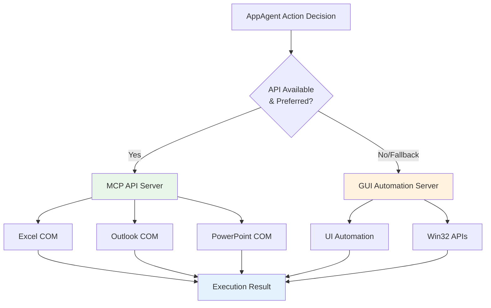

# Hybrid GUI–API Action Layer

UFO² introduces a **hybrid action layer** that seamlessly combines traditional GUI automation with native application APIs, enabling agents to dynamically select the optimal execution method for each task. This design bridges the gap between universal GUI availability and high-fidelity API control, achieving both robustness and efficiency.

## The Two-Interface Problem

Application environments typically expose two complementary classes of interfaces, each with distinct trade-offs:

### GUI Frontends (Traditional Approach)

**Characteristics:**  
✅ **Universally Available** — Works with any application, even without API documentation  
✅ **Visual Compatibility** — Follows actual UI layout users see  
✅ **No Integration Required** — Works out-of-the-box with UI Automation

**Limitations:**  
❌ **Brittle to UI Changes** — Layout modifications break automation  
❌ **Slow Execution** — Requires screenshot capture, OCR, and simulated input  
❌ **Limited Precision** — Pixel-based targeting prone to errors  
❌ **High Cognitive Load** — LLMs must interpret visual information at each step

### Native APIs (Preferred Approach)

**Characteristics:**  
✅ **High-Fidelity Control** — Direct manipulation of application state  
✅ **Fast Execution** — No screenshot analysis or UI rendering delays  
✅ **Precise Operations** — Programmatic access to exact data structures  
✅ **Robust to UI Changes** — API contracts remain stable across versions

**Limitations:**  
❌ **Requires Explicit Integration** — Must implement API wrappers for each app  
❌ **Limited Availability** — Not all applications expose comprehensive APIs  
❌ **Maintenance Overhead** — API changes require code updates  
❌ **Documentation Dependency** — Requires accurate API references

!!! info "Research Finding"
    Studies show that **API-based agents outperform GUI-only agents** by 15–30% on tasks where APIs are available, but **GUI fallback is essential** for broad application coverage and handling edge cases where APIs are insufficient.  
    📄 Reference: [API Agents vs. GUI Agents](https://arxiv.org/abs/2501.05446)

## UFO²'s Hybrid Solution

UFO² addresses this dilemma through a **unified action layer** that:

1. **Dynamically selects** between GUI and API execution based on availability and task requirements
2. **Composes hybrid workflows** that mix GUI and API actions within a single task
3. **Provides graceful fallback** from API to GUI when APIs are unavailable or insufficient
4. **Leverages MCP servers** for extensible, modular integration of application-specific APIs


*UFO²'s hybrid action architecture powered by Model Context Protocol (MCP) servers. Agents dynamically select between GUI automation (via UI Automation/Win32 APIs) and native application APIs (via MCP servers like Excel COM, Outlook API, PowerPoint), enabling optimal execution strategies for each task.*

## MCP-Powered Action Execution

UFO² implements the hybrid action layer through the **Model Context Protocol (MCP)** framework:

### Architecture Components

| Component | Role | Examples |
|-----------|------|----------|
| **MCP Servers** | Expose application-specific APIs as standardized tools | Excel COM Server, Outlook API Server, PowerPoint Server |
| **GUI Automation Servers** | Provide universal UI interaction commands | UICollector, HostUIExecutor, AppUIExecutor |
| **Command Dispatcher** | Routes agent requests to appropriate MCP server | Selects Excel API for cell operations, GUI for unlabeled buttons |
| **Action Strategies** | Determine execution method based on context | Prefer API for bulk operations, GUI for visual verification |

### Execution Flow



### Example: Excel Chart Creation

**Scenario:** Create a column chart from data in cells A1:B10

**API-First Execution:**

```python
# Agent decision: Use Excel API (fast, precise)
command = ExcelCreateChartCommand(
    data_range="A1:B10",
    chart_type="column",
    chart_title="Sales Data"
)
    
# MCP Server: Excel COM
result = mcp_server.execute(command)
# → Direct API call: workbook.charts.add(...)
# → Execution time: ~0.5s
```

**GUI Fallback Execution:**

```python
# Agent decision: API unavailable, use GUI
commands = [
    SelectControlCommand(control="A1:B10"),
    ClickCommand(control="Insert > Chart"),
    SelectChartTypeCommand(type="Column"),
    SetTextCommand(control="Chart Title", text="Sales Data"),
    ClickCommand(control="OK")
]
    
# MCP Server: UICollector
for cmd in commands:
    result = mcp_server.execute(cmd)
# → UI Automation: capture, annotate, click sequence
# → Execution time: ~8s
```

**Hybrid Execution:**

```python
# Agent decision: Mix API + GUI for optimal workflow
    
# Step 1: API for data manipulation (fast)
api_command = ExcelSetRangeCommand(
    range="A1:B10",
    values=processed_data
)
mcp_api_server.execute(api_command)
    
# Step 2: GUI for chart insertion (visual verification)
gui_commands = [
    SelectControlCommand(control="A1:B10"),
    ClickCommand(control="Insert > Recommended Charts"),
    # Visual confirmation before finalizing
    ScreenshotCommand(),
    ClickCommand(control="OK")
]
for cmd in gui_commands:
    mcp_gui_server.execute(cmd)
```

---

## Dynamic Action Selection

UFO²'s agents use a **strategy-based decision process** to select execution methods:

### Selection Criteria

UFO² agents dynamically select between GUI and API execution based on:

| Factor | API Preference | GUI Preference |
|--------|---------------|---------------|
| **Operation Type** | Bulk data operations, calculations | Visual layout, custom UI elements |
| **Performance Requirement** | Time-critical tasks | Tasks requiring visual verification |
| **API Availability** | Application has MCP server configured | Application only has GUI automation |
| **Precision Requirement** | Exact data manipulation | Approximate interactions (e.g., scrolling) |
| **Error Handling** | Predictable state changes | Exploratory interactions |

**How Agents Decide:**

The agent **reasoning process** determines execution method based on:

1. **Available MCP servers** — Check if application has API-based MCP servers configured
2. **Task characteristics** — Bulk operations favor API, visual tasks favor GUI
3. **Tool availability** — Each MCP server exposes specific capabilities as tools
4. **LLM decision** — Agent reasons about which available tool best fits the task

**Real-World Decision Examples:**

**Task: "Fill 1000 Excel cells with sequential numbers"**  
→ **Decision: ExcelCOMExecutor** (COM API bulk operation ~2s vs. GUI 1000 clicks ~300s)

**Task: "Click the blue 'Submit' button in custom dialog"**  
→ **Decision: AppUIExecutor** (No API for custom dialogs, visual grounding needed)

**Task: "Create presentation from Excel data, verify slide layout"**  
→ **Decision: Both servers** (PowerPointCOMExecutor for data, AppUIExecutor for verification)

## MCP Server Configuration

UFO² agents discover available MCP servers through the `config/ufo/mcp.yaml` configuration:

### Server Registration

```yaml
# config/ufo/mcp.yaml
# MCP servers are organized by agent type and application

AppAgent:
  # Default configuration for all applications
  default:
    data_collection:
      - namespace: UICollector        # Screenshot capture, UI tree extraction
        type: local                   # Local in-memory server
        start_args: []
        reset: false
    action:
      - namespace: AppUIExecutor      # GUI automation (click, type, scroll)
        type: local
        start_args: []
        reset: false
      - namespace: CommandLineExecutor # Command-line execution
        type: local
        start_args: []
        reset: false
  
  # Excel-specific configuration (adds COM API)
  EXCEL.EXE:
    data_collection:
      - namespace: UICollector
        type: local
        start_args: []
        reset: false
    action:
      - namespace: AppUIExecutor      # GUI fallback
        type: local
        start_args: []
        reset: false
      - namespace: ExcelCOMExecutor   # Excel COM API
        type: local
        start_args: []
        reset: true                   # Reset when switching apps
  
  # Word-specific configuration
  WINWORD.EXE:
    action:
      - namespace: WordCOMExecutor    # Word COM API
        type: local
        start_args: []
        reset: true
  
  # PowerPoint-specific configuration
  POWERPNT.EXE:
    action:
      - namespace: PowerPointCOMExecutor # PowerPoint COM API
        type: local
        start_args: []
        reset: true

HostAgent:
  default:
    data_collection:
      - namespace: UICollector
        type: local
        start_args: []
        reset: false
    action:
      - namespace: HostUIExecutor     # Desktop-level GUI automation
        type: local
        start_args: []
        reset: false
      - namespace: CommandLineExecutor
        type: local
        start_args: []
        reset: false
```

### How Agents Load MCP Servers

When an agent is initialized for a specific application, the system:

1. **Matches application** — Uses process name (e.g., `EXCEL.EXE`) to find configuration
2. **Creates MCP servers** — Initializes servers via `MCPServerManager.create_or_get_server()`
3. **Registers tools** — Each MCP server exposes tools (e.g., `excel_write_cell`, `ui_click`)
4. **Agent discovers capabilities** — LLM sees available tools in system prompt

**Example: Available Tools for Excel**

When AppAgent opens Excel, it gets tools from:

**ExcelCOMExecutor (API):**
- `excel_write_cell` — Write to specific cell
- `excel_read_range` — Read cell range
- `excel_create_chart` — Create chart
- `excel_run_macro` — Run VBA macro

**AppUIExecutor (GUI):**
- `ui_click` — Click UI element
- `ui_type_text` — Type text
- `ui_select` — Select from dropdown

**UICollector (Data):**
- `capture_screenshot` — Capture screen
- `get_ui_tree` — Get UI element tree

For complete MCP documentation, see:

- [MCP Overview](../../mcp/overview.md) — Model Context Protocol architecture
- [MCP Configuration Reference](../../configuration/system/mcp_reference.md) — Complete configuration options
- [MCP Server Documentation](../../mcp/local_servers.md) — All available MCP servers

## Best Practices

### When to Use API

✅ **Bulk data operations** — Filling cells, processing records  
✅ **Precise calculations** — Formula application, data transformations  
✅ **Programmatic workflows** — Email automation, calendar scheduling  
✅ **Time-critical tasks** — High-volume operations with strict SLAs

### When to Use GUI

✅ **Visual verification** — Layout checking, color validation  
✅ **Custom UI elements** — Application-specific dialogs, unlabeled controls  
✅ **Exploratory tasks** — Navigating unfamiliar applications  
✅ **Legacy applications** — Apps without accessible APIs

### When to Use Hybrid

✅ **Complex workflows** — Combine API efficiency with GUI verification  
✅ **Partial API coverage** — Use API where available, GUI for gaps  
✅ **User-facing demos** — API for backend, GUI for visible interactions  
✅ **Debugging** — API for state setup, GUI for manual inspection

!!! warning "Common Pitfalls"
    - **Over-relying on APIs** — Some UI states only visible through screenshots  
    - **Ignoring API errors** — Always implement GUI fallback for resilience  
    - **Static execution plans** — Use dynamic selection based on runtime context  
    - **Inadequate verification** — Combine API execution with screenshot validation

## Related Documentation

### Core Concepts

- [**MCP Overview**](../../mcp/overview.md) — Model Context Protocol architecture  
- [**AppAgent**](../app_agent/overview.md) — Application-level agent implementation  
- [**HostAgent**](../host_agent/overview.md) — Desktop-level agent implementation

### Configuration

- [**MCP Configuration Reference**](../../configuration/system/mcp_reference.md) — Complete MCP server configuration options  
- [**Configuration Guide**](../../configuration/system/overview.md) — System configuration overview

### MCP Servers

- [**UICollector**](../../mcp/servers/ui_collector.md) — Screenshot and UI tree capture  
- [**AppUIExecutor**](../../mcp/servers/app_ui_executor.md) — GUI automation server  
- [**ExcelCOMExecutor**](../../mcp/servers/excel_com_executor.md) — Excel COM API integration  
- [**WordCOMExecutor**](../../mcp/servers/word_com_executor.md) — Word COM API integration  
- [**PowerPointCOMExecutor**](../../mcp/servers/ppt_com_executor.md) — PowerPoint COM API integration  
- [**CommandLineExecutor**](../../mcp/servers/command_line_executor.md) — Command-line execution

---

## Next Steps

1. **Explore MCP Architecture**: Read [MCP Overview](../../mcp/overview.md) to understand the protocol design  
2. **Configure MCP Servers**: Review [MCP Configuration](../../configuration/system/mcp_reference.md) for setup options  
3. **Study MCP Servers**: Check built-in implementations in [MCP Server Documentation](../../mcp/local_servers.md)  
4. **Build Custom Agents**: Follow [Creating AppAgent](../../tutorials/creating_app_agent/overview.md) to use hybrid actions

Want to see hybrid actions in practice?

- [Quick Start Guide](../../getting_started/quick_start_ufo2.md) — Run UFO² with default MCP servers  
- [Creating AppAgent Tutorial](../../tutorials/creating_app_agent/overview.md) — Build custom agents with hybrid actions
- [Speculative Multi-Action Execution](multi_action.md) — Optimize performance with batch action prediction
