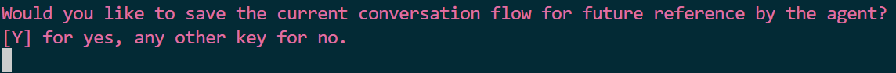
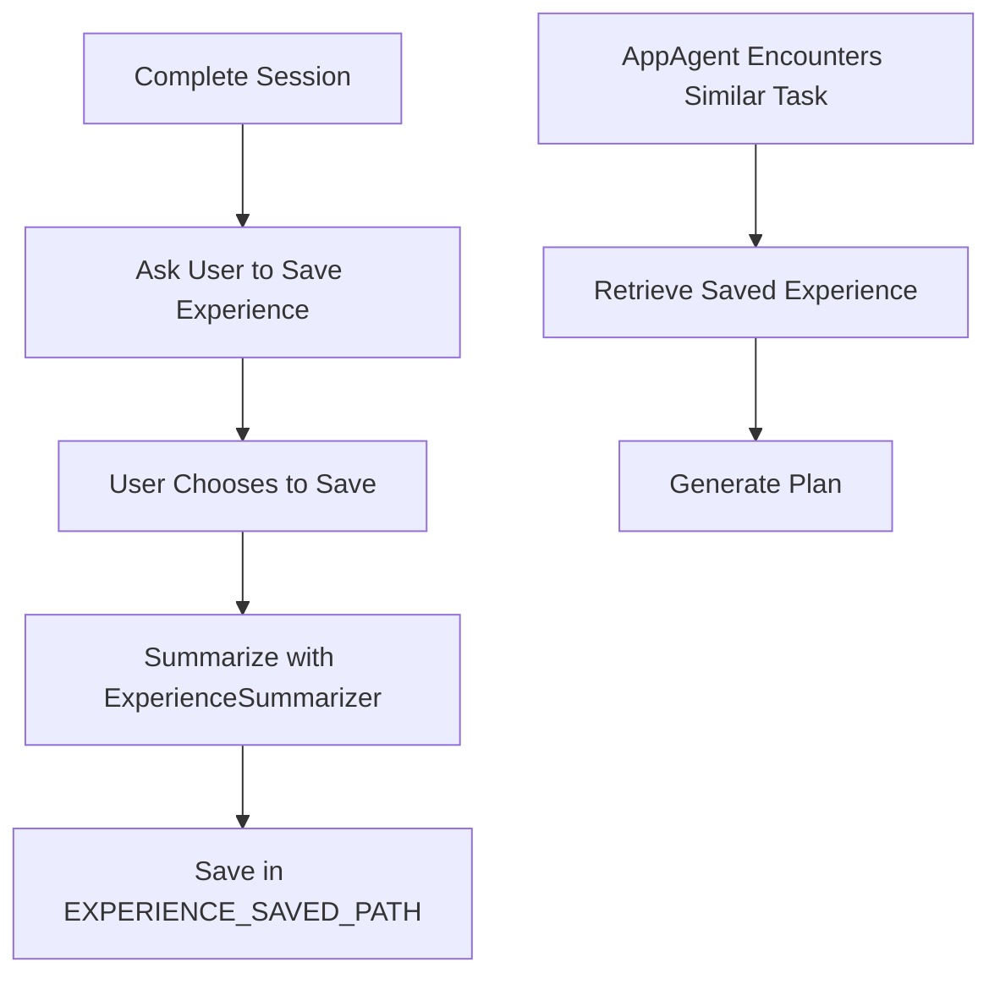

# Learning from Self-Experience

When UFO successfully completes a task, user can choose to save the successful experience to reinforce the AppAgent. The AppAgent can learn from its own successful experiences to improve its performance in the future.

## Mechanism

### Step 1: Complete a Session
- **Event**: UFO completes a session

### Step 2: Ask User to Save Experience
- **Action**: The agent prompts the user with a choice to save the successful experience

<h1 align="center">
    
</h1>

### Step 3: User Chooses to Save
- **Action**: If the user chooses to save the experience

### Step 4: Summarize and Save the Experience
- **Tool**: `ExperienceSummarizer`
- **Process**:
  1. Summarize the experience into a demonstration example
  2. Save the demonstration example in the `EXPERIENCE_SAVED_PATH` as specified in the `config_dev.yaml` file
  3. The demonstration example includes similar [fields](../../prompts/examples_prompts.md) as those used in the AppAgent's prompt

### Step 5: Retrieve and Utilize Saved Experience
- **When**: The AppAgent encounters a similar task in the future
- **Action**: Retrieve the saved experience from the experience database
- **Outcome**: Use the retrieved experience to generate a plan

### Workflow Diagram

## Activate the Learning from Self-Experience

### Step 1: Configure the AppAgent
Configure the following parameters to allow UFO to use the RAG from its self-experience:

| Configuration Option | Description | Type | Default Value |
|----------------------|-------------|------|---------------|
| `RAG_EXPERIENCE` | Whether to use the RAG from its self-experience | Boolean | False |
| `RAG_EXPERIENCE_RETRIEVED_TOPK` | The topk for the offline retrieved documents | Integer | 5 |

# Reference

## Experience Summarizer
The `ExperienceSummarizer` class is located in the `ufo/experience/experience_summarizer.py` file. The `ExperienceSummarizer` class provides the following methods to summarize the experience:

:::experience.summarizer.ExperienceSummarizer

 

## Experience Retriever
The `ExperienceRetriever` class is located in the `ufo/rag/retriever.py` file. The `ExperienceRetriever` class provides the following methods to retrieve the experience:

:::rag.retriever.ExperienceRetriever
