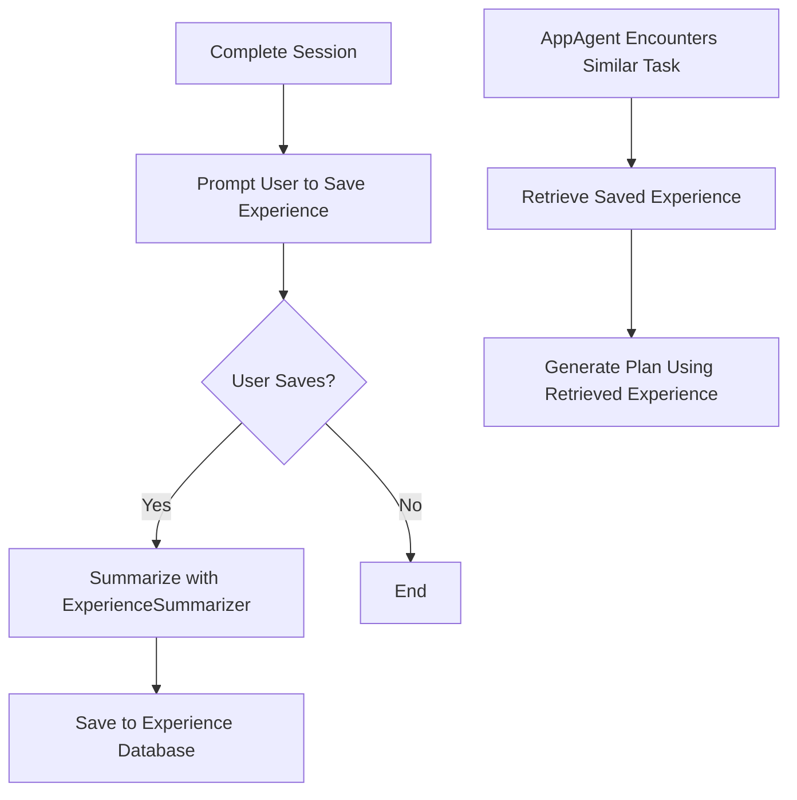

# Learning from Self-Experience

When UFO successfully completes a task, users can save the successful experience to enhance the AppAgent's future performance. The AppAgent learns from its own successful experiences to improve task execution.

## Mechanism

### Workflow Steps

1. **Complete a Session**: UFO finishes executing a task successfully

2. **Prompt User to Save**: The system asks whether to save the experience

    

3. **Summarize Experience**: If the user chooses to save, the `ExperienceSummarizer` processes the session:
   - Extracts key information from the execution trajectory
   - Summarizes the experience into a structured demonstration example
   - Saves it to the experience database at the configured path
   - The demonstration example includes fields similar to those in the [AppAgent's prompt examples](../../prompts/examples_prompts.md)

4. **Retrieve and Utilize**: When encountering similar tasks in the future:
   - The AppAgent queries the experience database
   - Retrieves relevant past experiences
   - Uses them to inform plan generation

## Configuration

Configure the following parameters in `config.yaml` to enable self-experience learning:

| Configuration Option | Description | Type | Default |
|---------------------|-------------|------|---------|
| `RAG_EXPERIENCE` | Enable experience-based learning | Boolean | `False` |
| `RAG_EXPERIENCE_RETRIEVED_TOPK` | Number of top experiences to retrieve | Integer | `5` |
| `EXPERIENCE_SAVED_PATH` | Database path for storing experiences | String | `"vectordb/experience/"` |

For more details on RAG configuration, see the [RAG Configuration Guide](../../../configuration/system/rag_config.md).

## API Reference

### Experience Summarizer

The `ExperienceSummarizer` class in `ufo/experience/summarizer.py` handles experience summarization:

:::experience.summarizer.ExperienceSummarizer

### Experience Retriever

The `ExperienceRetriever` class in `ufo/rag/retriever.py` handles experience retrieval:

:::rag.retriever.ExperienceRetriever
