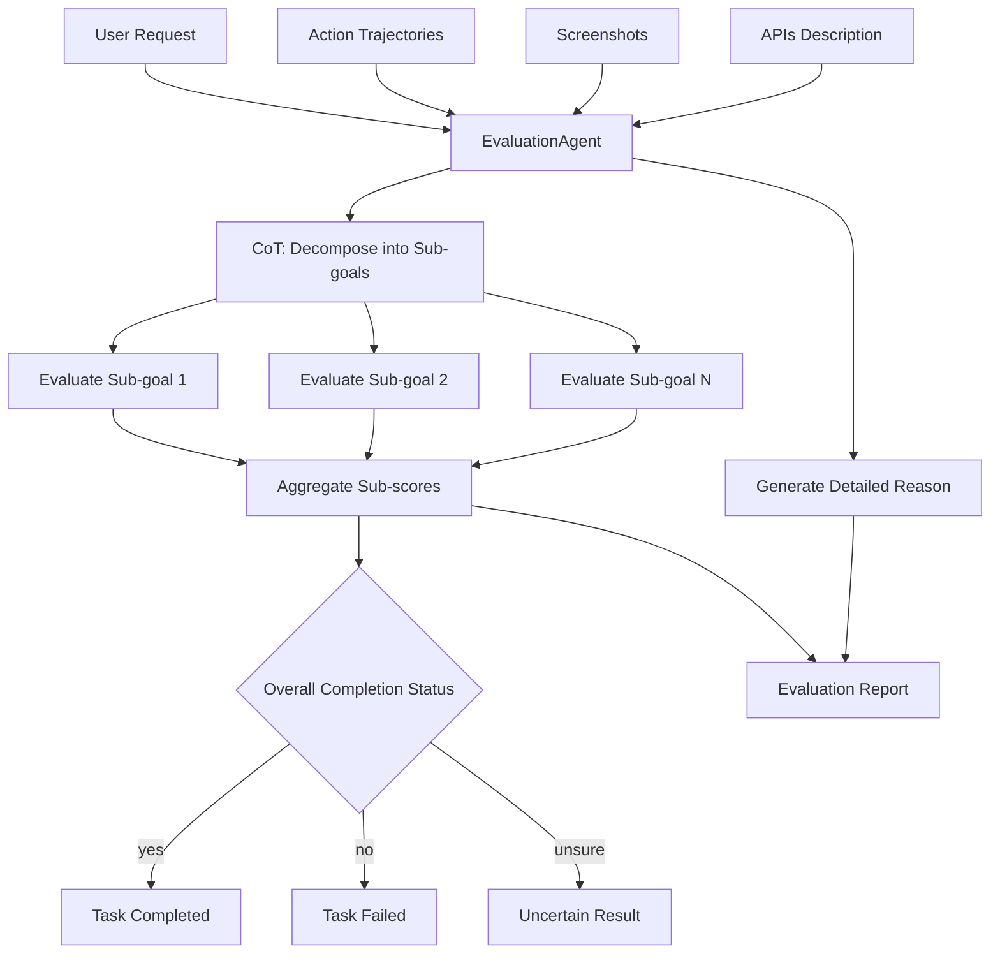

# EvaluationAgent

The `EvaluationAgent` evaluates whether a `Session` or `Round` has been successfully completed by assessing the performance of the `HostAgent` and `AppAgent` in fulfilling user requests. Configuration options are available in `config/ufo/system.yaml`. For more details, refer to the [System Configuration Guide](../../configuration/system/system_config.md).

The `EvaluationAgent` is fully LLM-driven and conducts evaluations based on action trajectories and screenshots. Since LLM-based evaluation may not be 100% accurate, the results should be used as guidance rather than absolute truth.


## Configuration

Configure the `EvaluationAgent` in `config/ufo/system.yaml`:

| Configuration Option      | Description                                   | Type    | Default Value |
|---------------------------|-----------------------------------------------|---------|---------------|
| `EVA_SESSION`             | Whether to evaluate the entire session. | Boolean | True          |
| `EVA_ROUND`               | Whether to evaluate each round.   | Boolean | False         |
| `EVA_ALL_SCREENSHOTS`     | Whether to include all screenshots in evaluation. If `False`, only the first and last screenshots are used. | Boolean | True          |

## Evaluation Process

The `EvaluationAgent` uses a Chain-of-Thought (CoT) mechanism to:

1. Decompose the evaluation into multiple sub-goals based on the user request
2. Evaluate each sub-goal separately
3. Aggregate the sub-scores to determine the overall completion status



### Inputs

The `EvaluationAgent` takes the following inputs:

| Input | Description | Type |
| --- | --- | --- |
| User Request | The user's request to be evaluated. | String |
| APIs Description | Description of the APIs (tools) used during execution. | String |
| Action Trajectories | Action trajectories executed by the `HostAgent` and `AppAgent`, including subtask, step, observation, thought, plan, comment, action, and application. | List of Dictionaries |
| Screenshots | Screenshots captured during execution. | List of Images |

The input construction is handled by the `EvaluationAgentPrompter` class in `ufo/prompter/eva_prompter.py`.

### Outputs

The `EvaluationAgent` generates the following outputs:

| Output | Description | Type |
| --- | --- | --- |
| reason | Detailed reasoning for the judgment based on screenshot analysis and execution trajectory. | String |
| sub_scores | List of sub-scoring points evaluating different aspects of the task. Each sub-score contains a name and evaluation result. | List of Dictionaries |
| complete | Overall completion status: `yes`, `no`, or `unsure`. | String |

Example output:

```json
{
    "reason": "The agent successfully completed the task of sending 'hello' to Zac on Microsoft Teams. 
    The initial screenshot shows the Microsoft Teams application with the chat window of Chaoyun Zhang open. 
    The agent then focused on the chat window, input the message 'hello', and clicked the Send button. 
    The final screenshot confirms that the message 'hello' was sent to Zac.", 
    "sub_scores": [
        { "name": "correct application focus", "evaluation": "yes" }, 
        { "name": "correct message input", "evaluation": "yes" }, 
        { "name": "message sent successfully", "evaluation": "yes" }
    ], 
    "complete": "yes"
}
```

Evaluation logs are saved in `logs/{task_name}/evaluation.log`.

## See Also

- [System Configuration](../../configuration/system/system_config.md) - Configure evaluation settings
- [Evaluation Logs](logs/evaluation_logs.md) - Understanding evaluation logs structure
- [Logs Overview](logs/overview.md) - Complete guide to UFO logging system
- [Benchmark Overview](benchmark/overview.md) - Benchmarking UFO performance using evaluation results

## Reference

:::agents.agent.evaluation_agent.EvaluationAgent

