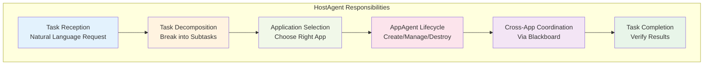
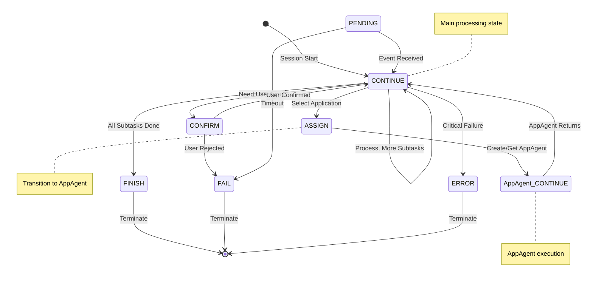
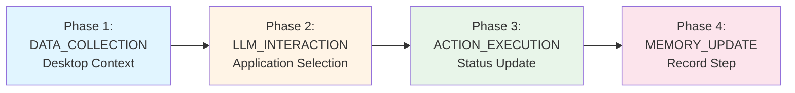
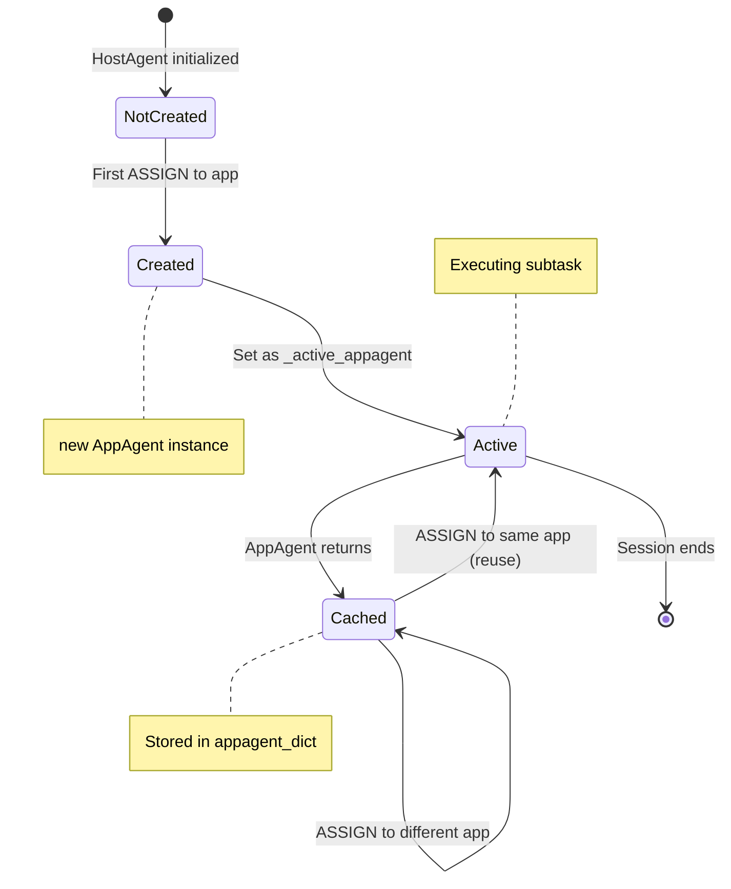
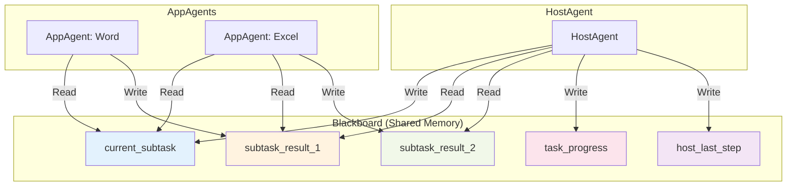
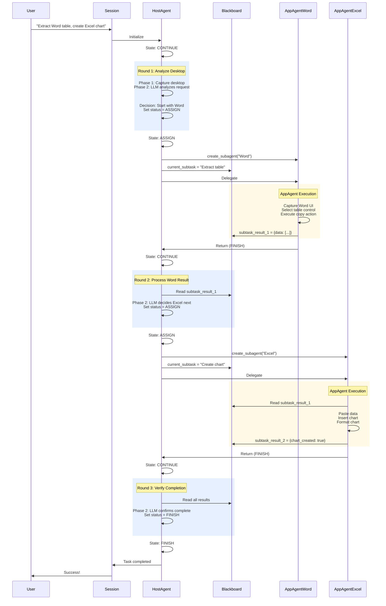

# HostAgent: Desktop Orchestrator

!!!quote "The Task Decomposition and Orchestration Agent"
    **HostAgent** is the top-level orchestrator agent in the Windows Agent Module. It decomposes user requests into subtasks, selects appropriate applications, manages AppAgent lifecycles, and coordinates multi-application workflows through the Blackboard pattern. HostAgent operates at the desktop level with a 7-state finite state machine and 4-phase processing pipeline.

---

## Overview

### Role and Responsibilities



| Responsibility | Description | Example |
|---------------|-------------|---------|
| **Task Reception** | Receive and understand user's natural language request | "Extract data from Word and create an Excel chart" |
| **Task Decomposition** | Break complex request into sequential subtasks | 1. Extract table from Word<br/>2. Create chart in Excel |
| **Application Selection** | Identify which application can fulfill each subtask | Subtask 1 → Microsoft Word<br/>Subtask 2 → Microsoft Excel |
| **AppAgent Lifecycle** | Create, manage, and destroy AppAgent instances | Create AppAgent for Word, reuse or create for Excel |
| **Cross-App Coordination** | Share data between AppAgents via Blackboard | Word result → Blackboard → Excel input |
| **Task Completion** | Verify all subtasks completed successfully | Check Blackboard for all subtask results |

!!!info "Hierarchical Position"
    **HostAgent** is the **parent** agent that:
    
    - Lives for the entire session duration
    - Maintains a single instance per session
    - Delegates subtasks to **AppAgent** children
    - Returns to control after each AppAgent completes
    - Owns the shared Blackboard for all agents

Below is a diagram illustrating the `HostAgent` architecture and its interactions with other components:

<h1 align="center">
    
</h1>

---

## Architecture Components

### 1. State Machine (7 States)

HostAgent uses a finite state machine with 7 possible states:



#### State Details

| State | Purpose | Processor Executed | Duration | Transitions |
|-------|---------|-------------------|----------|-------------|
| **CONTINUE** | Active processing state - execute orchestration logic | ✅ Yes (4 phases) | Single round | CONTINUE / ASSIGN / FINISH / ERROR |
| **ASSIGN** | Create or retrieve AppAgent for selected application | ❌ No | Immediate | AppAgent.CONTINUE |
| **FINISH** | Task completed successfully | ❌ No | Permanent | None (terminal) |
| **FAIL** | Task failed, cannot proceed | ❌ No | Permanent | None (terminal) |
| **ERROR** | Unhandled exception or system error | ❌ No | Permanent | FINISH (shutdown) |
| **PENDING** | Await external event or user input | ❌ No | Until event/timeout | CONTINUE / FAIL |
| **CONFIRM** | Request user approval before proceeding | ✅ Yes | Until user responds | CONTINUE / FAIL |

The state machine diagram for the `HostAgent` is also shown below:
<h1 align="center">
     
</h1>

!!!tip "State Transition Control"
    The **LLM** controls most state transitions by setting `agent.status` in the **LLM_INTERACTION** phase:
    
    ```json
    {
      "Observation": "Desktop shows Word and Excel. Task requires data extraction.",
      "Thought": "I should first extract data from Word before creating Excel chart.",
      "ControlLabel": "0",
      "ControlText": "Microsoft Word - Document1",
      "Function": "select_application",
      "Args": {...},
      "Status": "ASSIGN",
      "Comment": "Delegating data extraction to Word AppAgent"
    }
    ```

---

### 2. Processing Pipeline (4 Phases)

HostAgent executes a 4-phase pipeline in **CONTINUE** and **CONFIRM** states:



| Phase | Strategy | Purpose | Key Outputs |
|-------|----------|---------|-------------|
| **Phase 1** | `DesktopDataCollectionStrategy` | Gather desktop environment context | Desktop screenshot, application list, target registry |
| **Phase 2** | `HostLLMInteractionStrategy` | LLM analyzes and decides application | Selected application, subtask description, status |
| **Phase 3** | `HostActionExecutionStrategy` | Execute LLM decision (launch app, update context) | Execution result, application launched |
| **Phase 4** | `HostMemoryUpdateStrategy` | Record orchestration step in memory | Memory item, blackboard updated |

!!!info "Processing Flow"
    ```mermaid
    sequenceDiagram
        participant Agent
        participant P1 as DATA_COLLECTION
        participant P2 as LLM_INTERACTION
        participant P3 as ACTION_EXECUTION
        participant P4 as MEMORY_UPDATE
        
        Agent->>P1: Execute
        P1-->>Agent: Desktop context
        Agent->>P2: Execute
        P2-->>Agent: Application selection
        Agent->>P3: Execute
        P3-->>Agent: Status update
        Agent->>P4: Execute
        P4-->>Agent: Memory recorded
    ```

---

### 3. Command System

HostAgent uses desktop-level MCP commands:

| Command Category | Commands | Purpose |
|-----------------|----------|---------|
| **Screenshot** | `capture_desktop_screenshot` | Capture full desktop view |
| **Window Management** | `get_desktop_app_info`, `get_app_window` | Get application window information |
| **Process Control** | `launch_application`, `close_application` | Start/terminate applications |
| **MCP Tools** | `list_tools` | Get available MCP tools |

!!!example "Command Usage Example"
    ```python
    # Capture desktop screenshot
    command = Command(
        tool_name="capture_desktop_screenshot",
        parameters={"save_path": "C:/logs/desktop_step1.png"},
        tool_type="action",
    )
    result = await dispatcher.execute_commands([command])
    ```

---

## Input and Output

### HostAgent Input

The `HostAgent` receives the following inputs:

| Input | Description | Type |
| --- | --- | --- |
| User Request | The user's request in natural language | String |
| Application Information | Information about existing active applications | List of Dicts |
| Desktop Screenshots | Screenshots of the desktop to provide context | Image |
| Previous Sub-Tasks | The previous sub-tasks and their completion status | List of Dicts |
| Previous Plan | The previous plan for following sub-tasks | List of Strings |
| Blackboard | Shared memory space for storing and sharing information | Dictionary |

### HostAgent Output

With the inputs provided, the `HostAgent` generates the following outputs:

| Output | Description | Type |
| --- | --- | --- |
| Observation | The observation of current desktop screenshots | String |
| Thought | The logical reasoning process of the `HostAgent` | String |
| Current Sub-Task | The current sub-task to be executed by the `AppAgent` | String |
| Message | The message to be sent to the `AppAgent` for completion | String |
| ControlLabel | The index of the selected application | String |
| ControlText | The name of the selected application | String |
| Plan | The plan for following sub-tasks | List of Strings |
| Status | The status of the agent, mapped to `AgentState` | String |
| Comment | Additional comments or information for the user | String |
| Questions | Questions to ask the user for additional information | List of Strings |
| Bash | Bash command to be executed (open apps, system commands) | String |

Below is an example of the `HostAgent` output:

```json
{
    "Observation": "Desktop shows Microsoft Word with document open containing a table",
    "Thought": "User wants to extract data from Word first",
    "Current Sub-Task": "Extract the table data from the document",
    "Message": "Starting data extraction from Word document",
    "ControlLabel": "0",
    "ControlText": "Microsoft Word - Document1",
    "Plan": ["Extract table from Word", "Create chart in Excel"],
    "Status": "ASSIGN",
    "Comment": "Delegating table extraction to Word AppAgent",
    "Questions": [],
    "Bash": ""
}
```

!!! info
    The `HostAgent` output is formatted as a JSON object by LLMs and can be parsed by the `json.loads` method in Python.

---

## Task Decomposition

Upon receiving the user's request, the `HostAgent` decomposes it into sub-tasks and assigns each sub-task to an `AppAgent` for execution. The `HostAgent` determines the appropriate application to fulfill the user's request based on the application information and the user's request. It then orchestrates the `AppAgents` to execute the necessary actions to complete the sub-tasks. We show the task decomposition process in the following figure:

<h1 align="center">
    
</h1>

---

## AppAgent Lifecycle Management

### Creation and Reuse

```python
class HostAgent:
    def __init__(self):
        self.appagent_dict = {}  # Cache of created AppAgents
        self._active_appagent = None
    
    def create_subagent(self, context: Context):
        """Create or reuse AppAgent for selected application"""
        app_root = context.get(ContextNames.APPLICATION_ROOT_NAME)
        process_name = context.get(ContextNames.APPLICATION_PROCESS_NAME)
        
        # Generate unique key
        agent_key = f"{app_root}/{process_name}"
        
        # Check cache
        if agent_key in self.appagent_dict:
            # Reuse existing AppAgent
            self._active_appagent = self.appagent_dict[agent_key]
            self.logger.info(f"Reusing AppAgent: {agent_key}")
        else:
            # Create new AppAgent
            config = AgentConfigResolver.resolve_app_agent_config(
                root=app_root,
                process=process_name,
                mode=self.mode
            )
            
            app_agent = AgentFactory.create_agent(**config)
            
            # Set relationships
            app_agent.host = self  # Parent reference
            app_agent.blackboard = self.blackboard  # Shared memory
            
            # Cache for future use
            self.appagent_dict[agent_key] = app_agent
            self._active_appagent = app_agent
            
            self.logger.info(f"Created new AppAgent: {agent_key}")
        
        return self._active_appagent
```

### Lifecycle Diagram



!!!tip "AppAgent Caching Benefits"
    - **Performance**: Avoid repeated initialization overhead
    - **Context Preservation**: AppAgent maintains memory across calls
    - **Resource Efficiency**: Single AppAgent instance per application
    - **State Continuity**: AppAgent remembers previous interactions

---

## Blackboard Pattern

### Shared Memory Interface

```python
class HostAgent:
    def __init__(self):
        self._blackboard = Blackboard()  # Shared across all agents
    
    @property
    def blackboard(self) -> Blackboard:
        """All agents access same Blackboard instance"""
        return self._blackboard

# When creating AppAgent
app_agent.blackboard = self.blackboard  # Share reference
```

### Data Flow Examples

**Writing Subtask:**
```python
# HostAgent writes subtask for AppAgent
agent.blackboard["current_subtask"] = {
    "application": "Microsoft Word",
    "task": "Extract table data from document",
    "context": {
        "document_name": "report.docx",
        "table_location": "first page"
    },
    "timestamp": time.time()
}
```

**Reading Result:**
```python
# HostAgent reads AppAgent result
result = agent.blackboard.get("subtask_result_1")
if result and result["status"] == "FINISH":
    extracted_data = result["data"]
    # Use data for next subtask
```

### Blackboard Visualization



---

## Complete Workflow Example

### Multi-Application Task

**User Request:** "Extract the sales table from the Word document and create a bar chart in Excel"



---

## Related Documentation

!!!info "Architecture"
    - **[Windows Agent Overview](overview.md)**: Module architecture and hierarchy
    - **[AppAgent](app_agent.md)**: Application automation agent
    - **[State Layer](../infrastructure/agents/design/state.md)**: FSM design principles
    - **[Strategy Layer](../infrastructure/agents/design/processor.md)**: Processor framework

!!!info "System Integration"
    - **[Session Management](../infrastructure/modules/session.md)**: Session lifecycle
    - **[Round Management](../infrastructure/modules/round.md)**: Execution rounds
    - **[Blackboard](../infrastructure/agents/design/blackboard.md)**: Inter-agent communication
    - **[Memory System](../infrastructure/agents/design/memory.md)**: Execution history

---

## API Reference

:::agents.agent.host_agent.HostAgent

---

## Summary

!!!success "HostAgent Key Characteristics"
    ✅ **Orchestrator**: Decomposes tasks and coordinates AppAgents
    
    ✅ **Desktop-Scoped**: Operates at system level, not application level
    
    ✅ **7-State FSM**: CONTINUE → ASSIGN → AppAgent → CONTINUE → FINISH
    
    ✅ **4-Phase Pipeline**: DATA_COLLECTION → LLM → ACTION → MEMORY
    
    ✅ **AppAgent Manager**: Creates, caches, and reuses AppAgent instances
    
    ✅ **Blackboard Owner**: Provides shared memory for all agents
    
    ✅ **Single Instance**: One HostAgent per session, manages many AppAgents

**Next Steps:**

1. **Study AppAgent**: Read [AppAgent documentation](app_agent.md) to understand execution layer
2. **Explore Architecture**: Review [Device Agent Overview](../infrastructure/agents/overview.md) for system design
3. **Learn Processing**: Check [Strategy Layer](../infrastructure/agents/design/processor.md) for processing logic
4. **Command System**: See [Command Layer](../infrastructure/agents/design/command.md) for available operations
