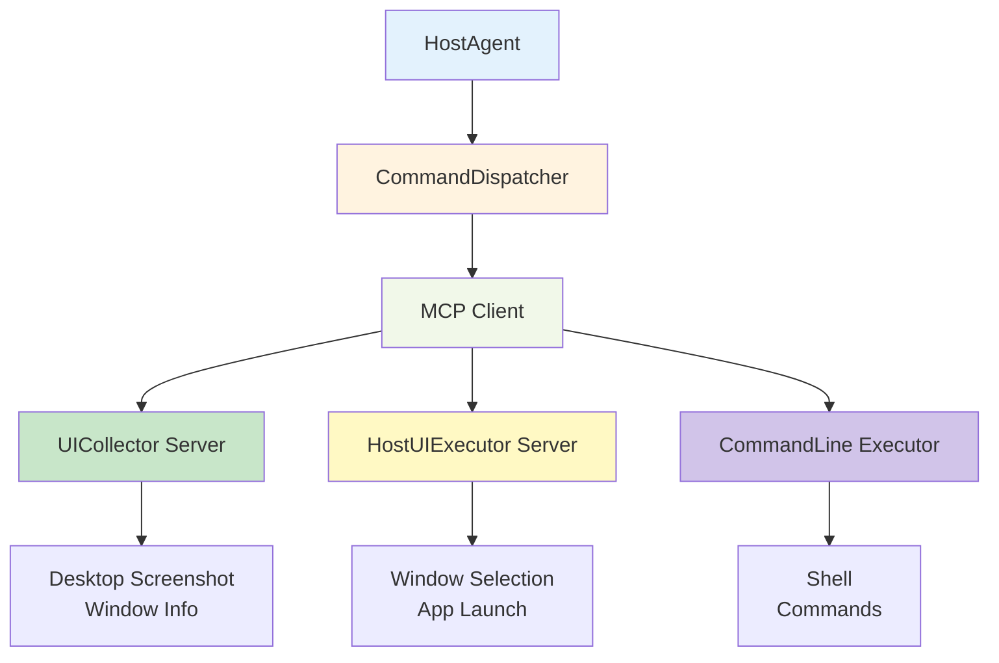
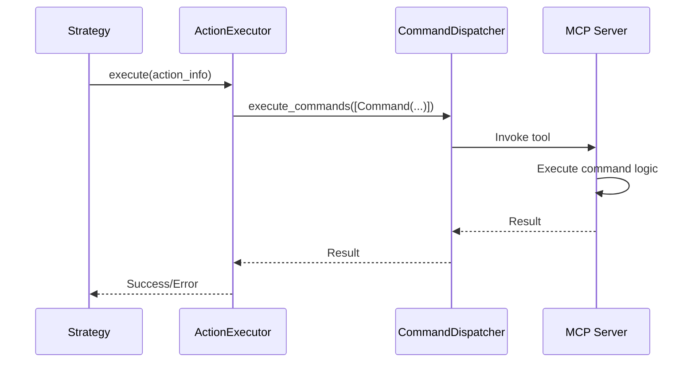

# HostAgent Command System

HostAgent executes desktop-level commands through the **MCP (Model Context Protocol)** system. Commands are dynamically provided by MCP servers and executed through the `CommandDispatcher` interface. This document describes the MCP configuration for HostAgent commands.

---

## Command Execution Architecture



!!!note "Dynamic Commands"
    HostAgent commands are **not hardcoded**. They are dynamically discovered from configured MCP servers. Available commands depend on MCP server configuration in `config/ufo/mcp.yaml`, installed MCP servers, and active MCP connections.

---

## MCP Server Configuration

### Configuration File

HostAgent commands are configured in **`config/ufo/mcp.yaml`**:

```yaml
HostAgent:
  default:
    data_collection:
      - namespace: UICollector
        type: local
        start_args: []
        reset: false
    action:
      - namespace: HostUIExecutor
        type: local
        start_args: []
        reset: false
      - namespace: CommandLineExecutor
        type: local
        start_args: []
        reset: false
```

### MCP Servers Used by HostAgent

| Server | Namespace | Type | Purpose | Command Categories |
|--------|-----------|------|---------|-------------------|
| **UICollector** | `UICollector` | Local | Data collection | Desktop screenshot, window enumeration |
| **HostUIExecutor** | `HostUIExecutor` | Local | Desktop actions | Window selection, application launch |
| **CommandLineExecutor** | `CommandLineExecutor` | Local | Shell execution | PowerShell, Bash commands |

---

## Command Discovery

### Listing Available Commands

HostAgent dynamically discovers available commands from MCP servers:

```python
# Get all available tools from MCP servers
result = await command_dispatcher.execute_commands([
    Command(tool_name="list_tools", parameters={})
])

tools = result[0].result
# Returns list of all available commands with their schemas
```

### Command Categories

Commands are categorized by purpose:

| Category | Server | Examples |
|----------|--------|----------|
| **Data Collection** | UICollector | `capture_desktop_screenshot`, `get_desktop_app_target_info`, `get_desktop_window_info` |
| **Window Management** | HostUIExecutor | `select_application_window`, `launch_application` |
| **Process Control** | HostUIExecutor | `close_application`, `get_process_info` |
| **Shell Execution** | CommandLineExecutor | `execute_command` |
| **Tool Discovery** | All Servers | `list_tools` |

---

## Command Execution

### Execution Flow



### Example: Capture Desktop Screenshot

```python
from aip.messages import Command

# Create command
command = Command(
    tool_name="capture_desktop_screenshot",
    parameters={"all_screens": True},
    tool_type="data_collection",
)

# Execute command
results = await command_dispatcher.execute_commands([command])

# Access result
screenshot_data = results[0].result  # Base64-encoded image
```

### Example: Select Application Window

```python
# Select and focus application window
command = Command(
    tool_name="select_application_window",
    parameters={
        "id": "0",
        "name": "Microsoft Word - Document1"
    },
    tool_type="action",
)

results = await command_dispatcher.execute_commands([command])
app_info = results[0].result
```

---

## Configuration Resources

For detailed MCP configuration, server setup, and command reference:

**Quick References:**

- **[MCP Configuration Reference](../../configuration/system/mcp_reference.md)** - Quick MCP settings reference
- **[MCP Overview](../../mcp/overview.md)** - MCP architecture and concepts

**Configuration Guides:**

- **[MCP Configuration Guide](../../mcp/configuration.md)** - Complete configuration documentation
- **[Local Servers](../../mcp/local_servers.md)** - Built-in MCP servers
- **[Remote Servers](../../mcp/remote_servers.md)** - HTTP and stdio servers
- **[Creating MCP Servers](../../tutorials/creating_mcp_servers.md)** - Creating custom MCP servers

**Server Type Documentation:**

- **[Action Servers](../../mcp/action.md)** - Action server documentation
- **[Data Collection Servers](../../mcp/data_collection.md)** - Data collection server documentation

### Detailed Server Documentation

Each MCP server has comprehensive documentation:

| Server | Documentation | Command Details |
|--------|--------------|----------------|
| UICollector | [UICollector Server](../../mcp/servers/ui_collector.md) | Screenshot, window info, control detection commands |
| HostUIExecutor | [HostUIExecutor Server](../../mcp/servers/host_ui_executor.md) | Window management and desktop automation commands |
| CommandLineExecutor | [CommandLine Executor](../../mcp/servers/command_line_executor.md) | Shell command execution |

!!!warning "Command Details Subject to Change"
    Specific command parameters, names, and behaviors may change as MCP servers evolve. Always refer to the server-specific documentation for the most up-to-date command reference.

---

## Agent Configuration Settings

### HostAgent Configuration

```yaml
# config/ufo/host_agent_config.yaml
system:
  # Control detection backend
  control_backend:
    - "uia"  # Windows UI Automation
    - "omniparser"  # Vision-based detection
  
  # Screenshot settings
  save_full_screen: true  # Capture desktop screenshots
  save_ui_tree: true  # Save UI tree JSON
  include_last_screenshot: true  # Include previous step
  concat_screenshot: true  # Concatenate clean + annotated
  
  # Window behavior
  maximize_window: false  # Maximize on selection
  show_visual_outline_on_screen: true  # Draw red outline
```

See **[Configuration Overview](../../configuration/system/overview.md)** and **[System Configuration](../../configuration/system/system_config.md)** for complete configuration options.

---

## Related Documentation

**Architecture & Design:**

- **[HostAgent Overview](overview.md)** - High-level HostAgent architecture
- **[State Machine](state.md)** - 7-state FSM documentation
- **[Processing Strategy](strategy.md)** - 4-phase processing pipeline
- **[AppAgent Commands](../app_agent/commands.md)** - Application-level commands

**Core Features:**
    - **[Hybrid Actions](../core_features/hybrid_actions.md)** - MCP command system architecture
    - **[Control Detection](../core_features/control_detection/overview.md)** - UIA and OmniParser backends
    - **[Command Dispatcher](../../infrastructure/modules/dispatcher.md)** - Command routing

---

## Summary

**Key Takeaways:**

- **MCP-Based**: All commands provided by MCP servers configured in `mcp.yaml`
- **Dynamic Discovery**: Commands discovered at runtime via `list_tools`
- **Desktop-Level**: System-wide operations (screenshots, window management)
- **Configurable**: Extensive MCP server configuration options
- **Documented**: Each server has detailed command reference

!!!warning
    Command details subject to change - refer to server documentation for latest information

**Next Steps:**

1. **Review MCP Configuration**: [MCP Configuration Reference](../../configuration/system/mcp_reference.md)
2. **Explore Server Documentation**: Click server links above for command details
3. **Understand Processing**: [Processing Strategy](strategy.md) shows commands in action
4. **Learn State Machine**: [State Machine](state.md) explains when commands execute
