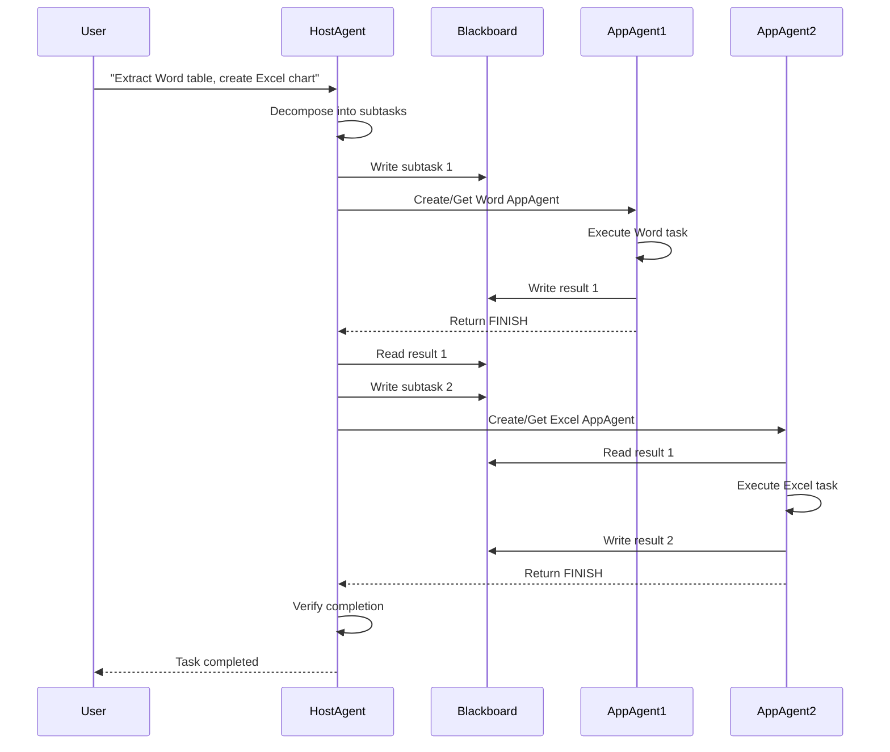

# HostAgent: Desktop Orchestrator

**HostAgent** serves as the centralized control plane of UFO². It interprets user-specified goals, decomposes them into structured subtasks, instantiates and dispatches AppAgent modules, and coordinates their progress across the system. HostAgent provides system-level services for introspection, planning, application lifecycle management, and multi-agent synchronization.

---

## Architecture Overview

Operating atop the native Windows substrate, HostAgent monitors active applications, issues shell commands to spawn new processes as needed, and manages the creation and teardown of application-specific AppAgent instances. All coordination occurs through a persistent state machine, which governs the transitions across execution phases.

<figure markdown>
  
  <figcaption><b>Figure:</b> HostAgent architecture showing the finite state machine, processing pipeline, and interactions with AppAgents through the Blackboard pattern.</figcaption>
</figure>

---

## Core Responsibilities

### Task Decomposition

Given a user's natural language input, HostAgent identifies the underlying task goal and decomposes it into a dependency-ordered subtask graph.

**Example:** User request "Extract data from Word and create an Excel chart" becomes:

1. Extract table from Word document
2. Create chart in Excel with extracted data

<figure markdown>
  
  <figcaption><b>Figure:</b> HostAgent decomposes user requests into sequential subtasks, assigns each to the appropriate application, and orchestrates AppAgents to complete them in dependency order.</figcaption>
</figure>

### Application Lifecycle Management

For each subtask, HostAgent inspects system process metadata (via UIA APIs) to determine whether the target application is running. If not, it launches the program and registers it with the runtime.

### AppAgent Instantiation

HostAgent spawns the corresponding AppAgent for each active application, providing it with task context, memory references, and relevant toolchains (e.g., APIs, documentation).

### Task Scheduling and Control

The global execution plan is serialized into a finite state machine (FSM), allowing HostAgent to enforce execution order, detect failures, and resolve dependencies across agents. See **[State Machine Details](state.md)** for the FSM architecture.

### Shared State Communication

HostAgent reads from and writes to a global blackboard, enabling inter-agent communication and system-level observability for debugging and replay.

---

## Key Characteristics

- **Scope**: Desktop-level orchestrator (system-wide, not application-specific)
- **Lifecycle**: Single instance per session, persists throughout task execution
- **Hierarchy**: Parent agent that manages multiple child AppAgents
- **Communication**: Owns and coordinates the shared Blackboard
- **Control**: 7-state finite state machine with 4-phase processing pipeline

---

## Execution Workflow



---

## Deep Dive Topics

- **[State Machine](state.md)**: 7-state FSM architecture and transitions
- **[Processing Strategy](strategy.md)**: 4-phase processing pipeline
- **[Command System](commands.md)**: Desktop-level MCP commands

---

## Input and Output

### HostAgent Input

| Input | Description | Type |
|-------|-------------|------|
| User Request | Natural language task description | String |
| Application Information | Active application metadata | List of Dicts |
| Desktop Screenshots | Visual context of desktop state | Image |
| Previous Sub-Tasks | Completed subtask history | List of Dicts |
| Previous Plan | Planned future subtasks | List of Strings |
| Blackboard | Shared memory space | Dictionary |

### HostAgent Output

| Output | Description | Type |
|--------|-------------|------|
| Observation | Desktop screenshot analysis | String |
| Thought | Reasoning process | String |
| Current Sub-Task | Active subtask description | String |
| Message | Information for AppAgent | String |
| ControlLabel | Selected application index | String |
| ControlText | Selected application name | String |
| Plan | Future subtask sequence | List of Strings |
| Status | Agent state (CONTINUE/ASSIGN/FINISH/etc.) | String |
| Comment | User-facing information | String |
| Questions | Clarification requests | List of Strings |
| Bash | System command to execute | String |

**Example Output:**
```json
{
    "Observation": "Desktop shows Microsoft Word with document open containing a table",
    "Thought": "User wants to extract data from Word first",
    "Current Sub-Task": "Extract the table data from the document",
    "Message": "Starting data extraction from Word document",
    "ControlLabel": "0",
    "ControlText": "Microsoft Word - Document1",
    "Plan": ["Extract table from Word", "Create chart in Excel"],
    "Status": "ASSIGN",
    "Comment": "Delegating table extraction to Word AppAgent",
    "Questions": [],
    "Bash": ""
}
```

---

## Related Documentation

**Architecture & Design:**

- **[Windows Agent Overview](../overview.md)**: Module architecture and hierarchy
- **[AppAgent](../app_agent/overview.md)**: Application automation agent
- **[Blackboard](../../infrastructure/agents/design/blackboard.md)**: Inter-agent communication
- **[Memory System](../../infrastructure/agents/design/memory.md)**: Execution history

**Configuration:**

- **[Configuration System Overview](../../configuration/system/overview.md)**: System configuration structure
- **[Agents Configuration](../../configuration/system/agents_config.md)**: LLM and agent settings
- **[System Configuration](../../configuration/system/system_config.md)**: Runtime and execution settings
- **[MCP Reference](../../configuration/system/mcp_reference.md)**: MCP server configuration

**System Integration:**

- **[Session Management](../../infrastructure/modules/session.md)**: Session lifecycle
- **[Round Management](../../infrastructure/modules/round.md)**: Execution rounds

---

## API Reference

:::agents.agent.host_agent.HostAgent

---

## Summary

HostAgent is the desktop-level orchestrator that:

- Decomposes tasks and coordinates AppAgents
- Operates at system level, not application level  
- Uses a 7-state FSM: CONTINUE → ASSIGN → AppAgent → CONTINUE → FINISH
- Executes a 4-phase pipeline: DATA_COLLECTION → LLM → ACTION → MEMORY
- Creates, caches, and reuses AppAgent instances
- Provides shared Blackboard memory for all agents
- Maintains single instance per session managing multiple AppAgents

**Next Steps:**

1. Read [State Machine](state.md) for FSM details
2. Read [Processing Strategy](strategy.md) for pipeline architecture  
3. Read [Command System](commands.md) for available desktop operations
4. Read [AppAgent](../app_agent/overview.md) for application-level execution
