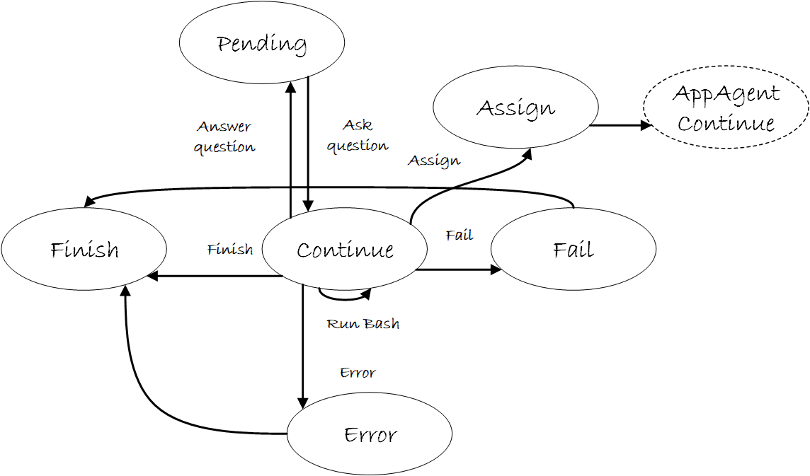
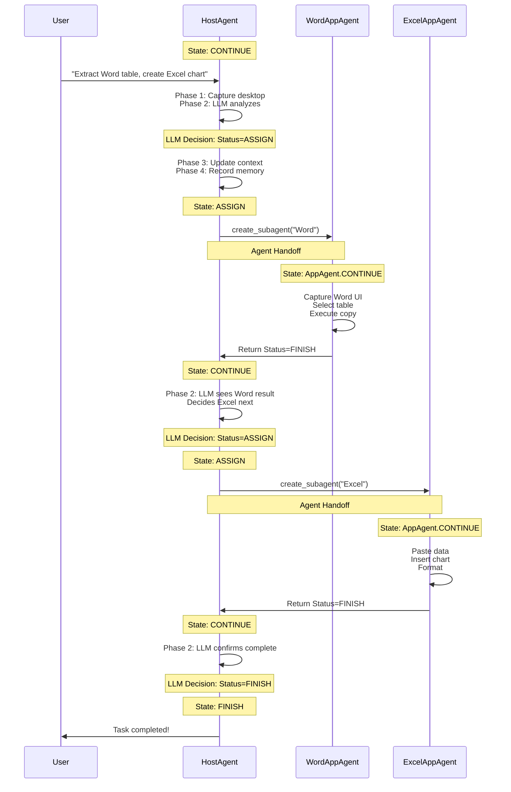

# HostAgent State Machine

!!!abstract "Overview"
    HostAgent uses a **7-state finite state machine (FSM)** to manage task orchestration flow. The state machine controls task decomposition, application selection, AppAgent delegation, and completion verification. States transition based on LLM decisions and system events.

---

## State Machine Architecture

### State Enumeration

```python
class HostAgentStatus(Enum):
    """Store the status of the host agent"""
    ERROR = "ERROR"        # Unhandled exception or system error
    FINISH = "FINISH"      # Task completed successfully
    CONTINUE = "CONTINUE"  # Active processing state
    ASSIGN = "ASSIGN"      # Delegate to AppAgent
    FAIL = "FAIL"          # Task failed, cannot proceed
    PENDING = "PENDING"    # Await external event or user input
    CONFIRM = "CONFIRM"    # Request user approval
```

### State Management

HostAgent states are managed by `HostAgentStateManager`, which implements a singleton registry pattern:

```python
class HostAgentStateManager(AgentStateManager):
    """Manages the states of the host agent"""
    _state_mapping: Dict[str, Type[HostAgentState]] = {}
    
    @property
    def none_state(self) -> AgentState:
        return NoneHostAgentState()
```

All HostAgent states are registered using the `@HostAgentStateManager.register` decorator, enabling dynamic state lookup by name.

---

## State Definitions

### 1. CONTINUE State

**Purpose**: Active orchestration state where HostAgent executes its 4-phase processing pipeline.

```python
@HostAgentStateManager.register
class ContinueHostAgentState(HostAgentState):
    """The class for the continue host agent state"""
    
    async def handle(self, agent: "HostAgent", context: Optional["Context"] = None):
        """Execute the 4-phase processing pipeline"""
        await agent.process(context)
    
    def is_round_end(self) -> bool:
        return False  # Round continues
    
    @classmethod
    def name(cls) -> str:
        return HostAgentStatus.CONTINUE.value
```

| Property | Value |
|----------|-------|
| **Type** | Active |
| **Processor Executed** | ✓ Yes (4 phases) |
| **Round Ends** | No |
| **Duration** | Single round |
| **Next States** | CONTINUE, ASSIGN, FINISH, CONFIRM, ERROR |

**Behavior**:

1. Captures desktop screenshot
2. LLM analyzes desktop and selects application
3. Updates context with selected application
4. Records orchestration step in memory

**Example Usage:**

```python
# HostAgent in CONTINUE state
agent.status = HostAgentStatus.CONTINUE.value
agent.set_state(ContinueHostAgentState())

# State executes 4-phase pipeline
await state.handle(agent, context)

# LLM sets next status in response
# {"Status": "ASSIGN", "ControlText": "Microsoft Word"}
```

---

### 2. ASSIGN State

**Purpose**: Create or retrieve AppAgent for the selected application and delegate execution.

```python
@HostAgentStateManager.register
class AssignHostAgentState(HostAgentState):
    """The class for the assign host agent state"""
    
    async def handle(self, agent: "HostAgent", context: Optional["Context"] = None):
        """Create/get AppAgent for selected application"""
        agent.create_subagent(context)
    
    def next_state(self, agent: "HostAgent") -> "AppAgentState":
        """Transition to AppAgent's CONTINUE state"""
        next_agent = self.next_agent(agent)
        
        if type(next_agent) == OpenAIOperatorAgent:
            return ContinueOpenAIOperatorState()
        else:
            return ContinueAppAgentState()
    
    def next_agent(self, agent: "HostAgent") -> "AppAgent":
        """Get the active AppAgent for delegation"""
        return agent.get_active_appagent()
    
    @classmethod
    def name(cls) -> str:
        return HostAgentStatus.ASSIGN.value
```

| Property | Value |
|----------|-------|
| **Type** | Transition |
| **Processor Executed** | ✗ No |
| **Round Ends** | No |
| **Duration** | Immediate |
| **Next States** | AppAgent.CONTINUE |
| **Next Agent** | AppAgent (switched) |

**Behavior**:

1. Checks if AppAgent for application already exists (cache)
2. Creates new AppAgent if not cached
3. Sets parent-child relationship (`app_agent.host = self`)
4. Shares Blackboard (`app_agent.blackboard = self.blackboard`)
5. Transitions to `AppAgent.CONTINUE` state

**AppAgent Caching:**

```python
# HostAgent maintains a cache of created AppAgents
agent_key = f"{app_root}/{process_name}"

if agent_key in self.appagent_dict:
    # Reuse existing AppAgent
    self._active_appagent = self.appagent_dict[agent_key]
else:
    # Create new AppAgent
    app_agent = AgentFactory.create_agent(**config)
    self.appagent_dict[agent_key] = app_agent
    self._active_appagent = app_agent
```

---

### 3. FINISH State

**Purpose**: Task completed successfully, terminate session.

```python
@HostAgentStateManager.register
class FinishHostAgentState(HostAgentState):
    """The class for the finish host agent state"""
    
    def is_round_end(self) -> bool:
        return True  # Round ends
    
    @classmethod
    def name(cls) -> str:
        return HostAgentStatus.FINISH.value
```

| Property | Value |
|----------|-------|
| **Type** | Terminal |
| **Processor Executed** | ✗ No |
| **Round Ends** | Yes |
| **Duration** | Permanent |
| **Next States** | None |

**Behavior**:

- Session terminates successfully
- All subtasks completed
- Results available in Blackboard

---

### 4. FAIL State

**Purpose**: Task failed, cannot proceed further.

```python
@HostAgentStateManager.register
class FailHostAgentState(HostAgentState):
    """The class for the fail host agent state"""
    
    def is_round_end(self) -> bool:
        return True  # Round ends
    
    def next_state(self, agent: "HostAgent") -> AgentState:
        return FinishHostAgentState()  # Transition to FINISH for cleanup
    
    @classmethod
    def name(cls) -> str:
        return HostAgentStatus.FAIL.value
```

| Property | Value |
|----------|-------|
| **Type** | Terminal |
| **Processor Executed** | ✗ No |
| **Round Ends** | Yes |
| **Duration** | Permanent |
| **Next States** | FINISH (for cleanup) |

**Behavior**:

- Task cannot be completed
- May result from user rejection or irrecoverable error
- Transitions to FINISH for graceful shutdown

---

### 5. ERROR State

**Purpose**: Unhandled exception or critical system error.

```python
@HostAgentStateManager.register
class ErrorHostAgentState(HostAgentState):
    """The class for the error host agent state"""
    
    def is_round_end(self) -> bool:
        return True  # Round ends
    
    def next_state(self, agent: "HostAgent") -> AgentState:
        return FinishHostAgentState()  # Transition to FINISH for cleanup
    
    @classmethod
    def name(cls) -> str:
        return HostAgentStatus.ERROR.value
```

| Property | Value |
|----------|-------|
| **Type** | Terminal |
| **Processor Executed** | ✗ No |
| **Round Ends** | Yes |
| **Duration** | Permanent |
| **Next States** | FINISH (for cleanup) |

**Behavior**:

- Critical system error occurred
- Unhandled exception during processing
- Automatically triggers graceful shutdown

**Error vs Fail:**

- **ERROR**: System/code errors (exceptions, crashes)
- **FAIL**: Logical task failures (user rejection, impossible task)

---

### 6. PENDING State

**Purpose**: Await external event or user input before continuing.

```python
@HostAgentStateManager.register
class PendingHostAgentState(HostAgentState):
    """The class for the pending host agent state"""
    
    async def handle(self, agent: "HostAgent", context: Optional["Context"] = None):
        """Ask the user questions to help the agent proceed"""
        agent.process_asker(ask_user=ufo_config.system.ask_question)
    
    def next_state(self, agent: "HostAgent") -> AgentState:
        """Return to CONTINUE after receiving input"""
        agent.status = HostAgentStatus.CONTINUE.value
        return ContinueHostAgentState()
    
    @classmethod
    def name(cls) -> str:
        return HostAgentStatus.PENDING.value
```

| Property | Value |
|----------|-------|
| **Type** | Waiting |
| **Processor Executed** | ✗ No |
| **Round Ends** | No |
| **Duration** | Until event/timeout |
| **Next States** | CONTINUE, FAIL |

**Behavior**:

- Requests additional information from user
- Waits for external event (async operation)
- Transitions to CONTINUE after receiving input
- May timeout and transition to FAIL

---

### 7. CONFIRM State

**Purpose**: Request user approval before proceeding with action.

```python
@HostAgentStateManager.register
class ConfirmHostAgentState(HostAgentState):
    """The class for the confirm host agent state"""
    
    async def handle(self, agent: "HostAgent", context: Optional["Context"] = None):
        """Request user confirmation"""
        # Confirmation logic handled by processor
        pass
    
    @classmethod
    def name(cls) -> str:
        return HostAgentStatus.CONFIRM.value
```

| Property | Value |
|----------|-------|
| **Type** | Waiting |
| **Processor Executed** | ✓ Yes (collect confirmation) |
| **Round Ends** | No |
| **Duration** | Until user responds |
| **Next States** | CONTINUE (approved), FAIL (rejected) |

**Behavior**:

- Displays confirmation request to user
- Waits for user approval/rejection
- CONTINUE if approved
- FAIL if rejected

**Safety Check:**

CONFIRM state provides a safety mechanism for sensitive operations such as application launches, file deletions, and system configuration changes.

---

## State Transition Diagram

<figure markdown>
  
  <figcaption>HostAgent State Machine: Visual representation of the 7-state FSM with transitions and conditions</figcaption>
</figure>

---

## State Transition Control

### LLM-Driven Transitions

Most state transitions are controlled by the LLM through the `Status` field in its response:

```json
{
  "Observation": "Desktop shows Word and Excel. User wants to extract data from Word.",
  "Thought": "I should start with Word to extract the table data first.",
  "Current Sub-Task": "Extract table data from Word document",
  "ControlLabel": "0",
  "ControlText": "Microsoft Word - Document1",
  "Status": "ASSIGN",
  "Comment": "Delegating data extraction to Word AppAgent"
}
```

**Transition Flow**:

1. HostAgent in `CONTINUE` state executes processor
2. LLM analyzes desktop and decides next action
3. LLM sets `Status: "ASSIGN"` in response
4. Processor updates `agent.status = "ASSIGN"`
5. State machine transitions: `CONTINUE` → `ASSIGN`
6. `ASSIGN` state creates/gets AppAgent
7. Transitions to `AppAgent.CONTINUE`

### System-Driven Transitions

Some transitions are automatic and controlled by the system:

| From State | To State | Trigger | Controller |
|------------|----------|---------|------------|
| ASSIGN | AppAgent.CONTINUE | AppAgent created | System |
| AppAgent.CONTINUE | CONTINUE | AppAgent returns | System |
| PENDING | FAIL | Timeout | System |
| CONFIRM | CONTINUE | User approved | User Input |
| CONFIRM | FAIL | User rejected | User Input |
| ERROR | FINISH | Exception caught | System |
| FAIL | FINISH | Cleanup needed | System |

---

## Complete Execution Flow Example

### Multi-Application Task

**User Request**: "Extract sales table from Word and create bar chart in Excel"



### Step-by-Step State Transitions

| Step | Agent | State | Action | Next State |
|------|-------|-------|--------|------------|
| 1 | HostAgent | CONTINUE | Analyze desktop, select Word | ASSIGN |
| 2 | HostAgent | ASSIGN | Create WordAppAgent | AppAgent.CONTINUE |
| 3 | WordAppAgent | CONTINUE | Extract table | FINISH |
| 4 | HostAgent | CONTINUE | Analyze result, select Excel | ASSIGN |
| 5 | HostAgent | ASSIGN | Create ExcelAppAgent | AppAgent.CONTINUE |
| 6 | ExcelAppAgent | CONTINUE | Create chart | FINISH |
| 7 | HostAgent | CONTINUE | Verify completion | FINISH |
| 8 | HostAgent | FINISH | Session ends | - |

---

## Implementation Details

### State Class Hierarchy

```python
# Base state interface
class HostAgentState(AgentState):
    """Abstract class for host agent states"""
    
    async def handle(self, agent: "HostAgent", context: Optional["Context"] = None):
        """Execute state-specific logic"""
        pass
    
    def next_state(self, agent: "HostAgent") -> AgentState:
        """Determine next state based on agent status"""
        status = agent.status
        return HostAgentStateManager().get_state(status)
    
    def next_agent(self, agent: "HostAgent") -> "HostAgent":
        """Get agent for next step (usually same agent)"""
        return agent
    
    def is_round_end(self) -> bool:
        """Check if round should end"""
        return False
    
    @classmethod
    def agent_class(cls) -> Type["HostAgent"]:
        from ufo.agents.agent.host_agent import HostAgent
        return HostAgent
```

### State Registration Pattern

```python
# Registration decorator adds state to manager
@HostAgentStateManager.register
class ContinueHostAgentState(HostAgentState):
    @classmethod
    def name(cls) -> str:
        return HostAgentStatus.CONTINUE.value

# Manager can look up states by name
state = HostAgentStateManager().get_state("CONTINUE")
# Returns: ContinueHostAgentState instance
```

**Lazy Loading:**

States are loaded lazily by `HostAgentStateManager` only when needed, reducing initialization overhead.

---
```

### State Transition in Round Execution

```python
# In Round.run() method
while not state.is_round_end():
    # Execute current state
    await state.handle(agent, context)
    
    # Get next state based on agent.status
    state = state.next_state(agent)
    
    # Check if agent switched (HostAgent → AppAgent)
    agent = state.next_agent(agent)
```

!!!tip "Lazy Loading"
    States are loaded lazily by `HostAgentStateManager` only when needed, reducing initialization overhead.

---

## State Transition Table

### Complete Transition Matrix

| From \ To | CONTINUE | ASSIGN | FINISH | FAIL | ERROR | PENDING | CONFIRM | AppAgent.CONTINUE |
|-----------|----------|--------|--------|------|-------|---------|---------|-------------------|
| **CONTINUE** | ✓ LLM | ✓ LLM | ✓ LLM | ✗ | ✓ System | ✓ LLM | ✓ LLM | ✗ |
| **ASSIGN** | ✗ | ✗ | ✗ | ✗ | ✗ | ✗ | ✗ | ✓ System |
| **FINISH** | ✗ | ✗ | ✗ | ✗ | ✗ | ✗ | ✗ | ✗ |
| **FAIL** | ✗ | ✗ | ✓ System | ✗ | ✗ | ✗ | ✗ | ✗ |
| **ERROR** | ✗ | ✗ | ✓ System | ✗ | ✗ | ✗ | ✗ | ✗ |
| **PENDING** | ✓ User | ✗ | ✗ | ✓ Timeout | ✗ | ✗ | ✗ | ✗ |
| **CONFIRM** | ✓ User | ✗ | ✗ | ✓ User | ✗ | ✗ | ✗ | ✗ |
| **AppAgent.CONTINUE** | ✓ System | ✗ | ✗ | ✗ | ✗ | ✗ | ✗ | ✗ |

**Legend**:
- ✓ LLM: Transition controlled by LLM decision
- ✓ System: Automatic system transition
- ✓ User: User input required
- ✓ Timeout: Timeout triggers transition
- ✗: Transition not allowed

---

## Related Documentation

**Architecture & Design:**

- **[Overview](overview.md)**: HostAgent high-level architecture
- **[Processing Strategy](strategy.md)**: 4-phase processing pipeline
- **[State Design Pattern](../../infrastructure/agents/design/state.md)**: General state framework
- **[AppAgent State Machine](../app_agent/state.md)**: AppAgent FSM comparison

**System Integration:**

- **[Round Management](../../infrastructure/modules/round.md)**: How states execute in rounds
- **[Session Management](../../infrastructure/modules/session.md)**: Session lifecycle

---

## Summary

**Key Takeaways:**

- **7 States**: CONTINUE, ASSIGN, FINISH, FAIL, ERROR, PENDING, CONFIRM
- **LLM Control**: Most transitions driven by LLM's `Status` field
- **Agent Handoff**: ASSIGN state transitions to AppAgent.CONTINUE
- **Terminal States**: FINISH, FAIL, ERROR end the session
- **Safety Checks**: CONFIRM and PENDING provide user control
- **State Pattern**: Implements Gang of Four State design pattern
- **Singleton Registry**: HostAgentStateManager manages all states

**Next Steps:**

- Read [Processing Strategy](strategy.md) to understand what happens in CONTINUE state
- Read [Command System](commands.md) for available desktop operations
- Read [AppAgent State Machine](../app_agent/state.md) for comparison
