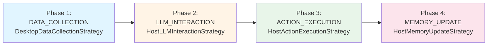
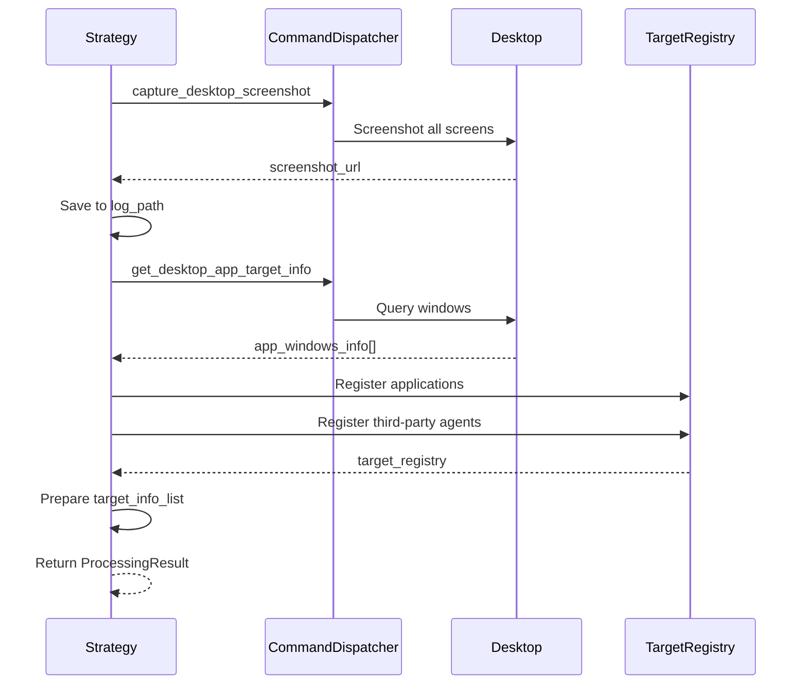
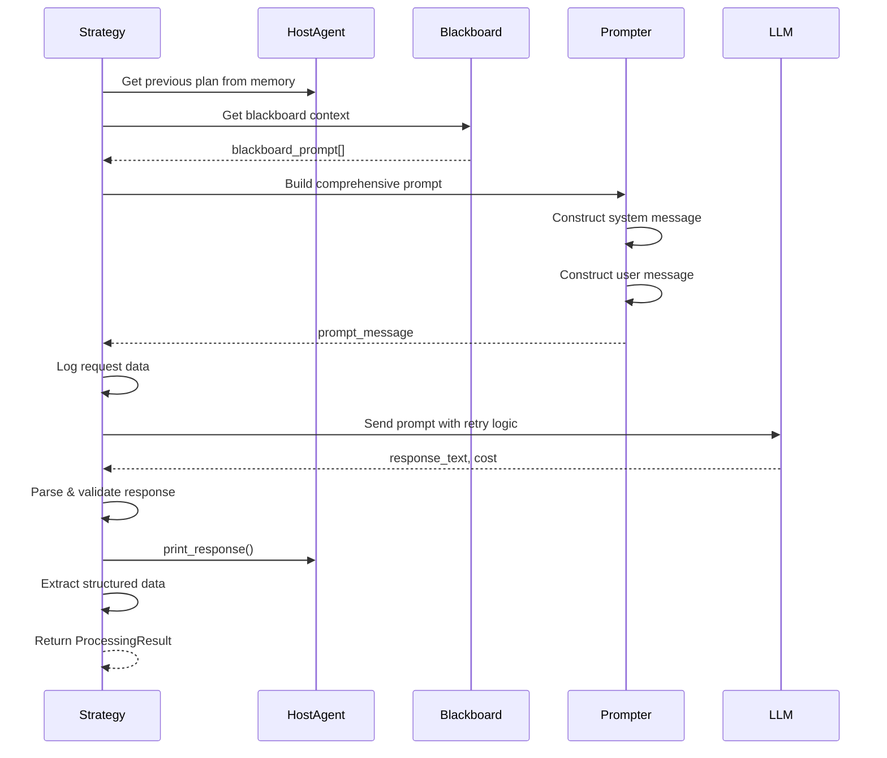
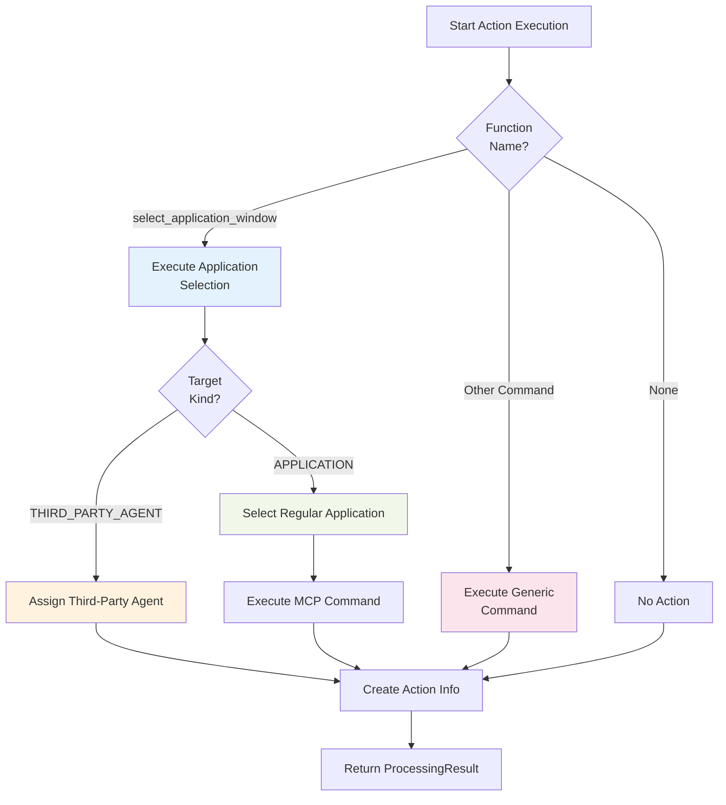
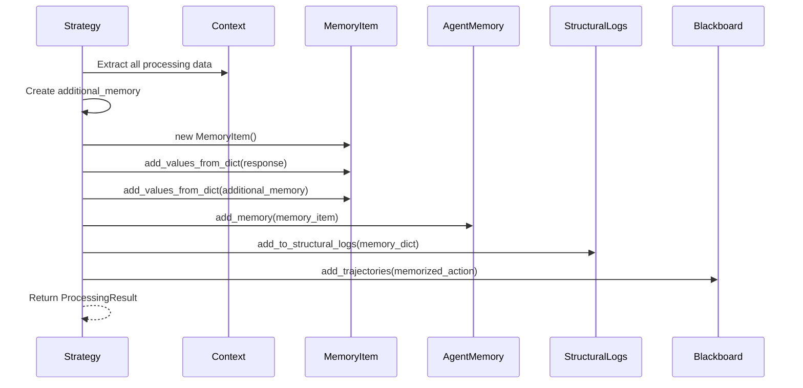

# HostAgent Processing Strategy

HostAgent executes a **4-phase processing pipeline** in **CONTINUE** and **CONFIRM** states. Each phase handles a specific aspect of desktop orchestration: **data collection**, **LLM decision making**, **action execution**, and **memory recording**. This document details the implementation of each strategy based on the actual codebase.

---

## Strategy Assembly

Processing strategies are **assembled and orchestrated** by the `HostAgentProcessor` class defined in `ufo/agents/processors/host_agent_processor.py`. The processor acts as the **coordinator** that initializes, configures, and executes the 4-phase pipeline.

### HostAgentProcessor Overview

The `HostAgentProcessor` extends `ProcessorTemplate` and serves as the main orchestrator for HostAgent workflows:

```python
class HostAgentProcessor(ProcessorTemplate):
    """
    Enhanced processor for Host Agent with comprehensive functionality.
    
    Manages the complete workflow including:
    - Desktop environment analysis and screenshot capture
    - Application window detection and registration
    - Third-party agent integration and management
    - LLM-based decision making with context-aware prompting
    - Action execution including application selection and command dispatch
    - Memory management with detailed logging and state tracking
    """
    
    processor_context_class = HostAgentProcessorContext
    
    def __init__(self, agent: "HostAgent", global_context: Context):
        super().__init__(agent, global_context)
```

### Strategy Registration

During initialization, `HostAgentProcessor._setup_strategies()` registers all four processing strategies:

```python
def _setup_strategies(self) -> None:
    """Configure processing strategies with error handling and logging."""
    
    # Phase 1: Desktop data collection (critical - fail_fast=True)
    self.strategies[ProcessingPhase.DATA_COLLECTION] = (
        DesktopDataCollectionStrategy(
            fail_fast=True  # Desktop data collection is critical
        )
    )
    
    # Phase 2: LLM interaction (critical - fail_fast=True)
    self.strategies[ProcessingPhase.LLM_INTERACTION] = (
        HostLLMInteractionStrategy(
            fail_fast=True  # LLM failure should trigger recovery
        )
    )
    
    # Phase 3: Action execution (graceful - fail_fast=False)
    self.strategies[ProcessingPhase.ACTION_EXECUTION] = (
        HostActionExecutionStrategy(
            fail_fast=False  # Action failures can be handled gracefully
        )
    )
    
    # Phase 4: Memory update (graceful - fail_fast=False)
    self.strategies[ProcessingPhase.MEMORY_UPDATE] = (
        HostMemoryUpdateStrategy(
            fail_fast=False  # Memory update failures shouldn't stop process
        )
    )
```

| Phase | Strategy Class | fail_fast | Rationale |
|-------|---------------|-----------|-----------|
| **DATA_COLLECTION** | `DesktopDataCollectionStrategy` | ✓ True | Desktop screenshot and window info are critical for LLM context |
| **LLM_INTERACTION** | `HostLLMInteractionStrategy` | ✓ True | LLM response failure requires immediate recovery mechanism |
| **ACTION_EXECUTION** | `HostActionExecutionStrategy` | ✗ False | Action failures can be gracefully handled and reported |
| **MEMORY_UPDATE** | `HostMemoryUpdateStrategy` | ✗ False | Memory failures shouldn't block the main execution flow |

**Fail-Fast vs Graceful:**

The `fail_fast` parameter controls error propagation behavior:

- **fail_fast=True**: Errors immediately halt the pipeline and trigger recovery (used for critical phases)
- **fail_fast=False**: Errors are logged but don't stop execution (used for non-critical phases)

### Middleware Configuration

The processor also configures specialized logging middleware:

```python
def _setup_middleware(self) -> None:
    """Set up enhanced middleware chain with comprehensive monitoring."""
    self.middleware_chain = [
        HostAgentLoggingMiddleware(),  # Specialized logging for Host Agent
    ]
```

**HostAgentLoggingMiddleware** provides:

- Round and step progress tracking
- Rich Panel displays with color coding
- Application selection logging
- Detailed error context reporting

---

## Processing Pipeline Architecture



Each phase is implemented as a separate **strategy class** inheriting from `BaseProcessingStrategy`. Strategies declare their dependencies and outputs using `@depends_on` and `@provides` decorators for automatic data flow management.

---

## Phase 1: DATA_COLLECTION

### Strategy: `DesktopDataCollectionStrategy`

**Purpose**: Gather comprehensive desktop environment context for LLM decision making.

```python
@depends_on("command_dispatcher", "log_path", "session_step")
@provides(
    "desktop_screenshot_url",
    "desktop_screenshot_path",
    "application_windows_info",
    "target_registry",
    "target_info_list",
)
class DesktopDataCollectionStrategy(BaseProcessingStrategy):
    """Enhanced strategy for collecting desktop environment data"""
    
    def __init__(self, fail_fast: bool = True):
        super().__init__(name="desktop_data_collection", fail_fast=fail_fast)
```

### Execution Steps



### Step 1: Capture Desktop Screenshot

**Code**:
```python
async def _capture_desktop_screenshot(
    self,
    command_dispatcher: BasicCommandDispatcher,
    save_path: str,
) -> str:
    """Capture desktop screenshot with error handling"""
    result = await command_dispatcher.execute_commands([
        Command(
            tool_name="capture_desktop_screenshot",
            parameters={"all_screens": True},
            tool_type="data_collection",
        )
    ])
    
    desktop_screenshot_url = result[0].result
    utils.save_image_string(desktop_screenshot_url, save_path)
    return desktop_screenshot_url
```

**Outputs**:
- `desktop_screenshot_url`: Base64 encoded screenshot for LLM
- `desktop_screenshot_path`: File path for logging (`action_step{N}.png`)

**Multi-Screen Support:**

The `all_screens: True` parameter captures all connected monitors in a single composite image, providing complete desktop context.

### Step 2: Collect Application Window Information

**Code**:
```python
async def _get_desktop_application_info(
    self, command_dispatcher: BasicCommandDispatcher
) -> List[TargetInfo]:
    """Get comprehensive desktop application information"""
    result = await command_dispatcher.execute_commands([
        Command(
            tool_name="get_desktop_app_target_info",
            parameters={
                "remove_empty": True,
                "refresh_app_windows": True
            },
            tool_type="data_collection",
        )
    ])
    
    app_windows_info = result[0].result or []
    target_info = [TargetInfo(**control_info) for control_info in app_windows_info]
    return target_info
```

**Outputs**:
- List of `TargetInfo` objects containing:
  - `id`: Unique identifier (index-based)
  - `name`: Window title or process name
  - `kind`: Target type (APPLICATION, PROCESS, etc.)
  - `type`: Detailed type information
  - Additional metadata (position, size, state)

**Window Filtering:**

`remove_empty: True` filters out windows without valid handles or titles, reducing noise for LLM decision making.

### Step 3: Register Applications and Third-Party Agents

**Code**:
```python
def _register_applications_and_agents(
    self,
    app_windows_info: List[TargetInfo],
    target_registry: TargetRegistry = None,
) -> TargetRegistry:
    """Register desktop applications and third-party agents"""
    if not target_registry:
        target_registry = TargetRegistry()
    
    # Register desktop application windows
    target_registry.register(app_windows_info)
    
    # Register third-party agents
    third_party_count = self._register_third_party_agents(
        target_registry, len(app_windows_info)
    )
    
    return target_registry

def _register_third_party_agents(
    self, target_registry: TargetRegistry, start_index: int
) -> int:
    """Register enabled third-party agents"""
    third_party_agent_names = ufo_config.system.enabled_third_party_agents
    
    third_party_agent_list = []
    for i, agent_name in enumerate(third_party_agent_names):
        agent_id = str(i + start_index + 1)
        third_party_agent_list.append(
            TargetInfo(
                kind=TargetKind.THIRD_PARTY_AGENT.value,
                id=agent_id,
                type="ThirdPartyAgent",
                name=agent_name,
            )
        )
    
    target_registry.register(third_party_agent_list)
    return len(third_party_agent_list)
```

**Target Registry**:

| Component | Purpose |
|-----------|---------|
| **TargetRegistry** | Centralized registry of all selectable targets |
| **Applications** | Desktop windows (Word, Excel, browser, etc.) |
| **Third-Party Agents** | Custom agents from configuration |
| **Indexing** | Sequential IDs for LLM selection (0, 1, 2, ...) |

**Target Registry Example:**

```json
[
  {"id": "0", "name": "Microsoft Word - Document1", "kind": "APPLICATION"},
  {"id": "1", "name": "Microsoft Excel - Workbook1", "kind": "APPLICATION"},
  {"id": "2", "name": "Chrome - GitHub", "kind": "APPLICATION"},
  {"id": "3", "name": "HardwareAgent", "kind": "THIRD_PARTY_AGENT"}
]
```

### Processing Result

**Outputs**:
```python
ProcessingResult(
    success=True,
    data={
        "desktop_screenshot_url": "data:image/png;base64,...",
        "desktop_screenshot_path": "C:/logs/action_step1.png",
        "application_windows_info": [TargetInfo(...), ...],
        "target_registry": TargetRegistry(...),
        "target_info_list": [{"id": "0", "name": "Word", "kind": "APPLICATION"}, ...]
    },
    phase=ProcessingPhase.DATA_COLLECTION
)
```

---

## Phase 2: LLM_INTERACTION

### Strategy: `HostLLMInteractionStrategy`

**Purpose**: Construct context-aware prompts and obtain LLM decisions for application selection and task decomposition.

```python
@depends_on("target_info_list", "desktop_screenshot_url")
@provides(
    "parsed_response",
    "response_text",
    "llm_cost",
    "prompt_message",
    "subtask",
    "plan",
    "result",
    "host_message",
    "status",
    "question_list",
    "function_name",
    "function_arguments",
)
class HostLLMInteractionStrategy(BaseProcessingStrategy):
    """Enhanced LLM interaction strategy for Host Agent"""
    
    def __init__(self, fail_fast: bool = True):
        super().__init__(name="host_llm_interaction", fail_fast=fail_fast)
```

### Execution Steps



### Step 1: Build Comprehensive Prompt

**Code**:
```python
async def _build_comprehensive_prompt(
    self,
    agent: "HostAgent",
    target_info_list: List[Any],
    desktop_screenshot_url: str,
    prev_plan: List[Any],
    previous_subtasks: List[Any],
    request: str,
    session_step: int,
    request_logger,
) -> Dict[str, Any]:
    """Build comprehensive prompt message"""
    host_agent: "HostAgent" = agent
    
    # Get blackboard context if available
    blackboard_prompt = []
    if not host_agent.blackboard.is_empty():
        blackboard_prompt = host_agent.blackboard.blackboard_to_prompt()
    
    # Build complete prompt message
    prompt_message = host_agent.message_constructor(
        image_list=[desktop_screenshot_url] if desktop_screenshot_url else [],
        os_info=target_info_list,
        plan=prev_plan,
        prev_subtask=previous_subtasks,
        request=request,
        blackboard_prompt=blackboard_prompt,
    )
    
    return prompt_message
```

**Prompt Components**:

| Component | Source | Purpose |
|-----------|--------|---------|
| **System Message** | Prompter template | Define agent role and capabilities |
| **Desktop Screenshot** | Phase 1 | Visual context |
| **Target List** | Phase 1 | Available applications |
| **User Request** | Session context | Original task description |
| **Previous Subtasks** | Session context | Completed steps |
| **Previous Plan** | Agent memory | Future steps from last round |
| **Blackboard** | Shared memory | Inter-agent communication |

**Blackboard Integration:**

The Blackboard provides inter-agent communication by including results from AppAgents in the prompt:

```python
blackboard_prompt = [
    {"role": "user", "content": "Previous result from Word AppAgent: Table data extracted"}
]
```

### Step 2: Get LLM Response with Retry

**Code**:
```python
async def _get_llm_response_with_retry(
    self, host_agent: "HostAgent", prompt_message: Dict[str, Any]
) -> tuple[str, float]:
    """Get LLM response with retry logic for JSON parsing failures"""
    max_retries = ufo_config.system.json_parsing_retry
    
    for retry_count in range(max_retries):
        try:
            # Run synchronous LLM call in thread executor
            loop = asyncio.get_event_loop()
            response_text, cost = await loop.run_in_executor(
                None,
                host_agent.get_response,
                prompt_message,
                AgentType.HOST,
                True,  # use_backup_engine
            )
            
            # Validate response can be parsed as JSON
            host_agent.response_to_dict(response_text)
            
            return response_text, cost
            
        except Exception as e:
            if retry_count < max_retries - 1:
                self.logger.warning(f"Retry {retry_count + 1}/{max_retries}: {e}")
            else:
                raise Exception(f"Failed after {max_retries} attempts: {e}")
```

!!!note "WebSocket Timeout Fix"
    The code uses `run_in_executor` to prevent blocking the event loop during long LLM responses, which could cause WebSocket ping/pong timeouts in MCP connections.

### Step 3: Parse and Validate Response

**Code**:
```python
def _parse_and_validate_response(
    self, host_agent: "HostAgent", response_text: str
) -> HostAgentResponse:
    """Parse and validate LLM response"""
    # Parse response to dictionary
    response_dict = host_agent.response_to_dict(response_text)
    
    # Create structured response object
    parsed_response = HostAgentResponse.model_validate(response_dict)
    
    # Validate required fields
    self._validate_response_fields(parsed_response)
    
    # Print response for user feedback
    host_agent.print_response(parsed_response)
    
    return parsed_response

def _validate_response_fields(self, response: HostAgentResponse):
    """Validate response contains required fields"""
    if not response.observation:
        raise ValueError("Response missing required 'observation' field")
    if not response.thought:
        raise ValueError("Response missing required 'thought' field")
    if not response.status:
        raise ValueError("Response missing required 'status' field")
    
    valid_statuses = ["CONTINUE", "FINISH", "CONFIRM", "ERROR", "ASSIGN"]
    if response.status.upper() not in valid_statuses:
        self.logger.warning(f"Unexpected status value: {response.status}")
```

**HostAgentResponse Structure**:

```python
class HostAgentResponse(BaseModel):
    observation: str           # What the agent sees
    thought: str              # Reasoning process
    current_subtask: str      # Current subtask description
    message: str              # Message for AppAgent
    control_label: str        # Selected target ID
    control_text: str         # Selected target name
    plan: List[str]           # Future subtasks
    status: str               # Next state (ASSIGN/CONTINUE/FINISH/etc.)
    comment: str              # User-facing comment
    questions: List[str]      # Clarification questions
    function: str             # Command to execute
    arguments: Dict[str, Any] # Command arguments
    result: str               # Result description
```

### Processing Result

**Outputs**:
```python
ProcessingResult(
    success=True,
    data={
        "parsed_response": HostAgentResponse(...),
        "response_text": '{"Observation": "...", ...}',
        "llm_cost": 0.025,
        "prompt_message": [...],
        "subtask": "Extract table from Word",
        "plan": ["Create chart in Excel"],
        "host_message": "Starting extraction",
        "status": "ASSIGN",
        "result": "",
        "question_list": [],
        "function_name": "select_application_window",
        "function_arguments": {"id": "0"}
    },
    phase=ProcessingPhase.LLM_INTERACTION
)
```

!!!example "LLM Response Example"
    ```json
    {
      "Observation": "Desktop shows Word with table and Excel empty",
      "Thought": "Need to extract table from Word first before creating chart",
      "Current Sub-Task": "Extract sales table from Word document",
      "Message": "Please extract the table data for chart creation",
      "ControlLabel": "0",
      "ControlText": "Microsoft Word - Sales Report",
      "Plan": ["Extract table", "Create bar chart in Excel"],
      "Status": "ASSIGN",
      "Comment": "Starting data extraction from Word",
      "Questions": [],
      "Function": "select_application_window",
      "Args": {"id": "0"}
    }
    ```

---

## Phase 3: ACTION_EXECUTION

### Strategy: `HostActionExecutionStrategy`

**Purpose**: Execute LLM-decided actions including application selection, third-party agent assignment, and generic command execution.

```python
@depends_on("target_registry", "command_dispatcher")
@provides(
    "execution_result",
    "action_info",
    "selected_target_id",
    "selected_application_root",
    "assigned_third_party_agent",
    "target",
)
class HostActionExecutionStrategy(BaseProcessingStrategy):
    """Enhanced action execution strategy for Host Agent"""
    
    SELECT_APPLICATION_COMMAND: str = "select_application_window"
    
    def __init__(self, fail_fast: bool = False):
        super().__init__(name="host_action_execution", fail_fast=fail_fast)
```

### Execution Flow



### Application Selection

**Code**:
```python
async def _execute_application_selection(
    self,
    parsed_response: HostAgentResponse,
    target_registry: TargetRegistry,
    command_dispatcher: BasicCommandDispatcher,
) -> List[Result]:
    """Execute application selection"""
    target_id = parsed_response.arguments.get("id")
    target = target_registry.get(target_id)
    
    # Handle third-party agent selection
    if target.kind == TargetKind.THIRD_PARTY_AGENT:
        return await self._select_third_party_agent(target)
    # Handle regular application selection
    else:
        return await self._select_regular_application(target, command_dispatcher)
```

#### Third-Party Agent Selection

**Code**:
```python
async def _select_third_party_agent(self, target: TargetInfo) -> List[Result]:
    """Handle third-party agent selection"""
    self.logger.info(f"Assigned third-party agent: {target.name}")
    
    return [
        Result(
            status="success",
            result={
                "id": target.id,
                "name": target.name,
                "type": "third_party_agent",
            },
        )
    ]
```

!!!info "Third-Party Agents"
    Third-party agents are custom agents registered in configuration:
    ```yaml
    enabled_third_party_agents:
      - HardwareAgent
      - NetworkAgent
    ```
    
    They are selected like applications but don't require window management.

#### Regular Application Selection

**Code**:
```python
async def _select_regular_application(
    self, target: TargetInfo, command_dispatcher: BasicCommandDispatcher
) -> List[Result]:
    """Handle regular application selection"""
    execution_result = await command_dispatcher.execute_commands([
        Command(
            tool_name="select_application_window",
            parameters={"id": str(target.id), "name": target.name},
            tool_type="action",
        )
    ])
    
    if execution_result and execution_result[0].result:
        app_root = execution_result[0].result.get("root_name", "")
        self.logger.info(f"Selected application: {target.name}, root: {app_root}")
    
    return execution_result
```

**Window Selection Actions**:
1. Focuses application window
2. Brings window to foreground
3. Retrieves application root name (for AppAgent configuration)
4. Updates global context with window information

### Generic Command Execution

**Code**:
```python
async def _execute_generic_command(
    self,
    parsed_response: HostAgentResponse,
    command_dispatcher: BasicCommandDispatcher,
) -> List[Result]:
    """Execute generic command"""
    function_name = parsed_response.function
    arguments = parsed_response.arguments or {}
    
    execution_result = await command_dispatcher.execute_commands([
        Command(
            tool_name=function_name,
            parameters=arguments,
            tool_type="action",
        )
    ])
    
    return execution_result
```

**Generic Commands:**

- `launch_application`: Start new application
- `close_application`: Terminate application
- `bash_command`: Execute shell command
- Custom MCP tools

### Action Info Creation

**Code**:
```python
def _create_action_info(
    self,
    parsed_response: HostAgentResponse,
    execution_result: List[Result],
    target_registry: TargetRegistry,
    selected_target_id: str,
) -> ActionCommandInfo:
    """Create action information object for memory"""
    target_object = None
    if target_registry and selected_target_id:
        target_object = target_registry.get(selected_target_id)
    
    action_info = ActionCommandInfo(
        function=parsed_response.function,
        arguments=parsed_response.arguments or {},
        target=target_object,
        status=parsed_response.status,
        result=execution_result[0] if execution_result else Result(status="none"),
    )
    
    return action_info
```

**ActionCommandInfo Structure**:

| Field | Type | Description |
|-------|------|-------------|
| `function` | str | Command name executed |
| `arguments` | Dict | Command parameters |
| `target` | TargetInfo | Selected target object |
| `status` | str | Agent status after execution |
| `result` | Result | Execution result |

### Processing Result

**Outputs**:
```python
ProcessingResult(
    success=True,
    data={
        "execution_result": [Result(...)],
        "action_info": ActionCommandInfo(...),
        "target": TargetInfo(...),
        "selected_target_id": "0",
        "selected_application_root": "WINWORD",
        "assigned_third_party_agent": "",
    },
    phase=ProcessingPhase.ACTION_EXECUTION
)
```

---

## Phase 4: MEMORY_UPDATE

### Strategy: `HostMemoryUpdateStrategy`

**Purpose**: Record orchestration step in agent memory, update structural logs, and maintain Blackboard trajectories.

```python
@depends_on("session_step")
@provides("additional_memory", "memory_item", "memory_keys_count")
class HostMemoryUpdateStrategy(BaseProcessingStrategy):
    """Enhanced memory update strategy for Host Agent"""
    
    def __init__(self, fail_fast: bool = False):
        super().__init__(name="host_memory_update", fail_fast=fail_fast)
```

### Execution Steps



### Step 1: Create Additional Memory Data

**Code**:
```python
def _create_additional_memory_data(
    self, agent: "HostAgent", context: ProcessingContext
) -> "HostAgentProcessorContext":
    """Create comprehensive additional memory data"""
    host_context: HostAgentProcessorContext = context.local_context
    
    # Update context with current state
    host_context.session_step = context.get_global(ContextNames.SESSION_STEP.name, 0)
    host_context.round_step = context.get_global(ContextNames.CURRENT_ROUND_STEP.name, 0)
    host_context.round_num = context.get_global(ContextNames.CURRENT_ROUND_ID.name, 0)
    host_context.agent_step = agent.step if agent else 0
    
    action_info: ActionCommandInfo = host_context.action_info
    
    # Update action information
    if action_info:
        host_context.action = [action_info.model_dump()]
        host_context.function_call = action_info.function or ""
        host_context.arguments = action_info.arguments
        host_context.action_representation = action_info.to_representation()
        
        if action_info.result and action_info.result.result:
            host_context.results = str(action_info.result.result)
    
    # Update application and agent names
    host_context.application = host_context.selected_application_root or ""
    host_context.agent_name = agent.name
    
    return host_context
```

**Additional Memory Fields**:

| Field | Description |
|-------|-------------|
| `session_step` | Global session step counter |
| `round_step` | Step within current round |
| `round_num` | Current round number |
| `agent_step` | HostAgent's own step counter |
| `action` | Executed action details |
| `function_call` | Command name |
| `arguments` | Command parameters |
| `action_representation` | Human-readable action description |
| `results` | Execution results |
| `application` | Selected application root |
| `agent_name` | "HostAgent" |

### Step 2: Create and Populate Memory Item

**Code**:
```python
def _create_and_populate_memory_item(
    self,
    parsed_response: HostAgentResponse,
    additional_memory: "HostAgentProcessorContext",
) -> MemoryItem:
    """Create and populate memory item"""
    memory_item = MemoryItem()
    
    # Add response data
    if parsed_response:
        memory_item.add_values_from_dict(parsed_response.model_dump())
    
    # Add additional memory data
    memory_item.add_values_from_dict(additional_memory.to_dict(selective=True))
    
    return memory_item
```

**MemoryItem Contents**:

```python
{
    # From HostAgentResponse
    "observation": "Desktop shows Word and Excel...",
    "thought": "Need to extract table first...",
    "current_subtask": "Extract table from Word",
    "plan": ["Create chart in Excel"],
    "status": "ASSIGN",
    
    # From Additional Memory
    "session_step": 1,
    "round_num": 0,
    "round_step": 0,
    "agent_step": 0,
    "action": [{"function": "select_application_window", ...}],
    "application": "WINWORD",
    "agent_name": "HostAgent",
    ...
}
```

### Step 3: Update Structural Logs

**Code**:
```python
def _update_structural_logs(self, memory_item: MemoryItem, global_context):
    """Update structural logs for debugging"""
    global_context.add_to_structural_logs(memory_item.to_dict())
```

**Structural Logs:**

Structural logs provide machine-readable JSON logs of every agent step for debugging and analysis, replay and reproduction, performance monitoring, and training data collection.

### Step 4: Update Blackboard Trajectories

**Code**:
```python
def _update_blackboard_trajectories(
    self,
    host_agent: "HostAgent",
    memory_item: MemoryItem,
):
    """Update blackboard trajectories"""
    history_keys = ufo_config.system.history_keys
    
    memory_dict = memory_item.to_dict()
    memorized_action = {
        key: memory_dict.get(key) for key in history_keys if key in memory_dict
    }
    
    if memorized_action:
        host_agent.blackboard.add_trajectories(memorized_action)
```

**Blackboard Trajectories**:

```python
# Configuration
history_keys = ["observation", "thought", "current_subtask", "status", "result"]

# Stored in Blackboard
{
    "step_0": {
        "observation": "Desktop shows Word and Excel",
        "thought": "Extract table first",
        "current_subtask": "Extract table",
        "status": "ASSIGN",
        "result": ""
    },
    "step_1": {
        "observation": "Word AppAgent extracted table",
        "thought": "Now create chart in Excel",
        "current_subtask": "Create bar chart",
        "status": "ASSIGN",
        "result": "Table data: [...]"
    }
}
```

**Inter-Agent Communication:**

Blackboard trajectories enable AppAgents to access HostAgent's orchestration history, providing context for their execution.

### Processing Result

**Outputs**:
```python
ProcessingResult(
    success=True,
    data={
        "additional_memory": HostAgentProcessorContext(...),
        "memory_item": MemoryItem(...),
        "memory_keys_count": 25
    },
    phase=ProcessingPhase.MEMORY_UPDATE
)
```

---

## Complete Processing Flow

### Multi-Step Example

**User Request**: "Extract table from Word and create chart in Excel"

**Round 1**: Select Word

| Phase | Key Operations | Outputs |
|-------|----------------|---------|
| DATA_COLLECTION | Capture desktop, list windows | screenshot, [Word, Excel] |
| LLM_INTERACTION | Analyze, select Word | Status=ASSIGN, target_id=0 |
| ACTION_EXECUTION | Select Word window | app_root="WINWORD" |
| MEMORY_UPDATE | Record step | memory_item added |

**Round 2**: Create Excel Chart

| Phase | Key Operations | Outputs |
|-------|----------------|---------|
| DATA_COLLECTION | Capture desktop, list windows | screenshot, [Word, Excel] |
| LLM_INTERACTION | Analyze Word result, select Excel | Status=ASSIGN, target_id=1 |
| ACTION_EXECUTION | Select Excel window | app_root="EXCEL" |
| MEMORY_UPDATE | Record step | memory_item added |

**Round 3**: Verify Completion

| Phase | Key Operations | Outputs |
|-------|----------------|---------|
| DATA_COLLECTION | Capture desktop | screenshot |
| LLM_INTERACTION | Verify chart created | Status=FINISH |
| ACTION_EXECUTION | No action | - |
| MEMORY_UPDATE | Record completion | memory_item added |

---

## Error Handling

### Strategy-Level Error Handling

Each strategy implements robust error handling:

```python
async def execute(self, agent, context) -> ProcessingResult:
    try:
        # Execute strategy logic
        return ProcessingResult(success=True, data={...})
    except Exception as e:
        error_msg = f"{self.name} failed: {str(e)}"
        self.logger.error(error_msg)
        return self.handle_error(e, self.phase, context)
```

**Error Handling Modes**:

| Strategy | `fail_fast` | Behavior |
|----------|-------------|----------|
| DATA_COLLECTION | True | Stop immediately on failure |
| LLM_INTERACTION | True | Stop immediately on failure |
| ACTION_EXECUTION | False | Log error, continue |
| MEMORY_UPDATE | False | Log error, continue |

!!!warning "Critical vs Non-Critical Failures"
    - **Critical** (fail_fast=True): Desktop capture, LLM interaction
    - **Non-Critical** (fail_fast=False): Action execution, memory update
    
    Critical failures prevent further processing, while non-critical failures are logged but don't stop the pipeline.

---

## Performance Considerations

### Async Execution

All strategies use async/await for non-blocking I/O:

```python
# Non-blocking screenshot capture
result = await command_dispatcher.execute_commands([...])

# Non-blocking LLM call (with thread executor)
loop = asyncio.get_event_loop()
response = await loop.run_in_executor(None, llm_call, ...)
```

### Retry Logic

LLM interaction includes automatic retry for transient failures:

```python
max_retries = ufo_config.system.json_parsing_retry  # Default: 3

for retry_count in range(max_retries):
    try:
        response = await get_llm_response(...)
        validate_json(response)
        return response
    except Exception as e:
        if retry_count < max_retries - 1:
            continue
        raise
```

### Caching

Target registry can be reused across rounds:

```python
existing_target_registry = context.get_local("target_registry")
target_registry = self._register_applications_and_agents(
    app_windows_info, existing_target_registry
)
```

---

## Related Documentation

**Architecture & Design:**

- **[Overview](overview.md)**: HostAgent high-level architecture
- **[State Machine](state.md)**: When strategies are executed
- **[Processor Framework](../../infrastructure/agents/design/processor.md)**: General processor architecture

**System Integration:**

- **[Command System](commands.md)**: Available desktop commands
- **[Blackboard](../../infrastructure/agents/design/blackboard.md)**: Inter-agent communication
- **[Memory System](../../infrastructure/agents/design/memory.md)**: Memory management

---

## Summary

**Key Takeaways:**

- **4 Phases**: DATA_COLLECTION → LLM_INTERACTION → ACTION_EXECUTION → MEMORY_UPDATE
- **Desktop Context**: Capture screenshot + application list
- **LLM Decision**: Select application, decompose task, set status
- **Action Types**: Application selection, third-party agent assignment, generic commands
- **Memory Persistence**: Record every step for context and replay
- **Blackboard Integration**: Share trajectories with AppAgents
- **Error Resilience**: Retry logic, fail-fast configuration, graceful degradation

**Next Steps:**

- Read [Command System](commands.md) for available desktop operations
- Read [State Machine](state.md) to understand when processing occurs
- Read [Blackboard](../../infrastructure/agents/design/blackboard.md) for inter-agent communication
- Learn [Creating Third-Party Agents](../../tutorials/creating_third_party_agents.md) to build custom agents
