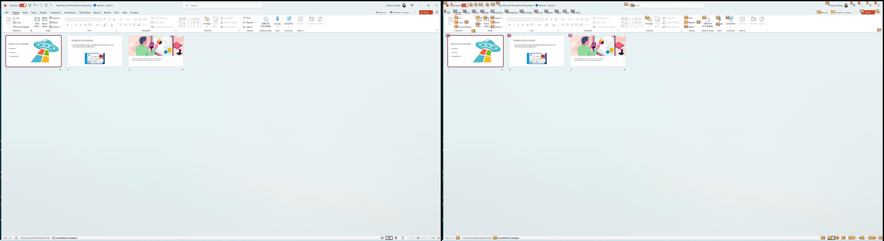
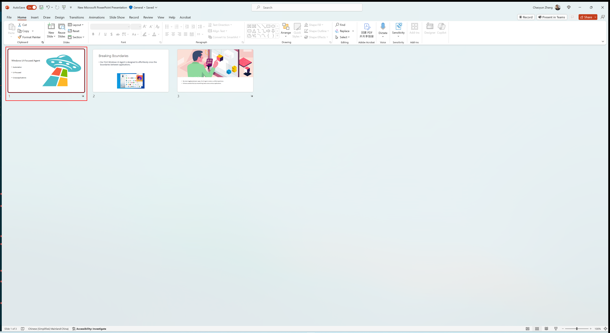

# Screenshot Logs

UFO also save desktop or application screenshots for debugging and evaluation purposes. The screenshot logs are stored in the `logs/{task_name}/`.

There are 4 types of screenshot logs generated by UFO, as detailed below.

## Clean Screenshots
At each step, UFO saves a clean screenshot of the desktop or application. The clean screenshot is saved in the `action_step{step_number}.png` file. In addition, the clean screenshots are also saved when a sub-task, round or session is completed. The clean screenshots are saved in the `action_round_{round_id}_sub_round_{sub_task_id}_final.png`, `action_round_{round_id}_final.png` and `action_step_final.png` files, respectively. Below is an example of a clean screenshot.

<h1 align="center">
    
</h1>

## Annotation Screenshots
UFO also saves annotated screenshots of the application, with each control item is annotated with a number, following the [Set-of-Mark](https://arxiv.org/pdf/2310.11441) paradigm. The annotated screenshots are saved in the `action_step{step_number}_annotated.png` file. Below is an example of an annotated screenshot.

<h1 align="center">
    
</h1>

!!!info
    Only selected types of controls are annotated in the screenshots. They are configured in the `config_dev.yaml` file under the `CONTROL_LIST` field.

!!!tip
    Different types of controls are annotated with different colors. You can configure the colors in the `config_dev.yaml` file under the `ANNOTATION_COLORS` field.

## Concatenated Screenshots
UFO also saves concatenated screenshots of the application, with clean and annotated screenshots concatenated side by side. The concatenated screenshots are saved in the `action_step{step_number}_concat.png` file. Below is an example of a concatenated screenshot.

<h1 align="center">
    
</h1>

!!!info
    You can configure whether to feed the concatenated screenshots to the LLMs, or separate clean and annotated screenshots, in the `config_dev.yaml` file under the `CONCAT_SCREENSHOT` field.

## Selected Control Screenshots
UFO saves screenshots of the selected control item for operation. The selected control screenshots are saved in the `action_step{step_number}_selected_controls.png` file. Below is an example of a selected control screenshot.

<h1 align="center">
    
</h1>

!!!info
    You can configure whether to feed LLM with the selected control screenshots at the previous step to enhance the context, in the `config_dev.yaml` file under the `INCLUDE_LAST_SCREENSHOT` field.