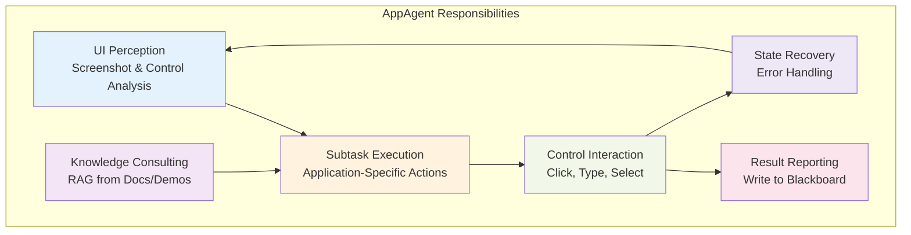
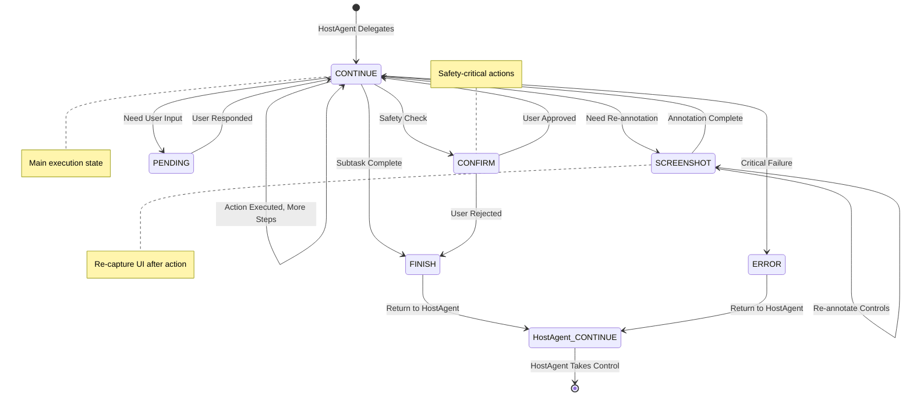
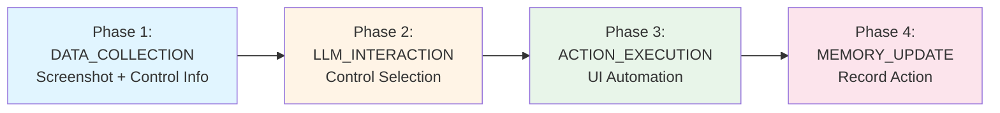
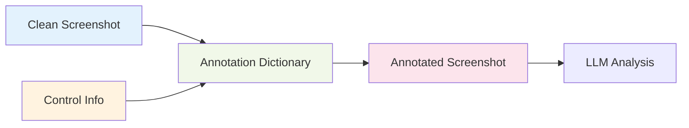
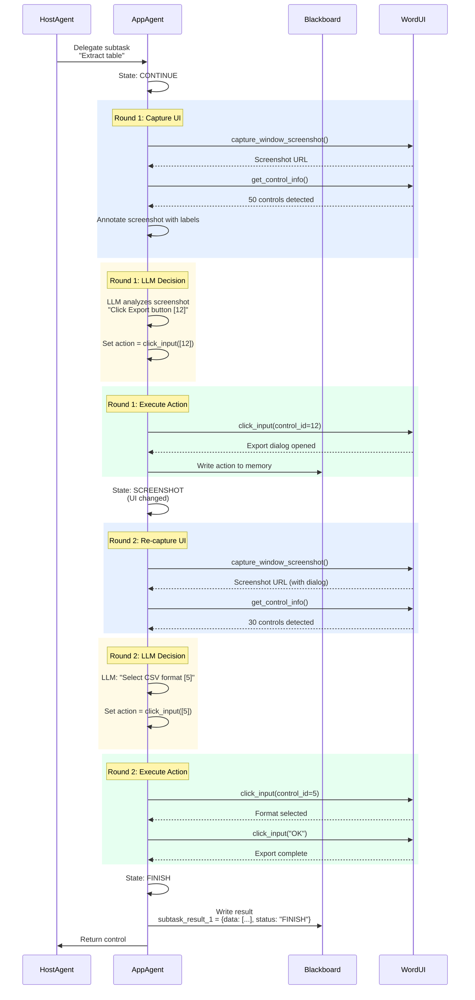

# AppAgent: Application Automation Agent

!!!quote "The UI Automation and Control Interaction Agent"
    **AppAgent** is the application-level automation agent in the Windows Agent Module. It executes subtasks within specific applications through UI automation, interacts with application controls, and returns results to HostAgent via the Blackboard. AppAgent operates with a 6-state finite state machine and 4-phase processing pipeline optimized for UI interaction.

---

## Overview

### Role and Responsibilities

An `AppAgent` is responsible for iteratively executing actions on the selected applications until the task is successfully concluded within a specific application. The `AppAgent` is created by the `HostAgent` to fulfill a sub-task within a `Round`. The `AppAgent` is responsible for executing the necessary actions within the application to fulfill the user's request. The `AppAgent` has the following features:

1. **[ReAct](https://arxiv.org/abs/2210.03629) with the Application** - The `AppAgent` recursively interacts with the application in a workflow of observation→thought→action, leveraging the multi-modal capabilities of Visual Language Models (VLMs) to comprehend the application UI and fulfill the user's request.
2. **Comprehension Enhancement** - The `AppAgent` is enhanced by Retrieval Augmented Generation (RAG) from heterogeneous sources, including external knowledge bases, and demonstration libraries, making the agent an application "expert".
3. **Versatile Skill Set** - The `AppAgent` is equipped with a diverse set of skills to support comprehensive automation, such as mouse, keyboard, native APIs, and "Copilot".



| Responsibility | Description | Example |
|---------------|-------------|---------|
| **UI Perception** | Capture screenshot, detect controls, annotate UI elements | Take screenshot → Detect 50 controls → Annotate with labels |
| **Subtask Execution** | Execute specific subtask delegated by HostAgent | "Extract table data from this document" |
| **Control Interaction** | Interact with UI controls (buttons, textboxes, menus) | Click "Export" button → Type filename → Select format |
| **Result Reporting** | Write execution results back to Blackboard | Write extracted data to `subtask_result_1` |
| **Knowledge Consulting** | Retrieve help docs, online search, demonstrations | Query "how to export table in Word" → Use retrieved steps |
| **State Recovery** | Handle errors, retry failed actions, request confirmation | Action failed → Retry 3 times → Request user help |

!!!info "Hierarchical Position"
    **AppAgent** is the **child** agent that:
    
    - Lives only during subtask execution
    - Receives delegation from HostAgent (parent)
    - Operates within a single application window
    - Reports results via shared Blackboard
    - Returns control to HostAgent when done

!!! tip
    You can find how to enhance the `AppAgent` with external knowledge bases and demonstration libraries in the [Reinforcing AppAgent](../../advanced_usage/reinforce_appagent/overview.md) documentation.

We show the framework of the `AppAgent` in the following diagram:

<h1 align="center">
    
</h1>

---

## Architecture Components

### 1. State Machine (6 States)

AppAgent uses a finite state machine with 6 possible states:



#### State Details

| State | Purpose | Processor Executed | Duration | Transitions | Returns to HostAgent |
|-------|---------|-------------------|----------|-------------|---------------------|
| **CONTINUE** | Main execution - interact with UI controls | ✅ Yes (4 phases) | Single action | CONTINUE / SCREENSHOT / FINISH / CONFIRM / PENDING / ERROR | ❌ No |
| **SCREENSHOT** | Re-capture and re-annotate UI after control changes | ✅ Yes (same as CONTINUE) | Single capture | SCREENSHOT / CONTINUE | ❌ No |
| **FINISH** | Subtask completed successfully | ❌ No | Immediate | HostAgent.CONTINUE | ✅ Yes |
| **PENDING** | Await user input for clarification | ✅ Yes (ask user) | Until user responds | CONTINUE | ❌ No |
| **CONFIRM** | Request user approval for safety-critical action | ✅ Yes (present dialog) | Until user decides | CONTINUE / FINISH | ❌ No |
| **ERROR** | Unhandled exception or critical failure | ❌ No | Immediate | HostAgent.CONTINUE | ✅ Yes |

The state machine diagram for the `AppAgent` is also shown below:
<h1 align="center">
     
</h1>

!!!tip "State Transition Control"
    The **LLM** controls most state transitions by setting `agent.status` in the **LLM_INTERACTION** phase:
    
    ```json
    {
      "Observation": "Table with 50 rows visible, Export button at label [12]",
      "Thought": "I should click the Export button to export the table data",
      "ControlLabel": "12",
      "ControlText": "Export",
      "Function": "click_input",
      "Args": {"button": "left", "double": false},
      "Status": "CONTINUE",
      "Comment": "Clicking Export button to save table data"
    }
    ```

---

### 2. Processing Pipeline (4 Phases)

AppAgent executes a 4-phase pipeline in **CONTINUE** and **SCREENSHOT** states:



| Phase | Strategies | Purpose | Key Outputs |
|-------|-----------|---------|-------------|
| **Phase 1** | `AppScreenshotCaptureStrategy` + `AppControlInfoStrategy` | Capture UI and detect controls | Screenshot, control list, annotations |
| **Phase 2** | `AppLLMInteractionStrategy` | LLM analyzes UI and selects control | Selected control, action, arguments, status |
| **Phase 3** | `AppActionExecutionStrategy` | Execute action on selected control | Action result, success/failure |
| **Phase 4** | `AppMemoryUpdateStrategy` | Record action in memory and Blackboard | Memory item, Blackboard updated |

!!!info "Composed Strategy for Data Collection"
    Phase 1 uses a **ComposedStrategy** that executes two strategies sequentially:
    
    1. **AppScreenshotCaptureStrategy**: Captures clean + desktop screenshots
    2. **AppControlInfoStrategy**: Detects controls via UIA/OmniParser, creates annotations
    
    This ensures screenshot and control data are available together for LLM analysis.

---

### 3. UI Control Detection

AppAgent supports multiple control detection backends:

=== "UIA (UI Automation)"

    **Windows UI Automation API** - Native control detection
    
    | Aspect | Details |
    |--------|---------|
    | **Technology** | Microsoft UI Automation (UIA) API |
    | **Control Types** | Button, Edit, ComboBox, DataGrid, MenuItem, etc. |
    | **Properties Captured** | Name, Type, Rectangle, ClassName, AutomationId |
    | **Advantages** | Native, accurate, fast, works with most apps |
    | **Limitations** | May miss custom controls or web content |
    
    ```python
    # UIA control detection
    result = await command_dispatcher.execute_commands([
        Command(
            tool_name="get_control_info",
            parameters={"field_list": ["name", "type", "rect", "class_name"]},
            tool_type="data_collection",
        )
    ])
    
    # Example output
    controls = [
        {
            "id": "1",
            "name": "Export",
            "type": "Button",
            "rect": [100, 200, 150, 230],
            "class_name": "Button",
        },
        ...
    ]
    ```

=== "OmniParser"

    **Vision-based control detection** - Grounding model for visual elements
    
    | Aspect | Details |
    |--------|---------|
    | **Technology** | OmniParser grounding model (vision-based) |
    | **Detection Method** | Analyzes screenshot to detect visual elements |
    | **Control Types** | Any visible UI element (icons, images, custom controls) |
    | **Advantages** | Detects controls UIA misses (icons, web content) |
    | **Limitations** | Requires external service, slower than UIA |
    
    ```python
    # OmniParser control detection
    grounding_service = OmniParser(endpoint="http://localhost:5000")
    grounding_controls = await grounding_service.detect_controls(
        screenshot_path="action_step1.png"
    )
    
    # Example output
    controls = [
        {
            "id": "omni_1",
            "name": "Search icon",
            "type": "icon",
            "bbox": [50, 10, 70, 30],
            "confidence": 0.95,
        },
        ...
    ]
    ```

=== "Hybrid (UIA + OmniParser)"

    **Best of both worlds** - Merge UIA and OmniParser results
    
    | Aspect | Details |
    |--------|---------|
    | **Approach** | Run both UIA and OmniParser, merge results |
    | **Merging Logic** | Deduplicate overlapping controls, keep both unique ones |
    | **Advantages** | Maximum coverage - native controls + visual elements |
    | **Configuration** | Set `control_backend: ["uia", "omniparser"]` |
    
    ```python
    # Hybrid detection
    merged_controls = self._collect_merged_control_list(
        uia_controls, omniparser_controls
    )
    
    # Merging deduplicates by overlap
    # Final count: 45 UIA + 12 OmniParser - 3 duplicates = 54 total
    ```

!!!warning "Configuration Required"
    Set control detection backend in `config/ufo/app_agent_config.yaml`:
    
    ```yaml
    system:
      control_backend:
        - "uia"  # Windows UI Automation
        - "omniparser"  # Vision-based detection
      
      omniparser:
        ENDPOINT: "http://localhost:5000"  # OmniParser service URL
    ```

---

### 4. Screenshot Annotation

AppAgent annotates screenshots with control labels using the **Set-of-Mark** paradigm:

<h1 align="center">
    
</h1>



**Annotation Process:**

1. **Clean Screenshot**: Capture raw application window
2. **Control Detection**: Detect controls via UIA/OmniParser
3. **Label Assignment**: Assign numeric labels [1], [2], [3]...
4. **Overlay Rendering**: Draw labels on screenshot
5. **LLM Context**: Provide annotated screenshot + control list to LLM

**Annotation Dictionary Example:**
```python
annotation_dict = {
    "1": TargetInfo(id="1", name="Export", type="Button", rect=[100, 200, 150, 230]),
    "2": TargetInfo(id="2", name="File Name", type="Edit", rect=[100, 250, 300, 280]),
    "3": TargetInfo(id="3", name="Format", type="ComboBox", rect=[100, 300, 200, 330]),
    ...
}
```

!!!tip "Screenshot Configuration"
    ```yaml
    # config/ufo/app_agent_config.yaml
    system:
      CONCAT_SCREENSHOT: true  # Concatenate clean + annotated
      INCLUDE_LAST_SCREENSHOT: true  # Include previous step screenshot
      save_ui_tree: true  # Save UI tree JSON for debugging
    ```

---

## Input and Output

### AppAgent Input

To interact with the application, the `AppAgent` receives the following inputs:

| Input | Description | Type |
| --- | --- | --- |
| User Request | The user's request in natural language | String |
| Sub-Task | The sub-task description assigned by `HostAgent` | String |
| Current Application | The name of the application to interact with | String |
| Control Information | Index, name, type of available controls | List of TargetInfo |
| Application Screenshots | Clean, annotated, and previous step screenshots | List of URLs |
| Previous Sub-Tasks | Previous sub-tasks and their completion status | List of Dicts |
| Previous Plan | The previous plan for following steps | List of Strings |
| HostAgent Message | Message from `HostAgent` for subtask completion | String |
| Retrieved Information | Info from external knowledge bases or demos | String |
| Blackboard | Shared memory space for inter-agent communication | Dictionary |

By processing these inputs, the `AppAgent` determines the necessary actions to fulfill the user's request within the application.

!!! tip
    Whether to concatenate the clean screenshot and annotated screenshot can be configured in the `CONCAT_SCREENSHOT` field in the `config_dev.yaml` file.

!!! tip
     Whether to include the screenshot with a rectangle around the selected control at the previous step can be configured in the `INCLUDE_LAST_SCREENSHOT` field in the `config_dev.yaml` file.

### AppAgent Output

With the inputs provided, the `AppAgent` generates the following outputs:

| Output | Description | Type |
| --- | --- | --- |
| Observation | The observation of the current application screenshots | String |
| Thought | The logical reasoning process of the `AppAgent` | String |
| ControlLabel | The index of the selected control to interact with | String |
| ControlText | The name of the selected control to interact with | String |
| Function | The function to be executed on the selected control | String |
| Args | The arguments required for the function execution | Dict |
| Status | The status of the agent, mapped to `AgentState` | String |
| Plan | The plan for the following steps after the current action | List of Strings |
| Comment | Additional comments or information for the user | String |
| SaveScreenshot | Flag to save screenshot to `blackboard` for future reference | Boolean |

Below is an example of the `AppAgent` output:

```json
{
    "Observation": "Word document with table containing 50 rows and 3 columns. Export button visible at label [12].",
    "Thought": "To extract the table data, I should click the Export button to initiate the export process.",
    "ControlLabel": "12",
    "ControlText": "Export",
    "Function": "click_input",
    "Args": {"button": "left", "double": false},
    "Status": "CONTINUE",
    "Plan": ["Click Export", "Select format", "Choose save location", "Confirm export"],
    "Comment": "Initiating table export process",
    "SaveScreenshot": false
}
```

!!! info
    The `AppAgent` output is formatted as a JSON object by LLMs and can be parsed by the `json.loads` method in Python.

---

## Knowledge Enhancement

The `AppAgent` is enhanced by Retrieval Augmented Generation (RAG) from heterogeneous sources, including external knowledge bases and demonstration libraries. The `AppAgent` leverages this knowledge to enhance its comprehension of the application and learn from demonstrations to improve its performance.

### Learning from Help Documents

User can provide help documents to the `AppAgent` to enhance its comprehension of the application and improve its performance in the `config.yaml` file. 

```python
# Build offline docs retriever
def build_offline_docs_retriever(self) -> None:
    """Build the offline docs retriever."""
    self.offline_doc_retriever = self.retriever_factory.create_retriever(
        "offline", self._app_root_name
    )

# Retrieve relevant documents
offline_docs = self.offline_doc_retriever.retrieve(
    request="How to export table in Word",
    top_k=3,
    filter=None,
)

# Construct prompt with retrieved docs
offline_docs_prompt = self.prompter.retrieved_documents_prompt_helper(
    "[Help Documents]",
    "",
    [format_string.format(
        question=doc.metadata.get("title", ""),
        answer=doc.metadata.get("text", ""),
    ) for doc in offline_docs],
)
```

!!! tip
    Please find details configuration in the [documentation](../../configurations/field_reference.md). 

### Learning from Bing Search

Since help documents may not cover all the information or the information may be outdated, the `AppAgent` can also leverage Bing search to retrieve the latest information.

```python
# Build online search retriever
def build_online_search_retriever(self, request: str, top_k: int) -> None:
    """Build the online search retriever."""
    self.online_doc_retriever = self.retriever_factory.create_retriever(
        "online", request, top_k
    )

# Retrieve online search results
online_search_docs = self.online_doc_retriever.retrieve(
    request="How to export table in Word 2024",
    top_k=5,
    filter=None
)

# Construct prompt with search results
online_docs_prompt = self.prompter.retrieved_documents_prompt_helper(
    "Online Search Results",
    "Search Result",
    [doc.page_content for doc in online_search_docs],
)
```

!!! tip
    Please find details configuration in the [documentation](../../configurations/field_reference.md).

### Learning from Self-Demonstrations

You may save successful action trajectories in the `AppAgent` to learn from self-demonstrations and improve its performance.

```python
# Build experience retriever
def build_experience_retriever(self, db_path: str) -> None:
    """Build the experience retriever."""
    self.experience_retriever = self.retriever_factory.create_retriever(
        "experience", db_path
    )

# Retrieve experience examples
def rag_experience_retrieve(self, request: str, experience_top_k: int) -> List[Dict]:
    """Retrieve experience examples for the user request."""
    experience_docs = self.experience_retriever.retrieve(
        request,
        experience_top_k,
        filter=lambda x: self._app_root_name.lower() in [
            app.lower() for app in x["app_list"]
        ],
    )
    
    retrieved_docs = []
    for doc in experience_docs:
        retrieved_docs.append({
            "Request": doc.metadata.get("request", ""),
            "Response": doc.metadata.get("example", {}),
            "Sub-task": doc.metadata.get("Sub-task", ""),
            "Tips": doc.metadata.get("Tips", ""),
        })
    
    return retrieved_docs
```

!!! tip
     You can find details of the configuration in the [documentation](../../configurations/field_reference.md).

### Learning from Human Demonstrations

In addition to self-demonstrations, you can also provide human demonstrations to the `AppAgent` using the [Step Recorder](https://support.microsoft.com/en-us/windows/record-steps-to-reproduce-a-problem-46582a9b-620f-2e36-00c9-04e25d784e47) tool built in the Windows OS.

```python
# Build human demonstration retriever
def build_human_demonstration_retriever(self, db_path: str) -> None:
    """Build the human demonstration retriever."""
    self.human_demonstration_retriever = self.retriever_factory.create_retriever(
        "demonstration", db_path
    )

# Retrieve demonstration examples
def rag_demonstration_retrieve(self, request: str, demonstration_top_k: int) -> List[Dict]:
    """Retrieve demonstration examples for the user request."""
    demonstration_docs = self.human_demonstration_retriever.retrieve(
        request, demonstration_top_k
    )
    
    retrieved_docs = []
    for doc in demonstration_docs:
        retrieved_docs.append({
            "Request": doc.metadata.get("request", ""),
            "Response": doc.metadata.get("example", {}),
            "Sub-task": doc.metadata.get("Sub-task", ""),
            "Tips": doc.metadata.get("Tips", ""),
        })
    
    return retrieved_docs
```

!!! tip
    You can find details of the configuration in the [documentation](../../configurations/field_reference.md).

---

## Skill Set for Automation

The `AppAgent` is equipped with a versatile skill set to support comprehensive automation within the application. The skills include:

| Skill | Description | Technologies |
| --- | --- | --- |
| **UI Automation** | Mimicking user interactions with application UI controls | UI Automation API, Win32 API |
| **Native API** | Accessing the application's native API to execute specific functions | COM Automation, Application APIs |
| **In-App Agent** | Leveraging the in-app agent (e.g., Copilot) to interact with internal features | Microsoft Copilot integration |

By utilizing these skills, the `AppAgent` can efficiently interact with the application and fulfill the user's request. You can find more details in the [Automator](../../automator/overview.md) documentation and the code in the `ufo/automator` module.

---

## Complete Workflow Example

### Single-Application Subtask

**HostAgent delegates:** "Extract the table data from the Word document"



---

## Error Handling and Recovery

### Retry Mechanism

```python
class AppActionExecutionStrategy(BaseProcessingStrategy):
    async def execute(self, agent, context):
        max_retries = 3
        retry_count = 0
        
        while retry_count < max_retries:
            try:
                result = await self._execute_action(command)
                if result.status == ResultStatus.SUCCESS:
                    return ProcessingResult(success=True, data=result)
                retry_count += 1
                await asyncio.sleep(1)  # Wait before retry
            except Exception as e:
                retry_count += 1
                if retry_count >= max_retries:
                    return self.handle_error(e, context)
```

### Safety Confirmation

```python
@AppAgentStateManager.register
class ConfirmAppAgentState(AppAgentState):
    """Request user confirmation for safety-critical actions"""
    
    async def handle(self, agent, context):
        # If safe guard disabled, proceed automatically
        if not ufo_config.system.safe_guard:
            await agent.process_resume()
            self._confirm = True
            return
        
        # Ask user for confirmation
        self._confirm = agent.process_confirmation()
        
        if self._confirm:
            await agent.process_resume()  # User approved
        # else: User rejected, transition to FINISH
```

---

## Related Documentation

!!!info "Deep Dive"
    - **[AppAgent States](states/app_agent_states.md)**: Detailed state machine documentation
    - **[AppAgent Strategies](strategies/app_agent_strategies.md)**: Processing strategy implementations
    - **[UI Commands](commands/ui_commands.md)**: MCP command reference for UI automation

!!!info "Architecture"
    - **[Windows Agent Overview](overview.md)**: Module architecture and hierarchy
    - **[HostAgent](host_agent.md)**: Task orchestration agent
    - **[State Layer](../design/state.md)**: FSM design principles
    - **[Strategy Layer](../design/processor.md)**: Processor framework

!!!info "System Integration"
    - **[Automator Module](../../automator/overview.md)**: UI automation implementation
    - **[RAG System](../../advanced_usage/reinforce_appagent/overview.md)**: Knowledge enhancement
    - **[Blackboard](../design/blackboard.md)**: Inter-agent communication
    - **[Memory System](../design/memory.md)**: Execution history

---

## API Reference

:::agents.agent.app_agent.AppAgent

---

## Summary

!!!success "AppAgent Key Characteristics"
    ✅ **Executor**: Executes subtasks within specific applications
    
    ✅ **Application-Scoped**: Operates within single application window
    
    ✅ **6-State FSM**: CONTINUE → SCREENSHOT → CONTINUE → FINISH → HostAgent
    
    ✅ **4-Phase Pipeline**: DATA_COLLECTION (Screenshot + Controls) → LLM → ACTION → MEMORY
    
    ✅ **UI Automation**: Multi-backend control detection (UIA + OmniParser)
    
    ✅ **Knowledge-Enhanced**: RAG from help docs, Bing search, demonstrations
    
    ✅ **Result Reporter**: Writes execution results to Blackboard for HostAgent

**Next Steps:**

1. **Study Strategies**: Read [AppAgent Strategies](strategies/app_agent_strategies.md) for processing details
2. **Explore States**: Review [AppAgent States](states/app_agent_states.md) for state machine details
3. **Learn Commands**: Check [UI Commands](commands/ui_commands.md) for available operations
4. **RAG Enhancement**: See [Reinforcing AppAgent](../../advanced_usage/reinforce_appagent/overview.md) for knowledge integration