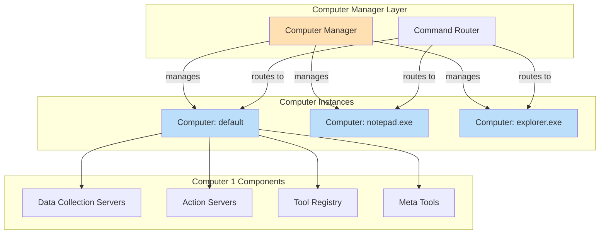
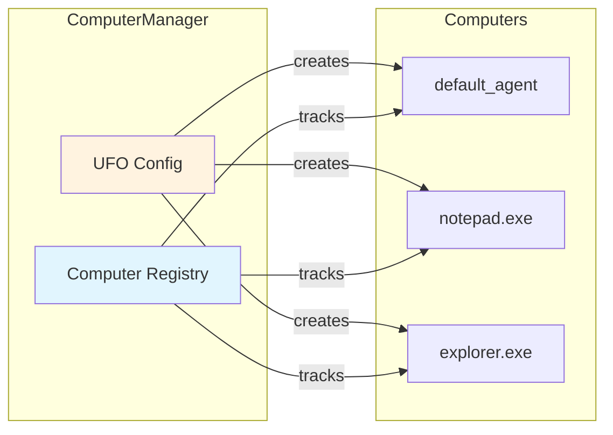
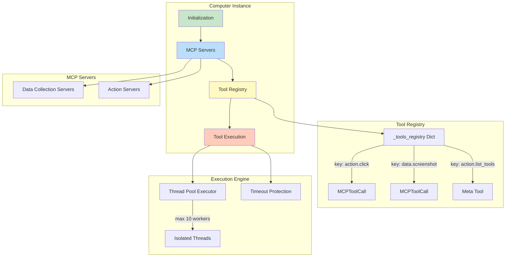
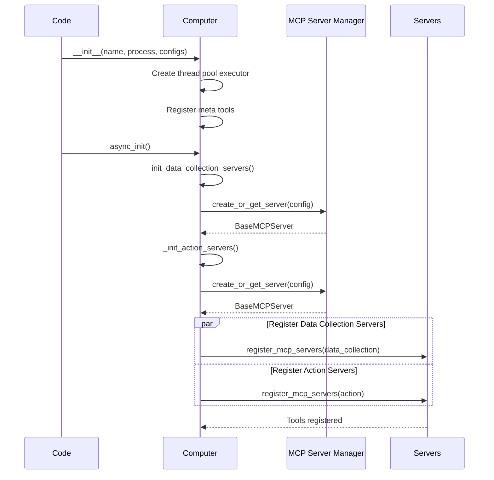

# 🖥️ Computer Manager & Computer

!!!quote "Multi-Namespace Tool Execution"
    The **Computer Manager** orchestrates multiple **Computer** instances, each representing an isolated execution namespace with dedicated MCP servers and tools. This enables context-specific tool routing and fine-grained control over data collection vs. action execution.

---

## 📋 Overview

!!!info "Two-Layer Architecture"
    The Computer layer consists of two components working together:
    
    - **ComputerManager**: High-level orchestrator managing multiple Computer instances
    - **Computer**: Individual execution namespace with its own MCP servers and tool registry

### Computer Manager Responsibilities

| Capability | Description | Implementation |
|------------|-------------|----------------|
| **Multi-Computer Management** | Create and manage multiple Computer instances | Per-process, per-agent namespaces |
| **Namespace Isolation** | Separate tool namespaces for different contexts | Independent MCP servers per Computer |
| **Command Routing** | Route commands to appropriate Computer instances | CommandRouter resolves by agent/process/root |
| **MCP Server Configuration** | Configure data collection and action servers | Config-driven server initialization |
| **Lifecycle Management** | Initialize, reset, and tear down Computers | Async initialization, cascading reset |

### Computer (Instance) Responsibilities

| Capability | Description | Implementation |
|------------|-------------|----------------|
| **Tool Registry** | Maintain registry of available MCP tools | `_tools_registry` dict |
| **Tool Execution** | Execute MCP tool calls with timeout protection | Thread pool isolation (max 10 workers) |
| **Server Management** | Manage data collection and action MCP servers | Separate namespaces |
| **Meta Tools** | Provide built-in tools (list_tools, etc.) | Decorated meta tool methods |
| **Async Initialization** | Initialize MCP servers asynchronously | `async_init()` |

**Architectural Relationship:**



---

## 🏗️ Computer Manager Architecture

### Computer Instance Management



**Computer Namespaces:**

| Namespace Type | Purpose | Example |
|----------------|---------|---------|
| **Data Collection** | Gathering information, non-invasive queries | Screenshots, UI element detection, app state |
| **Action** | Performing actions, invasive operations | GUI automation, file operations, app control |

!!!success "Separation of Concerns"
    Data collection tools can't modify state, while action tools have full control. This prevents accidental state changes during information gathering.

---

## 🖥️ Computer (Instance) Architecture

### Internal Structure



**Key Attributes:**

| Attribute | Type | Purpose |
|-----------|------|---------|
| `_name` | `str` | Computer name (identifier) |
| `_process_name` | `str` | Associated process (e.g., "notepad.exe") |
| `_data_collection_servers` | `Dict[str, BaseMCPServer]` | Namespace → MCP server mapping (data collection) |
| `_action_servers` | `Dict[str, BaseMCPServer]` | Namespace → MCP server mapping (actions) |
| `_tools_registry` | `Dict[str, MCPToolCall]` | Tool key → tool info mapping |
| `_meta_tools` | `Dict[str, Callable]` | Built-in meta tools |
| `_executor` | `ThreadPoolExecutor` | Thread pool for tool execution (10 workers) |
| `_tool_timeout` | `int` | Tool execution timeout: **6000 seconds (100 minutes)** |

!!!warning "Tool Timeout: 100 Minutes"
    Based on source code: `self._tool_timeout = 6000` (6000 seconds = 100 minutes). This allows very long-running operations but prevents indefinite hangs.

---

## 🚀 Initialization

### Computer Manager Initialization

!!!example "Creating Computer Manager"
    ```python
    from ufo.client.computer import ComputerManager
    from ufo.client.mcp.mcp_server_manager import MCPServerManager
    from config.config_loader import get_ufo_config
    
    # 1. Get UFO configuration
    ufo_config = get_ufo_config()
    
    # 2. Initialize MCP server manager
    mcp_server_manager = MCPServerManager()
    
    # 3. Create computer manager
    computer_manager = ComputerManager(
        ufo_config.to_dict(),
        mcp_server_manager
    )
    ```

### Computer Instance Initialization

!!!example "Computer Async Initialization"
    ```python
    computer = Computer(
        name="default_agent",
        process_name="explorer.exe",
        mcp_server_manager=mcp_server_manager,
        data_collection_servers_config=[...],
        action_servers_config=[...]
    )
    
    # Async initialization (required)
    await computer.async_init()
    ```

**Initialization Flow:**



**Configuration Example:**

```yaml
data_collection_servers:
  - namespace: screenshot_collector
    type: local
    module: ufo.client.mcp.local_servers.screenshot_server
    reset: false
  - namespace: ui_collector
    type: local
    module: ufo.client.mcp.local_servers.ui_server
    reset: false

action_servers:
  - namespace: gui_automator
    type: local
    module: ufo.client.mcp.local_servers.automation_server
    reset: false
```

---

## 🔀 Command Routing

### CommandRouter

!!!info "Smart Command Resolution"
    The CommandRouter resolves which Computer instance should handle each command based on agent/process/root context.

**Routing Signature:**

```python
async def execute(
    self,
    agent_name: str,
    process_name: str,
    root_name: str,
    commands: List[Command]
) -> List[Result]
```

**Routing Logic:**

```mermaid
graph TD
    Start[Command List]
    Start --> Resolve[Resolve Computer Instance]
    Resolve -->|agent_name, process_name, root_name| Computer[Get/Create Computer]
    
    Computer --> Loop[For Each Command]
    Loop --> Parse[Parse Command to MCPToolCall]
    Parse --> Lookup[Lookup Tool in Registry]
    
    Lookup -->|Found| Execute[Execute Tool]
    Lookup -->|Not Found| Error[Return Error Result]
    
    Execute --> Timeout[Tool Execution with Timeout]
    Timeout -->|Success| Result[Return Result]
    Timeout -->|Timeout| TimeoutError[Timeout Error Result]
    Timeout -->|Exception| ExecError[Execution Error Result]
    
    Result --> Collect[Collect Results]
    Error --> Collect
    TimeoutError --> Collect
    ExecError --> Collect
    
    Collect --> Return[Return List[Result]]
    
    style Start fill:#e1f5fe
    style Computer fill:#bbdefb
    style Execute fill:#c8e6c9
    style Collect fill:#fff9c4
```

---

## 🔧 Tool Execution

### Tool Execution Pipeline

!!!success "Thread Isolation for Blocking Operations"
    MCP tools are executed in isolated threads to prevent blocking operations (like `time.sleep`) from blocking the main event loop and causing WebSocket disconnections.

**Execution Flow:**

```mermaid
sequenceDiagram
    participant Computer
    participant TP as Thread Pool
    participant Thread
    participant Loop as New Event Loop
    participant MCP as MCP Server
    
    Computer->>Computer: _run_action(tool_call)
    Computer->>Computer: Lookup tool in registry
    
    alt Meta Tool
        Computer->>Computer: Execute meta tool directly
        Computer-->>Computer: Result
    else MCP Tool
        Computer->>TP: Submit _call_tool_in_thread()
        TP->>Thread: Execute in thread
        Thread->>Loop: Create new event loop
        Loop->>MCP: client.call_tool(name, params)
        
        alt Success (within timeout)
            MCP-->>Loop: Result
            Loop-->>Thread: Result
            Thread-->>TP: Result
            TP-->>Computer: CallToolResult
        else Timeout (> 6000s)
            Note over Computer,MCP: Tool execution timeout
            Computer-->>Computer: TimeoutError Result
        else Exception
            Note over Computer,MCP: Tool execution failed
            Computer-->>Computer: Error Result
        end
    end
```

**Thread Pool Configuration:**

| Parameter | Value | Purpose |
|-----------|-------|---------|
| `max_workers` | **10** | Maximum concurrent tool executions |
| `thread_name_prefix` | `"mcp_tool_"` | Thread naming for debugging |
| Timeout | **6000 seconds (100 minutes)** | Per-tool execution timeout |

**Code Implementation:**

```python
def _call_tool_in_thread():
    """
    Execute MCP tool call in an isolated thread with its own event loop.
    This prevents blocking operations in MCP tools from blocking the main event loop.
    """
    # Create a new event loop for this thread
    loop = asyncio.new_event_loop()
    asyncio.set_event_loop(loop)
    try:
        async def _do_call():
            async with Client(server) as client:
                return await client.call_tool(
                    name=tool_name, arguments=params, raise_on_error=False
                )
        return loop.run_until_complete(_do_call())
    finally:
        loop.close()

# Execute in thread pool with timeout protection
result = await asyncio.wait_for(
    loop.run_in_executor(self._executor, _call_tool_in_thread),
    timeout=self._tool_timeout
)
```

---

## 🛠️ Tool Registry

### Tool Registration

!!!info "Dynamic Tool Discovery"
    Tools are discovered from MCP servers during initialization and registered with unique keys.

**Tool Key Format:**

```
<tool_type>.<tool_name>

Examples:
- action.click
- action.type_text
- data_collection.screenshot
- data_collection.get_ui_elements
```

**Registration Process:**

```python
async def register_one_mcp_server(
    self, namespace: str, tool_type: str, mcp_server: BaseMCPServer
) -> None:
    async with Client(mcp_server.server) as client:
        tools = await client.list_tools()
        
        for tool in tools:
            tool_key = self.make_tool_key(tool_type, tool.name)
            
            self._register_tool(
                tool_key=tool_key,
                tool_name=tool.name,
                title=tool.title,
                namespace=namespace,
                tool_type=tool_type,
                description=tool.description,
                input_schema=tool.inputSchema,
                output_schema=tool.outputSchema,
                mcp_server=mcp_server
            )
```

**MCPToolCall Structure:**

| Field | Type | Description |
|-------|------|-------------|
| `tool_key` | `str` | Unique key (e.g., "action.click") |
| `tool_name` | `str` | Tool name (e.g., "click") |
| `title` | `str` | Display title |
| `namespace` | `str` | Server namespace |
| `tool_type` | `str` | "action" or "data_collection" |
| `description` | `str` | Tool description |
| `input_schema` | `Dict` | Input parameters schema |
| `output_schema` | `Dict` | Output schema |
| `mcp_server` | `BaseMCPServer` | Reference to server |

---

## 🎯 Meta Tools

!!!tip "Built-In Computer Operations"
    Meta tools are built-in methods decorated with `@meta_tool` that provide computer-level operations.

**Example: list_tools Meta Tool**

```python
@Computer.meta_tool("list_tools")
async def list_tools(
    self,
    tool_type: Optional[str] = None,
    namespace: Optional[str] = None,
    remove_meta: bool = True
) -> CallToolResult:
    """
    Get available tools of a specific type.
    """
    tools = []
    
    for tool in self._tools_registry.values():
        if ((tool_type is None or tool.tool_type == tool_type)
            and (namespace is None or tool.namespace == namespace)
            and (not remove_meta or tool.tool_name not in self._meta_tools)):
            tools.append(tool.tool_info.model_dump())
    
    return CallToolResult(
        content=[TextContent(type="text", text=json.dumps(tools))]
    )
```

**Meta Tool Registration:**

```python
# In __init__:
for attr in dir(self):
    method = getattr(self, attr)
    if callable(method) and hasattr(method, "_meta_tool_name"):
        name = getattr(method, "_meta_tool_name")
        self._meta_tools[name] = method
```

---

## 🔄 Lifecycle Management

### Reset

```python
# Computer Manager reset (cascades to all computers)
computer_manager.reset()

# Computer instance reset
computer.reset()
```

**Reset Operations:**

| Component | Reset Action |
|-----------|--------------|
| Computer Manager | Reset all Computer instances |
| Computer | Clear tool registry, reset MCP servers |
| MCP Servers | Reset server state |

---

## ✅ Best Practices

!!!tip "Production Tips"
    
    **1. Monitor Tool Execution Times**
    ```python
    import time
    start = time.time()
    result = await computer._run_action(tool_call)
    duration = time.time() - start
    if duration > 300:  # 5 minutes
        logger.warning(f"Slow tool: {tool_call.tool_name} took {duration}s")
    ```
    
    **2. Handle Timeouts Gracefully**
    ```python
    # 100-minute timeout is generous but not infinite
    # Design tools to complete within reasonable time
    ```
    
    **3. Use Namespace Isolation**
    ```python
    # Separate data collection from actions
    data_tools = await computer.list_tools(tool_type="data_collection")
    action_tools = await computer.list_tools(tool_type="action")
    ```

---

## 🚀 Next Steps

👉 [Device Info Provider](./device_info.md) - System profiling  
👉 [MCP Integration](./mcp_integration.md) - MCP server details  
👉 [UFO Client](./ufo_client.md) - Execution orchestration

## Architecture

```
┌────────────────────────────────────────────────────┐
│            ComputerManager                         │
├────────────────────────────────────────────────────┤
│  Computer Instances:                               │
│  • default_agent - Default computer instance       │
│  • process_specific - Per-process computers        │
│  • custom_contexts - Custom computer instances     │
├────────────────────────────────────────────────────┤
│  Command Routing:                                  │
│  • CommandRouter - Route by agent/process/root     │
│  • Namespace resolution                            │
│  • Tool lookup and execution                       │
├────────────────────────────────────────────────────┤
│  Configuration:                                    │
│  • Data collection servers config                  │
│  • Action servers config                           │
│  • MCP server manager integration                  │
└────────────────────────────────────────────────────┘
```

## Computer Instances

Each computer instance is an isolated execution environment with its own:

- **MCP Servers** - Data collection and action servers
- **Tool Registry** - Available tools and their configurations
- **Meta Tools** - Built-in computer operations
- **Execution Context** - Agent name, process name, root name

### Computer Namespaces

**Data Collection Namespace:**
- Tools for gathering information
- Screenshot capture
- UI element detection
- Application state queries

**Action Namespace:**
- Tools for performing actions
- GUI automation (click, type, etc.)
- Application control
- File system operations

!!!info "Namespace Isolation"
    Each namespace can have different MCP servers, allowing fine-grained control over data collection vs. action execution.

## Initialization

```python
from ufo.client.computer import ComputerManager
from ufo.client.mcp.mcp_server_manager import MCPServerManager
from config.config_loader import get_ufo_config

# Get UFO configuration
ufo_config = get_ufo_config()

# Initialize MCP server manager
mcp_server_manager = MCPServerManager()

# Create computer manager
computer_manager = ComputerManager(
    ufo_config.to_dict(),
    mcp_server_manager
)
```

**Configuration Structure:**

The `ufo_config` contains:

```python
{
    "data_collection_servers": [
        {
            "namespace": "screenshot_collector",
            "type": "local",
            "module": "ufo.client.mcp.local_servers.screenshot_server",
            "reset": False
        },
        {
            "namespace": "ui_collector",
            "type": "local",
            "module": "ufo.client.mcp.local_servers.ui_server",
            "reset": False
        }
    ],
    "action_servers": [
        {
            "namespace": "gui_automator",
            "type": "local",
            "module": "ufo.client.mcp.local_servers.automation_server",
            "reset": False
        }
    ]
}
```

## Command Router

The `CommandRouter` routes commands to the appropriate computer instance and tool:

```python
from ufo.client.computer import CommandRouter
from aip.messages import Command, Result

router = CommandRouter(computer_manager=computer_manager)

# Execute commands
results = await router.execute(
    agent_name="HostAgent",
    process_name="explorer.exe",
    root_name="navigate_folder",
    commands=[
        Command(action="click", parameters={"label": "File"}),
        Command(action="type_text", parameters={"text": "Hello"})
    ]
)
```

### Routing Logic

```
Command → Resolve Computer → Lookup Tool → Execute → Return Result
    │           │               │            │           │
    │           │               │            │           │
Agent/       Computer        MCP Tool      Isolated   Result
Process/     Instance        Registry      Thread     Object
Root Name                                  Pool
```

**Step-by-Step:**

1. **Resolve Computer Instance**
   - Based on `agent_name`, `process_name`, `root_name`
   - Falls back to default computer if not found

2. **Lookup Tool**
   - Search in tool registry by action name
   - Raise error if tool not found

3. **Execute Tool**
   - Run in isolated thread pool with timeout
   - Capture result or error

4. **Return Result**
   - Structured Result object with status, observation, error

### Command Execution

```python
async def execute(
    self,
    agent_name: str,
    process_name: str,
    root_name: str,
    commands: List[Command]
) -> List[Result]:
    """Execute a list of commands."""
    
    results = []
    
    for command in commands:
        try:
            # Get computer instance
            computer = self.computer_manager.get_computer(
                agent_name, process_name, root_name
            )
            
            # Execute command
            result = await computer.execute_command(command)
            results.append(result)
            
        except Exception as e:
            # Create error result
            error_result = Result(
                action=command.action,
                status=ResultStatus.ERROR,
                error_message=str(e),
                observation=f"Failed to execute {command.action}"
            )
            results.append(error_result)
    
    return results
```

## Computer Lifecycle

### Creation

Computers are created on demand:

```python
def get_or_create_computer(
    self,
    agent_name: str,
    process_name: str,
    root_name: str
) -> Computer:
    """Get existing computer or create new one."""
    
    key = f"{agent_name}_{process_name}_{root_name}"
    
    if key not in self.computers:
        computer = Computer(
            name=key,
            process_name=process_name,
            mcp_server_manager=self.mcp_server_manager,
            data_collection_servers_config=self.data_collection_config,
            action_servers_config=self.action_config
        )
        await computer.async_init()  # Initialize MCP servers
        self.computers[key] = computer
    
    return self.computers[key]
```

### Initialization

Each computer initializes its MCP servers asynchronously:

```python
class Computer:
    async def async_init(self) -> None:
        """Asynchronous initialization."""
        
        # Initialize data collection servers
        self._data_collection_servers = self._init_data_collection_servers()
        
        # Initialize action servers
        self._action_servers = self._init_action_servers()
        
        # Register MCP servers in parallel
        await asyncio.gather(
            self.register_mcp_servers(
                self._data_collection_servers,
                tool_type="data_collection"
            ),
            self.register_mcp_servers(
                self._action_servers,
                tool_type="action"
            )
        )
```

!!!tip "Parallel Initialization"
    MCP servers are registered in parallel for faster startup.

### Reset

Reset clears all computer instances and their state:

```python
def reset(self):
    """Reset all computer instances."""
    
    # Clear all computers
    for computer in self.computers.values():
        computer.cleanup()
    
    self.computers.clear()
    
    self.logger.info("Computer manager has been reset.")
```

**When to Reset:**

- Before starting a new task
- On task completion/failure
- On client reconnection

## Tool Registry

Each computer maintains a registry of available tools:

```python
class Computer:
    def __init__(self, ...):
        self._tools_registry: Dict[str, MCPToolCall] = {}
    
    async def register_mcp_servers(
        self,
        servers: Dict[str, BaseMCPServer],
        tool_type: str
    ):
        """Register MCP servers and their tools."""
        
        for namespace, server in servers.items():
            # Get tools from server
            tools = await server.list_tools()
            
            # Register each tool
            for tool in tools:
                tool_name = f"{namespace}.{tool.name}"
                self._tools_registry[tool_name] = MCPToolCall(
                    mcp_server=server,
                    tool_name=tool.name,
                    namespace=namespace,
                    tool_type=tool_type
                )
```

### Tool Lookup

```python
def get_tool(self, action: str) -> MCPToolCall:
    """Look up tool by action name."""
    
    if action in self._tools_registry:
        return self._tools_registry[action]
    
    # Try namespace-qualified lookup
    for namespace in self._action_servers.keys():
        qualified_name = f"{namespace}.{action}"
        if qualified_name in self._tools_registry:
            return self._tools_registry[qualified_name]
    
    raise ValueError(f"Tool '{action}' not found in registry")
```

## Tool Execution

### Isolated Execution

Tools are executed in isolated thread pools to prevent blocking:

```python
class Computer:
    def __init__(self, ...):
        # Thread pool for isolating blocking MCP tool calls
        self._executor = concurrent.futures.ThreadPoolExecutor(
            max_workers=10,
            thread_name_prefix="mcp_tool_"
        )
        
        # Tool execution timeout (seconds)
        self._tool_timeout = 6000  # 100 minutes
```

### Execute Command

```python
async def execute_command(self, command: Command) -> Result:
    """Execute a single command."""
    
    try:
        # Lookup tool
        tool = self.get_tool(command.action)
        
        # Execute with timeout
        loop = asyncio.get_event_loop()
        future = loop.run_in_executor(
            self._executor,
            tool.execute,
            command.parameters
        )
        
        result = await asyncio.wait_for(
            future,
            timeout=self._tool_timeout
        )
        
        return Result(
            action=command.action,
            status=ResultStatus.SUCCESS,
            observation=result.observation,
            data=result.data
        )
        
    except asyncio.TimeoutError:
        return Result(
            action=command.action,
            status=ResultStatus.ERROR,
            error_message=f"Tool execution timeout ({self._tool_timeout}s)",
            observation="Tool execution exceeded time limit"
        )
    
    except Exception as e:
        return Result(
            action=command.action,
            status=ResultStatus.ERROR,
            error_message=str(e),
            observation=f"Tool execution failed: {e}"
        )
```

!!!warning "Timeout Protection"
    Tools have a default 100-minute timeout. Adjust `_tool_timeout` for different needs.

## Meta Tools

Computers support meta tools - built-in operations that don't require MCP servers:

```python
class Computer:
    @Computer.meta_tool("get_system_info")
    def get_system_info(self) -> Dict[str, Any]:
        """Get system information."""
        return {
            "cpu_count": os.cpu_count(),
            "memory_gb": psutil.virtual_memory().total / (1024**3),
            "platform": platform.system()
        }
    
    @Computer.meta_tool("ping")
    def ping(self) -> str:
        """Health check."""
        return "pong"
```

**Meta Tool Registration:**

```python
def __init__(self, ...):
    # Register meta tools
    for attr in dir(self):
        method = getattr(self, attr)
        if callable(method) and hasattr(method, "_meta_tool_name"):
            name = getattr(method, "_meta_tool_name")
            self._meta_tools[name] = method
```

## Configuration

### MCP Server Configuration

**Data Collection Servers:**

```yaml
data_collection_servers:
  - namespace: screenshot_collector
    type: local
    module: ufo.client.mcp.local_servers.screenshot_server
    reset: false
    
  - namespace: ui_detector
    type: local
    module: ufo.client.mcp.local_servers.ui_detection_server
    reset: false
```

**Action Servers:**

```yaml
action_servers:
  - namespace: gui_automator
    type: local
    module: ufo.client.mcp.local_servers.automation_server
    reset: false
    
  - namespace: file_ops
    type: local
    module: ufo.client.mcp.local_servers.file_server
    reset: false
```

### Server Types

**Local MCP Servers:**
- Run in same process via FastMCP
- Fastest execution
- Shared memory with client

**Remote MCP Servers:**
- Connect via HTTP
- Can run on different machines
- Useful for resource-intensive tools

See [MCP Integration](./mcp_integration.md) for MCP server details.

## Best Practices

**Use Unique Namespaces**

```python
# Good - clear namespace separation
data_collection_servers:
  - namespace: screenshot_collector
  - namespace: ui_detector

# Bad - generic namespaces
data_collection_servers:
  - namespace: default
  - namespace: default_2
```

**Configure Appropriate Timeouts**

```python
# For long-running operations
computer._tool_timeout = 600  # 10 minutes

# For quick operations
computer._tool_timeout = 30  # 30 seconds
```

**Handle Tool Failures Gracefully**

```python
result = await computer.execute_command(command)

if result.status == ResultStatus.ERROR:
    logger.error(f"Tool failed: {result.error_message}")
    # Implement recovery logic
```

**Reset Between Tasks**

```python
computer_manager.reset()  # Clear all computers and state
```

## Integration Points

### UFO Client

The UFO Client uses the Command Router:

```python
action_results = await self.command_router.execute(
    agent_name=self.agent_name,
    process_name=self.process_name,
    root_name=self.root_name,
    commands=commands
)
```

See [UFO Client](./ufo_client.md) for execution details.

### MCP Server Manager

The Computer Manager uses MCP Server Manager to create servers:

```python
mcp_server = self.mcp_server_manager.create_or_get_server(
    mcp_config=server_config,
    reset=False,
    process_name=process_name
)
```

See [MCP Integration](./mcp_integration.md) for MCP details.

## Next Steps

- [UFO Client](./ufo_client.md) - Execution orchestration
- [MCP Integration](./mcp_integration.md) - MCP server management
- [Quick Start](./quick_start.md) - Get started with client
- [Configuration](../configurations/overview.md) - UFO configuration
