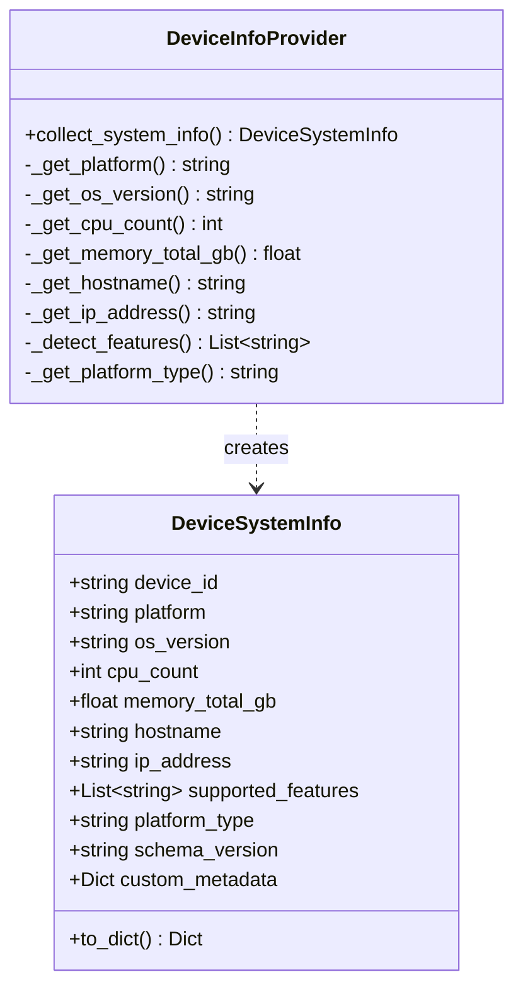
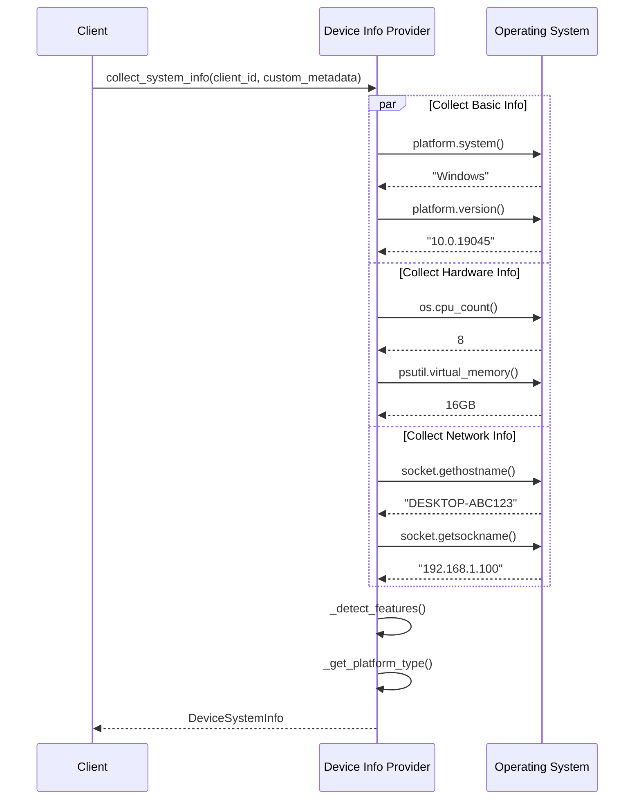

# 📱 Device Info Provider

!!!quote "Know Your Device"
    The **Device Info Provider** collects comprehensive system information from client devices during registration, enabling intelligent task assignment and device selection in constellation (multi-device) scenarios.

---

## 📋 Overview

!!!info "Push Model Device Profiling"
    Device information is **proactively collected** during client registration and pushed to the server. This reduces latency for constellation clients and enables immediate task routing decisions.

**Core Capabilities:**

| Capability | Description | Use Case |
|------------|-------------|----------|
| **System Detection** | Auto-detect OS, version, architecture | Platform-specific task routing |
| **Hardware Profiling** | CPU count, memory capacity | Resource-aware task assignment |
| **Network Discovery** | Hostname, IP address | Network topology mapping |
| **Feature Detection** | GUI, CLI, browser, office apps | Capability-based device selection |
| **Extensibility** | Custom metadata support | Environment-specific configuration |

**Supported Platforms:**

| Platform | Status | Features Detected |
|----------|--------|-------------------|
| **Windows** | ✅ Full Support | GUI, CLI, browser, file system, office, Windows apps |
| **Linux** | ✅ Full Support | GUI, CLI, browser, file system, office, Linux apps |
| **macOS** | ✅ Full Support | GUI, CLI, browser, file system, office |
| **Mobile** | 🔮 Planned | Touch, mobile apps, sensors |
| **IoT** | 🔮 Planned | Sensors, actuators, limited resources |

---

## 🏗️ Architecture

### DeviceSystemInfo Dataclass

!!!success "Lightweight & Essential"
    The device info structure captures only essential information to minimize registration overhead.



**Field Reference:**

| Field | Type | Description | Example |
|-------|------|-------------|---------|
| `device_id` | `str` | Unique client identifier | `"device_windows_001"` |
| `platform` | `str` | OS platform (lowercase) | `"windows"`, `"linux"`, `"darwin"` |
| `os_version` | `str` | OS version string | `"10.0.19045"` (Windows 10) |
| `cpu_count` | `int` | Number of CPU cores | `8` |
| `memory_total_gb` | `float` | Total RAM in GB (rounded to 2 decimals) | `16.0` |
| `hostname` | `str` | Network hostname | `"DESKTOP-ABC123"` |
| `ip_address` | `str` | Local IP address | `"192.168.1.100"` |
| `supported_features` | `List[str]` | Detected capabilities | `["gui", "cli", "browser", "office"]` |
| `platform_type` | `str` | Device category | `"computer"`, `"mobile"`, `"web"`, `"iot"` |
| `schema_version` | `str` | Schema version for compatibility | `"1.0"` |
| `custom_metadata` | `Dict` | User-defined metadata | `{"environment": "production"}` |

---

## 🔍 Collection Process

### Automatic Collection

!!!example "Collection at Registration"
    Device info is collected automatically when the client registers with the server:

```python
from ufo.client.device_info_provider import DeviceInfoProvider

# Collect system information
system_info = DeviceInfoProvider.collect_system_info(
    client_id="device_windows_001",
    custom_metadata=None  # Or load from config
)

# Result: DeviceSystemInfo object
print(system_info.platform)         # "windows"
print(system_info.cpu_count)        # 8
print(system_info.memory_total_gb)  # 16.0
print(system_info.supported_features)  # ["gui", "cli", "browser", ...]

# Convert to dict for transmission
device_dict = system_info.to_dict()
```

**Collection Flow:**



---

## 🎯 Feature Detection

### Platform-Specific Features

!!!info "Intelligent Capability Detection"
    Features are automatically detected based on the platform to enable capability-based device selection.

**Windows Features:**

```python
features = [
    "gui",           # Graphical user interface
    "cli",           # Command line interface
    "browser",       # Web browser support
    "file_system",   # File system operations
    "office",        # Office applications (Word, Excel, etc.)
    "windows_apps"   # Windows-specific applications
]
```

**Linux Features:**

```python
features = [
    "gui",           # Graphical user interface (X11/Wayland)
    "cli",           # Bash/shell
    "browser",       # Firefox, Chrome, etc.
    "file_system",   # Linux file system
    "office",        # LibreOffice, etc.
    "linux_apps"     # Linux-specific applications
]
```

**macOS Features:**

```python
features = [
    "gui",           # macOS GUI
    "cli",           # Terminal
    "browser",       # Safari, Chrome, etc.
    "file_system",   # macOS file system
    "office"         # Office for Mac
]
```

**Feature Detection Logic:**

| Platform | Detected Features | Rationale |
|----------|-------------------|-----------|
| `windows`, `linux`, `darwin` | GUI, CLI, browser, file_system, office | Desktop/laptop computers have full capabilities |
| `android`, `ios` (future) | Touch, mobile apps, camera | Mobile-specific features |
| Custom | User-defined | Extensible via custom_metadata |

---

## 💡 Usage Examples

### Basic Collection

```python
from ufo.client.device_info_provider import DeviceInfoProvider

# Collect with auto-detection
info = DeviceInfoProvider.collect_system_info(
    client_id="device_001",
    custom_metadata=None
)

print(f"Platform: {info.platform}")
print(f"CPU Cores: {info.cpu_count}")
print(f"Memory: {info.memory_total_gb} GB")
print(f"Features: {', '.join(info.supported_features)}")
```

### With Custom Metadata

```python
# Add environment-specific metadata
custom_meta = {
    "environment": "production",
    "datacenter": "us-east-1",
    "role": "automation_worker",
    "team": "qa"
}

info = DeviceInfoProvider.collect_system_info(
    client_id="device_prod_001",
    custom_metadata=custom_meta
)

# Custom metadata is preserved
print(info.custom_metadata["environment"])  # "production"
```

### JSON Serialization

```python
# Convert to dictionary for transmission
device_dict = info.to_dict()

# Serialize to JSON
import json
json_str = json.dumps(device_dict, indent=2)

# Example output:
# {
#   "device_id": "device_001",
#   "platform": "windows",
#   "os_version": "10.0.19045",
#   "cpu_count": 8,
#   "memory_total_gb": 16.0,
#   "hostname": "DESKTOP-ABC123",
#   "ip_address": "192.168.1.100",
#   "supported_features": ["gui", "cli", "browser", "file_system", "office", "windows_apps"],
#   "platform_type": "computer",
#   "schema_version": "1.0",
#   "custom_metadata": {}
# }
```

---

## ⚠️ Error Handling

### Graceful Degradation

!!!success "Fail-Safe Collection"
    If any detection method fails, the provider returns minimal info instead of crashing.

**Error Handling Strategy:**

```python
try:
    # Attempt full collection
    return DeviceSystemInfo(...)
except Exception as e:
    logger.error(f"Error collecting system info: {e}", exc_info=True)
    # Return minimal info on error
    return DeviceSystemInfo(
        device_id=client_id,
        platform="unknown",
        os_version="unknown",
        cpu_count=0,
        memory_total_gb=0.0,
        hostname="unknown",
        ip_address="unknown",
        supported_features=[],
        platform_type="unknown",
        custom_metadata=custom_metadata or {}
    )
```

**Individual Method Failures:**

| Method | Failure Behavior | Fallback Value |
|--------|------------------|----------------|
| `_get_platform()` | Catch exception | `"unknown"` |
| `_get_os_version()` | Catch exception | `"unknown"` |
| `_get_cpu_count()` | Catch exception | `0` |
| `_get_memory_total_gb()` | psutil not installed or exception | `0.0` |
| `_get_hostname()` | Catch exception | `"unknown"` |
| `_get_ip_address()` | Primary method fails | Try hostname resolution, then `"unknown"` |

---

## 🔧 Memory Detection Details

### psutil Dependency

!!!warning "Optional Dependency"
    Memory detection requires `psutil`. If not installed, memory will be reported as `0.0`.

**Installation:**

```bash
pip install psutil
```

**Detection Code:**

```python
@staticmethod
def _get_memory_total_gb() -> float:
    """Get total memory in GB"""
    try:
        import psutil
        total_memory = psutil.virtual_memory().total
        return round(total_memory / (1024**3), 2)  # Convert to GB, round to 2 decimals
    except ImportError:
        logger.warning("psutil not installed, memory info unavailable")
        return 0.0
    except Exception:
        return 0.0
```

---

## 🌐 IP Address Detection

### Multi-Method Approach

!!!tip "Robust IP Detection"
    IP detection uses a two-stage approach for reliability.

**Primary Method (Socket Connection):**

```python
# Connect to external address (doesn't actually send data)
s = socket.socket(socket.AF_INET, socket.SOCK_DGRAM)
s.connect(("8.8.8.8", 80))  # Google DNS
ip = s.getsockname()[0]
s.close()
```

**Fallback Method (Hostname Resolution):**

```python
# If primary fails, resolve via hostname
ip = socket.gethostbyname(socket.gethostname())
```

**Final Fallback:**

```python
# If all methods fail
return "unknown"
```

---

## 🚀 Integration Points

### WebSocket Client Registration

```python
# In websocket client's register_client()
from ufo.client.device_info_provider import DeviceInfoProvider

system_info = DeviceInfoProvider.collect_system_info(
    self.ufo_client.client_id,
    custom_metadata=None
)

metadata = {
    "system_info": system_info.to_dict(),
    "registration_time": datetime.now(timezone.utc).isoformat()
}

await self.registration_protocol.register_as_device(
    device_id=self.ufo_client.client_id,
    metadata=metadata,
    platform=self.ufo_client.platform
)
```

See [WebSocket Client](./websocket_client.md) for registration details.

---

## ✅ Best Practices

!!!tip "Production Recommendations"
    
    **1. Add Custom Metadata for Environment Tracking**
    ```python
    custom_meta = {
        "environment": os.getenv("ENVIRONMENT", "development"),
        "version": "1.0.0",
        "deployment_region": "us-west-2"
    }
    ```
    
    **2. Install psutil for Accurate Memory Detection**
    ```bash
    pip install psutil
    ```
    
    **3. Use Descriptive Client IDs**
    ```python
    # Include environment and location in client_id
    client_id = f"device_{platform}_{env}_{location}_{instance_id}"
    ```

---

## 🚀 Next Steps

👉 [WebSocket Client](./websocket_client.md) - See how device info is used in registration  
👉 [MCP Integration](./mcp_integration.md) - Understand tool capabilities  
👉 [Server Overview](../server/overview.md) - Learn how servers use device info

## Device System Info

The core data structure:

```python
@dataclass
class DeviceSystemInfo:
    """Device system information - lightweight and essential."""
    
    # Basic identification
    device_id: str                      # Unique device identifier
    platform: str                       # windows, linux, darwin, android, ios
    os_version: str                     # OS version string
    
    # Hardware information
    cpu_count: int                      # Number of CPU cores
    memory_total_gb: float              # Total RAM in GB
    
    # Network information
    hostname: str                       # Device hostname
    ip_address: str                     # Device IP address
    
    # Capability information
    supported_features: List[str]       # Feature list
    platform_type: str                  # computer, mobile, web, iot
    
    # Metadata
    schema_version: str = "1.0"         # Schema version
    custom_metadata: Dict[str, Any]     # Custom metadata
```

## Collecting System Info

### Basic Collection

```python
from ufo.client.device_info_provider import DeviceInfoProvider

# Collect device information
system_info = DeviceInfoProvider.collect_system_info(
    client_id="device_windows_001",
    custom_metadata=None
)

# Access information
print(f"Platform: {system_info.platform}")
print(f"CPU Cores: {system_info.cpu_count}")
print(f"Memory: {system_info.memory_total_gb}GB")
print(f"Hostname: {system_info.hostname}")
print(f"IP: {system_info.ip_address}")
print(f"Features: {system_info.supported_features}")
```

### With Custom Metadata

```python
# Add custom metadata from configuration
custom_metadata = {
    "datacenter": "US-EAST-1",
    "rack": "A-42",
    "role": "production",
    "tags": ["gpu-enabled", "high-memory"]
}

system_info = DeviceInfoProvider.collect_system_info(
    client_id="device_windows_prod_01",
    custom_metadata=custom_metadata
)
```

### Serialization

```python
# Convert to dictionary for transmission
info_dict = system_info.to_dict()

# Example output:
{
    "device_id": "device_windows_001",
    "platform": "windows",
    "os_version": "10.0.22631",
    "cpu_count": 8,
    "memory_total_gb": 16.0,
    "hostname": "DESKTOP-ABC123",
    "ip_address": "192.168.1.100",
    "supported_features": [
        "gui",
        "cli",
        "browser",
        "file_system",
        "office",
        "windows_apps"
    ],
    "platform_type": "computer",
    "schema_version": "1.0",
    "custom_metadata": {}
}
```

## Platform Detection

### Auto-Detection

The provider automatically detects the platform:

```python
@staticmethod
def _get_platform() -> str:
    """Get platform name (windows, linux, darwin, etc.)"""
    try:
        return platform.system().lower()  # "windows", "linux", "darwin"
    except Exception:
        return "unknown"
```

**Supported Platforms:**

| Platform | Identifier | Description |
|----------|------------|-------------|
| Windows | `windows` | Windows 10/11, Server |
| Linux | `linux` | Ubuntu, CentOS, Debian, etc. |
| macOS | `darwin` | macOS/OS X |
| Android | `android` | Android devices (future) |
| iOS | `ios` | iOS devices (future) |

### OS Version

```python
@staticmethod
def _get_os_version() -> str:
    """Get OS version string"""
    try:
        return platform.version()
        # Windows: "10.0.22631"
        # Linux: "#1 SMP PREEMPT_DYNAMIC Wed Nov 1 15:36:23 UTC 2023"
        # macOS: "Darwin Kernel Version 22.6.0"
    except Exception:
        return "unknown"
```

## Hardware Detection

### CPU Information

```python
@staticmethod
def _get_cpu_count() -> int:
    """Get number of CPU cores"""
    try:
        import os
        cpu_count = os.cpu_count()
        return cpu_count if cpu_count is not None else 0
    except Exception:
        return 0
```

**Examples:**

- Quad-core: `4`
- 8-core with hyperthreading: `16` (logical cores)
- Single-core: `1`

### Memory Information

```python
@staticmethod
def _get_memory_total_gb() -> float:
    """Get total memory in GB"""
    try:
        import psutil
        total_memory = psutil.virtual_memory().total
        return round(total_memory / (1024**3), 2)
    except ImportError:
        logger.warning("psutil not installed, memory info unavailable")
        return 0.0
    except Exception:
        return 0.0
```

!!!warning "psutil Required"
    Memory detection requires the `psutil` package. Install with `pip install psutil`.

**Examples:**

- 16 GB RAM: `16.0`
- 32 GB RAM: `32.0`
- 8 GB RAM: `8.0`

## Network Information

### Hostname

```python
@staticmethod
def _get_hostname() -> str:
    """Get device hostname"""
    try:
        return socket.gethostname()
        # Examples:
        # Windows: "DESKTOP-ABC123"
        # Linux: "ubuntu-server-01"
        # macOS: "MacBook-Pro.local"
    except Exception:
        return "unknown"
```

### IP Address

```python
@staticmethod
def _get_ip_address() -> str:
    """Get device IP address"""
    try:
        # Get local IP by connecting to external address
        # (doesn't actually send data)
        s = socket.socket(socket.AF_INET, socket.SOCK_DGRAM)
        s.connect(("8.8.8.8", 80))
        ip = s.getsockname()[0]
        s.close()
        return ip
    except Exception:
        try:
            # Fallback to hostname resolution
            return socket.gethostbyname(socket.gethostname())
        except Exception:
            return "unknown"
```

**IP Detection Strategy:**

1. **Primary**: Connect to external address (8.8.8.8) to get local IP
2. **Fallback**: Resolve hostname to IP
3. **Error**: Return "unknown"

!!!tip "Network Detection"
    This method reliably gets the local network IP, not the loopback address (127.0.0.1).

## Feature Detection

### Auto-Detected Features

The provider automatically detects device capabilities:

```python
@staticmethod
def _detect_features() -> List[str]:
    """Auto-detect device capabilities based on platform."""
    
    features = []
    sys_platform = platform.system().lower()
    
    if sys_platform in ["windows", "linux", "darwin"]:
        # Desktop/laptop computers
        features.extend([
            "gui",          # Graphical user interface
            "cli",          # Command line interface
            "browser",      # Web browser support
            "file_system",  # File system operations
            "office"        # Office applications
        ])
        
        # Platform-specific features
        if sys_platform == "windows":
            features.append("windows_apps")
        elif sys_platform == "linux":
            features.append("linux_apps")
        elif sys_platform == "darwin":
            features.append("macos_apps")
    
    elif sys_platform in ["android", "ios"]:
        # Mobile devices (future support)
        features.extend([
            "mobile_touch",  # Touch interface
            "mobile_apps",   # Mobile applications
            "camera",        # Camera support
            "gps"            # GPS/location services
        ])
    
    return features
```

### Feature Categories

**Desktop/Laptop Features:**

| Feature | Description |
|---------|-------------|
| `gui` | Graphical user interface available |
| `cli` | Command line interface available |
| `browser` | Web browser support |
| `file_system` | File system operations |
| `office` | Office applications (Word, Excel, etc.) |
| `windows_apps` | Windows-specific applications |
| `linux_apps` | Linux-specific applications |
| `macos_apps` | macOS-specific applications |

**Mobile Features (Future):**

| Feature | Description |
|---------|-------------|
| `mobile_touch` | Touch interface support |
| `mobile_apps` | Mobile application support |
| `camera` | Camera hardware available |
| `gps` | GPS/location services |

!!!example "Feature-Based Selection"
    Constellation clients can use features to select appropriate devices:
    ```python
    # Select device with GUI and browser support
    devices = [d for d in all_devices 
               if "gui" in d.supported_features 
               and "browser" in d.supported_features]
    ```

## Platform Type

### Type Categorization

```python
@staticmethod
def _get_platform_type() -> str:
    """Categorize platform type."""
    
    sys_platform = platform.system().lower()
    
    if sys_platform in ["windows", "linux", "darwin"]:
        return "computer"
    elif sys_platform in ["android", "ios"]:
        return "mobile"
    else:
        return "unknown"
```

**Platform Types:**

| Type | Platforms | Use Cases |
|------|-----------|-----------|
| `computer` | Windows, Linux, macOS | Desktop automation, office tasks |
| `mobile` | Android, iOS | Mobile app testing, touch automation |
| `web` | Browser-based | Web automation, testing |
| `iot` | Embedded devices | IoT device control |

## Error Handling

### Graceful Degradation

If information collection fails, minimal info is returned:

```python
try:
    return DeviceSystemInfo(
        device_id=client_id,
        platform=DeviceInfoProvider._get_platform(),
        os_version=DeviceInfoProvider._get_os_version(),
        cpu_count=DeviceInfoProvider._get_cpu_count(),
        memory_total_gb=DeviceInfoProvider._get_memory_total_gb(),
        hostname=DeviceInfoProvider._get_hostname(),
        ip_address=DeviceInfoProvider._get_ip_address(),
        supported_features=DeviceInfoProvider._detect_features(),
        platform_type=DeviceInfoProvider._get_platform_type(),
        custom_metadata=custom_metadata or {}
    )
except Exception as e:
    logger.error(f"Error collecting system info: {e}", exc_info=True)
    # Return minimal info on error
    return DeviceSystemInfo(
        device_id=client_id,
        platform="unknown",
        os_version="unknown",
        cpu_count=0,
        memory_total_gb=0.0,
        hostname="unknown",
        ip_address="unknown",
        supported_features=[],
        platform_type="unknown",
        custom_metadata=custom_metadata or {}
    )
```

!!!success "Always Returns"
    The provider always returns a valid `DeviceSystemInfo` object, even if collection fails partially.

### Individual Field Errors

Each detection method handles errors independently:

```python
@staticmethod
def _get_memory_total_gb() -> float:
    try:
        import psutil
        total_memory = psutil.virtual_memory().total
        return round(total_memory / (1024**3), 2)
    except ImportError:
        logger.warning("psutil not installed, memory info unavailable")
        return 0.0  # Graceful fallback
    except Exception:
        return 0.0  # Graceful fallback
```

## Usage in Registration

The WebSocket client uses the provider during registration:

```python
from ufo.client.device_info_provider import DeviceInfoProvider

async def register_client(self):
    """Register with device information."""
    
    # Collect device info
    system_info = DeviceInfoProvider.collect_system_info(
        client_id=self.ufo_client.client_id,
        custom_metadata=None
    )
    
    # Prepare metadata
    metadata = {
        "system_info": system_info.to_dict(),
        "registration_time": datetime.now(timezone.utc).isoformat()
    }
    
    # Register via AIP
    success = await self.registration_protocol.register_as_device(
        device_id=self.ufo_client.client_id,
        metadata=metadata,
        platform=self.ufo_client.platform
    )
```

See [WebSocket Client](./websocket_client.md) for registration details.

## Best Practices

**Include Custom Metadata for Production**

```python
custom_metadata = {
    "environment": "production",
    "region": "us-west-2",
    "cluster": "gpu-cluster-01",
    "capabilities": ["gpu", "high-memory"],
    "cost_center": "engineering"
}

system_info = DeviceInfoProvider.collect_system_info(
    client_id="prod_device_001",
    custom_metadata=custom_metadata
)
```

**Log Collection Results**

```python
system_info = DeviceInfoProvider.collect_system_info(...)

logger.info(
    f"Collected device info: "
    f"platform={system_info.platform}, "
    f"cpu={system_info.cpu_count}, "
    f"memory={system_info.memory_total_gb}GB, "
    f"features={system_info.supported_features}"
)
```

**Handle Missing psutil**

```python
try:
    import psutil
except ImportError:
    logger.warning("Installing psutil for memory detection...")
    import subprocess
    subprocess.check_call(["pip", "install", "psutil"])
```

**Validate Before Sending**

```python
system_info = DeviceInfoProvider.collect_system_info(...)

# Validate essential fields
assert system_info.device_id, "Device ID required"
assert system_info.platform != "unknown", "Platform detection failed"
assert system_info.cpu_count > 0, "CPU detection failed"
```

## Integration Points

### WebSocket Client

Uses provider during registration:

```python
system_info = DeviceInfoProvider.collect_system_info(
    self.ufo_client.client_id,
    custom_metadata=None
)
```

See [WebSocket Client](./websocket_client.md) for integration details.

### Agent Server

Receives device info during registration:

```python
# Server-side AgentProfile integration
device_info = registration_data["metadata"]["system_info"]
agent_profile.add_device(device_id, device_info)
```

See [Server Quick Start](../server/quick_start.md) for server-side processing.

## Next Steps

- [WebSocket Client](./websocket_client.md) - Registration process
- [Quick Start](./quick_start.md) - Connect your device
- [Server Quick Start](../server/quick_start.md) - Server-side registration
- [AIP Messages](../aip/messages.md) - Message structures
