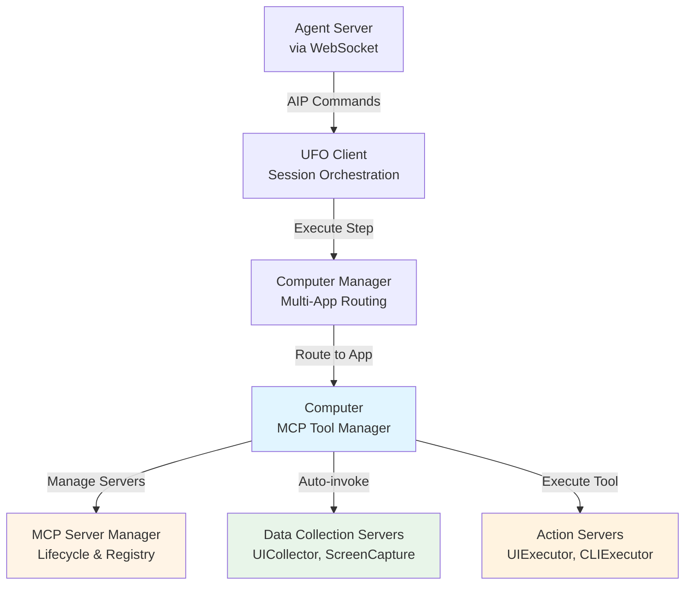
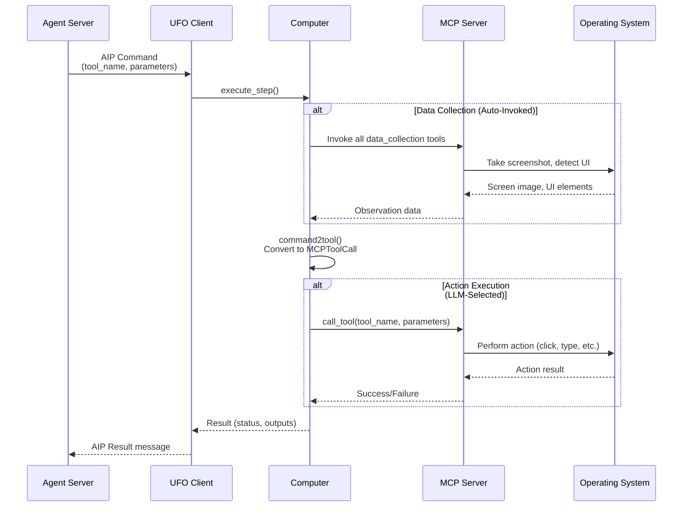

# 🔌 MCP Integration

!!!quote "Unified Tool Execution"
    **MCP (Model Context Protocol)** provides the tool execution layer in UFO² clients, enabling agents to collect system state and execute actions through a standardized interface.

!!!info "📚 Complete MCP Documentation Available"
    This page provides a **client-focused overview** of MCP integration. For comprehensive details:
    
    **📖 Core Concepts:**
    - [MCP Overview](../mcp/overview.md) - Architecture, server types, deployment models
    - [Configuration Guide](../mcp/configuration.md) - How to configure MCP servers
    
    **🛠️ Server Types:**
    - [Data Collection Servers](../mcp/data_collection.md) - UI detection, screenshots, system info
    - [Action Servers](../mcp/action.md) - Click, type, run commands
    
    **🚀 Deployment:**
    - [Local Servers](../mcp/local_servers.md) - Built-in in-process servers
    - [Remote Servers](../mcp/remote_servers.md) - HTTP/Stdio deployment
    - [Custom Servers](../mcp/custom_servers.md) - Build your own tools

---

## 🏗️ MCP in Client Architecture

### Role in the Client Stack



**Key Components:**

| Component | Role | Responsibility |
|-----------|------|----------------|
| **Computer** | MCP Tool Manager | Registers MCP servers, routes tool calls, executes in thread pool |
| **MCP Server Manager** | Server Lifecycle | Creates/manages server instances, handles local/remote servers |
| **Data Collection Servers** | Observation Layer | Auto-invoked to gather UI state, screenshots, system info |
| **Action Servers** | Execution Layer | LLM-selected tools to perform actions (click, type, run) |

---

## 🔄 Client-MCP Integration Flow

### End-to-End Execution



**Execution Stages:**

| Stage | Description | Tool Type | Trigger |
|-------|-------------|-----------|---------|
| **1. Data Collection** | Gather system/UI state | Data Collection | Automatic (every step) |
| **2. Command Conversion** | AIP Command → MCPToolCall | N/A | Client |
| **3. Action Execution** | Execute LLM-selected tool | Action | Explicit command |
| **4. Result Return** | Package result for server | N/A | Client |

---

## 💻 Computer: The MCP Manager

### Computer Class Overview

!!!success "Central MCP Hub"
    The `Computer` class is the **client-side MCP manager**, handling server registration, tool discovery, and execution.

**Core Responsibilities:**

```python
from ufo.client.computer import Computer
from ufo.client.mcp.mcp_server_manager import MCPServerManager

# Initialize Computer with MCP servers
computer = Computer(
    name="notepad_computer",
    process_name="notepad.exe",
    mcp_server_manager=mcp_manager,
    data_collection_servers_config=[
        {"namespace": "UICollector", "type": "local", "reset": False}
    ],
    action_servers_config=[
        {"namespace": "HostUIExecutor", "type": "local", "reset": False}
    ]
)

# Async initialization registers all tools
await computer.async_init()
```

**Initialization Sequence:**

| Step | Action | Result |
|------|--------|--------|
| 1. Create MCPServerManager | Initialize server factory | Ready to create servers |
| 2. Load data_collection servers | Register observation tools | UICollector, ScreenCapture ready |
| 3. Load action servers | Register execution tools | UIExecutor, CLIExecutor ready |
| 4. Discover tools | Query each server for tools | Tool registry populated |

See [Computer Manager](./computer_manager.md) for detailed architecture.

---

## 🛠️ Two Server Types

### Data Collection vs Action

!!!info "Critical Distinction"
    Understanding the difference between server types is essential for proper MCP usage.

**Comparison:**

| Aspect | Data Collection Servers | Action Servers |
|--------|------------------------|----------------|
| **Purpose** | Observe system state | Modify system state |
| **Examples** | `take_screenshot`, `detect_ui_elements` | `click`, `type_text`, `run_command` |
| **Invocation** | **Automatic** (every step) | **Explicit** (LLM selects) |
| **Side Effects** | ❌ None (read-only) | ✅ Yes (state changes) |
| **Namespace** | `"data_collection"` | `"action"` |
| **LLM Selectable?** | ❌ No | ✅ Yes |

**Data Collection Example:**

```python
# Automatically invoked before each action
# Client doesn't explicitly call - framework handles it
screenshot = await data_collection_server.call_tool(
    "take_screenshot",
    region="active_window"
)
```

**Action Example:**

```python
# LLM selects tool based on task
# Client explicitly calls via AIP Command
result = await action_server.call_tool(
    "click",
    control_text="Save",
    control_type="Button"
)
```

See [MCP Overview - Server Types](../mcp/overview.md#key-concepts) for detailed comparison.

---

## 📋 Server Configuration

### Configuration File

MCP servers are configured in `config/ufo/mcp.yaml`:

```yaml
HostAgent:
  default:
    data_collection:
      - namespace: UICollector        # Server namespace
        type: local                   # local, http, or stdio
        reset: false                  # Reset on each step?
    
    action:
      - namespace: HostUIExecutor     # Server namespace
        type: local
        reset: false
      
      - namespace: CLIExecutor        # Multiple servers allowed
        type: local
        reset: false
```

**Configuration Parameters:**

| Parameter | Type | Description | Example |
|-----------|------|-------------|---------|
| `namespace` | `str` | Server identifier (must match registered name) | `"UICollector"` |
| `type` | `str` | Deployment type: `local`, `http`, `stdio` | `"local"` |
| `reset` | `bool` | Reset server state on each step | `false` |

!!!tip "📖 Full Configuration Guide"
    See [MCP Configuration](../mcp/configuration.md) for advanced configuration including:
    - HTTP server endpoints
    - Stdio server commands
    - Custom server parameters
    - Environment-specific configs

---

## 🔧 Tool Registry & Execution

### Tool Discovery

**Automatic Registration:**

```python
# During computer.async_init()
async def register_mcp_servers(self, servers, tool_type):
    for namespace, server in servers.items():
        # Connect to MCP server
        async with Client(server.server) as client:
            # List available tools
            tools = await client.list_tools()
            
            # Register each tool
            for tool in tools:
                self.tool_registry[tool.name] = MCPToolCall(
                    name=tool.name,
                    description=tool.description,
                    parameters=tool.inputSchema,
                    mcp_server=server,
                    namespace=namespace
                )
```

**Tool Registry Structure:**

| Field | Type | Description |
|-------|------|-------------|
| `name` | `str` | Tool name (e.g., `"take_screenshot"`) |
| `description` | `str` | Tool description from docstring |
| `parameters` | `dict` | JSON schema of parameters |
| `mcp_server` | `BaseMCPServer` | Server instance |
| `namespace` | `str` | Server namespace |

See [Computer Manager](./computer_manager.md) for details.

---

## 🚀 Integration Examples

### Basic Usage

```python
from ufo.client.computer_manager import ComputerManager

# Create computer manager (manages MCP servers internally)
computer_manager = ComputerManager(config)

# Execute action through MCP
command = Command(
    tool_name="click",
    tool_type="action",
    parameters={
        "control_text": "Save",
        "control_type": "Button"
    }
)

# Computer routes to appropriate MCP server
result = await computer_manager.execute_command(command)
```

### Custom MCP Server

```python
from fastmcp import FastMCP

# Define custom MCP server
mcp = FastMCP("CustomTools")

@mcp.tool()
async def custom_action(param: str) -> str:
    """Execute custom action"""
    return f"Executed: {param}"

# Register in config/ufo/mcp.yaml:
# action:
#   - namespace: CustomTools
#     type: local
#     reset: false
```

!!!example "🛠️ Build Custom Servers"
    See [Custom Servers](../mcp/custom_servers.md) for step-by-step guide to creating your own MCP servers.

---

## 🔗 Integration Points

### With Other Client Components

**UFO Client:**
- Receives AIP Commands from server
- Delegates to Computer Manager
- Returns AIP Results

**Computer Manager:**
- Routes commands to correct Computer instance (by app/process)
- Manages multiple Computer instances

**Computer:**
- **MCP entry point**: Manages all MCP servers
- Executes tools via MCP Server Manager
- Aggregates results

See [UFO Client](./ufo_client.md) and [Computer Manager](./computer_manager.md) for integration details.

---

## 📚 Related Documentation

### Client Components

| Component | Description | Link |
|-----------|-------------|------|
| **Computer Manager** | Multi-app MCP coordination | [Computer Manager](./computer_manager.md) |
| **UFO Client** | Session orchestration | [UFO Client](./ufo_client.md) |
| **WebSocket Client** | Server communication | [WebSocket Client](./websocket_client.md) |

### MCP Deep Dive

| Topic | Description | Link |
|-------|-------------|------|
| **MCP Overview** | Architecture, concepts, deployment models | [Overview](../mcp/overview.md) |
| **Data Collection** | Observation tools (UI, screenshots, system) | [Data Collection](../mcp/data_collection.md) |
| **Action Servers** | Execution tools (click, type, run) | [Action](../mcp/action.md) |
| **Configuration** | YAML configuration guide | [Configuration](../mcp/configuration.md) |
| **Local Servers** | Built-in in-process servers | [Local Servers](../mcp/local_servers.md) |
| **Remote Servers** | HTTP/Stdio deployment | [Remote Servers](../mcp/remote_servers.md) |
| **Custom Servers** | Build your own tools | [Custom Servers](../mcp/custom_servers.md) |

---

## 🎯 Key Takeaways

!!!success "MCP in Client - Summary"
    
    **1. Computer is the MCP Manager**
    - Manages all MCP server instances
    - Routes tool calls to appropriate servers
    - Executes in thread pool for isolation
    
    **2. Two Server Types**
    - **Data Collection**: Auto-invoked, read-only, observation
    - **Action**: LLM-selected, state-changing, execution
    
    **3. Configuration-Driven**
    - Servers configured in `config/ufo/mcp.yaml`
    - Supports local, HTTP, and stdio deployment
    
    **4. Automatic Registration**
    - Tools auto-discovered during initialization
    - Tool registry built from server metadata
    
    **5. Detailed Docs Available**
    - Full MCP section at [../mcp/](../mcp/overview.md)
    - Custom server guides, examples, troubleshooting

---

## 🚀 Next Steps

👉 [MCP Overview](../mcp/overview.md) - Understand MCP architecture in depth  
👉 [Computer Manager](./computer_manager.md) - See how MCP servers are managed  
👉 [Custom Servers](../mcp/custom_servers.md) - Build your own MCP tools
