<!-- markdownlint-disable MD033 MD041 -->
<h1 align="center">
  <b>UFO³</b>  : Weaving the Digital Agent Galaxy
</h1>
<p align="center">
  <em>Cross-Device Orchestration Framework for Ubiquitous Intelligent Automation</em>
</p>

<div align="center">

[](https://arxiv.org/)&ensp;
&ensp;
[](https://opensource.org/licenses/MIT)&ensp;
[](https://microsoft.github.io/UFO/)&ensp;

</div>

---

<h3 align="center">
   
</h3>

<p align="center">
  <em><strong>From isolated device agents to interconnected constellations — Building the Digital Agent Galaxy</strong></em>
</p>

---

## 🌟 What is UFO³ Galaxy?

**UFO³ Galaxy** is a revolutionary **cross-device orchestration framework** that transforms isolated device agents into a unified digital ecosystem. It models complex user requests as **Task Constellations** (星座) — dynamic distributed DAGs where nodes represent executable subtasks and edges capture dependencies across heterogeneous devices.

### 🎯 The Vision

Building truly ubiquitous intelligent agents requires moving beyond single-device automation. UFO³ Galaxy addresses four fundamental challenges:

<table>
<tr>
<td width="50%" valign="top">

**🔄 Asynchronous Parallelism**
Concurrent task execution across devices while maintaining correctness through event-driven coordination

**⚡ Dynamic Adaptation**  
Real-time workflow evolution based on runtime feedback and task completion events

</td>
<td width="50%" valign="top">

**🌐 Distributed Coordination**  
Reliable, low-latency cross-device communication via WebSocket-based Agent Interaction Protocol

**🛡️ Safety Guarantees**  
Formal invariants (I1-I3) ensure DAG consistency during concurrent modifications and parallel execution

</td>
</tr>
</table>

---

## ✨ Key Innovations

<table>
<tr>
<td width="50%" valign="top">

### 🌟 Task Constellation Framework

Natural language requests are decomposed into **Task Constellations** — structured DAG workflows with **TaskStars** (nodes) and **TaskStarLines** (edges) encoding task logic, dependencies, and device assignments. This enables **declarative workflow representation** for automated scheduling, **runtime introspection** and dynamic modification, **parallel execution** of independent subtasks, and **cross-device data flow** management.

```
User Intent → ConstellationAgent → Task Constellation (DAG)
                                    ├─ TaskStar 1 (Windows)
                                    ├─ TaskStar 2 (Linux GPU) ─┐
                                    ├─ TaskStar 3 (Linux CPU) ─┼─ TaskStar 5
                                    └─ TaskStar 4 (Mobile)    ─┘
```

---

### ⚡ Event-Driven Orchestration

**Constellation Orchestrator** executes DAGs asynchronously with:

- 👁️ **Observer pattern** for real-time task status monitoring
- 🔒 **Safe assignment locking** to prevent race conditions
- ✅ **Three formal invariants** ensuring DAG correctness:
- 📅 **Dynamic task scheduling** based on dependency completion
- 🔄 **Automatic retry and migration** on failures

</td>
<td width="50%" valign="top">

### 🎯 Intelligent Constellation Agent

LLM-powered agent that operates in two modes:

- **Creation Mode**: Synthesizes initial DAG from user request with device-aware task decomposition
- **Editing Mode**: Incrementally refines constellation based on task completion events and runtime feedback

**Features:**
- 🧠 ReAct architecture for context-aware planning
- 🎯 Capability-based device assignment
- 🛡️ Automatic error recovery and workflow adaptation
- 🔄 State machine control with safe transitions

---

### 🔌 Agent Interaction Protocol (AIP)

Unified WebSocket-based communication layer providing:

- 📝 **Device registration** with capability profiles
- 💓 **Heartbeat monitoring** for availability tracking
- 📤 **Task dispatch** with dynamic routing
- 📊 **Result streaming** with real-time progress updates
- 🔌 **Connection resilience** with automatic reconnection

</td>
</tr>
</table>

---

## 🏗️ Architecture Overview

<div align="center">
  
  <p><em>UFO³ Galaxy Layered Architecture — From natural language to distributed execution</em></p>
</div>

### Hierarchical Design

<table>
<tr>
<td width="50%" valign="top">

#### 🎛️ Control Plane

| Component | Role | Key Features |
|-----------|------|--------------|
| **🌐 ConstellationClient** | Global device registry | • Capability profiles<br>• Health metrics<br>• Load balancing |
| **🖥️ Device Agents** | Local orchestration | • Unified MCP tools<br>• Platform-specific execution |
| **🔒 Clean Separation** | Architecture principle | • Global policies<br>• Device independence |

</td>
<td width="50%" valign="top">

#### 🔄 Execution Flow

```mermaid
graph TD
    A[1️⃣ DAG Synthesis] --> B[2️⃣ Device Assignment]
    B --> C[3️⃣ Asynchronous Execution]
    C --> D[4️⃣ Dynamic Adaptation]
    
    A1[ConstellationAgent constructs<br/>TaskConstellation] -.-> A
    B1[Match to capable devices<br/>based on profiles] -.-> B
    C1[Event-driven coordination<br/>parallel execution] -.-> C
    D1[Workflow evolution<br/>based on feedback] -.-> D
```



</td>
</tr>
</table>

---

## 🎥 Demo Video

See UFO³ Galaxy in action with this comprehensive demonstration of cross-device orchestration:

<div align="center">
  <a href="YOUR_YOUTUBE_VIDEO_URL_HERE">
    
  </a>
  <p><em>🎬 Watch the full demo: Multi-device workflow orchestration with UFO³ Galaxy</em></p>
</div>

**Demo Highlights:**

| Feature | Demonstration |
|---------|---------------|
| 🌟 **Constellation Planning** | Natural language → DAG workflow decomposition |
| 🎯 **Device Assignment** | Capability-based task routing to Windows/Linux devices |
| ⚡ **Parallel Execution** | Concurrent task execution with dependency management |
| 📊 **Real-Time Monitoring** | Live constellation visualization and status updates |
| 🔄 **Dynamic Adaptation** | Automatic error recovery and workflow refinement |
| 🌐 **Cross-Platform** | Seamless coordination across heterogeneous devices |


---

## 🚀 Quick Start

### 🛠️ Step 1: Installation

```powershell
# Clone repository
git clone https://github.com/microsoft/UFO.git
cd UFO

# Create environment (recommended)
conda create -n ufo3 python=3.10
conda activate ufo3

# Install dependencies
pip install -r requirements.txt
```

### ⚙️ Step 2: Configure ConstellationAgent LLM

UFO³ Galaxy uses a **ConstellationAgent** that orchestrates all device agents. Configure its LLM settings:

```powershell
# Create configuration from template
copy config\galaxy\agent.yaml.template config\galaxy\agent.yaml
notepad config\galaxy\agent.yaml
```

**Configuration File Location:**
```
config/galaxy/
├── agent.yaml.template    # Template - COPY THIS
├── agent.yaml             # Your config with API keys (DO NOT commit)
└── devices.yaml           # Device pool configuration (Step 4)
```

**OpenAI Configuration:**
```yaml
CONSTELLATION_AGENT:
  REASONING_MODEL: false
  API_TYPE: "openai"
  API_BASE: "https://api.openai.com/v1/chat/completions"
  API_KEY: "sk-YOUR_KEY_HERE"
  API_VERSION: "2025-02-01-preview"
  API_MODEL: "gpt-5-chat-20251003"
  # ... (prompt configurations use defaults)
```

**Azure OpenAI Configuration:**
```yaml
CONSTELLATION_AGENT:
  REASONING_MODEL: false
  API_TYPE: "aoai"
  API_BASE: "https://YOUR_RESOURCE.openai.azure.com"
  API_KEY: "YOUR_AOAI_KEY"
  API_VERSION: "2024-02-15-preview"
  API_MODEL: "gpt-5-chat-20251003"
  API_DEPLOYMENT_ID: "YOUR_DEPLOYMENT_ID"
  # ... (prompt configurations use defaults)
```

### 🖥️ Step 3: Configure Device Agents

Each device agent (Windows/Linux) needs its own LLM configuration to execute tasks.

```powershell
# Configure device agent LLMs
copy config\ufo\agents.yaml.template config\ufo\agents.yaml
notepad config\ufo\agents.yaml
```

**Configuration File Location:**
```
config/ufo/
├── agents.yaml.template    # Template - COPY THIS
└── agents.yaml             # Device agent LLM config (DO NOT commit)
```

**Example Configuration:**
```yaml
HOST_AGENT:
  VISUAL_MODE: true
  API_TYPE: "openai"  # or "aoai" for Azure OpenAI
  API_BASE: "https://api.openai.com/v1/chat/completions"
  API_KEY: "sk-YOUR_KEY_HERE"
  API_MODEL: "gpt-4o"

APP_AGENT:
  VISUAL_MODE: true
  API_TYPE: "openai"
  API_BASE: "https://api.openai.com/v1/chat/completions"
  API_KEY: "sk-YOUR_KEY_HERE"
  API_MODEL: "gpt-4o"
```

> **💡 Tip:** You can use the same API key and model for both ConstellationAgent (Step 2) and device agents (Step 3).

### 🌐 Step 4: Configure Device Pool

```powershell
# Configure available devices
copy config\galaxy\devices.yaml.template config\galaxy\devices.yaml
notepad config\galaxy\devices.yaml
```

**Example Device Configuration:**
```yaml
devices:
  # Windows Device (UFO²)
  - device_id: "windows_device_1"              # Must match --client-id
    server_url: "ws://localhost:5000/ws"       # Must match server WebSocket URL
    os: "windows"
    capabilities:
      - "desktop_automation"
      - "office_applications"
      - "excel"
      - "word"
      - "outlook"
      - "email"
      - "web_browsing"
    metadata:
      os: "windows"
      version: "11"
      performance: "high"
      installed_apps:
        - "Microsoft Excel"
        - "Microsoft Word"
        - "Microsoft Outlook"
        - "Google Chrome"
      description: "Primary Windows desktop for office automation"
    auto_connect: true
    max_retries: 5

  # Linux Device
  - device_id: "linux_device_1"                # Must match --client-id
    server_url: "ws://localhost:5001/ws"       # Must match server WebSocket URL
    os: "linux"
    capabilities:
      - "server_management"
      - "log_analysis"
      - "file_operations"
      - "database_operations"
    metadata:
      os: "linux"
      performance: "medium"
      logs_file_path: "/var/log/myapp/app.log"
      dev_path: "/home/user/projects/"
      warning_log_pattern: "WARN"
      error_log_pattern: "ERROR|FATAL"
      description: "Development server for backend operations"
    auto_connect: true
    max_retries: 5
```

> **⚠️ Critical: IDs and URLs Must Match**
> - `device_id` **must exactly match** the `--client-id` flag
> - `server_url` **must exactly match** the server WebSocket URL
> - Otherwise, Galaxy cannot control the device!

### 🖥️ Step 5: Start Device Agents

Galaxy orchestrates **device agents** that execute tasks on individual machines. You need to start the appropriate device agents based on your needs.

#### Example: Quick Windows Device Setup

**On your Windows machine:**

```powershell
# Terminal 1: Start UFO² Server
python -m ufo.server.app --port 5000

# Terminal 2: Start UFO² Client (connect to server)
python -m ufo.client.client `
  --ws `
  --ws-server ws://localhost:5000/ws `
  --client-id windows_device_1 `
  --platform windows
```

> **⚠️ Important: Platform Flag Required**
> Always include `--platform windows` for Windows devices and `--platform linux` for Linux devices!

#### Example: Quick Linux Device Setup

**On your Linux machine:**

```bash
# Terminal 1: Start Device Agent Server
python -m ufo.server.app --port 5001

# Terminal 2: Start Linux Client (connect to server)
python -m ufo.client.client \
  --ws \
  --ws-server ws://localhost:5001/ws \
  --client-id linux_device_1 \
  --platform linux

# Terminal 3: Start HTTP MCP Server (for Linux tools)
python -m ufo.client.mcp.http_servers.linux_mcp_server
```

**📖 Detailed Setup Instructions:**
- **For Windows devices (UFO²):** See [UFO² as Galaxy Device](../documents/docs/ufo2/as_galaxy_device.md)
- **For Linux devices:** See [Linux as Galaxy Device](../documents/docs/linux/as_galaxy_device.md)

### 🌌 Step 6: Launch Galaxy Client

**Interactive Mode:**
```powershell
python -m galaxy --interactive
```

**Direct Request:**
```powershell
python -m galaxy --request "Extract data from Excel on Windows, process with Python on Linux, and generate visualization report"
```

**Programmatic API:**
```python
from galaxy.galaxy_client import GalaxyClient

async def main():
    # Initialize client
    client = GalaxyClient(session_name="data_pipeline")
    await client.initialize()
    
    # Execute cross-device workflow
    result = await client.process_request(
        "Download sales data, analyze trends, generate executive summary"
    )
    
    # Access constellation details
    constellation = client.session.constellation
    print(f"Tasks executed: {len(constellation.tasks)}")
    print(f"Devices used: {set(t.assigned_device for t in constellation.tasks)}")
    
    await client.shutdown()

import asyncio
asyncio.run(main())
```

---

## 🎯 Use Cases

### 🖥️ Software Development & CI/CD

**Request:**  
*"Clone repository on Windows, build Docker image on Linux GPU server, deploy to staging, and run test suite on CI cluster"*

**Constellation Workflow:**
```
Clone (Windows) → Build (Linux GPU) → Deploy (Linux Server) → Test (Linux CI)
```

**Benefit:** Parallel execution reduces pipeline time by 60%

---

### 📊 Data Science Workflows

**Request:**  
*"Fetch dataset from cloud storage, preprocess on Linux workstation, train model on A100 node, visualize results on Windows"*

**Constellation Workflow:**
```
Fetch (Any) → Preprocess (Linux) → Train (Linux GPU) → Visualize (Windows)
```

**Benefit:** Automatic GPU detection and optimal device assignment

---

### 📝 Cross-Platform Document Processing

**Request:**  
*"Extract data from Excel on Windows, process with Python on Linux, generate PDF report, and email summary"*

**Constellation Workflow:**
```
Extract (Windows) → Process (Linux) ┬→ Generate PDF (Windows)
                                      └→ Send Email (Windows)
```

**Benefit:** Parallel report generation and email delivery

---

### 🔬 Distributed System Monitoring

**Request:**  
*"Collect server logs from all Linux machines, analyze for errors, generate alerts, create consolidated report"*

**Constellation Workflow:**
```
┌→ Collect (Linux 1) ┐
├→ Collect (Linux 2) ├→ Analyze (Any) → Report (Windows)
└→ Collect (Linux 3) ┘
```

**Benefit:** Parallel log collection with automatic aggregation

---

## 🌐 Core Capabilities

<table>
<tr>
<td width="50%" valign="top">

### ⚡ Asynchronous Parallelism
- Event-driven scheduling monitors DAG for ready tasks
- Non-blocking execution with Python `asyncio`
- Dynamic integration of new tasks without interruption
- **Result:** Up to 70% reduction in end-to-end latency

### 🛡️ Safety & Consistency
- Three formal invariants (I1-I3) for DAG correctness
- Safe assignment locking prevents race conditions
- Acyclicity validation ensures no circular dependencies
- State merging preserves execution progress during edits

</td>
<td width="50%" valign="top">

### 🔄 Dynamic Adaptation
- Dual-mode operation (creation/editing) with FSM control
- Feedback-driven constellation refinement
- LLM-powered reasoning via ReAct architecture
- Automatic error recovery and task rescheduling

### 👁️ Rich Observability
- Real-time constellation visualization with DAG updates
- Event bus with publish-subscribe pattern
- Detailed execution logs with markdown trajectories
- Task status tracking and dependency inspection

</td>
</tr>
</table>

### 🔌 Extensibility & Custom Device Agents

UFO³ is designed as a **universal framework** that supports developing new device agents for different platforms (mobile, web, IoT, embedded systems, etc.) and applications. Through the **Agent Interaction Protocol (AIP)**, custom device agents can seamlessly integrate into UFO³ Galaxy for coordinated multi-device automation. 

**📖 Want to build your own device agent?** See our [Creating Custom Device Agents tutorial](../documents/docs/tutorials/creating_device_agent/overview.md) to learn how to extend UFO³ to new platforms.

---

## 📚 Documentation

| Component | Description | Link |
|-----------|-------------|------|
| **Galaxy Client** | Device coordination and ConstellationClient API | [Learn More](../documents/docs/galaxy/client/overview.md) |
| **Constellation Agent** | LLM-driven task decomposition and DAG evolution | [Learn More](../documents/docs/galaxy/constellation_agent/overview.md) |
| **Task Orchestrator** | Asynchronous execution and safety guarantees | [Learn More](../documents/docs/galaxy/constellation_orchestrator/overview.md) |
| **Task Constellation** | DAG structure and constellation editor | [Learn More](../documents/docs/galaxy/constellation/overview.md) |
| **Agent Registration** | Device registry and agent profiles | [Learn More](../documents/docs/galaxy/agent_registration/overview.md) |
| **AIP Protocol** | WebSocket messaging and communication patterns | [Learn More](../documents/docs/aip/overview.md) |
| **Configuration** | Device pools and orchestration policies | [Learn More](../documents/docs/configuration/system/galaxy_devices.md) |
| **Creating Device Agents** | Tutorial for building custom device agents | [Learn More](../documents/docs/tutorials/creating_device_agent/overview.md) |

---

## 📊 System Architecture

### Core Components

| Component | Location | Responsibility |
|-----------|----------|----------------|
| **GalaxyClient** | `galaxy/galaxy_client.py` | Session management, user interaction |
| **ConstellationClient** | `galaxy/client/constellation_client.py` | Device registry, connection lifecycle |
| **ConstellationAgent** | `galaxy/agents/constellation_agent.py` | DAG synthesis and evolution |
| **TaskConstellationOrchestrator** | `galaxy/constellation/orchestrator/` | Asynchronous execution, safety enforcement |
| **TaskConstellation** | `galaxy/constellation/task_constellation.py` | DAG data structure and validation |
| **DeviceManager** | `galaxy/client/device_manager.py` | WebSocket connections, heartbeat monitoring |
| **Agent Server** | `ufo/mode/agent_server.py` | Device-side WebSocket server |

### Technology Stack

| Layer | Technologies |
|-------|-------------|
| **Language** | Python 3.10+, asyncio, dataclasses |
| **Communication** | WebSockets, JSON-RPC |
| **LLM** | OpenAI, Azure OpenAI, Gemini, Claude |
| **Tools** | Model Context Protocol (MCP) |
| **Config** | YAML, Pydantic validation |
| **Logging** | Rich console, Markdown trajectories |

---

## 🌟 From Devices to Galaxy

UFO³ represents a paradigm shift in intelligent automation:

```
Single Device  →  Task Constellation  →  Digital Agent Galaxy
   (UFO/UFO²)           (UFO³ Galaxy)         (Future Vision)
     ↓                    ↓                      ↓
  Windows          Cross-Device           Self-Organizing
  Desktop          Workflows              Ecosystem
```

Over time, multiple constellations interconnect, forming a self-organizing **Digital Agent Galaxy** where devices, agents, and capabilities weave together into adaptive, resilient, and intelligent ubiquitous computing systems.

---

## 📄 Citation

If you use UFO³ Galaxy in your research, please cite:

**UFO³ Galaxy Framework:**
```bibtex
@article{zhang2025ufo3,
  title   = {{UFO³: Weaving the Digital Agent Galaxy}},
  author  = {Zhang, Chaoyun and [Authors TBD]},
  journal = {arXiv preprint arXiv:[TBD]},
  year    = {2025}
}
```

**UFO² Desktop AgentOS:**
```bibtex
@article{zhang2025ufo2,
  title   = {{UFO2: The Desktop AgentOS}},
  author  = {Zhang, Chaoyun and Huang, He and Ni, Chiming and Mu, Jian and Qin, Si and He, Shilin and Wang, Lu and Yang, Fangkai and Zhao, Pu and Du, Chao and Li, Liqun and Kang, Yu and Jiang, Zhao and Zheng, Suzhen and Wang, Rujia and Qian, Jiaxu and Ma, Minghua and Lou, Jian-Guang and Lin, Qingwei and Rajmohan, Saravan and Zhang, Dongmei},
  journal = {arXiv preprint arXiv:2504.14603},
  year    = {2025}
}
```

**First UFO:**
```bibtex
@article{zhang2024ufo,
  title   = {{UFO: A UI-Focused Agent for Windows OS Interaction}},
  author  = {Zhang, Chaoyun and Li, Liqun and He, Shilin and Zhang, Xu and Qiao, Bo and Qin, Si and Ma, Minghua and Kang, Yu and Lin, Qingwei and Rajmohan, Saravan and Zhang, Dongmei and Zhang, Qi},
  journal = {arXiv preprint arXiv:2402.07939},
  year    = {2024}
}
```

---

## 🤝 Contributing

We welcome contributions! Whether building new device agents, improving orchestration algorithms, or enhancing the protocol:

- 🐛 [Report Issues](https://github.com/microsoft/UFO/issues)
- 💡 [Request Features](https://github.com/microsoft/UFO/discussions)
- 📝 [Improve Documentation](https://github.com/microsoft/UFO/pulls)
- 🧪 [Submit Pull Requests](../../CONTRIBUTING.md)

---

## 📬 Contact & Support

- 📖 **Documentation**: [https://microsoft.github.io/UFO/](https://microsoft.github.io/UFO/)
- 💬 **Discussions**: [GitHub Discussions](https://github.com/microsoft/UFO/discussions)
- 🐛 **Issues**: [GitHub Issues](https://github.com/microsoft/UFO/issues)
- 📧 **Email**: [ufo-agent@microsoft.com](mailto:ufo-agent@microsoft.com)

---

## ⚖️ License

UFO³ Galaxy is released under the [MIT License](../../LICENSE).

See [DISCLAIMER.md](../../DISCLAIMER.md) for privacy and safety notices.

---

<div align="center">
  <p><strong>Transform your distributed devices into a unified digital collective.</strong></p>
  <p><em>UFO³ Galaxy — Where every device is a star, and every task is a constellation.</em></p>
  <br>
  <sub>© Microsoft 2025 • UFO³ is an open-source research project</sub>
</div>
