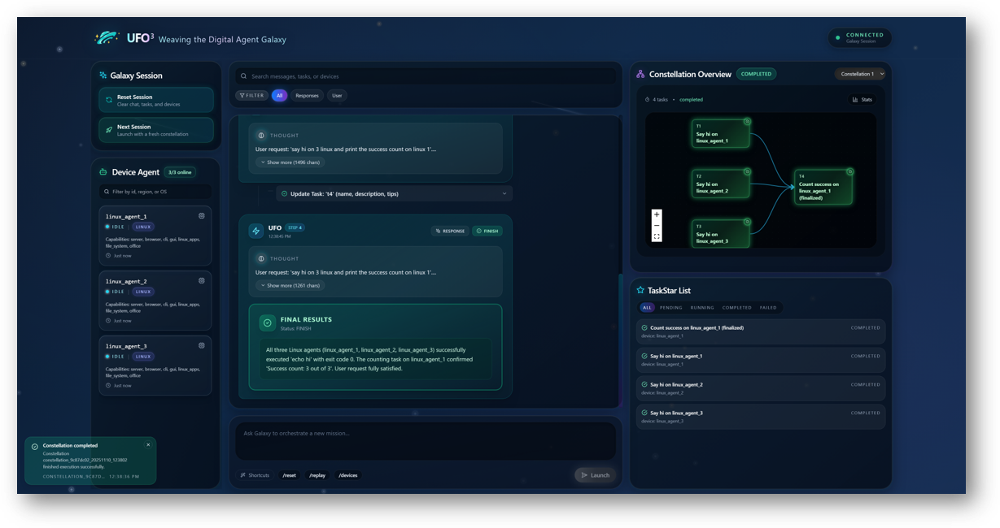
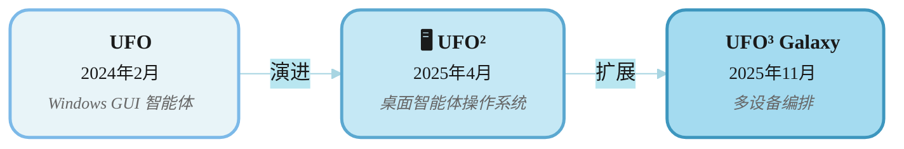

<!-- markdownlint-disable MD033 MD041 -->

<h1 align="center">
  <b>UFO³</b>  : 编织数字智能体星系
</h1>
<p align="center">
  <em>跨设备编排框架，实现无处不在的智能自动化</em>
</p>

<p align="center">
  <strong>📖 Language / 语言:</strong>
  <a href="README.md">English</a> | 
  <strong>中文</strong>
</p>

<div align="center">

[](https://arxiv.org/)&ensp;
&ensp;
[](https://opensource.org/licenses/MIT)&ensp;
[](https://microsoft.github.io/UFO/)&ensp;

</div>


---

## 🌟 什么是 UFO³ Galaxy？

**UFO³ Galaxy** 是一个革命性的**跨设备编排框架**，将孤立的设备智能体转变为统一的数字生态系统。它将复杂的用户请求建模为**任务星座（Task Constellations，星座）** —— 动态分布式 DAG，其中节点表示可执行的子任务，边捕获跨异构设备的依赖关系。

### 🎯 愿景

构建真正无处不在的智能智能体需要超越单设备自动化。UFO³ Galaxy 解决了跨设备智能体编排中的四个基本挑战：

<table>
<tr>
<td width="50%" valign="top">

**🔄 异步并行性**  
通过事件驱动协调和安全并发控制，实现跨多个设备的并发任务执行，同时保持正确性

**⚡ 动态适应**  
响应中间结果、瞬态故障和运行时观察的实时工作流演化，无需中止工作流

</td>
<td width="50%" valign="top">

**🌐 分布式协调**  
通过基于 WebSocket 的智能体交互协议，实现跨异构设备的可靠、低延迟通信，具有容错能力

**🛡️ 安全保证**  
形式不变量确保并发修改和并行执行期间的 DAG 一致性，通过严格证明验证

</td>
</tr>
</table>

------

## ✨ 关键创新

UFO³ Galaxy 通过五个紧密集成的设计原则实现跨设备编排：

---

### 🌟 声明式分解为动态 DAG

用户请求由 **ConstellationAgent（星座智能体）**分解为结构化的 DAG，包含 **TaskStars（任务星）**（节点）和 **TaskStarLines（任务星线）**（边），编码工作流逻辑、依赖关系和设备分配。

**关键优势：** 声明式结构用于自动调度 • 运行时自省 • 动态重写 • 跨设备编排

<div align="center">
  
</div>

---

<table>
<tr>
<td width="50%" valign="top">

### 🔄 持续的结果驱动图演化

**TaskConstellation（任务星座）**根据执行反馈、中间结果和故障，通过受控的 DAG 重写动态演化。

**适应机制：**
- 🩺 诊断 TaskStars 用于调试
- 🛡️ 创建回退方案用于错误恢复
- 🔗 依赖关系重连用于优化
- ✂️ 完成后节点修剪

实现弹性适应而非工作流中止。

</td>
<td width="50%" valign="top">

### ⚡ 异构、异步与安全编排

任务通过 **AgentProfiles（智能体配置文件）**（操作系统、硬件、工具）匹配到最优设备，并异步并行执行。

**安全保证：**
- 🔒 安全分配锁定（无竞态条件）
- 📅 事件驱动调度（DAG 就绪状态）
- ✅ DAG 一致性检查（结构完整性）
- 🔄 批量编辑（原子性）
- 📐 形式化验证（可证明正确性）

确保高效率与可靠性。

</td>
</tr>
<tr>
<td width="50%" valign="top">

### 🔌 统一的智能体交互协议（AIP）

基于持久 **WebSocket** 的协议，为整个智能体生态系统提供统一、安全、容错的通信。

**核心能力：**
- 📝 带能力配置文件的智能体注册
- 🔐 安全会话管理
- 📤 智能任务路由
- 💓 心跳健康监控
- 🔌 自动重连与重试机制

**优势：** 轻量级 • 可扩展 • 容错

</td>
<td width="50%" valign="top">

### 🛠️ 模板驱动的 MCP 赋能设备智能体

**轻量级开发模板**，通过 **模型上下文协议（MCP）**集成快速构建新设备智能体。

**开发框架：**
- 📄 能力声明（智能体配置文件）
- 🔗 环境绑定（本地系统）
- 🧩 MCP 服务器集成（即插即用工具）
- 🔧 模块化设计（快速开发）

**MCP 集成：** 工具包 • 跨平台标准化 • 快速原型开发

支持平台扩展（移动、Web、IoT、嵌入式）。

</td>
</tr>
</table>

<div align="center">
  <br>
  <em>🎯 这些设计共同使 UFO³ 能够高效地分解、调度、执行和适应分布式任务,同时保持跨异构设备的安全性和一致性。</em>
</div>

---

## 🎥 演示视频

观看 UFO³ Galaxy 跨设备协同的完整演示:

<div align="center">
  <a href="https://www.youtube.com/watch?v=NGrVWGcJL8o">
    
  </a>
  <p><em>🎬 点击观看:UFO³ Galaxy 多设备工作流编排</em></p>
</div>

---

## 🏗️ 架构概览

<div align="center">
  
  <p><em>UFO³ Galaxy 分层架构 —— 从自然语言到分布式执行</em></p>
</div>

### 分层设计

<table>
<tr>
<td width="35%" valign="top">

#### 🎛️ 控制平面

| 组件 | 角色 |
|-----------|------|
| **🌐 ConstellationClient** | 全局设备注册表，能力配置文件 |
| **🖥️ 设备智能体** | 本地编排，统一 MCP 工具 |
| **🔒 清晰分离** | 全局策略与设备独立性 |

</td>
<td width="65%" valign="top">

#### 🔄 执行工作流

<div align="center">
  
</div>

</td>
</tr>
</table>

---

## 🚀 快速入门

### 🛠️ 步骤 1：安装

```powershell
# 克隆仓库
git clone https://github.com/microsoft/UFO.git
cd UFO

# 创建环境（推荐）
conda create -n ufo3 python=3.10
conda activate ufo3

# 安装依赖
pip install -r requirements.txt
```

### ⚙️ 步骤 2：配置 ConstellationAgent LLM

UFO³ Galaxy 使用协调所有设备智能体的 **ConstellationAgent**。配置其 LLM 设置：

```powershell
# 从模板创建配置
copy config\galaxy\agent.yaml.template config\galaxy\agent.yaml
notepad config\galaxy\agent.yaml
```

**配置文件位置：**
```
config/galaxy/
├── agent.yaml.template    # 模板 - 复制此文件
├── agent.yaml             # 您的配置与 API 密钥（不要提交）
└── devices.yaml           # 设备池配置（步骤 4）
```

**OpenAI 配置：**
```yaml
CONSTELLATION_AGENT:
  REASONING_MODEL: false
  API_TYPE: "openai"
  API_BASE: "https://api.openai.com/v1/chat/completions"
  API_KEY: "sk-YOUR_KEY_HERE"
  API_VERSION: "2025-02-01-preview"
  API_MODEL: "gpt-5-chat-20251003"
  # ...（提示配置使用默认值）
```

**Azure OpenAI 配置：**
```yaml
CONSTELLATION_AGENT:
  REASONING_MODEL: false
  API_TYPE: "aoai"
  API_BASE: "https://YOUR_RESOURCE.openai.azure.com"
  API_KEY: "YOUR_AOAI_KEY"
  API_VERSION: "2024-02-15-preview"
  API_MODEL: "gpt-5-chat-20251003"
  API_DEPLOYMENT_ID: "YOUR_DEPLOYMENT_ID"
  # ...（提示配置使用默认值）
```

### 🖥️ 步骤 3：配置设备智能体

每个设备智能体（Windows/Linux）需要自己的 LLM 配置来执行任务。

```powershell
# 配置设备智能体 LLM
copy config\ufo\agents.yaml.template config\ufo\agents.yaml
notepad config\ufo\agents.yaml
```

**配置文件位置：**
```
config/ufo/
├── agents.yaml.template    # 模板 - 复制此文件
└── agents.yaml             # 设备智能体 LLM 配置（不要提交）
```

**示例配置：**
```yaml
HOST_AGENT:
  VISUAL_MODE: true
  API_TYPE: "openai"  # 或 Azure OpenAI 为 "aoai"
  API_BASE: "https://api.openai.com/v1/chat/completions"
  API_KEY: "sk-YOUR_KEY_HERE"
  API_MODEL: "gpt-4o"

APP_AGENT:
  VISUAL_MODE: true
  API_TYPE: "openai"
  API_BASE: "https://api.openai.com/v1/chat/completions"
  API_KEY: "sk-YOUR_KEY_HERE"
  API_MODEL: "gpt-4o"
```

> **💡 提示：** 您可以为 ConstellationAgent（步骤 2）和设备智能体（步骤 3）使用相同的 API 密钥和模型。

### 🌐 步骤 4：配置设备池

```powershell
# 配置可用设备
copy config\galaxy\devices.yaml.template config\galaxy\devices.yaml
notepad config\galaxy\devices.yaml
```

**示例设备配置：**
```yaml
devices:
  # Windows 设备（UFO²）
  - device_id: "windows_device_1"              # 必须匹配 --client-id
    server_url: "ws://localhost:5000/ws"       # 必须匹配服务器 WebSocket URL
    os: "windows"
    capabilities:
      - "desktop_automation"
      - "office_applications"
      - "excel"
      - "word"
      - "outlook"
      - "email"
      - "web_browsing"
    metadata:
      os: "windows"
      version: "11"
      performance: "high"
      installed_apps:
        - "Microsoft Excel"
        - "Microsoft Word"
        - "Microsoft Outlook"
        - "Google Chrome"
      description: "用于办公自动化的主 Windows 桌面"
    auto_connect: true
    max_retries: 5

  # Linux 设备
  - device_id: "linux_device_1"                # 必须匹配 --client-id
    server_url: "ws://localhost:5001/ws"       # 必须匹配服务器 WebSocket URL
    os: "linux"
    capabilities:
      - "server_management"
      - "log_analysis"
      - "file_operations"
      - "database_operations"
    metadata:
      os: "linux"
      performance: "medium"
      logs_file_path: "/var/log/myapp/app.log"
      dev_path: "/home/user/projects/"
      warning_log_pattern: "WARN"
      error_log_pattern: "ERROR|FATAL"
      description: "用于后端操作的开发服务器"
    auto_connect: true
    max_retries: 5
```

> **⚠️ 关键：ID 和 URL 必须匹配**
> - `device_id` **必须完全匹配** `--client-id` 标志
> - `server_url` **必须完全匹配**服务器 WebSocket URL
> - 否则，Galaxy 无法控制设备！

### 🖥️ 步骤 5：启动设备智能体

Galaxy 编排执行各个机器上任务的**设备智能体**。您需要根据需要启动适当的设备智能体。

#### 示例：快速 Windows 设备设置

**在您的 Windows 机器上：**

```powershell
# 终端 1：启动 UFO² 服务器
python -m ufo.server.app --port 5000

# 终端 2：启动 UFO² 客户端（连接到服务器）
python -m ufo.client.client `
  --ws `
  --ws-server ws://localhost:5000/ws `
  --client-id windows_device_1 `
  --platform windows
```

> **⚠️ 重要：需要平台标志**
> 始终为 Windows 设备包含 `--platform windows`，为 Linux 设备包含 `--platform linux`！

#### 示例：快速 Linux 设备设置

**在您的 Linux 机器上：**

```bash
# 终端 1：启动设备智能体服务器
python -m ufo.server.app --port 5001

# 终端 2：启动 Linux 客户端（连接到服务器）
python -m ufo.client.client \
  --ws \
  --ws-server ws://localhost:5001/ws \
  --client-id linux_device_1 \
  --platform linux

# 终端 3：启动 HTTP MCP 服务器（用于 Linux 工具）
python -m ufo.client.mcp.http_servers.linux_mcp_server
```

**📖 详细设置说明：**
- **对于 Windows 设备（UFO²）：** 参见 [UFO² 作为 Galaxy 设备](../documents/docs/ufo2/as_galaxy_device.md)
- **对于 Linux 设备：** 参见 [Linux 作为 Galaxy 设备](../documents/docs/linux/as_galaxy_device.md)

### 🌌 步骤 6：启动 Galaxy 客户端

#### 🎨 交互式 WebUI 模式（推荐）

使用交互式 Web 界面启动 Galaxy，实现实时星座可视化和监控：

```powershell
python -m galaxy --webui
```

这将启动带有 WebUI 的 Galaxy 服务器，并打开浏览器到交互式界面：

<div align="center">
  
  <p><em>🎨 Galaxy WebUI - 交互式星座可视化和聊天界面</em></p>
</div>

**WebUI 功能：**
- 🗣️ **聊天界面**：提交请求并实时与 ConstellationAgent 交互
- 📊 **实时 DAG 可视化**：观察任务星座形成和执行
- 🎯 **任务状态跟踪**：监控每个 TaskStar 的进度和完成情况
- 🔄 **动态更新**：随着任务完成查看星座演化
- 📱 **响应式设计**：在桌面和平板设备上工作

**默认 URL：** `http://localhost:8000`（如果 8000 被占用，自动查找下一个可用端口）

---

#### 💬 交互式终端模式

用于命令行交互：

```powershell
python -m galaxy --interactive
```

---

#### ⚡ 直接请求模式

执行单个请求并退出：

```powershell
python -m galaxy --request "从 Windows 上的 Excel 提取数据，在 Linux 上使用 Python 处理，并生成可视化报告"
```

---

#### 🔧 编程 API

将 Galaxy 嵌入到您的 Python 应用程序中：

```python
from galaxy.galaxy_client import GalaxyClient

async def main():
    # 初始化客户端
    client = GalaxyClient(session_name="data_pipeline")
    await client.initialize()
    
    # 执行跨设备工作流
    result = await client.process_request(
        "下载销售数据，分析趋势，生成执行摘要"
    )
    
    # 访问星座详细信息
    constellation = client.session.constellation
    print(f"执行的任务：{len(constellation.tasks)}")
    print(f"使用的设备：{set(t.assigned_device for t in constellation.tasks)}")
    
    await client.shutdown()

import asyncio
asyncio.run(main())
```

---

## 🎯 用例

### 🖥️ 软件开发和 CI/CD

**请求：**  
*"在 Windows 上克隆仓库，在 Linux GPU 服务器上构建 Docker 镜像，部署到暂存环境，并在 CI 集群上运行测试套件"*

**星座工作流：**
```
克隆 (Windows) → 构建 (Linux GPU) → 部署 (Linux 服务器) → 测试 (Linux CI)
```

**优势：** 并行执行将管道时间减少 60%

---

### 📊 数据科学工作流

**请求：**  
*"从云存储获取数据集，在 Linux 工作站上预处理，在 A100 节点上训练模型，在 Windows 上可视化结果"*

**星座工作流：**
```
获取（任何）→ 预处理（Linux）→ 训练（Linux GPU）→ 可视化（Windows）
```

**优势：** 自动 GPU 检测和最佳设备分配

---

### 📝 跨平台文档处理

**请求：**  
*"从 Windows 上的 Excel 提取数据，在 Linux 上使用 Python 处理，生成 PDF 报告，并发送电子邮件摘要"*

**星座工作流：**
```
提取（Windows）→ 处理（Linux）┬→ 生成 PDF（Windows）
                              └→ 发送电子邮件（Windows）
```

**优势：** 并行报告生成和电子邮件传递

---

### 🔬 分布式系统监控

**请求：**  
*"从所有 Linux 机器收集服务器日志，分析错误，生成警报，创建合并报告"*

**星座工作流：**
```
┌→ 收集（Linux 1）┐
├→ 收集（Linux 2）├→ 分析（任何）→ 报告（Windows）
└→ 收集（Linux 3）┘
```

**优势：** 并行日志收集，自动聚合

---

## 🌐 系统能力

基于五大设计原则，UFO³ Galaxy 为分布式自动化提供强大能力：

<table>
<tr>
<td width="50%" valign="top">

### ⚡ 高效并行执行
- **事件驱动调度**监控 DAG 以查找就绪任务
- **非阻塞执行**使用 Python `asyncio`
- **动态任务集成**无需中断工作流
- **结果：** 与顺序执行相比，端到端延迟减少高达 70%

---

### 🛡️ 形式化安全保证
- **三个形式不变量（I1-I3）**确保 DAG 正确性
- **安全分配锁定**防止竞态条件
- **无环性验证**消除循环依赖
- **状态合并**在运行时修改期间保留进度
- **形式化验证**通过严格的数学证明

</td>
<td width="50%" valign="top">

### 🔄 智能适应
- **双模式 ConstellationAgent**（创建/编辑）与 FSM 控制
- **结果驱动演化**基于执行反馈
- **LLM 驱动推理**通过 ReAct 架构
- **自动错误恢复**通过诊断任务和回退方案
- **工作流优化**通过动态重连和修剪

---

### 👁️ 全面可观察性
- **实时可视化**星座结构和执行
- **事件驱动更新**通过发布-订阅模式
- **丰富的执行日志**包含 markdown 轨迹
- **状态跟踪**每个 TaskStar 和依赖关系
- **交互式 WebUI** 用于监控和控制

</td>
</tr>
</table>

---

### 🔌 可扩展性与平台独立性

UFO³ 设计为**通用编排框架**，可无缝集成跨平台的异构设备智能体。

**多平台支持：**
- 🪟 **Windows** — 通过 UFO² 实现桌面自动化
- 🐧 **Linux** — 服务器管理、DevOps、数据处理
- 📱 **Android** — 通过 MCP 实现移动设备自动化
- 🌐 **Web** — 基于浏览器的智能体（即将推出）
- 🍎 **macOS** — 桌面自动化（即将推出）
- 🤖 **IoT/嵌入式** — 边缘设备和传感器（即将推出）

**开发者友好：**
- 📦 **轻量级模板**用于快速智能体开发
- 🧩 **MCP 集成**实现即插即用的工具扩展
- 📖 **全面的教程**和 API 文档
- 🔌 **AIP 协议**实现无缝生态系统集成

**📖 想构建自己的设备智能体？** 查看我们的[创建自定义设备智能体教程](../documents/docs/tutorials/creating_device_agent/overview.md)，了解如何将 UFO³ 扩展到新平台。

---

## 📚 文档

| 组件 | 描述 | 链接 |
|-----------|-------------|------|
| **Galaxy 客户端** | 设备协调和 ConstellationClient API | [了解更多](../documents/docs/galaxy/client/overview.md) |
| **星座智能体** | LLM 驱动的任务分解和 DAG 演化 | [了解更多](../documents/docs/galaxy/constellation_agent/overview.md) |
| **任务编排器** | 异步执行和安全保证 | [了解更多](../documents/docs/galaxy/constellation_orchestrator/overview.md) |
| **任务星座** | DAG 结构和星座编辑器 | [了解更多](../documents/docs/galaxy/constellation/overview.md) |
| **智能体注册** | 设备注册表和智能体配置文件 | [了解更多](../documents/docs/galaxy/agent_registration/overview.md) |
| **AIP 协议** | WebSocket 消息传递和通信模式 | [了解更多](../documents/docs/aip/overview.md) |
| **配置** | 设备池和编排策略 | [了解更多](../documents/docs/configuration/system/galaxy_devices.md) |
| **创建设备智能体** | 构建自定义设备智能体的教程 | [了解更多](../documents/docs/tutorials/creating_device_agent/overview.md) |

---

## 📊 系统架构

### 核心组件

| 组件 | 位置 | 职责 |
|-----------|----------|----------------|
| **GalaxyClient** | `galaxy/galaxy_client.py` | 会话管理，用户交互 |
| **ConstellationClient** | `galaxy/client/constellation_client.py` | 设备注册表，连接生命周期 |
| **ConstellationAgent** | `galaxy/agents/constellation_agent.py` | DAG 合成和演化 |
| **TaskConstellationOrchestrator** | `galaxy/constellation/orchestrator/` | 异步执行，安全执行 |
| **TaskConstellation** | `galaxy/constellation/task_constellation.py` | DAG 数据结构和验证 |
| **DeviceManager** | `galaxy/client/device_manager.py` | WebSocket 连接，心跳监控 |
| **Agent Server** | `ufo/mode/agent_server.py` | 设备端 WebSocket 服务器 |

### 技术栈

| 层 | 技术 |
|-------|-------------|
| **语言** | Python 3.10+、asyncio、dataclasses |
| **通信** | WebSockets、JSON-RPC |
| **LLM** | OpenAI、Azure OpenAI、Gemini、Claude |
| **工具** | 模型上下文协议（MCP） |
| **配置** | YAML、Pydantic 验证 |
| **日志** | Rich 控制台、Markdown 轨迹 |

---

## 🌟 从设备到星系

UFO³ 代表智能自动化的范式转变：



随着时间的推移，多个星座相互连接，形成一个自组织的**数字智能体星系**，其中设备、智能体和能力编织在一起，形成适应性强、弹性强和智能的无处不在的计算系统。

---

## 📄 引用

如果您在研究中使用 UFO³ Galaxy，请引用：

**UFO³ Galaxy 框架：**
```bibtex
@article{zhang2025ufo3,
  title   = {{UFO³: Weaving the Digital Agent Galaxy}},
  author  = {Zhang, Chaoyun and [Authors TBD]},
  journal = {arXiv preprint arXiv:[TBD]},
  year    = {2025}
}
```

**UFO² 桌面智能体操作系统：**
```bibtex
@article{zhang2025ufo2,
  title   = {{UFO2: The Desktop AgentOS}},
  author  = {Zhang, Chaoyun and Huang, He and Ni, Chiming and Mu, Jian and Qin, Si and He, Shilin and Wang, Lu and Yang, Fangkai and Zhao, Pu and Du, Chao and Li, Liqun and Kang, Yu and Jiang, Zhao and Zheng, Suzhen and Wang, Rujia and Qian, Jiaxu and Ma, Minghua and Lou, Jian-Guang and Lin, Qingwei and Rajmohan, Saravan and Zhang, Dongmei},
  journal = {arXiv preprint arXiv:2504.14603},
  year    = {2025}
}
```

**第一代 UFO：**
```bibtex
@article{zhang2024ufo,
  title   = {{UFO: A UI-Focused Agent for Windows OS Interaction}},
  author  = {Zhang, Chaoyun and Li, Liqun and He, Shilin and Zhang, Xu and Qiao, Bo and Qin, Si and Ma, Minghua and Kang, Yu and Lin, Qingwei and Rajmohan, Saravan and Zhang, Dongmei and Zhang, Qi},
  journal = {arXiv preprint arXiv:2402.07939},
  year    = {2024}
}
```

---

## 🤝 贡献

我们欢迎贡献！无论是构建新的设备智能体、改进编排算法还是增强协议：

- 🐛 [报告问题](https://github.com/microsoft/UFO/issues)
- 💡 [请求功能](https://github.com/microsoft/UFO/discussions)
- 📝 [改进文档](https://github.com/microsoft/UFO/pulls)
- 🧪 [提交拉取请求](../../CONTRIBUTING.md)

---

## 📬 联系与支持

- 📖 **文档**：[https://microsoft.github.io/UFO/](https://microsoft.github.io/UFO/)
- 💬 **讨论**：[GitHub 讨论](https://github.com/microsoft/UFO/discussions)
- 🐛 **问题**：[GitHub 问题](https://github.com/microsoft/UFO/issues)
- 📧 **电子邮件**：[ufo-agent@microsoft.com](mailto:ufo-agent@microsoft.com)

---

## ⚖️ 许可证

UFO³ Galaxy 根据 [MIT 许可证](../../LICENSE) 发布。

有关隐私和安全通知，请参阅 [DISCLAIMER.md](../../DISCLAIMER.md)。

---

<div align="center">
  <p><strong>将您的分布式设备转变为统一的数字集体。</strong></p>
  <p><em>UFO³ Galaxy —— 每个设备都是一颗星，每个任务都是一个星座。</em></p>
  <br>
  <sub>© Microsoft 2025 • UFO³ 是一个开源研究项目</sub>
</div>
